# Next.js Turbopack RSC vs React on Rails Pro RSC

Date: 2026-06-17

This is a deep architecture note for understanding how Next.js App Router, React Server Components, and Turbopack work together, and how that compares to React on Rails Pro RSC with Shakapacker, webpack, and Rspack.

Source snapshot:

- Next.js source: [vercel/next.js @ f4828c1](https://github.com/vercel/next.js/tree/f4828c13e778dbe04c4a1e308ff29941536f091f)
- Next.js canary version analyzed: `v16.3.0-canary.42`
- React on Rails source: `main` at
  [`bad061fbd693356009317b4b153cc48f20393ffe`](https://github.com/shakacode/react_on_rails/commit/bad061fbd693356009317b4b153cc48f20393ffe)
- React on Rails version context: `17.0.0-rc.5`, with the default RSC generator still on the stable
  React `~19.0.4` plus `react-on-rails-rsc@19.0.5` path, and the Pro dummy/CI path soaking React
  `19.2.7` with `react-on-rails-rsc@19.2.0-rc.1`
- Official docs checked: React RSC docs, Next.js Server/Client Components, Next.js Turbopack, Next.js Caching, Rspack docs

## The Seven-Year-Old Version

Imagine a web page is a toy castle.

- Rails or Next.js is the grown-up at the table.
- The browser is the kid who wants to play with the castle.
- Server Components are castle parts the grown-up builds in the kitchen.
- Client Components are parts the kid can touch, move, and click.
- HTML is the castle already standing on the table.
- The RSC payload, also called Flight, is the instruction sheet that says, "these parts came from the kitchen, and these buttons need these toy pieces."
- The bundler is the packing machine that decides which pieces go to the kid and which pieces stay in the kitchen.

Traditional SSR sends a castle picture plus a big toy box, then React checks the picture and attaches buttons. RSC sends the picture, but keeps many kitchen-only tools out of the kid's toy box. The kid receives less JavaScript, and the grown-up can fetch data and build parts before the browser has to ask for them.

The important twist:

- Next.js owns the whole castle shop: routes, server rendering, browser router, bundler, caches, and manifests.
- React on Rails Pro adds this castle-building machinery to a Rails house. Rails still owns routes, controllers, views, caching, auth, and layout. The Node renderer is a specialized workshop Rails calls when it needs React output.

## One-Screen Mental Model

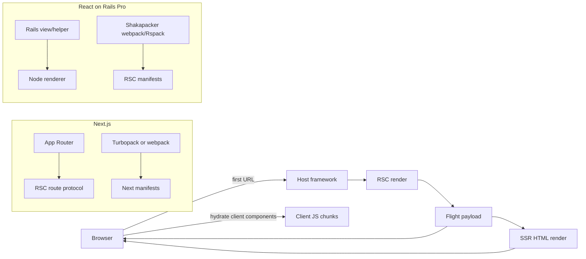

The same React primitives appear in both systems:

- `renderToPipeableStream` or `renderToReadableStream` for HTML streaming.
- `react-server-dom-*` server APIs to produce the Flight stream.
- `react-server-dom-*` client APIs to turn the Flight stream back into React nodes.
- Manifests that map a Client Component reference in Flight to the JavaScript chunks the browser needs.

The architecture is different because Next.js makes Flight the router protocol. React on Rails Pro makes Flight a component payload protocol inside Rails-rendered pages.

## Vocabulary

| Term                 | Simple meaning                                         | In practice                                                                                   |
| -------------------- | ------------------------------------------------------ | --------------------------------------------------------------------------------------------- |
| Server Component     | Code that runs in the server/RSC environment           | Can read server data directly and does not ship its implementation to the browser             |
| Client Component     | Code marked with `'use client'`                        | May use state, effects, event handlers, browser APIs, and must ship browser JS                |
| Flight payload       | React's RSC wire format                                | Encodes rendered server output, client references, props, promises, errors, and stream chunks |
| Client reference     | A placeholder for a Client Component in the RSC stream | The renderer needs a manifest to turn it into browser and SSR module IDs                      |
| SSR                  | HTML rendering                                         | Takes React output and streams HTML so users and crawlers see content before hydration        |
| Hydration            | Browser attaches interactivity                         | React reuses existing HTML and activates Client Components                                    |
| Manifest             | Build-time lookup table                                | Connects source modules, chunk files, module IDs, CSS, and server action references           |
| Turbopack transition | Turbopack graph context change                         | Used by Next to move from RSC graph to client, SSR, shared, or server utility graphs          |
| Shakapacker          | Rails bundling integration                             | Drives webpack or Rspack and emits Rails-friendly assets and manifests                        |
| `react-on-rails-rsc` | RORP RSC adapter package                               | Isolates React RSC bundler/runtime APIs from the main Pro package                             |

## Official Public Model

React says Server Components render in an environment separate from the client app or SSR server. They can run at build time or for each request. React also explicitly warns framework authors that the underlying RSC bundler APIs in React 19 do not follow semver across minor versions, so framework/bundler integrations should pin carefully or track canary channels. See [React Server Components](https://react.dev/reference/rsc/server-components).

Next's public docs describe the App Router flow this way:

- Server Components are rendered into the RSC payload.
- Client Components plus the RSC payload are used to prerender HTML.
- The first load uses HTML for a fast preview, the RSC payload to reconcile the tree, and JavaScript to hydrate Client Components.
- Subsequent navigations prefetch and cache the RSC payload. See [Next Server and Client Components](https://nextjs.org/docs/app/getting-started/server-and-client-components).

Next's Turbopack docs say Turbopack is a Rust incremental bundler built into Next.js, now the default bundler, and that it uses a unified graph for multiple output environments, lazy bundling, and incremental computation. It also states that RSC is supported for the App Router and Turbopack ensures correct server/client bundling. See [Next Turbopack](https://nextjs.org/docs/app/api-reference/turbopack).

Next's current Cache Components docs say caching can happen at the data or UI level, uncached dynamic data should stream behind Suspense, and the build can produce a static shell containing HTML plus serialized RSC payload for client navigation. See [Next Caching](https://nextjs.org/docs/app/getting-started/caching).

Rspack's public model is different from Turbopack. Rspack is a high-performance Rust bundler with a webpack-compatible API and support for most webpack loaders and many plugin patterns. See [Rspack](https://www.rspack.dev/) and [Rspack loader compatibility](https://rspack.dev/guide/features/loader).

## Next.js First Request: Browser Hits a URL

### Big Picture

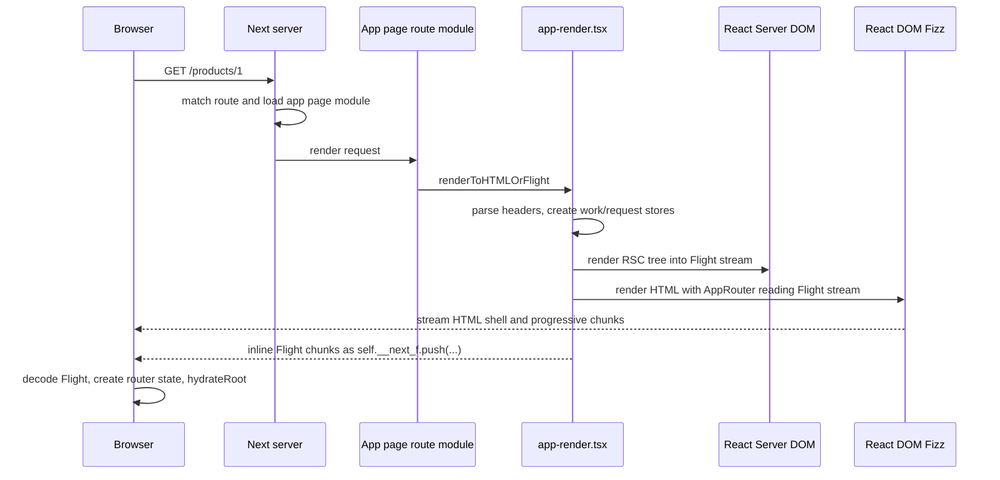

The source-level request path found in the Next.js clone is:

```text
BaseServer.handleRequestImpl
  -> BaseServer.renderToResponseImpl
  -> BaseServer.renderPageComponent
  -> BaseServer.renderToResponseWithComponentsImpl
  -> generated app-page handler
  -> AppPageRouteModule.render
  -> renderToHTMLOrFlight
```

Important files:

- [base-server.ts](https://github.com/vercel/next.js/blob/f4828c13e778dbe04c4a1e308ff29941536f091f/packages/next/src/server/base-server.ts)
- [app-page module.ts](https://github.com/vercel/next.js/blob/f4828c13e778dbe04c4a1e308ff29941536f091f/packages/next/src/server/route-modules/app-page/module.ts)
- [app-page template](https://github.com/vercel/next.js/blob/f4828c13e778dbe04c4a1e308ff29941536f091f/packages/next/src/build/templates/app-page.ts)
- [app-render.tsx](https://github.com/vercel/next.js/blob/f4828c13e778dbe04c4a1e308ff29941536f091f/packages/next/src/server/app-render/app-render.tsx)

### HTML Request vs Flight Request

The same route module can answer two related request types:

- A normal document request returns HTML plus inline RSC payload.
- A Flight request returns `text/x-component` RSC payload only.

Next's App Router headers are defined in [app-router-headers.ts](https://github.com/vercel/next.js/blob/f4828c13e778dbe04c4a1e308ff29941536f091f/packages/next/src/client/components/app-router-headers.ts). Key headers:

- `rsc`
- `next-router-state-tree`
- `next-router-prefetch`
- `next-hmr-refresh`
- `text/x-component` content type

The first document request usually has no `rsc: 1` header. Next renders both:

1. An RSC stream used by the server render.
2. An HTML stream sent to the browser.
3. Inline RSC chunks inside script tags for browser hydration.

On later client navigations, the browser sends `rsc: 1` plus the current router tree so the server can produce only the changed route segments.

### The Two Renderers on the First Request

Next's first request is not "SSR first, then RSC." It is closer to:

1. Build the RSC payload for the route.
2. Use the RSC payload while producing the HTML stream.
3. Inline the same payload into the HTML response so the browser can hydrate without refetching the route.

The key server functions live in [app-render.tsx](https://github.com/vercel/next.js/blob/f4828c13e778dbe04c4a1e308ff29941536f091f/packages/next/src/server/app-render/app-render.tsx):

- `renderToHTMLOrFlight`
- `renderToHTMLOrFlightImpl`
- `getRSCPayload`
- `generateDynamicRSCPayload`
- `generateDynamicFlightRenderResult`
- `renderToStream`

For a normal dynamic HTML render:

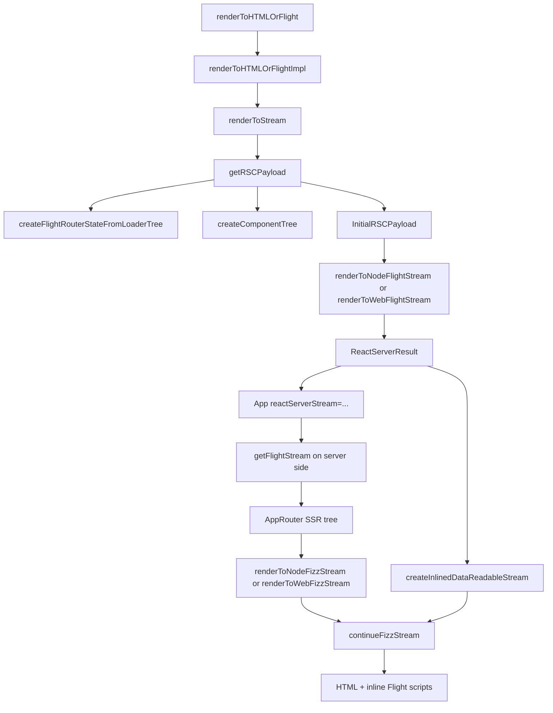

The important detail is that the server-side `<App>` receives a stream of React Server output, calls `getFlightStream`, decodes it into React values, creates the initial router state, and renders `<AppRouter>` into HTML. This is in [use-flight-response.tsx](https://github.com/vercel/next.js/blob/f4828c13e778dbe04c4a1e308ff29941536f091f/packages/next/src/server/app-render/use-flight-response.tsx) and [app-render.tsx](https://github.com/vercel/next.js/blob/f4828c13e778dbe04c4a1e308ff29941536f091f/packages/next/src/server/app-render/app-render.tsx).

### What Next Inlines Into HTML

Next converts the RSC stream into script chunks that push into `self.__next_f`.

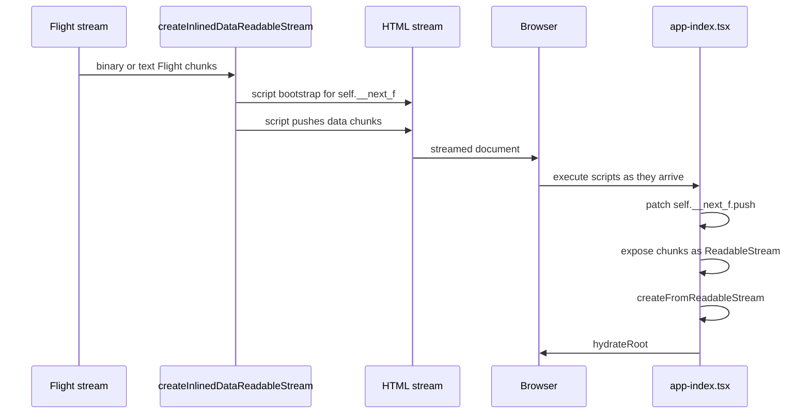

The inline protocol is implemented in [use-flight-response.tsx](https://github.com/vercel/next.js/blob/f4828c13e778dbe04c4a1e308ff29941536f091f/packages/next/src/server/app-render/use-flight-response.tsx). The browser consumer is [app-index.tsx](https://github.com/vercel/next.js/blob/f4828c13e778dbe04c4a1e308ff29941536f091f/packages/next/src/client/app-index.tsx).

The browser boot sequence:

1. `app-index.tsx` creates a buffer for inline Flight chunks.
2. It consumes any existing `self.__next_f` entries.
3. It replaces `self.__next_f.push` so later streamed script chunks feed the same stream.
4. It calls `createFromReadableStream` from `react-server-dom-webpack/client`.
5. It waits for `InitialRSCPayload`.
6. It calls `createInitialRouterState`.
7. It creates the App Router action queue.
8. It calls `ReactDOMClient.hydrateRoot`.

## Next.js Client Navigation

On navigation, the browser is not asking for new HTML. It asks for a new RSC payload that patches the App Router state.

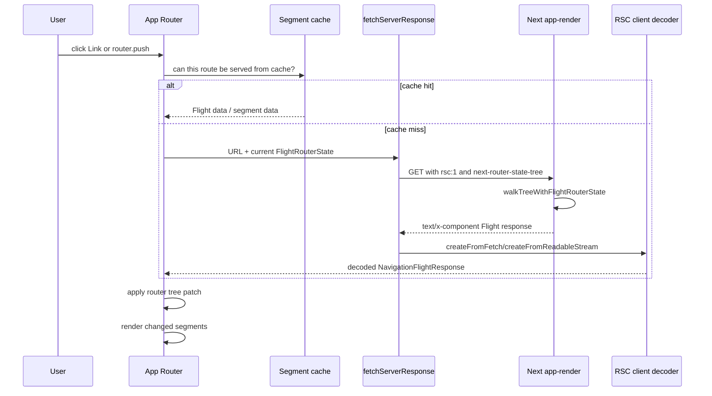

Important client files:

- [app-router.tsx](https://github.com/vercel/next.js/blob/f4828c13e778dbe04c4a1e308ff29941536f091f/packages/next/src/client/components/app-router.tsx)
- [router-reducer.ts](https://github.com/vercel/next.js/blob/f4828c13e778dbe04c4a1e308ff29941536f091f/packages/next/src/client/components/router-reducer/router-reducer.ts)
- [navigate-reducer.ts](https://github.com/vercel/next.js/blob/f4828c13e778dbe04c4a1e308ff29941536f091f/packages/next/src/client/components/router-reducer/reducers/navigate-reducer.ts)
- [fetch-server-response.ts](https://github.com/vercel/next.js/blob/f4828c13e778dbe04c4a1e308ff29941536f091f/packages/next/src/client/components/router-reducer/fetch-server-response.ts)
- [segment-cache/navigation.ts](https://github.com/vercel/next.js/blob/f4828c13e778dbe04c4a1e308ff29941536f091f/packages/next/src/client/components/segment-cache/navigation.ts)
- [segment-cache/cache.ts](https://github.com/vercel/next.js/blob/f4828c13e778dbe04c4a1e308ff29941536f091f/packages/next/src/client/components/segment-cache/cache.ts)
- [layout-router.tsx](https://github.com/vercel/next.js/blob/f4828c13e778dbe04c4a1e308ff29941536f091f/packages/next/src/client/components/layout-router.tsx)

The server-side diffing is in [walk-tree-with-flight-router-state.tsx](https://github.com/vercel/next.js/blob/f4828c13e778dbe04c4a1e308ff29941536f091f/packages/next/src/server/app-render/walk-tree-with-flight-router-state.tsx). It compares the requested loader tree with the client's current `FlightRouterState`, then decides whether to:

- Return only router state.
- Return metadata only.
- Render a subtree and return `FlightDataPath[]`.
- Traverse deeper into shared layouts and parallel routes.

This is a major difference from React on Rails Pro. Next uses RSC payloads to update route tree state. React on Rails Pro uses RSC payloads to render named registered server components, usually through `RSCRoute`.

## Next.js RSC Payload Shape

Next's `InitialRSCPayload` includes more than rendered JSX:

- Canonical URL pieces.
- Rendered search params.
- Interception-route hints.
- Flight data paths.
- Missing slot data in development.
- Global error component references.
- Per-segment prefetch support flags.
- Metadata vary data.
- Stale-time data.
- Static-stage byte lengths for cache components.
- Runtime prefetch stream when enabled.
- Navigation build ID.

The initial payload is created by `getRSCPayload` in [app-render.tsx](https://github.com/vercel/next.js/blob/f4828c13e778dbe04c4a1e308ff29941536f091f/packages/next/src/server/app-render/app-render.tsx). The route navigation payload is created by `generateDynamicRSCPayload` in the same file.

That payload is a router payload, not merely a component payload.

## Next.js Client and Server Component Boundary

Next's App Router treats files as Server Components unless they are marked with `'use client'`.

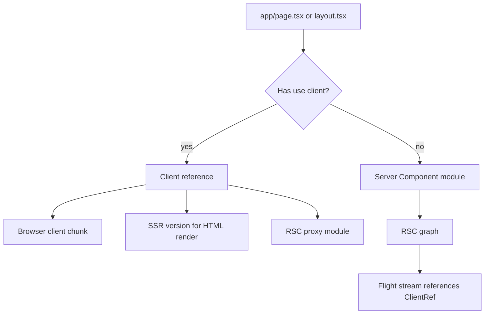

Runtime tree construction happens in [create-component-tree.tsx](https://github.com/vercel/next.js/blob/f4828c13e778dbe04c4a1e308ff29941536f091f/packages/next/src/server/app-render/create-component-tree.tsx). It calls `isClientReference` and wraps client pages or layouts with `ClientPageRoot` or `ClientSegmentRoot`. Server pages receive server-side `params` and `searchParams`; client pages receive a client root wrapper and serializable server-provided params.

Validation and transformation are split by bundler mode:

- Next's webpack path uses loaders and plugins such as [next-flight-loader](https://github.com/vercel/next.js/blob/f4828c13e778dbe04c4a1e308ff29941536f091f/packages/next/src/build/webpack/loaders/next-flight-loader/index.ts), [flight-client-entry-plugin.ts](https://github.com/vercel/next.js/blob/f4828c13e778dbe04c4a1e308ff29941536f091f/packages/next/src/build/webpack/plugins/flight-client-entry-plugin.ts), and [flight-manifest-plugin.ts](https://github.com/vercel/next.js/blob/f4828c13e778dbe04c4a1e308ff29941536f091f/packages/next/src/build/webpack/plugins/flight-manifest-plugin.ts).
- Next's Turbopack path uses Rust graph transitions and modules such as [next-api app.rs](https://github.com/vercel/next.js/blob/f4828c13e778dbe04c4a1e308ff29941536f091f/crates/next-api/src/app.rs), [ecmascript_client_reference_transition.rs](https://github.com/vercel/next.js/blob/f4828c13e778dbe04c4a1e308ff29941536f091f/crates/next-core/src/next_client_reference/ecmascript_client_reference/ecmascript_client_reference_transition.rs), and [ecmascript_client_reference_module.rs](https://github.com/vercel/next.js/blob/f4828c13e778dbe04c4a1e308ff29941536f091f/crates/next-core/src/next_client_reference/ecmascript_client_reference/ecmascript_client_reference_module.rs).
- Shared validation is in [react_server_components.rs](https://github.com/vercel/next.js/blob/f4828c13e778dbe04c4a1e308ff29941536f091f/crates/next-custom-transforms/src/transforms/react_server_components.rs). That transform validates directive placement, invalid imports, and invalid exports, while noting that Turbopack uses a separate client directive transformer for proxying.

## Turbopack in Next.js

### The Simple Model

Turbopack is not "webpack but faster" inside Next. It is the build graph engine Next uses to understand the whole app:

- app routes
- client references
- RSC endpoints
- HTML endpoints
- SSR chunks
- browser chunks
- CSS and fonts
- server actions
- HMR events
- route manifests

Rspack is closer to "webpack-compatible Rust bundler." Turbopack is closer to "Next-owned graph and endpoint compiler."

### Production Build

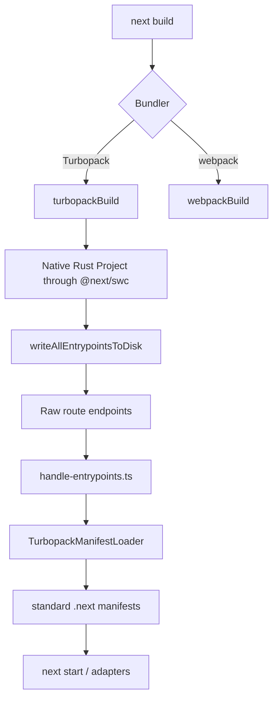

Key files:

- [build/index.ts](https://github.com/vercel/next.js/blob/f4828c13e778dbe04c4a1e308ff29941536f091f/packages/next/src/build/index.ts)
- [turbopack-build/impl.ts](https://github.com/vercel/next.js/blob/f4828c13e778dbe04c4a1e308ff29941536f091f/packages/next/src/build/turbopack-build/impl.ts)
- [handle-entrypoints.ts](https://github.com/vercel/next.js/blob/f4828c13e778dbe04c4a1e308ff29941536f091f/packages/next/src/build/handle-entrypoints.ts)
- [manifest-loader.ts](https://github.com/vercel/next.js/blob/f4828c13e778dbe04c4a1e308ff29941536f091f/packages/next/src/shared/lib/turbopack/manifest-loader.ts)
- [swc/types.ts](https://github.com/vercel/next.js/blob/f4828c13e778dbe04c4a1e308ff29941536f091f/packages/next/src/build/swc/types.ts)
- [swc/index.ts](https://github.com/vercel/next.js/blob/f4828c13e778dbe04c4a1e308ff29941536f091f/packages/next/src/build/swc/index.ts)

The TypeScript side calls native bindings and receives typed `Project`, `Route`, `Endpoint`, and `WrittenEndpoint` objects. The Rust side owns the graph, chunks, transitions, and endpoint generation.

### App Router Endpoints

Turbopack's Next integration maps an app page to two endpoint flavors:

- HTML endpoint
- RSC endpoint

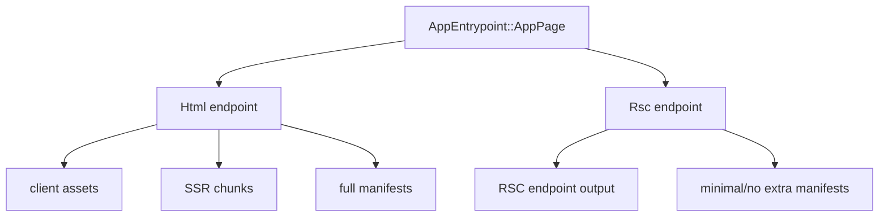

Important source:

- [next-api/src/app.rs](https://github.com/vercel/next.js/blob/f4828c13e778dbe04c4a1e308ff29941536f091f/crates/next-api/src/app.rs)
- [next_app/app_page_entry.rs](https://github.com/vercel/next.js/blob/f4828c13e778dbe04c4a1e308ff29941536f091f/crates/next-core/src/next_app/app_page_entry.rs)
- [app_page_loader_tree.rs](https://github.com/vercel/next.js/blob/f4828c13e778dbe04c4a1e308ff29941536f091f/crates/next-core/src/app_page_loader_tree.rs)

### Client Reference Transitions

When Turbopack sees a client reference from the RSC graph, it does not simply "exclude the file." It compiles related views of that module:

- a browser client module
- an SSR module
- an RSC proxy module that registers client references

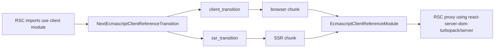

Source:

- [ecmascript_client_reference_transition.rs](https://github.com/vercel/next.js/blob/f4828c13e778dbe04c4a1e308ff29941536f091f/crates/next-core/src/next_client_reference/ecmascript_client_reference/ecmascript_client_reference_transition.rs)
- [ecmascript_client_reference_module.rs](https://github.com/vercel/next.js/blob/f4828c13e778dbe04c4a1e308ff29941536f091f/crates/next-core/src/next_client_reference/ecmascript_client_reference/ecmascript_client_reference_module.rs)
- [server_component_transition.rs](https://github.com/vercel/next.js/blob/f4828c13e778dbe04c4a1e308ff29941536f091f/crates/next-core/src/next_server_component/server_component_transition.rs)
- [visit_client_reference.rs](https://github.com/vercel/next.js/blob/f4828c13e778dbe04c4a1e308ff29941536f091f/crates/next-core/src/next_client_reference/visit_client_reference.rs)
- [client_reference_manifest.rs](https://github.com/vercel/next.js/blob/f4828c13e778dbe04c4a1e308ff29941536f091f/crates/next-core/src/next_manifests/client_reference_manifest.rs)

This is a key contrast with RORP. React on Rails Pro's RSC bundle currently uses
`react-on-rails-rsc/WebpackLoader` to replace Client Components with references, while the
client/server manifests are produced by `RSCWebpackPlugin` for webpack or `RSCRspackPlugin` for
Rspack. Turbopack models the relationships as graph transitions.

### Development HMR

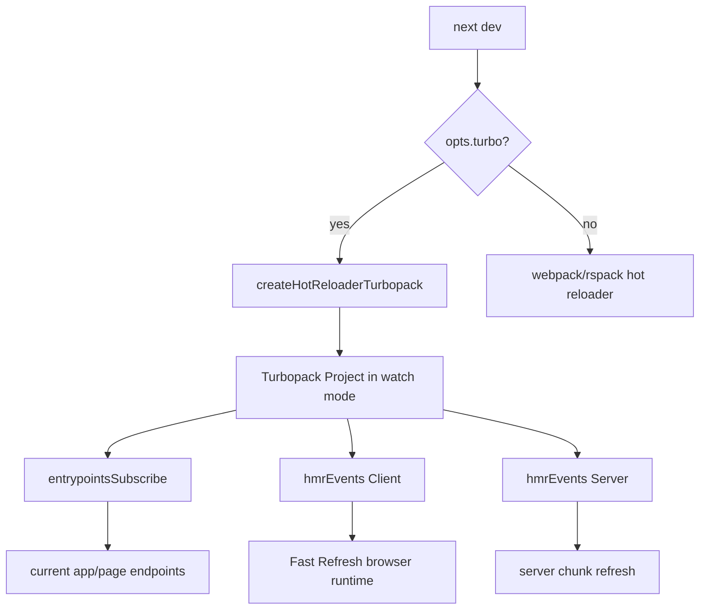

Important source:

- [setup-dev-bundler.ts](https://github.com/vercel/next.js/blob/f4828c13e778dbe04c4a1e308ff29941536f091f/packages/next/src/server/lib/router-utils/setup-dev-bundler.ts)
- [hot-reloader-turbopack.ts](https://github.com/vercel/next.js/blob/f4828c13e778dbe04c4a1e308ff29941536f091f/packages/next/src/server/dev/hot-reloader-turbopack.ts)
- [turbopack-utils.ts](https://github.com/vercel/next.js/blob/f4828c13e778dbe04c4a1e308ff29941536f091f/packages/next/src/server/dev/turbopack-utils.ts)
- [next-dev-turbopack.ts](https://github.com/vercel/next.js/blob/f4828c13e778dbe04c4a1e308ff29941536f091f/packages/next/src/client/next-dev-turbopack.ts)

Next dev mode can rebuild route endpoints and manifests on demand. Turbopack's lazy graph means the first hit to a route may trigger exactly the needed graph work; repeated edits reuse cached computations.

## React on Rails Pro RSC First Request

React on Rails Pro's runtime architecture has four boundaries:

1. Rails controller/view/helper.
2. Node renderer HTTP service.
3. Server bundle VM context.
4. RSC bundle VM context.

There are three JS bundle roles:

- Client bundle for the browser.
- Server bundle for SSR HTML.
- RSC bundle for Flight payload generation.

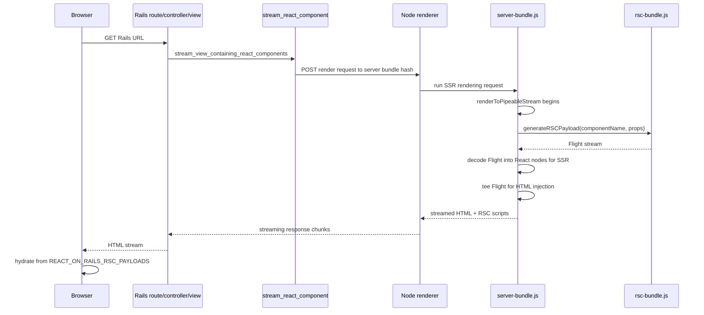

Key files:

- [react_on_rails_pro/app/helpers/react_on_rails_pro_helper.rb](../react_on_rails_pro/app/helpers/react_on_rails_pro_helper.rb)
- [react_on_rails_pro/lib/react_on_rails_pro/concerns/stream.rb](../react_on_rails_pro/lib/react_on_rails_pro/concerns/stream.rb)
- [react_on_rails_pro/lib/react_on_rails_pro/request.rb](../react_on_rails_pro/lib/react_on_rails_pro/request.rb)
- [react_on_rails_pro/lib/react_on_rails_pro/server_rendering_js_code.rb](../react_on_rails_pro/lib/react_on_rails_pro/server_rendering_js_code.rb)
- [react_on_rails_pro/lib/react_on_rails_pro/server_rendering_pool/node_rendering_pool.rb](../react_on_rails_pro/lib/react_on_rails_pro/server_rendering_pool/node_rendering_pool.rb)
- [packages/react-on-rails-pro/src/streamServerRenderedReactComponent.ts](../packages/react-on-rails-pro/src/streamServerRenderedReactComponent.ts)
- [packages/react-on-rails-pro/src/RSCRequestTracker.ts](../packages/react-on-rails-pro/src/RSCRequestTracker.ts)
- [packages/react-on-rails-pro/src/injectRSCPayload.ts](../packages/react-on-rails-pro/src/injectRSCPayload.ts)
- [packages/react-on-rails-pro/src/ReactOnRailsRSC.ts](../packages/react-on-rails-pro/src/ReactOnRailsRSC.ts)

### The Server Bundle to RSC Bundle Handoff

The generated render JS injects a global `generateRSCPayload` function when RSC support and streaming are enabled. In the server bundle, that function rewrites the current rendering request with a new component name and props, then calls `runOnOtherBundle(rscBundleHash, newRenderingRequest)`. The RSC bundle detects it is the RSC bundle and uses `serverRenderRSCReactComponent`.

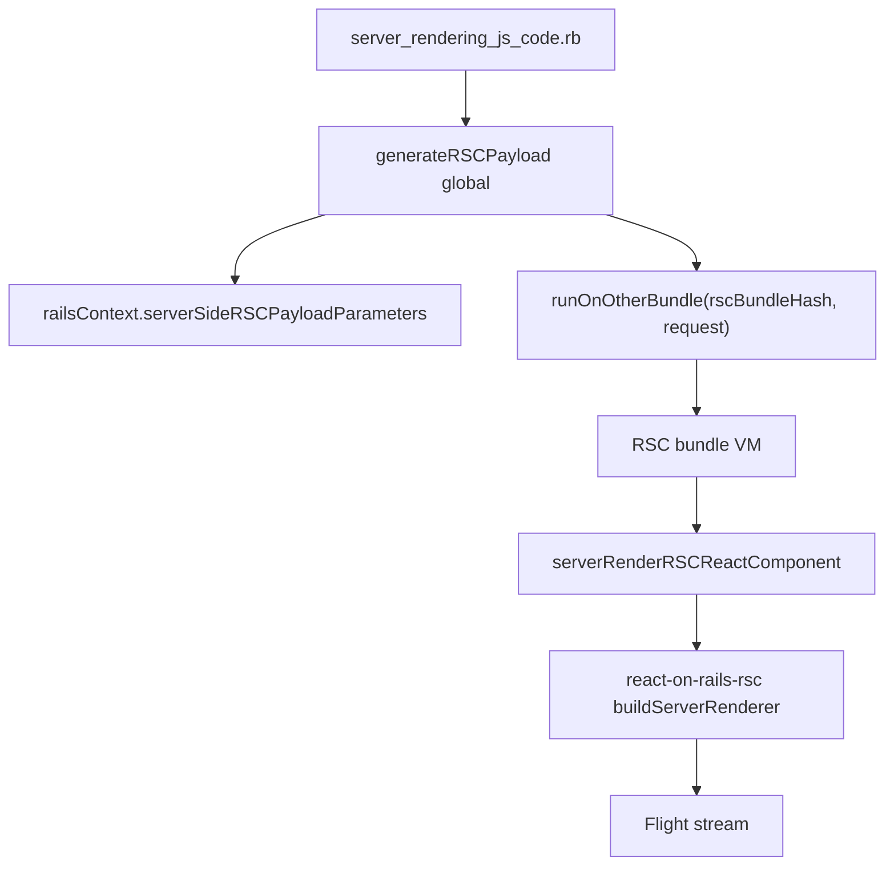

Important source:

- [server_rendering_js_code.rb](../react_on_rails_pro/lib/react_on_rails_pro/server_rendering_js_code.rb)
- [ReactOnRailsRSC.ts](../packages/react-on-rails-pro/src/ReactOnRailsRSC.ts)
- Node renderer VM boundary, from sub-agent: `packages/react-on-rails-pro-node-renderer/src/worker/vm.ts`

### RSCRequestTracker

`RSCRequestTracker` is the request-scoped coordination point:

1. `getRSCPayloadStream(componentName, props)` calls global `generateRSCPayload`.
2. The returned stream is manually teed into two `PassThrough` streams.
3. One stream is returned to SSR so the server bundle can render HTML.
4. The second stream is tracked for `injectRSCPayload`.
5. Callbacks are fired synchronously so payload array initialization scripts can be queued before related HTML is flushed.

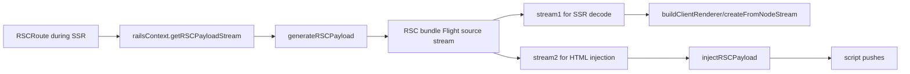

Source:

- [RSCRequestTracker.ts](../packages/react-on-rails-pro/src/RSCRequestTracker.ts)
- [getReactServerComponent.server.ts](../packages/react-on-rails-pro/src/getReactServerComponent.server.ts)
- [injectRSCPayload.ts](../packages/react-on-rails-pro/src/injectRSCPayload.ts)

### What RORP Inlines Into HTML

RORP writes into `self.REACT_ON_RAILS_RSC_PAYLOADS`.

The cache key is based on:

- component name
- props
- optionally `domNodeId`

The HTML injection order is intentional:

1. RSC payload array initialization scripts.
2. HTML chunks.
3. RSC payload chunk scripts.

That ensures a Client Component reading during hydration can find an array immediately, even if later Flight chunks are still streaming.

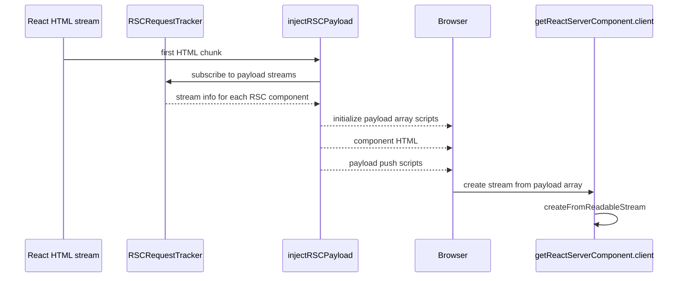

Source:

- [injectRSCPayload.ts](../packages/react-on-rails-pro/src/injectRSCPayload.ts)
- [getReactServerComponent.client.ts](../packages/react-on-rails-pro/src/getReactServerComponent.client.ts)

### Later Client Rendering in RORP

When the browser later needs a server component that was not embedded, `getReactServerComponent.client.ts` fetches:

```text
/<rscPayloadGenerationUrlPath>/<componentName>?props=<json>
```

Rails routes that to the RSC payload controller/helper:

- [routes.rb](../react_on_rails_pro/lib/react_on_rails_pro/routes.rb)
- [rsc_payload_renderer.rb](../react_on_rails_pro/lib/react_on_rails_pro/concerns/rsc_payload_renderer.rb)
- [rsc_payload.text.erb](../react_on_rails_pro/app/views/react_on_rails_pro/rsc_payload.text.erb)
- [react_on_rails_pro_helper.rb](../react_on_rails_pro/app/helpers/react_on_rails_pro_helper.rb)

This is not a full router-tree navigation protocol. It is a named server-component payload endpoint. That design is a good fit for Rails pages where route ownership remains in Rails.

## RORP Bundling

### Bundle Types

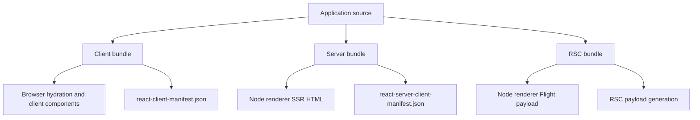

The RSC bundle is derived from the server bundle but:

- uses a different output name, typically `rsc-bundle.js`
- appends `react-on-rails-rsc/WebpackLoader` for the current RSC transform path
- selects the native `RSCRspackPlugin` manifest path when Shakapacker runs under Rspack
- uses the `react-server` condition
- overrides React aliases to the `react-server` entry files where needed
- ignores `react-dom/server`

Source:

- [rscWebpackConfig.js](../react_on_rails_pro/spec/dummy/config/webpack/rscWebpackConfig.js)
- [serverWebpackConfig.js](../react_on_rails_pro/spec/dummy/config/webpack/serverWebpackConfig.js)
- [clientWebpackConfig.js](../react_on_rails_pro/spec/dummy/config/webpack/clientWebpackConfig.js)
- [ServerClientOrBoth.js](../react_on_rails_pro/spec/dummy/config/webpack/ServerClientOrBoth.js)

### Development Mode

RORP development splits the work into several processes:

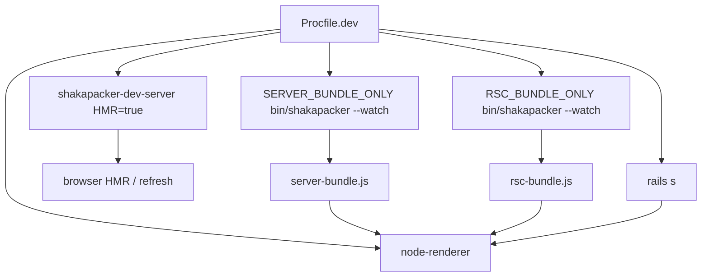

Source: [Procfile.dev](../react_on_rails_pro/spec/dummy/Procfile.dev)

Practical meaning:

- Client edits can HMR in the browser.
- Server bundle edits are watched and reflected by bundle hash changes and node renderer uploads/cache invalidation.
- RSC bundle edits are watched separately.
- Rails remains the HTTP app for the page route.
- The node renderer remains the JS execution and streaming SSR service.

This is more explicit than Next dev. Next has one dev server coordinating route discovery, Turbopack graph updates, HMR events, manifests, route modules, and server runtime. RORP exposes the moving parts as separate Rails/Shakapacker/node processes, which is easier to integrate into Rails but has more process-level coordination.

### Production Build

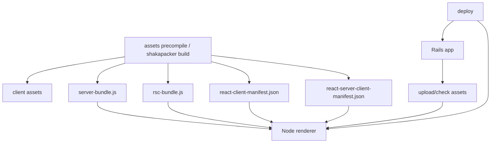

Production RORP has the same conceptual artifacts as development, but they are prebuilt, fingerprinted/hashed, uploaded or mounted for the renderer, and not watched. The Node rendering pool chooses the server bundle hash for SSR and the RSC bundle hash for RSC payload streaming.

Source:

- [request.rb](../react_on_rails_pro/lib/react_on_rails_pro/request.rb)
- [node_rendering_pool.rb](../react_on_rails_pro/lib/react_on_rails_pro/server_rendering_pool/node_rendering_pool.rb)
- [prepare_node_renderer_bundles.rb](../react_on_rails_pro/lib/react_on_rails_pro/prepare_node_renderer_bundles.rb)

## Direct Comparison

| Dimension           | Next.js App Router + Turbopack                                            | React on Rails Pro RSC                                                                               |
| ------------------- | ------------------------------------------------------------------------- | ---------------------------------------------------------------------------------------------------- |
| Owner of routing    | Next owns file-system routes and client router                            | Rails owns routes/controllers/views; React is mounted via helpers                                    |
| RSC unit            | Route segment tree                                                        | Registered component payload                                                                         |
| Navigation protocol | Flight payload patches App Router state                                   | `RSCRoute` fetches named component payloads                                                          |
| Initial document    | HTML plus `self.__next_f` inline Flight stream                            | Rails HTML stream plus `self.REACT_ON_RAILS_RSC_PAYLOADS` payload arrays                             |
| Server process      | Next server/route module runtime                                          | Rails process plus Node renderer process                                                             |
| Build graph         | Turbopack single unified graph for client/server/RSC endpoints            | Shakapacker orchestrates webpack/Rspack configs for client/server/RSC bundles                        |
| Client boundary     | `'use client'` becomes client reference through Next transforms and graph | `react-on-rails-rsc` Webpack/Rspack loaders and plugins handle references/manifests                  |
| Manifests           | Next client reference/server action/build/app path manifests              | `react-client-manifest.json`, `react-server-client-manifest.json`, Rails/Shakapacker asset manifests |
| Caching             | Deep route/segment/prefetch/cache component model                         | Rails caching, Pro streaming/cache helpers, node renderer bundle/cache behavior                      |
| Dev model           | one Next dev server with Turbopack project and HMR streams                | Rails + Shakapacker dev server + server bundle watcher + RSC watcher + node renderer                 |
| Production model    | `.next` output with route modules, endpoints, manifests                   | Rails assets plus private server/RSC bundles and manifests for Node renderer                         |
| Best fit            | Next-owned React app where App Router is the application shell            | Rails-owned application incrementally adopting React/RSC                                             |

## Why Next Can Optimize Differently

Next owns all of these layers:

- route discovery
- route matching
- route rendering
- browser router state
- prefetch policy
- segment cache
- static/dynamic route analysis
- app-level manifests
- server action manifests
- bundler integration
- dev HMR
- production output layout

Because of that, Next can make the Flight payload include router-state patches, partial prerender data, static-stage lengths, stale-time hints, and runtime-prefetch streams.

React on Rails Pro deliberately does not own all those layers. Rails owns routes and request state. The Pro integration optimizes a different shape:

- generate RSC payloads only where Rails/React asks for them
- stream HTML immediately through Rails
- embed the initial RSC payload to avoid hydration refetches
- preserve Rails caching, controllers, auth, layouts, and deployment model
- support incremental adoption in existing Rails apps

That means the RORP payload should probably stay component-centered unless a future Rails-side router abstraction wants to become Flight-aware.

## Performance Tradeoffs

### What Both Systems Improve

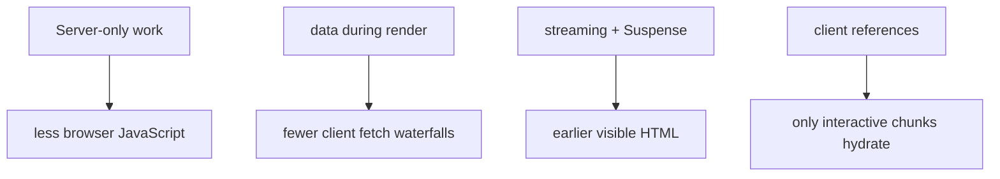

Both systems improve performance by:

- keeping server-only dependencies out of the browser bundle
- moving data fetching into the server render
- streaming instead of waiting for every async component
- hydrating only Client Components
- embedding initial Flight data to avoid a second request on first page load

### Next-Specific Performance Levers

Next can also optimize:

- route segment prefetching
- router cache reuse
- partial prerender static shells
- per-segment RSC payloads
- navigation build ID mismatch fallback
- static vs dynamic rendering analysis
- metadata and viewport streaming
- cache component stale-time fields

These are App Router capabilities, not generic React RSC capabilities.

### RORP-Specific Performance Levers

RORP can optimize:

- Rails fragment-style streaming cache with React output
- Rails app data locality and existing query/cache infrastructure
- component-level RSC adoption inside Rails pages
- persistent Node renderer VM contexts
- no Next router runtime if the app does not need it
- explicit control of which components are RSC-enabled
- compatibility with existing Rails layouts and server-rendered pages

The initial RSC embedding path in RORP is already the right performance instinct: it avoids the common "SSR HTML plus immediate Flight refetch" penalty.

## Rspack vs Webpack vs Turbopack

### The Short Version

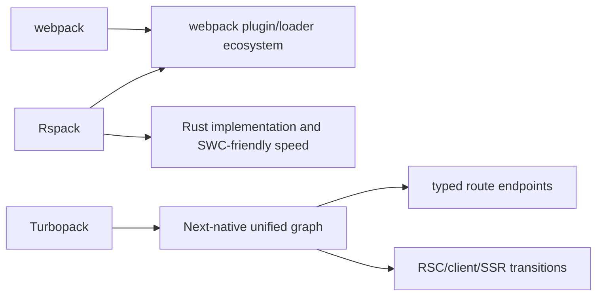

- webpack: mature JavaScript bundler and plugin ecosystem.
- Rspack: Rust bundler with webpack-compatible API, faster builds, and many compatible loaders/plugins.
- Turbopack: Rust incremental graph engine built into Next, not intended as a drop-in webpack config runner.

### In React on Rails/Shakapacker

Shakapacker is the Rails integration layer. It can drive webpack or Rspack and expose a Rails-friendly development/build story.

Using webpack:

- maximum compatibility with existing webpack loaders/plugins
- safest path for unusual custom configs
- slower builds compared with Rspack in many apps
- most RSC examples and `react-on-rails-rsc` internals are webpack-shaped

Using Rspack:

- faster Rust implementation
- webpack-style config and loader/plugin compatibility
- SWC-based transpilation path is a natural fit
- compatibility is high but not perfect
- watch for CSS extraction, CSS module hashing, lazy compilation, interop, and plugin edge cases
- current `react-on-rails-rsc` releases also ship native Rspack-facing exports:
  `react-on-rails-rsc/RspackPlugin`, `react-on-rails-rsc/RspackLoader`, and
  `react-on-rails-rsc/RSCReferenceDiscoveryPlugin`
- generated/dummy RSC configs currently use `RSCRspackPlugin` for manifests under Rspack while
  keeping `react-on-rails-rsc/WebpackLoader` for the RSC transform

That last point is important. Older RORP RSC explanations often say "Rspack just reuses the webpack
RSC plugin/loader/runtime." That was a useful shorthand for the webpack-compatible path, and it is
still directionally true for many webpack-shaped APIs. It is no longer precise enough. The package
now exposes explicit Rspack integration points while preserving the Webpack exports. Current dummy
config tests show the native Rspack manifest plugin selected under Rspack while the RSC transform
loader remains `WebpackLoader`-based because `RspackLoader` reports client modules to
`RSCRspackPlugin` and passes source through.

Local docs with practical details:

- [Webpack configuration: Rspack vs Webpack](../docs/oss/core-concepts/webpack-configuration.md)
- [Migrating from Webpack to Rspack](../docs/oss/migrating/migrating-from-webpack-to-rspack.md)
- [Generator details](../docs/oss/api-reference/generator-details.md)

### In Next.js

Next.js with webpack uses loaders/plugins to stitch App Router RSC behavior into webpack compilation. Next.js with its experimental Rspack path uses webpack-compatible APIs through `next-rspack`. Next.js with Turbopack computes the same conceptual outputs in the Rust graph.

The clean source-level contrast:

- webpack path: `next-flight-loader`, `flight-client-entry-plugin`, `flight-manifest-plugin`
- Turbopack path: `AppProject`, `TransitionOptions`, `NextEcmascriptClientReferenceTransition`, `EcmascriptClientReferenceModule`, `ClientReferencesGraph`

Turbopack is not the same kind of choice as Rspack in Shakapacker. Rspack preserves much of the
webpack-shaped integration surface, and RORP's RSC package now also exposes native Rspack plugin and
loader entry points. Turbopack moves the integration into Next-specific Rust code and typed route
endpoints.

## Why `react-on-rails-rsc` Is Separate

The separate package is architecturally justified.

Reasons:

1. React's framework/bundler-facing RSC APIs in React 19 are stable for app authors but not semver-stable for bundler/framework implementations across minor versions. React says this explicitly in the official docs.
2. The RSC adapter has to import condition-specific entries such as browser client, node client, server node, and React server builds.
3. The package owns bundler-facing loader/plugin behavior and manifest formats.
4. The main `react-on-rails-pro` package should not have to rev every time a React RSC bundler internal changes.
5. Apps need a compatibility matrix among React, React DOM, `react-on-rails-rsc`, webpack/Rspack, and Pro.

Current local version signals on `origin/main` at `17.0.0-rc.5`:

- The workspace default dependencies are React / React DOM `~19.0.4` and `react-on-rails-rsc`
  `19.0.5`.
- The generator's default RSC install policy intentionally stays on React `~19.0.4` and pins
  `react-on-rails-rsc@19.0.5`.
- The Pro package peer for `react-on-rails-rsc` is `^19.0.5`.
- `package.json` overrides scope the OSS dummy app to React 19.2.x and the Pro/RSC dummy app to
  React / React DOM `^19.2.7` plus `react-on-rails-rsc@19.2.0-rc.1`, so CI can soak-test the
  React 19.2 path before it becomes the default.
- Published `react-on-rails-rsc@19.2.0-rc.1` peers to React / React DOM `^19.2.7`.

So the current policy is not "only React 19.0.x works" and not yet "19.2.x is the default generator
target." It is a two-track policy:

- stable/default install path: React `~19.0.4` plus `react-on-rails-rsc@19.0.5`
- forward compatibility/soak path: React `19.2.7` plus `react-on-rails-rsc@19.2.0-rc.1`

The product docs need one clear compatibility statement:

```text
React on Rails Pro RSC supports:
  React / React DOM default install: ~19.0.4
  React / React DOM 19.2 soak path: 19.2.7 with react-on-rails-rsc 19.2.0-rc.1
  react-on-rails-rsc default install: 19.0.5
  webpack: supported through WebpackPlugin plus WebpackLoader
  Rspack: supported through RSCRspackPlugin/RspackPlugin for manifests plus the WebpackLoader
          RSC transform path in current generated configs
```

Given React's warning, the separate package is the compatibility adapter. In other words,
`react-on-rails-rsc` should be the package that tracks React RSC protocol/bundler internals, while
`react-on-rails-pro` and the generator decide which adapter version is the default install target.

## The Most Important Design Difference

Next turns RSC into a route protocol. React on Rails Pro turns RSC into a component protocol inside Rails.

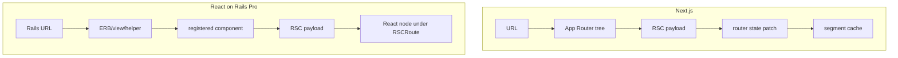

This explains almost every downstream difference:

- Next has to serialize route state and segment paths.
- RORP has to serialize component props and component names.
- Next can prefetch route segments.
- RORP can prefetch or cache component payloads.
- Next owns browser navigation.
- RORP leaves navigation to Rails, React Router, Turbo, or app-specific code.
- Next can make Turbopack deeply aware of route endpoints.
- RORP benefits from webpack/Rspack compatibility because Rails apps already have diverse asset setups.

## Where RORP Could Borrow Ideas From Next

These are not "should implement immediately" items. They are design inspirations.

1. Make the RSC payload cache key more explicitly protocol-versioned.

Next guards navigation with build IDs and deployment IDs. RORP already keys by component/props/dom id and bundle hash at higher levels, but a clear client-side protocol/version/build stamp could make stale embedded payloads easier to detect.

2. Consider component-level prefetch APIs.

Next's App Router prefetches route RSC payloads. RORP could expose a small prefetch primitive for `RSCRoute` payloads where props are known before user interaction.

3. Make RSC manifest diagnostics first-class.

Next has many route/build manifests, but also a consistent place to inspect them. RORP users would benefit from doctor output that says: "client manifest has X client refs, server client manifest has Y refs, RSC bundle can resolve react-server condition."

4. Consider a "Flight response only" dev inspector.

Next makes RSC requests visible as `text/x-component`. RORP has `/rsc_payload/:component_name`; the docs could show exactly how to inspect it, decode chunks, and correlate component names to manifest entries.

5. Keep the Webpack-compatible and native Rspack RSC paths explicit.

General Shakapacker Rspack support is documented. RSC-specific docs should distinguish the
Webpack-shaped transform path (`WebpackLoader`) from the native Rspack manifest path
(`RspackPlugin` / `RSCRspackPlugin`) and the separate `RspackLoader` reporting export, then state
which React / `react-on-rails-rsc` pairs are tested.

## Where RORP Should Not Copy Next

1. Do not make Rails pretend to be the Next App Router.

The value of React on Rails Pro is preserving Rails ownership. RSC should enhance Rails pages, not require a Next-like app directory.

2. Do not hide all process boundaries.

The explicit Rails, node renderer, server bundle, and RSC bundle boundaries are operationally useful in Rails deployments.

3. Do not couple Pro too tightly to one bundler.

Next can do that because Next owns the whole stack. RORP users benefit from Shakapacker's webpack/Rspack bridge.

4. Do not promise React minor compatibility without a test matrix.

React's own docs warn framework implementers about this. The separate `react-on-rails-rsc` package exists partly to absorb this volatility.

## Source-Level Map

### Next Runtime

- [app-render.tsx](https://github.com/vercel/next.js/blob/f4828c13e778dbe04c4a1e308ff29941536f091f/packages/next/src/server/app-render/app-render.tsx): central App Router renderer.
- [entry-base.ts](https://github.com/vercel/next.js/blob/f4828c13e778dbe04c4a1e308ff29941536f091f/packages/next/src/server/app-render/entry-base.ts): app-render exports and RSC API re-exports.
- [use-flight-response.tsx](https://github.com/vercel/next.js/blob/f4828c13e778dbe04c4a1e308ff29941536f091f/packages/next/src/server/app-render/use-flight-response.tsx): server-side Flight consumption and inline script stream.
- [create-component-tree.tsx](https://github.com/vercel/next.js/blob/f4828c13e778dbe04c4a1e308ff29941536f091f/packages/next/src/server/app-render/create-component-tree.tsx): builds seed tree from loader tree.
- [walk-tree-with-flight-router-state.tsx](https://github.com/vercel/next.js/blob/f4828c13e778dbe04c4a1e308ff29941536f091f/packages/next/src/server/app-render/walk-tree-with-flight-router-state.tsx): navigation diffing.
- [app-index.tsx](https://github.com/vercel/next.js/blob/f4828c13e778dbe04c4a1e308ff29941536f091f/packages/next/src/client/app-index.tsx): browser hydration entry.
- [fetch-server-response.ts](https://github.com/vercel/next.js/blob/f4828c13e778dbe04c4a1e308ff29941536f091f/packages/next/src/client/components/router-reducer/fetch-server-response.ts): browser Flight fetch/decode.

### Next Turbopack

- [next-api/src/app.rs](https://github.com/vercel/next.js/blob/f4828c13e778dbe04c4a1e308ff29941536f091f/crates/next-api/src/app.rs): App Router endpoint assembly and transitions.
- [next-api/src/project.rs](https://github.com/vercel/next.js/blob/f4828c13e778dbe04c4a1e308ff29941536f091f/crates/next-api/src/project.rs): Project setup.
- [next-core/src/app_page_loader_tree.rs](https://github.com/vercel/next.js/blob/f4828c13e778dbe04c4a1e308ff29941536f091f/crates/next-core/src/app_page_loader_tree.rs): loader tree generation.
- [next-core/src/next_app/app_page_entry.rs](https://github.com/vercel/next.js/blob/f4828c13e778dbe04c4a1e308ff29941536f091f/crates/next-core/src/next_app/app_page_entry.rs): app page entry generation.
- [next_client_reference](https://github.com/vercel/next.js/tree/f4828c13e778dbe04c4a1e308ff29941536f091f/crates/next-core/src/next_client_reference): Turbopack client reference implementation.
- [next_manifests/client_reference_manifest.rs](https://github.com/vercel/next.js/blob/f4828c13e778dbe04c4a1e308ff29941536f091f/crates/next-core/src/next_manifests/client_reference_manifest.rs): client reference manifest.
- [react_server_components.rs](https://github.com/vercel/next.js/blob/f4828c13e778dbe04c4a1e308ff29941536f091f/crates/next-custom-transforms/src/transforms/react_server_components.rs): RSC validation transform.

### React on Rails Pro

- [rendering-flow.md](../docs/pro/react-server-components/rendering-flow.md): existing Pro RSC flow doc.
- [server_rendering_js_code.rb](../react_on_rails_pro/lib/react_on_rails_pro/server_rendering_js_code.rb): generated JS and `generateRSCPayload`.
- [request.rb](../react_on_rails_pro/lib/react_on_rails_pro/request.rb): Rails-to-node-renderer request and asset upload.
- [node_rendering_pool.rb](../react_on_rails_pro/lib/react_on_rails_pro/server_rendering_pool/node_rendering_pool.rb): server vs RSC bundle hash selection.
- [streamServerRenderedReactComponent.ts](../packages/react-on-rails-pro/src/streamServerRenderedReactComponent.ts): server bundle SSR streaming.
- [ReactOnRailsRSC.ts](../packages/react-on-rails-pro/src/ReactOnRailsRSC.ts): RSC bundle runtime.
- [RSCRequestTracker.ts](../packages/react-on-rails-pro/src/RSCRequestTracker.ts): request-scoped Flight stream tracking.
- [injectRSCPayload.ts](../packages/react-on-rails-pro/src/injectRSCPayload.ts): HTML inline payload injection.
- [getReactServerComponent.server.ts](../packages/react-on-rails-pro/src/getReactServerComponent.server.ts): SSR-side RSC consumer.
- [getReactServerComponent.client.ts](../packages/react-on-rails-pro/src/getReactServerComponent.client.ts): browser-side RSC consumer.
- [RSCRoute.tsx](../packages/react-on-rails-pro/src/RSCRoute.tsx): Client Component bridge for rendering registered server components.
- [RSCProvider.tsx](../packages/react-on-rails-pro/src/RSCProvider.tsx): component cache and environment-independent RSC access.
- [rscWebpackConfig.js](../react_on_rails_pro/spec/dummy/config/webpack/rscWebpackConfig.js): RSC bundle configuration.

## Suggested Public Documentation Shape

If this analysis becomes published docs, I would split it:

1. `docs/pro/react-server-components/mental-model.md`
   - kid-friendly explanation
   - glossary
   - first request sequence

2. `docs/pro/react-server-components/architecture.md`
   - RORP bundles
   - Rails to node renderer
   - `RSCRequestTracker`
   - initial payload embedding
   - `/rsc_payload` endpoint

3. `docs/pro/react-server-components/nextjs-comparison.md`
   - Next route protocol vs RORP component protocol
   - Turbopack vs Shakapacker
   - migration implications

4. `docs/pro/react-server-components/version-compatibility.md`
   - React 19 range
   - `react-on-rails-rsc` range
   - webpack/Rspack support matrix
   - why the package is separate

## Bottom Line

Next.js RSC is a full application routing architecture. Turbopack is deeply integrated into that architecture, so it can compute route endpoints, client references, SSR chunks, RSC payload endpoints, and manifests as one unified graph.

React on Rails Pro RSC is a Rails integration architecture. It adds RSC to Rails pages without taking routing away from Rails. Its central trick is the server bundle to RSC bundle handoff plus request-scoped Flight stream teeing, so SSR and hydration share the same RSC payload without an initial refetch.

That makes the two systems spiritually similar at the React protocol layer, but strategically different at the framework layer.
