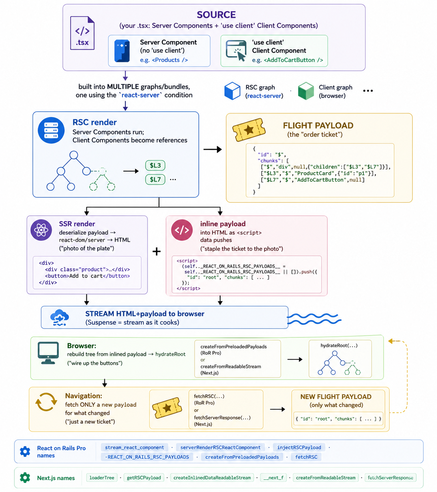

# React Server Components, End to End — START HERE

A complete, code‑grounded explanation of how React Server Components (RSC) work in **React on Rails
Pro**, how **Shakapacker** builds it in dev vs prod, why there's a separate **`react-on-rails-rsc`**
npm package, how **webpack vs rspack** differ — and then a deep dive into **Next.js + Turbopack** with
a full **compare‑and‑contrast**.

Everything here was verified against real source: this repo (React on Rails + Pro) and fresh clones of
**`vercel/next.js`** (with the Rust `turbopack/`+`crates/`) and **`facebook/react`** (the
`react-server-dom-*` runtimes). File paths in each doc are clickable starting points for going deeper.

---

## 🧒 The whole thing in one story (read this first)

Imagine a **restaurant**.

- **The kitchen is the server.** It can touch secret ingredients — your database, secret files, API
  keys — that customers must never see.
- A **Server Component** is a dish the kitchen finishes completely and sends out plated. Its _recipe_
  (source code) never leaves the kitchen, so the customer's "to‑go bag" (the JavaScript bundle) stays
  light. It can use the secret ingredients freely.
- A **Client Component** is a **build‑your‑own‑taco kit** at the table — interactive, with buttons and
  moving parts (`useState`, `onClick`). The customer plays with it.

Now the clever bit: **how does the kitchen tell your table what's on the plate?** Not by sending the
recipe. It sends an **order ticket** — a compact description that says _"here's the finished soup
(described exactly), and a taco kit — you already have kit #47 at your seat, fill it with these
toppings."_ That order ticket is the **RSC payload** (React calls the format **"Flight"**). The "you
already have kit #47" part is the magic: interactive pieces are **referenced**, not re‑described,
because the browser already downloaded them.

When you load a page:

1. The kitchen cooks the Server Components into an **order ticket** (RSC payload).
2. So you don't stare at an empty table, it also sends a **photo of the finished plate** (the server
   turns the ticket into **HTML** — "SSR") so you see food **instantly**.
3. Stapled to the photo is the **order ticket itself** (the payload, inlined into the HTML as little
   `<script>` data pushes).
4. Your browser reads the ticket, rebuilds the _real_ interactive plate from your at‑table kits, and
   the waiter connects all the buttons (**hydration**).
5. Later, pressing a button that needs fresh food fetches **just a new order ticket** — not a whole
   new page. That's why RSC apps feel fast.

**React on Rails Pro and Next.js tell this exact same story.** They use the same recipe book (React's
Flight protocol) and the same flow. They differ in the _building_: Next.js is a **purpose‑built RSC
restaurant** (kitchen + menu + waiters + lunchbox machine, all designed together in Rust); React on
Rails Pro is a **world‑class React station you bolt onto your existing Rails restaurant**, reusing a
general‑purpose lunchbox machine (webpack/rspack).

Two more cast members you'll meet:

- **Shakapacker / the bundler (webpack, rspack, Turbopack)** = the **lunchbox‑packing machine** that
  turns your many little source files into a few neat bundles the browser can eat. It runs two ways:
  _development_ (taste as you cook — hot‑swap one dish without leaving your seat = **HMR**) and
  _production_ (pack 10,000 sealed, labeled lunchboxes once and ship).
- **`react-on-rails-rsc` (the npm package)** = the shop that extracts React's RSC **engine** for one
  exact React version, tests it, bolts on the Rails brackets, and sells it in a labeled box. It's
  separate because the engine is welded to a specific React version's private guts and isn't sold
  standalone.

That's the entire mental model. Each document below makes one part precise, with the real function
names and file paths.

---

## 📚 Reading guide

| #   | Document                                              | What it answers                                                                                           | Read if you want…                                                                                              |
| --- | ----------------------------------------------------- | --------------------------------------------------------------------------------------------------------- | -------------------------------------------------------------------------------------------------------------- |
| 01  | **`01-ror-pro-rsc-request-flow.md`**                  | The complete browser↔Rails↔Node↔browser RSC flow in React on Rails Pro, with every real function name  | the precise call chain: helpers, node‑renderer, `injectRSCPayload`, hydration, navigation refetch, async props |
| 02  | **`02-shakapacker-dev-and-prod-builds.md`**           | Shakapacker in **dev (HMR)** vs **production**, and how the 3 RSC bundles are built/watched               | to understand the dev process set, React Refresh, the node‑renderer, and the prod precompile                   |
| 03  | **`03-rsc-npm-package-react19-webpack-vs-rspack.md`** | **Why `react-on-rails-rsc` exists**, how it maps to **React 19 versions**, and **webpack vs rspack**      | the version‑coupling story and why rspack needs no special RSC runtime                                         |
| 04  | **`04-nextjs-and-turbopack-deep-dive.md`**            | Next.js App Router RSC flow + the **Turbopack** (Rust) architecture, dev/HMR, and build                   | a deep, source‑grounded tour of how Next does all of this                                                      |
| 05  | **`05-compare-and-contrast.md`**                      | **React on Rails Pro vs Next.js** side by side: Rosetta Stone, bundler table, feature scorecard, strategy | the synthesis and the "so what" for React on Rails                                                             |

Suggested path:

- **Just want the concepts?** This page + the 🧒 boxes at the top of each section in 01, 04, 05.
- **Want the React on Rails truth?** 01 → 02 → 03.
- **Want the Next.js/Turbopack truth + comparison?** 04 → 05.

---

## 🔑 The five ideas to walk away with

1. **Three renders, not two.** Classic SSR = render→HTML→hydrate. RSC inserts a **Server‑Components
   render** _before_ SSR that produces a serialized React tree (the **Flight payload**), with client
   components left as **references**. (doc 01 §1–2)

2. **The payload is streamed _and_ inlined.** The server streams HTML for fast first paint and
   **inlines the same payload** into the HTML so the client hydrates without re‑fetching. RoR:
   `REACT_ON_RAILS_RSC_PAYLOADS`. Next: `__next_f`. Same trick. (doc 01 §4, doc 04 §2.3)

3. **The `react-server` condition forks React itself.** The RSC bundle resolves a _different build of
   React_ (`react.react-server.js`) that has no client hooks and exposes server internals. Forget the
   condition and RSC throws at import. (doc 03 §6.3, doc 04 §4.6)

4. **The RSC runtime is per‑bundler and version‑welded.** `react-server-dom-webpack` vs
   `-turbopack` differ only in the runtime "load chunk #47" primitive; both are pinned to an exact
   React version's private internals. That's why `react-on-rails-rsc` vendors a specific build.
   rspack can **reuse the webpack runtime** (React core and Next.js ship no `-rspack` build), but as
   of `react-on-rails-rsc@19.0.5‑rc.x` the package **also** ships a native Rspack plugin/loader
   backed by its own vendored `react-server-dom-rspack` (the GA direction). (doc 03 §1–2, §6.1, doc 05 §5)

5. **The deep difference is ownership.** Next builds RSC **into** a Rust bundler + framework (buying
   Turbopack speed, prefetch, server actions, PPR). React on Rails Pro **bolts** RSC onto a
   general‑purpose bundler so it can live inside **any real Rails app**. (doc 05 §4)

---

## 🗺️ Master diagram: the shared shape



> _Conceptual overview — the same flow as the ASCII diagram below, and both function-name rows
> are accurate. **Caveat:** the "Flight payload" and inlined `<script>` boxes are **simplified
> pseudocode, not the literal wire format.** Real React Flight is newline-delimited rows
> (`0:[…]`, `1:I[…]`), and a `'use client'` component like `AddToCartButton` appears as a
> **client reference** (an import row), not an inline element; React on Rails' inlined payload is
> a **keyed** array of raw length-prefixed Flight strings, not a single `{id, chunks}` object.
> See `01-ror-pro-rsc-request-flow.md` §E for the exact framing._

```
   SOURCE  (your .tsx: Server Components + 'use client' Client Components)
      │
      │  built into MULTIPLE graphs/bundles, one using the `react-server` condition
      ▼
   ┌─ RSC render ───────────────────────────────────────────────┐
   │  Server Components run; Client Components become references │  → FLIGHT PAYLOAD (the "order ticket")
   └────────────────────────────────────────────────────────────┘
      │
      ├─► SSR render: deserialize payload → react-dom/server → HTML  ("photo of the plate")
      │
      └─► inline payload into HTML as <script> data pushes          ("staple the ticket to the photo")
      ▼
   STREAM HTML+payload to browser (Suspense = stream as it cooks)
      ▼
   Browser: rebuild tree from inlined payload → hydrateRoot          ("wire up the buttons")
      ▼
   Navigation: fetch ONLY a new payload for what changed             ("just a new ticket")

   RoR Pro names:  stream_react_component · serverRenderRSCReactComponent · injectRSCPayload ·
                   REACT_ON_RAILS_RSC_PAYLOADS · createFromPreloadedPayloads · fetchRSC
   Next.js names:  loaderTree · getRSCPayload · createInlinedDataReadableStream ·
                   __next_f · createFromReadableStream · fetchServerResponse
```

---

## 🧰 Where the research came from

- **React on Rails + Pro:** this repository (`packages/react-on-rails-pro/`,
  `react_on_rails_pro/`, the generators, the dummy apps).
- **Next.js + Turbopack:** a fresh shallow clone of `vercel/next.js` (v16.3.0‑canary) — App Router
  server/client runtime under `packages/next/src/`, Turbopack under `turbopack/crates/` +
  Next‑specific Rust under `crates/`.
- **React RSC runtimes:** a fresh shallow clone of `facebook/react` —
  `packages/react-server-dom-{webpack,turbopack,parcel,esm,unbundled}`, `react-server`, `react-client`.

These reference repos are **not committed** to this repository. To browse the exact files cited in
docs 03–05, clone `vercel/next.js` and `facebook/react` yourself (a shallow clone is enough). The
original research used local checkouts under `.context/next-research/repos/`, but that path only
exists in the author's workspace.
