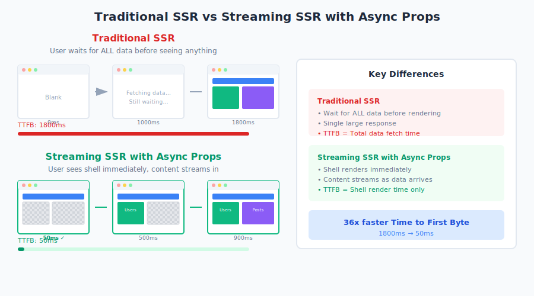
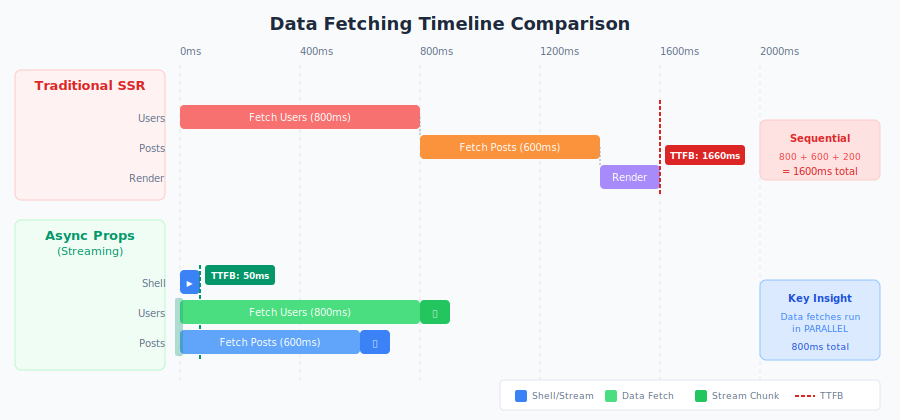
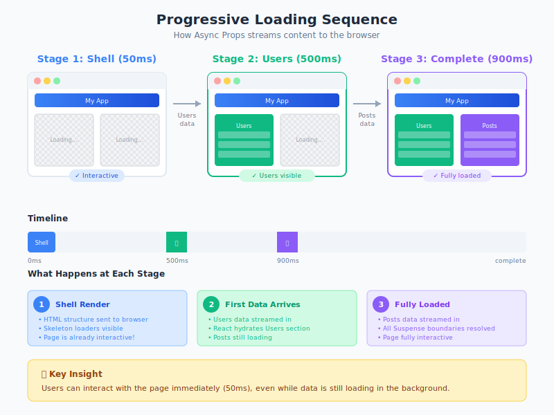
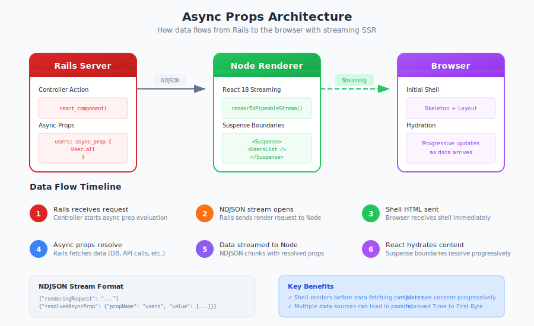

# Async Props: Streaming Server-Side Rendering

Async Props is a React on Rails Pro feature that enables **streaming server-side rendering** with progressive hydration. Instead of waiting for all data to load before sending any HTML to the browser, Async Props streams the page shell immediately while data fetches happen in parallel.

## The Problem with Traditional SSR

In traditional SSR, the entire page must wait for **all** data before anything is sent to the browser:



This creates a poor user experience:
- **Long Time to First Byte (TTFB)**: Users stare at a blank screen
- **Sequential data fetching**: Each data source blocks the next
- **All-or-nothing rendering**: No content until everything is ready

## How Async Props Solves This

Async Props uses React 18's streaming capabilities to render content progressively:



### Key Benefits

| Metric | Traditional SSR | Async Props |
|--------|-----------------|-------------|
| Time to First Byte | 1800ms | **50ms** |
| Time to Interactive | 1800ms | **50ms** |
| Data Fetching | Sequential | **Parallel** |
| User Perception | Slow | **Fast** |

## Progressive Loading in Action

Watch how content loads progressively with Async Props:



1. **Stage 1 (50ms)**: Shell renders with skeleton loaders - page is already interactive!
2. **Stage 2 (500ms)**: First data arrives, Users section hydrates
3. **Stage 3 (900ms)**: Remaining data arrives, page fully loaded

## Architecture Overview

Async Props uses NDJSON streaming between Rails and the Node renderer:



### How It Works

1. **Rails Controller** defines async props using `async_prop` blocks
2. **NDJSON Stream** opens between Rails and Node renderer
3. **Shell HTML** is sent to browser immediately
4. **Data fetches** happen in parallel on the Rails side
5. **Resolved props** stream to Node as they complete
6. **React hydrates** each section as its data arrives

## Quick Start

### 1. Define Async Props in Your Controller

```ruby
class DashboardController < ApplicationController
  def show
    render_component(
      "Dashboard",
      props: {
        # Regular prop - available immediately
        title: "My Dashboard",

        # Async prop - streams when ready
        users: async_prop { User.active.limit(10) },

        # Another async prop - fetches in parallel
        posts: async_prop { Post.recent.limit(5) }
      }
    )
  end
end
```

### 2. Use Suspense in Your Component

```tsx
import React, { Suspense } from 'react';

function Dashboard({ title, users, posts }) {
  return (
    <div>
      <h1>{title}</h1>

      <Suspense fallback={<UsersSkeleton />}>
        <UsersList users={users} />
      </Suspense>

      <Suspense fallback={<PostsSkeleton />}>
        <PostsList posts={posts} />
      </Suspense>
    </div>
  );
}
```

### 3. That's It!

The shell with skeleton loaders renders immediately. As each async prop resolves, React hydrates that section automatically.

## When to Use Async Props

**Use Async Props when:**
- You have slow database queries or API calls
- Multiple independent data sources
- Pages with distinct loading sections
- SEO is important (full SSR, not client-side fetch)

**Consider alternatives when:**
- Data fetches are already fast (<100ms)
- Single data source with no parallelization opportunity
- Static pages with no dynamic data

## Learn More

- [How Async Props Works](./how-it-works.md) - Deep dive into the streaming architecture
- [API Reference](./api-reference.md) - Complete configuration options
- [Advanced Usage](./advanced-usage.md) - Error handling, caching, and optimization
