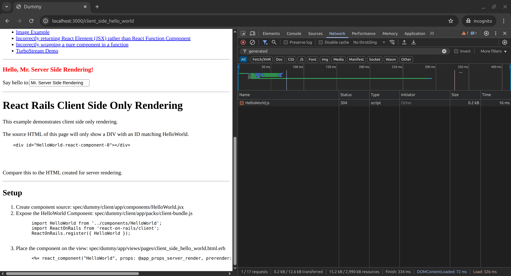

# Getting Started

> **💡 Looking for the fastest way to get started?** Try our **[15-Minute Quick Start Guide](./quick-start/README.md)** instead.

## Choose Your Starting Point

The best way to understand React on Rails depends on your situation:

### 🚀 **New to React on Rails?**

**→ [15-Minute Quick Start](./quick-start/README.md)** - Get your first component working fast

### 📱 **Have an existing Rails app?**

**→ [Add to Existing App](./guides/installation-into-an-existing-rails-app.md)** - Integrate React on Rails

### 📚 **Want comprehensive tutorial?**

**→ [Complete Tutorial](./guides/tutorial.md)** - Step-by-step with Redux and routing

### 👀 **Learn by example?**

- **[Spec/Dummy](https://github.com/shakacode/react_on_rails/tree/master/spec/dummy)** - Simple example in this repo
- **[Live Demo](https://reactrails.com)** with **[source code](https://github.com/shakacode/react-webpack-rails-tutorial)**

---

## System Requirements

✅ **🚨 React on Rails 16.0+** (this guide covers modern features)
✅ **🚨 Shakapacker 6+** (7+ recommended for React on Rails 16)
✅ **Rails 7+** (Rails 5.2+ supported)
✅ **Ruby 3.0+** (required)
✅ **Node.js 18+**

> **Don't have Shakapacker?** It's the modern replacement for Webpacker and required for React on Rails.

## Basic Installation

You need a Rails application with Shakapacker installed and configured on it. Check [Shakapacker documentation](https://github.com/shakacode/shakapacker) for more details but typically you need the following steps:

```bash
rails new PROJECT_NAME --skip-javascript
cd PROJECT_NAME
```

## React on Rails Installation

1. Add the `react_on_rails` gem to Gemfile:
   Please use [the latest version](https://rubygems.org/gems/react_on_rails) to ensure you get all the security patches and the best support.

   ```bash
   bundle add react_on_rails --version=16.0.0 --strict
   ```

   Commit this to git (or else you cannot run the generator in the next step unless you pass the option `--ignore-warnings`).

   ```bash
   git add -A
   git commit -m "Initial commit"
   ```

2. Run the install generator:

   ```bash
   bundle exec rails generate react_on_rails:install
   ```

Start the app:

```bash
bin/dev help
bin/dev # start with hmr
bin/dev static #
```

## Basic Usage

### Configuration

- Configure `config/initializers/react_on_rails.rb`. You can adjust some necessary settings and defaults. See file [docs/basics/configuration.md](./guides/configuration.md) for documentation of all configuration options.
- Configure `config/shakapacker.yml`. If you used the generator and the default Shakapacker setup, you don't need to touch this file. If you are customizing your setup, then consult the [spec/dummy/config/shakapacker.yml](https://github.com/shakacode/react_on_rails/tree/master/spec/dummy/config/shakapacker.yml) example or the official default [shakapacker.yml](https://github.com/shakacode/shakapacker/blob/master/lib/install/config/shakapacker.yml).
- Most apps should rely on the Shakapacker setup for Webpack. Shakapacker v6+ includes support for Webpack version 5.

## Including your React Component on your Rails Views

Once installation is complete, you can render a React component in any Rails view using the `react_component` helper method.

```erb
<%= react_component("HelloWorld", props: @some_props) %>
```

- **Server-Side Rendering**: Your React component is first rendered into HTML on the server. Use the **prerender** option:

  ```erb
  <%= react_component("HelloWorld", props: @some_props, prerender: true) %>
  ```

`@component_name` is a string and corresponds to the name you used to globally expose your React component.

## Auto-Bundling (includes Auto-Registration)

React on Rails supports **Auto-Bundling**, which automatically creates the webpack bundle _and_ registers your React components. This means you don’t have to manually configure packs or call `ReactOnRails.register(...)`.

---

### Manual Registration (traditional way)

```js
// packs/hello-world-bundle.js
import ReactOnRails from 'react-on-rails';
import HelloWorld from '../components/HelloWorld';

ReactOnRails.register({ HelloWorld });
```

```erb
<%= react_component("HelloWorld", @hello_world_props) %>
```

Here you must both configure the pack entry (`hello-world-bundle.js`) and register the component.

---

### Auto-Bundling (with Auto-Registration)

```erb
<%= react_component("HelloWorld", @hello_world_props, auto_load_bundle: true) %>
<%= react_component("HeavyMarkdownEditor", @editor_props, auto_load_bundle: true) %>
```

With `auto_load_bundle: true`, and by placing your "exposed" components in the appropriate directories, React on Rails:

- Automatically finds and bundles your component.
- Automatically registers it for use.
- Eliminates the need for manual pack configuration.

See [Auto-Bundling: File-System-Based Automated Bundle Generation](./guides/auto-bundling-file-system-based-automated-bundle-generation.md)

Exposing your component in this way allows you to reference the component from a Rails view. You can expose as many components as you like, but their names must be unique. See below for the details of how you expose your components via the React on Rails Webpack configuration. You may call `ReactOnRails.register` many times.

- `@some_props` can be either a hash or JSON string. This is an optional argument assuming you do not need to pass any options (if you want to pass options, such as `prerender: true`, but you do not want to pass any properties, simply pass an empty hash `{}`). **Props are automatically sanitized by React on Rails for security.** This will make the data available in your component:

- This is what your HelloWorld.js file might contain. The railsContext is always available for any parameters that you _always_ want available for your React components. It has _nothing_ to do with the concept of the [React Context](https://react.dev/reference/react/useContext). See [Render-Functions and the RailsContext](./guides/render-functions-and-railscontext.md) for more details on this topic.

  ```js
  import React from 'react';

  export default (props, railsContext) => {
    // Note wrap in a function to make this a React function component
    return () => (
      <div>
        Your locale is {railsContext.i18nLocale}.<br />
        Hello, {props.name}!
      </div>
    );
  };
  ```

## What Happens Next?

The generator set up the following:

1. Component directory: `app/javascript/bundles/HelloWorld`
2. Rails integration for rendering this component in a Rails view
3. Webpack configuration for building your JavaScript bundle



#### Different Server-Side Rendering Code (and a Server-Specific Bundle)

You may want different code for your server-rendered components running on the server side versus the client side. For example, if you have an animation that runs when a component is displayed, you might need to turn that off when server rendering. One way to handle this is conditional code like `if (typeof window !== 'undefined') { doClientOnlyCode() }`.

Another way is to use a separate Webpack configuration file that can use a different server-side entry file, like 'serverRegistration.js' as opposed to 'clientRegistration.js.' That would set up different code for server rendering.

For details on techniques to use different code for client and server rendering, see: [How to use different versions of a file for client and server rendering](https://forum.shakacode.com/t/how-to-use-different-versions-of-a-file-for-client-and-server-rendering/1352). (_Requires creating a free account._)

## Specifying Your React Components

You have two ways to specify your React components. You can either register the React component (either function or class component) directly, or you can create a function that returns a React component, which we using the name of a "render-function". Creating a render-function allows you to:

1. Access to the `railsContext`. See the [documentation for the railsContext](./guides/render-functions-and-railscontext.md) in terms of why you might need it. You **need** a Render-Function to access the `railsContext`.
2. Use the passed-in props to initialize a redux store or set up `react-router`.
3. Return different components depending on what's in the props.

Note, the return value of a **Render-Function** should be either a React Function or Class Component or an object representing server rendering results.

**Do not return a React Element (JSX).**

ReactOnRails will automatically detect a registered Render-Function by the fact that the function takes
more than 1 parameter. In other words, if you want the ability to provide a function that returns the
React component, then you need to specify at least a second parameter. This is the `railsContext`.
If you're not using this parameter, declare your function with the unused param:

```js
const MyComponentGenerator = (props, _railsContext) => {
  if (props.print) {
    // This is a React FunctionComponent because it is wrapped in a function.
    return () => <H1>{JSON.stringify(props)}</H1>;
  }
};
```

Thus, there is no difference between registering a React Function Component or class Component versus a "Render-Function." Just call `ReactOnRails.register`.

## react_component_hash for Render-Functions

Another reason to use a Render-Function is that sometimes in server rendering, specifically with React Router, you need to return the result of calling ReactDOMServer.renderToString(element). You can do this by returning an object with the following shape: `{ renderedHtml, redirectLocation, error }`. Make sure you use this function with `react_component_hash`.

For server rendering, if you wish to return multiple HTML strings from a Render-Function, you may return an Object from your Render-Function with a single top-level property of `renderedHtml`. Inside this Object, place a key called `componentHtml`, along with any other needed keys. An example scenario of this is when you are using side effects libraries like [React Helmet](https://github.com/nfl/react-helmet). Your Ruby code will get this Object as a Hash containing keys `componentHtml` and any other custom keys that you added:

```js
{
  renderedHtml: {
    componentHtml,
    customKey1,
    customKey2,
  },
}
```

For details on using react_component_hash with react-helmet, see [our react-helmet documentation](./javascript/react-helmet.md).

## Error Handling

- All errors from ReactOnRails will be of type ReactOnRails::Error.
- Prerendering (server rendering) errors get context information for HoneyBadger and Sentry for easier debugging.

## I18n

React on Rails provides an option for automatic conversions of Rails `*.yml` locale files into `*.json` or `*.js`.
See the [How to add I18n](./guides/i18n.md) for a summary of adding I18n.

## More Reading

Depending on your goals, here's a progression of what to do next:

1. **[View Helpers API](./api/view-helpers-api.md)** - for more options of the `react_component` method.
2. **[Tutorial](./guides/tutorial.md)** - Comprehensive walkthrough of features with a real app.
3. **[Configuration](./guides/configuration.md)** - Details on every possible option you can configure.
4. **[Migration Guide](./guides/upgrading-react-on-rails.md)** - Upgrade advice for each version.

---

## Additional Resources

### Rails/React Integration Options

- **[Rails + Webpack Comparison](./guides/rails-webpacker-react-integration-options.md)**

### JavaScript/TypeScript Module System

- See the official [Shakapacker documentation](https://github.com/shakacode/shakapacker) for more details regarding this topic.
