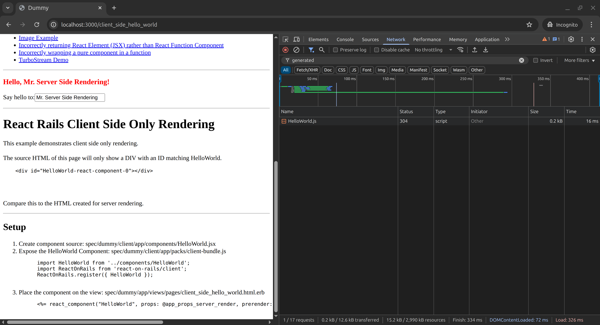

# Auto-Bundling: File-System-Based Automated Bundle Generation

To use the automated bundle generation feature introduced in React on Rails v13.1.0, please upgrade to use [Shakapacker v6.5.1](https://github.com/shakacode/shakapacker/tree/v6.5.1) at least. If you are currently using Webpacker, please follow the migration steps available [v6 upgrade](https://github.com/shakacode/shakapacker/blob/master/docs/v6_upgrade.md). Then upgrade to Shakapacker 7 using [v7 upgrade](https://github.com/shakacode/shakapacker/blob/master/docs/v7_upgrade.md) guide.

## Configuration

### Enable nested_entries for Shakapacker

To use the automated bundle generation feature, set `nested_entries: true` in the `shakapacker.yml` file like this.
The generated files will go in a nested directory.

```yml
default:
  ...
  nested_entries: true
```

For more details, see [Configuration and Code](https://github.com/shakacode/shakapacker#configuration-and-code) section in [shakapacker](https://github.com/shakacode/shakapacker/).

> Example (dummy app): `nested_entries: true` with a different `source_path: client/app`. See `config/shakapacker.yml` in the dummy app.
> [Dummy shakapacker.yml](https://github.com/shakacode/react_on_rails/blob/master/spec/dummy/config/shakapacker.yml)

### Configure Components Subdirectory

`components_subdirectory` is the name of the matched directories containing components that will be automatically registered for use by the view helpers.
For example, configure `config/initializers/react_on_rails` to set the name for `components_subdirectory`:

```rb
config.components_subdirectory = "ror_components"
```

Now all React components inside the directories called `ror_components` will automatically be registered for usage with [`react_component`](../api/view-helpers-api.md#react_component) and [`react_component_hash`](../api/view-helpers-api.md#react_component_hash) helper methods provided by React on Rails.

> Example (dummy app): the configured components subdirectory is named `startup` instead of `ror_components`.
> [Dummy initializer](https://github.com/shakacode/react_on_rails/blob/master/spec/dummy/config/initializers/react_on_rails.rb)

### Configure `auto_load_bundle` Option

For automated component registry, [`react_component`](../api/view-helpers-api.md#react_component) and [`react_component_hash`](../api/view-helpers-api.md#react_component_hash) view helper method tries to load generated bundle for component from the generated directory automatically per `auto_load_bundle` option. `auto_load_bundle` option in `config/initializers/react_on_rails` configures the default value that will be passed to component helpers. The default is `false`, and the parameter can be passed explicitly for each call.

You can change the value in `config/initializers/react_on_rails` by updating it as follows:

```rb
config.auto_load_bundle = true
```

> Example (dummy app): `auto_load_bundle` is set to `true` in the same initializer.
> [Dummy initializer](https://github.com/shakacode/react_on_rails/blob/master/spec/dummy/config/initializers/react_on_rails.rb)

### Location of generated files

Generated files will go to the following two directories:

- Pack files for entrypoint components will be generated in the `{Shakapacker.config.source_entry_path}/generated` directory.
- The interim server bundle file, which is only generated if you already have a server bundle entrypoint and have not set `make_generated_server_bundle_the_entrypoint` to `true`, will be generated in the `{Pathname(Shakapacker.config.source_entry_path).parent}/generated` directory.

### Update `.gitignore` file

To avoid committing generated files to your version control system, please update `.gitignore` to include:

```gitignore
# Generated React on Rails packs
**/generated/**
```

### Commit changes to server bundle entrypoint

If you already have an existing server bundle entrypoint and have not set `make_generated_server_bundle_the_entrypoint` to `true`, then pack generation will add an import statement to your existing server bundle entrypoint similar to:

```javascript
// import statement added by react_on_rails:generate_packs rake task
import './../generated/server-bundle-generated.js';
```

We recommend committing this import statement to your version control system.

> Example (dummy app): see the server bundle entrypoint import.
> [Dummy server-bundle.js](https://github.com/shakacode/react_on_rails/blob/master/spec/dummy/client/app/packs/server-bundle.js)

## Usage

### Basic usage

#### Background

If the `shakapacker.yml` file is configured as instructed [here](https://github.com/shakacode/shakapacker#configuration-and-code), with the following configurations

```yml
default: &default
  source_path: app/javascript
  source_entry_path: packs
  public_root_path: public
  public_output_path: packs
  nested_entries: true
# And more
```

the directory structure will look like this

```
app/javascript:
  └── packs:               # sets up webpack entries
  │   └── application.js   # references FooComponentOne.jsx, BarComponentOne.jsx and BarComponentTwo.jsx in `../src`
  └── src:                 # any directory name is fine. Referenced files need to be under source_path
  │   └── Foo
  │   │   └── ...
  │   │   └── FooComponentOne.jsx
  │   └── Bar
  │   │   └── ...
  │   │   └── BarComponentOne.jsx
  │   │   └── BarComponentTwo.jsx
  └── stylesheets:
  │   └── my_styles.css
  └── images:
      └── logo.svg
```

Previously, many applications would use one pack (webpack entrypoint) for many components. In this example, the`application.js` file manually registers server components, `FooComponentOne`, `BarComponentOne` and `BarComponentTwo`.

```jsx
import ReactOnRails from 'react-on-rails';
import FooComponentOne from '../src/Foo/FooComponentOne';
import BarComponentOne from '../src/Foo/BarComponentOne';
import BarComponentTwo from '../src/Foo/BarComponentTwo';

ReactOnRails.register({ FooComponentOne, BarComponentOne, BarComponentTwo });
```

Your layout would contain:

```erb
  <%= javascript_pack_tag 'application' %>
  <%= stylesheet_pack_tag 'application' %>
```

Now suppose you want to use bundle splitting to minimize unnecessary javascript loaded on each page, you would put each of your components in the `packs` directory.

```text
app/javascript:
  └── packs:                   # sets up webpack entries
  │   └── FooComponentOne.jsx  # Internally uses ReactOnRails.register
  │   └── BarComponentOne.jsx  # Internally uses ReactOnRails.register
  │   └── BarComponentTwo.jsx  # Internally uses ReactOnRails.register
  └── src:                     # any directory name is fine. Referenced files need to be under source_path
  │   └── Foo
  │   │   └── ...
  │   └── Bar
  │   │   └── ...
  └── stylesheets:
  │   └── my_styles.css
  └── images:
      └── logo.svg
```

The tricky part is to figure out which bundles to load on any Rails view. [Shakapacker's `append_stylesheet_pack_tag` and `append_javascript_pack_tag` view helpers](https://github.com/shakacode/shakapacker#view-helper-append_javascript_pack_tag-and-append_stylesheet_pack_tag) enables Rails views to specify needed bundles for use by layout's call to `javascript_pack_tag` and `stylesheet_pack_tag`.

#### Solution

File-system-based automated pack generation simplifies this process with a new option for the view helpers.

> Note: In the Background examples above, we used `BarComponentTwo`. In the Solution below, we refer to the same component as `SpecialComponentNotToAutoLoadBundle` to emphasize that it is excluded from auto-loading. You do not need to rename your files.

For example, if you wanted to utilize our file-system based entrypoint generation for `FooComponentOne` and `BarComponentOne`, but not `SpecialComponentNotToAutoLoadBundle` (formerly `BarComponentTwo`) (for whatever reason), then...

1. Remove generated entrypoints from parameters passed directly to `javascript_pack_tag` and `stylesheet_pack_tag`.
2. Remove generated entrypoints from parameters passed directly to `append_javascript_pack_tag` and `append_stylesheet_pack_tag`.

   Your layout would now contain:

   ```erb
   <%= javascript_pack_tag('SpecialComponentNotToAutoLoadBundle') %>
   <%= stylesheet_pack_tag('SpecialComponentNotToAutoLoadBundle') %>
   ```

3. Create a directory structure where the components that you want to be auto-generated are within `ReactOnRails.configuration.components_subdirectory`, which should be a subdirectory of `Shakapacker.config.source_path`:

   ```text
   app/javascript:
     └── packs:
     │   └── SpecialComponentNotToAutoLoadBundle.jsx  # Internally uses ReactOnRails.register
     └── src:
     │   └── Foo
     │   │ └── ...
     │   │ └── ror_components          # configured as `components_subdirectory`
     │   │   └── FooComponentOne.jsx
     │   └── Bar
     │   │ └── ...
     │   │ └── ror_components          # configured as `components_subdirectory`
     │   │   │ └── BarComponentOne.jsx
     │   │ └── something_else
     │   │   │ └── SpecialComponentNotToAutoLoadBundle.jsx
   ```

   4. You no longer need to register the React components within the `ReactOnRails.configuration.components_subdirectory` nor directly add their bundles. For example, you can have a Rails view using three components:

      ```erb
      <%= react_component("FooComponentOne", {}, auto_load_bundle: true) %>
      <%= react_component("BarComponentOne", {}, auto_load_bundle: true) %>

      <% append_javascript_pack_tag('SpecialComponentNotToAutoLoadBundle') %>
      <%= react_component("SpecialComponentNotToAutoLoadBundle", {}) %>
      ```

      If a component uses multiple HTML strings for server rendering, the [`react_component_hash`](../api/view-helpers-api.md#react_component_hash) view helper can be used on the Rails view, as illustrated below.

      ```erb
      <% foo_component_one_data = react_component_hash(
           "FooComponentOne",
           prerender: true,
           auto_load_bundle: true,
           props: {}
         )
      %>
      <% content_for :title do %>
        <%= foo_component_one_data["title"] %>
      <% end %>
      <%= foo_component_one_data["componentHtml"] %>
      ```

      The default value of the `auto_load_bundle` parameter can be specified by setting `config.auto_load_bundle` in `config/initializers/react_on_rails.rb` and thus removed from each call to `react_component`.

### Layout Integration with Auto-Loading

When using `auto_load_bundle: true`, your Rails layout needs to include empty pack tag placeholders where React on Rails will inject the component-specific CSS and JavaScript bundles automatically:

```erb
<!DOCTYPE html>
<html>
  <head>
    <!-- Your regular head content -->
    <%= csrf_meta_tags %>
    <%= csp_meta_tag %>

    <!-- Empty pack tags - React on Rails injects component CSS/JS here -->
    <%= stylesheet_pack_tag %>
    <%= javascript_pack_tag %>
  </head>
  <body>
    <%= yield %>
  </body>
</html>
```

**How it works:**

1. **Component calls automatically append bundles**: When you use `<%= react_component("ComponentName", props, auto_load_bundle: true) %>` in a view, React on Rails automatically calls `append_javascript_pack_tag "generated/ComponentName"` and `append_stylesheet_pack_tag "generated/ComponentName"` (in static/production modes).

2. **Layout renders appended bundles**: The empty `<%= stylesheet_pack_tag %>` and `<%= javascript_pack_tag %>` calls in your layout are where the appended component bundles get rendered.

3. **No manual bundle management**: You don't need to manually specify which bundles to load - React on Rails handles this automatically based on which components are used in each view.

**Example with multiple components:**

If your view contains:

```erb
<%= react_component("HelloWorld", @hello_world_props, auto_load_bundle: true) %>
<%= react_component("HeavyMarkdownEditor", @editor_props, auto_load_bundle: true) %>
```

React on Rails automatically generates HTML equivalent to:

```erb
<!-- In <head> where <%= stylesheet_pack_tag %> appears -->
<%= stylesheet_pack_tag "generated/HelloWorld" %>
<%= stylesheet_pack_tag "generated/HeavyMarkdownEditor" %>

<!-- Before </body> where <%= javascript_pack_tag %> appears -->
<%= javascript_pack_tag "generated/HelloWorld" %>
<%= javascript_pack_tag "generated/HeavyMarkdownEditor" %>
```

This enables optimal bundle splitting where each page only loads the CSS and JavaScript needed for the components actually used on that page.

## Complete Working Example

Here's a step-by-step example showing how to set up file-system-based automated bundle generation from scratch:

### 1. Configure Shakapacker

In `config/shakapacker.yml`:

```yml
default: &default
  source_path: app/javascript
  source_entry_path: packs
  public_root_path: public
  public_output_path: packs
  nested_entries: true # Required for auto-generation
  cache_manifest: false
```

### 2. Configure React on Rails

In `config/initializers/react_on_rails.rb`:

```rb
ReactOnRails.configure do |config|
  config.components_subdirectory = "ror_components"  # Directory name for auto-registered components
  config.auto_load_bundle = true                     # Enable automatic bundle loading
  config.server_bundle_js_file = "server-bundle.js"
end
```

### 3. Directory Structure

Set up your directory structure like this:

```text
app/javascript/
└── src/
    ├── HelloWorld/
    │   ├── HelloWorld.module.css           # Component styles
    │   └── ror_components/                 # Auto-registration directory
    │       └── HelloWorld.jsx              # React component
    └── HeavyMarkdownEditor/
        ├── HeavyMarkdownEditor.module.css  # Component styles
        └── ror_components/                 # Auto-registration directory
            └── HeavyMarkdownEditor.jsx     # React component
```

### 4. Component Implementation

`app/javascript/src/HelloWorld/ror_components/HelloWorld.jsx`:

```jsx
import React from 'react';
import styles from '../HelloWorld.module.css';

const HelloWorld = ({ name }) => (
  <div className={styles.hello}>
    <h1>Hello {name}!</h1>
    <p>Welcome to React on Rails with auto-registration!</p>
  </div>
);

export default HelloWorld;
```

`app/javascript/src/HeavyMarkdownEditor/ror_components/HeavyMarkdownEditor.jsx`:

```jsx
import React, { useState, useEffect } from 'react';
import styles from '../HeavyMarkdownEditor.module.css';

const HeavyMarkdownEditor = ({ initialContent = '# Hello\n\nStart editing!' }) => {
  const [content, setContent] = useState(initialContent);
  const [ReactMarkdown, setReactMarkdown] = useState(null);
  const [remarkGfm, setRemarkGfm] = useState(null);

  // Dynamic imports for SSR compatibility
  useEffect(() => {
    const loadMarkdown = async () => {
      const [{ default: ReactMarkdown }, { default: remarkGfm }] = await Promise.all([
        import('react-markdown'),
        import('remark-gfm'),
      ]);
      setReactMarkdown(() => ReactMarkdown);
      setRemarkGfm(() => remarkGfm);
    };
    loadMarkdown();
  }, []);

  if (!ReactMarkdown) {
    return <div className={styles.loading}>Loading editor...</div>;
  }

  return (
    <div className={styles.editor}>
      <div className={styles.input}>
        <h3>Markdown Input:</h3>
        <textarea value={content} onChange={(e) => setContent(e.target.value)} className={styles.textarea} />
      </div>
      <div className={styles.output}>
        <h3>Preview:</h3>
        <div className={styles.preview}>
          <ReactMarkdown remarkPlugins={[remarkGfm]}>{content}</ReactMarkdown>
        </div>
      </div>
    </div>
  );
};

export default HeavyMarkdownEditor;
```

### 5. Rails Layout

`app/views/layouts/application.html.erb`:

```erb
<!DOCTYPE html>
<html>
  <head>
    <title>React on Rails Auto-Registration Demo</title>
    <meta name="viewport" content="width=device-width,initial-scale=1">
    <%= csrf_meta_tags %>
    <%= csp_meta_tag %>

    <!-- Empty pack tags - React on Rails injects component CSS/JS here -->
    <%= stylesheet_pack_tag %>
    <%= javascript_pack_tag %>
  </head>

  <body>
    <%= yield %>
  </body>
</html>
```

### 6. Rails Views and Controller

`app/controllers/hello_world_controller.rb`:

```rb
class HelloWorldController < ApplicationController
  def index
    @hello_world_props = { name: 'Auto-Registration' }
  end

  def editor
    @editor_props = {
      initialContent: "# Welcome to the Heavy Editor\n\nThis component demonstrates:\n- Dynamic imports for SSR\n- Bundle splitting\n- Automatic CSS loading"
    }
  end
end
```

`app/views/hello_world/index.html.erb`:

```erb
<%= react_component("HelloWorld", @hello_world_props, prerender: true) %>
```

`app/views/hello_world/editor.html.erb`:

```erb
<%= react_component("HeavyMarkdownEditor", @editor_props, prerender: true) %>
```

### 7. Generate Bundles

Run the pack generation command:

```bash
bundle exec rake react_on_rails:generate_packs
```

This creates:

- `app/javascript/packs/generated/HelloWorld.js`
- `app/javascript/packs/generated/HeavyMarkdownEditor.js`

### 8. Update .gitignore

```gitignore
# Generated React on Rails packs
**/generated/**
```

### 9. Start the Server

Now when you visit your pages, React on Rails automatically:

- Loads only the CSS and JS needed for components on each page
- Registers components without manual `ReactOnRails.register()` calls
- Enables optimal bundle splitting and caching

**Bundle sizes in this example (measured from browser dev tools):**

- **HelloWorld**: 1.1MB total resources (50KB component-specific code + shared React runtime)
  - HelloWorld.js: 10.0 kB
  - HelloWorld.css: 2.5 kB
  - Shared runtime: ~1.1MB (React, webpack runtime)
- **HeavyMarkdownEditor**: 2.2MB total resources (2.7MB with markdown libraries)
  - HeavyMarkdownEditor.js: 26.5 kB
  - HeavyMarkdownEditor.css: 5.5 kB
  - Markdown libraries: 1,081 kB additional
  - Shared runtime: ~1.1MB (React, webpack runtime)

**Bundle splitting benefit**: Each page loads only its required components - the HelloWorld page doesn't load the heavy markdown libraries, saving ~1.1MB (50% reduction)!

#### Performance Screenshots

**HelloWorld (Lightweight Component):**


**HeavyMarkdownEditor (Heavy Component):**


_Screenshots show browser dev tools network analysis demonstrating the dramatic difference in bundle sizes and load times between the two components._

### Server Rendering and Client Rendering Components

If server rendering is enabled, the component will be registered for usage both in server and client rendering. To have separate definitions for client and server rendering, name the component files `ComponentName.server.jsx` and `ComponentName.client.jsx`. The `ComponentName.server.jsx` file will be used for server rendering and the `ComponentName.client.jsx` file for client rendering. If you don't want the component rendered on the server, you should only have the `ComponentName.client.jsx` file.

> Example (dummy app): paired files such as [`ReduxApp.client.jsx`](https://github.com/shakacode/react_on_rails/blob/master/spec/dummy/client/app/startup/ReduxApp.client.jsx) and [`ReduxApp.server.jsx`](https://github.com/shakacode/react_on_rails/blob/master/spec/dummy/client/app/startup/ReduxApp.server.jsx), and [`RouterApp.client.jsx`](https://github.com/shakacode/react_on_rails/blob/master/spec/dummy/client/app/startup/RouterApp.client.jsx) and [`RouterApp.server.jsx`](https://github.com/shakacode/react_on_rails/blob/master/spec/dummy/client/app/startup/RouterApp.server.jsx).

Once generated, all server entrypoints will be imported into a file named `[ReactOnRails.configuration.server_bundle_js_file]-generated.js`, which in turn will be imported into a source file named the same as `ReactOnRails.configuration.server_bundle_js_file`. If your server bundling logic is such that your server bundle source entrypoint is not named the same as your `ReactOnRails.configuration.server_bundle_js_file` and changing it would be difficult, please let us know.

> [!IMPORTANT]
> When specifying separate definitions for client and server rendering, you need to delete the generalized `ComponentName.jsx` file.

### Using Automated Bundle Generation Feature with already defined packs

As of version 13.3.4, bundles inside directories that match `config.components_subdirectory` will be automatically added as entrypoints, while bundles outside those directories need to be manually added to the `Shakapacker.config.source_entry_path` or Webpack's `entry` rules.

## Troubleshooting

### Common Issues and Solutions

#### 1. "Component not found" errors

**Problem**: `react_component` helper throws "Component not found" error.

**Solutions**:

- Ensure your component is in a `ror_components` directory (or your configured `components_subdirectory`)
- Run `rake react_on_rails:generate_packs` to generate the component bundles
- Check that your component exports a default export: `export default MyComponent;`
- Verify the component name matches the directory structure

#### 2. CSS not loading (FOUC - Flash of Unstyled Content)

**Problem**: Components load but CSS styles are missing or delayed.

**Important**: FOUC (Flash of Unstyled Content) **only occurs with HMR (Hot Module Replacement)**. Static and production modes work perfectly without FOUC.

**Solutions**:

- **Development with HMR** (`./bin/dev`): FOUC is expected behavior due to dynamic CSS injection - **not a bug**
- **Development static** (`./bin/dev static`): No FOUC - CSS is extracted to separate files like production
- **Production** (`./bin/dev prod`): No FOUC - CSS is extracted and optimized
- **Layout**: Verify your layout includes empty `<%= stylesheet_pack_tag %>` placeholder for CSS injection
- **Component imports**: Check that CSS files are properly imported: `import styles from './Component.module.css';`

**Key insight**: Choose your development mode based on your current needs:

- Use HMR for fastest development (accept FOUC)
- Use static mode when testing styling without FOUC
- Use production mode for final testing

#### 3. "document is not defined" errors during SSR

**Problem**: Server-side rendering fails with browser-only API access.

**Solutions**:

- Use dynamic imports for browser-only libraries:
  ```jsx
  useEffect(() => {
    const loadLibrary = async () => {
      const { default: BrowserLibrary } = await import('browser-library');
      setLibrary(() => BrowserLibrary);
    };
    loadLibrary();
  }, []);
  ```
- Provide fallback/skeleton components during loading
- Consider client-only rendering: use `ComponentName.client.jsx` files only

#### 4. Bundles not being generated

**Problem**: Running `rake react_on_rails:generate_packs` doesn't create files.

**Solutions**:

- Verify `nested_entries: true` in `shakapacker.yml`
- Check that `components_subdirectory` is correctly configured
- Ensure components are in the right directory structure: `src/ComponentName/ror_components/ComponentName.jsx`
- Make sure you're using the correct source path in Shakapacker config

#### 5. Manual pack tags not working after switching to auto-loading

**Problem**: Manually specified `javascript_pack_tag` or `stylesheet_pack_tag` break.

**Solutions**:

- Remove specific pack names from manual pack tags: use `<%= javascript_pack_tag %>` instead of `<%= javascript_pack_tag 'specific-bundle' %>`
- Remove manual `append_javascript_pack_tag` calls - `react_component` with `auto_load_bundle: true` handles this automatically
- Delete any client bundle entry files (e.g., `client-bundle.js`) that manually register components

#### 6. Bundle size issues

**Problem**: Large bundles loading when not needed.

**Solutions**:

- Use component-level bundle splitting - each page loads only needed components
- Implement dynamic imports for heavy dependencies
- Check bundle analysis with `RAILS_ENV=production NODE_ENV=production bundle exec rails assets:precompile` and examine generated bundle sizes
- Consider code splitting within heavy components

#### 7. Development vs Production differences

**Problem**: Works in development but fails in production.

**Solutions**:

- **CSS**: Production extracts CSS to separate files, development might inline it
- **Source maps**: Check if source maps are causing issues in production
- **Minification**: Some code might break during minification - check console for errors
- **Environment**: Use `bin/dev prod` to test production-like assets locally

### Debug Mode

To debug auto-loading behavior, temporarily add logging to see what bundles are being loaded:

```erb
<!-- Temporarily add this to your layout to see what gets loaded -->
<%= debug(content_for(:javascript_pack_tags)) %>
<%= debug(content_for(:stylesheet_pack_tags)) %>
```

This helps verify that components are correctly appending their bundles.
