# RSC Migration: Component Tree Restructuring Patterns

This guide covers how to restructure your React component tree when migrating to React Server Components. The core challenge: your existing components likely mix data fetching, state management, and rendering in ways that prevent them from being Server Components. This guide shows you how to untangle them.

> **Part 2 of the [RSC Migration Series](migrating-to-rsc.md)** | Previous: [Preparing Your App](rsc-preparing-app.md) | Next: [Context and State Management](rsc-context-and-state.md)

## The Mental Model Shift

In the RSC world, components are **Server Components by default**. You opt into client-side execution by adding `'use client'` at the top of a file. The key rule:

> **`'use client'` operates at the module level, not the component level.** Once a file is marked `'use client'`, all its imports become part of the client bundle -- even if those imported components don't need client-side features.

This means the placement of `'use client'` directly determines your bundle size. The goal of restructuring is to push `'use client'` as far down the component tree as possible, to leaf-level interactive elements.

### `'use client'` Marks a Boundary, Not a Component Type

A common misconception is that every component using hooks or browser APIs needs `'use client'`. It doesn't. You only need the directive at the **boundary** — the file where code transitions from server to client. Everything imported below that boundary is automatically client code:

```text
ServerPage.jsx (Server Component)
└── imports SearchBar.jsx ('use client')   ← boundary — needs the directive
    └── imports SearchInput.jsx            ← automatically client, NO directive needed
    └── imports SearchResults.jsx          ← automatically client, NO directive needed
```

`SearchInput` and `SearchResults` use hooks and event handlers, but they don't need `'use client'` because `SearchBar` already established the boundary. Adding it would be redundant.

## The Top-Down Migration Strategy

Start from the top of each component tree and work downward:

<p align="center">
  
</p>

> **React on Rails multi-root note:** Unlike single-page apps with one root component, React on Rails renders multiple independent component trees on a page -- each `stream_react_component` call in your view is a separate root. This is actually an advantage for migration: you can migrate **one registered component at a time**, leaving the rest untouched.

### Phase 1: Mark All Entry Points as Client (already done)

If you followed [Preparing Your App](rsc-preparing-app.md), this phase is already complete. Every registered component entry point has `'use client'`, so the RSC pipeline is active but all components are still Client Components. Ensure that your bundle root files (`client-bundle.js`, `server-bundle.js`) do **not** have a `'use client'` directive -- only the individual component files should.

### Phase 2: Pick a Component and Push the Boundary Down

Choose one registered component to migrate. The ideal first candidate is a component that is mostly presentational -- heavy on layout and display, light on interactivity.

**Step 1: Remove `'use client'` from the component entry point.** This makes it a Server Component.

**Step 2: Update the registration.** When a component loses its `'use client'` directive, its registration must change:

- **With `auto_load_bundle`:** This happens automatically. The generated pack switches from `ReactOnRails.register` to `registerServerComponent` based on whether the file has `'use client'`.
- **With manual registration:** The `registerServerComponent` API uses different import paths per bundle (`/server` vs `/client`). How you update registration depends on your current setup:

  **If you have a single bundle file** (e.g., `server-bundle.js` that imports and registers all components):

  ```js
  // server-bundle.js
  import registerServerComponent from 'react-on-rails-pro/registerServerComponent/server';

  // Migrated component -- now a Server Component
  import ProductPage from '../components/ProductPage';
  registerServerComponent({ ProductPage });

  // Not yet migrated -- still Client Components
  import ReactOnRails from 'react-on-rails';
  import CartPage from '../components/CartPage';
  ReactOnRails.register({ CartPage });
  ```

  On the client side, create a separate entry point for each migrated component:

  ```js
  // ProductPage.client.js -- client entry point for the migrated component
  import registerServerComponent from 'react-on-rails-pro/registerServerComponent/client';

  registerServerComponent('ProductPage');
  ```

  Add `ProductPage.client.js` as a client bundle entry point in your webpack config.

  **If each component has its own entry file** (e.g., `ProductPage.jsx` contains `ReactOnRails.register` and is used as a client bundle entry point):
  1. **Remove** the `ReactOnRails.register` call from `ProductPage.jsx`.
  2. **Create** `ProductPage.client.jsx` with the client-side registration:

     ```js
     // ProductPage.client.jsx -- replaces ProductPage.jsx as the client entry point
     import registerServerComponent from 'react-on-rails-pro/registerServerComponent/client';

     registerServerComponent('ProductPage');
     ```

  3. **In the server bundle**, import the component and register it:

     ```js
     // server-bundle.js (or a dedicated server entry file)
     import registerServerComponent from 'react-on-rails-pro/registerServerComponent/server';
     import ProductPage from '../components/ProductPage';

     registerServerComponent({ ProductPage });
     ```

  4. **Update your client webpack config** to use `ProductPage.client.jsx` as the entry point instead of `ProductPage.jsx`. This preserves per-component chunking on the client side.

**Step 3: Push `'use client'` down to interactive children.** Identify child components that don't use hooks or browser APIs. Those can stay as server-rendered. Add `'use client'` only to the children that need interactivity.

```text
Before (all client):
ProductPage ('use client')       <-- Entry point, registered with ReactOnRails.register
├── ProductHeader
│   ├── ProductImage
│   └── ShareButton
├── ProductSpecs
├── ReviewList
└── AddToCartButton

After (migrated):
ProductPage                      <-- Server Component, registered with registerServerComponent
├── ProductHeader                <-- Server Component (no hooks)
│   ├── ProductImage             <-- Server Component (display only)
│   └── ShareButton ('use client')  <-- Needs onClick handler
├── ProductSpecs                 <-- Server Component (display only)
├── ReviewList                   <-- Server Component (display only)
└── AddToCartButton ('use client')  <-- Needs useState + onClick
```

Repeat for each registered component you want to migrate.

### Phase 3: Split Mixed Components

Components that mix data fetching with interactivity need to be split into two parts.

## Pattern 1: Pushing State to Leaf Components

The most common restructuring pattern. When a parent component has state that only a small part of the tree needs, extract the stateful part into a dedicated Client Component.

### Before: State at the top blocks everything

```jsx
'use client';

export default function ProductPage({ productId }) {
  const [product, setProduct] = useState(null);
  const [quantity, setQuantity] = useState(1);

  useEffect(() => {
    fetch(`/api/products/${productId}`)
      .then((res) => res.json())
      .then(setProduct);
  }, [productId]);

  if (!product) return <Loading />;

  return (
    <div>
      <h1>{product.name}</h1>
      <p>{product.description}</p>
      <ProductSpecs specs={product.specs} />
      <ReviewList reviews={product.reviews} />
      <div>
        <input type="number" value={quantity} onChange={(e) => setQuantity(Number(e.target.value))} />
        <button onClick={() => addToCart(product.id, quantity)}>Add to Cart</button>
      </div>
    </div>
  );
}
```

### After: State pushed to a leaf, data fetched on server

```jsx
// ProductPage.jsx -- Server Component (no directive)
// Data fetching patterns are covered in detail in Part 4: Data Fetching Migration
export default async function ProductPage({ productId }) {
  const product = await getProduct(productId);

  return (
    <div>
      <h1>{product.name}</h1>
      <p>{product.description}</p>
      <ProductSpecs specs={product.specs} />
      <ReviewList reviews={product.reviews} />
      <AddToCartButton productId={product.id} />
    </div>
  );
}
```

```jsx
// AddToCartButton.jsx -- Client Component (interactive leaf)
'use client';

import { useState } from 'react';
import { addToCart } from '../actions'; // Server Action or API call for mutation

export default function AddToCartButton({ productId }) {
  const [quantity, setQuantity] = useState(1);

  return (
    <div>
      <input type="number" value={quantity} onChange={(e) => setQuantity(Number(e.target.value))} />
      <button onClick={() => addToCart(productId, quantity)}>Add to Cart</button>
    </div>
  );
}
```

**Result:** `ProductSpecs`, `ReviewList`, and all the product data rendering stay on the server. Only the add-to-cart interaction ships JavaScript to the client.

## Pattern 2: The Donut Pattern (Children as Props)

When a Client Component needs to wrap Server Component content, use the `children` prop to create a "hole" in the client boundary. The Server Component content passes through without becoming client code.

### The Problem

A modal needs client-side state to toggle visibility, but its content should be server-rendered:

```jsx
// This would make Cart a Client Component (wrong!)
'use client';

import Cart from './Cart'; // Cart becomes client code via import chain

export default function Modal() {
  const [isOpen, setIsOpen] = useState(false);
  return (
    <div>
      <button onClick={() => setIsOpen(true)}>Open</button>
      {isOpen && <Cart />}
    </div>
  );
}
```

### The Solution

Use `children` to pass the Server Component through without importing it:

```jsx
// Modal.jsx -- Client Component
'use client';

import { useState } from 'react';

export default function Modal({ children }) {
  const [isOpen, setIsOpen] = useState(false);
  return (
    <div>
      <button onClick={() => setIsOpen(true)}>Open Cart</button>
      {isOpen && children}
    </div>
  );
}
```

```jsx
// Page.jsx -- Server Component (composes both)
import Modal from './Modal';
import Cart from './Cart'; // Cart stays a Server Component

export default function Page() {
  return (
    <Modal>
      <Cart /> {/* Rendered on the server, passed through */}
    </Modal>
  );
}
```

**Why this works:** The Server Component (`Page`) is the "owner" -- it decides what `Cart` receives as props and renders it on the server. `Modal` receives pre-rendered content as `children`, not the component definition.

## Pattern 3: Extracting State into a Wrapper Component

When a feature (like theme switching) requires state high in the tree, extract the stateful logic into a dedicated wrapper component so the rest of the tree stays server-rendered.

### Before: Theme state forces everything client-side

```jsx
'use client';

export default function Homepage() {
  const [theme, setTheme] = useState('light');
  const colors = theme === 'light' ? LIGHT_COLORS : DARK_COLORS;

  return (
    <body style={colors}>
      <Header />
      <MainContent />
      <Footer />
    </body>
  );
}
```

### After: Theme wrapper isolates state

```jsx
// ColorProvider.jsx -- Client Component (state only)
'use client';

import { useState } from 'react';

export default function ColorProvider({ children }) {
  const [theme, setTheme] = useState('light');
  const colors = theme === 'light' ? LIGHT_COLORS : DARK_COLORS;

  return <body style={colors}>{children}</body>;
}
```

```jsx
// Homepage.jsx -- Server Component (owns the tree)
import ColorProvider from './ColorProvider';
import Header from './Header';
import MainContent from './MainContent';
import Footer from './Footer';

export default function Homepage() {
  return (
    <ColorProvider>
      <Header /> {/* Stays a Server Component */}
      <MainContent /> {/* Stays a Server Component */}
      <Footer /> {/* Stays a Server Component */}
    </ColorProvider>
  );
}
```

**Key insight:** `Homepage` (a Server Component) is the component that imports and renders `Header`, `MainContent`, and `Footer`. Since `Homepage` owns these children, they remain Server Components -- even though they're visually nested inside the Client Component `ColorProvider`.

## Pattern 4: Async Server Components with Suspense

Server Components can be `async` functions that fetch data directly. Wrap them in `<Suspense>` to stream content progressively:

```jsx
// Dashboard.jsx -- Server Component
import { Suspense } from 'react';
import Stats from './Stats';
import RevenueChart from './RevenueChart';
import RecentOrders from './RecentOrders';
import { StatsSkeleton, ChartSkeleton, TableSkeleton } from './Skeletons';

export default function Dashboard() {
  return (
    <div>
      <h1>Dashboard</h1>
      <Suspense fallback={<StatsSkeleton />}>
        <Stats />     {/* Fetches and renders independently */}
      </Suspense>
      <Suspense fallback={<ChartSkeleton />}>
        <RevenueChart />  {/* Fetches and renders independently */}
      </Suspense>
      <Suspense fallback={<TableSkeleton />}>
        <RecentOrders />  {/* Fetches and renders independently */}
      </Suspense>
    </div>
  );
}

// Stats.jsx -- Async Server Component
export default async function Stats() {
  const stats = await getStats();  // Direct server-side fetch
  return (
    <div>
      <span>Revenue: {stats.revenue}</span>
      <span>Users: {stats.users}</span>
    </div>
  );
}
```

Each `<Suspense>` boundary enables independent streaming -- the user sees content progressively as each data fetch completes, rather than waiting for the slowest query.

## Pattern 5: Server-to-Client Promise Handoff

Start a data fetch on the server but let the client resolve it. This avoids blocking the server render while still starting the fetch early:

```jsx
// Page.jsx -- Server Component
import { Suspense } from 'react';
import Comments from './Comments';

export default async function Page({ id }) {
  const post = await getPost(id); // Await critical data
  const commentsPromise = getComments(id); // Start but DON'T await

  return (
    <article>
      <h1>{post.title}</h1>
      <p>{post.body}</p>
      <Suspense fallback={<p>Loading comments...</p>}>
        <Comments commentsPromise={commentsPromise} />
      </Suspense>
    </article>
  );
}
```

> **Requires React 19+.** The `use(promise)` pattern for server-to-client promise handoff is not available in React 18.

```jsx
// Comments.jsx -- Client Component
'use client';

import { use } from 'react';

export default function Comments({ commentsPromise }) {
  const comments = use(commentsPromise); // Resolves the promise
  return (
    <ul>
      {comments.map((c) => (
        <li key={c.id}>{c.text}</li>
      ))}
    </ul>
  );
}
```

**Benefits:** The post renders immediately. Comments stream in when ready. The promise starts on the server (close to the data source) but resolves on the client.

> **Warning:** Never create promises inside Client Components for `use()` -- this causes the "uncached promise" runtime error. See [Common `use()` Mistakes](rsc-data-fetching.md#common-use-mistakes-in-client-components) for why and what to do instead.

## Decision Guide: Server or Client Component?

| Feature Needed                                    | Component Type | Reason                                |
| ------------------------------------------------- | -------------- | ------------------------------------- |
| `useState`, `useReducer`                          | Client         | State requires re-rendering           |
| `useEffect`, `useLayoutEffect`                    | Client         | Lifecycle effects run in browser      |
| `onClick`, `onChange`, event handlers             | Client         | Events are browser-only               |
| `window`, `document`, `localStorage`              | Client         | Browser APIs                          |
| Custom hooks using the above                      | Client         | Transitively client                   |
| Data fetching (database, API)                     | Server         | Direct backend access, no bundle cost |
| Rendering static/display-only content             | Server         | No JavaScript shipped                 |
| Using server-only secrets (API keys)              | Server         | Never exposed to client               |
| Heavy dependencies (markdown parsers, formatters) | Server         | Dependencies stay off client bundle   |

## Common Mistakes

### Mistake 1: Adding `'use client'` too high

```jsx
// BAD: Makes the entire layout client-side
'use client';

export default function Layout({ children }) {
  return (
    <div>
      <nav>
        <Logo />
        <SearchBar />
      </nav>
      <main>{children}</main>
      <footer>...</footer>
    </div>
  );
}
```

```jsx
// GOOD: Only SearchBar is client-side
export default function Layout({ children }) {
  return (
    <div>
      <nav><Logo /><SearchBar /></nav>
      <main>{children}</main>
      <footer>...</footer>
    </div>
  );
}

// SearchBar.jsx
'use client';
export default function SearchBar() { /* interactive logic */ }
```

### Mistake 2: Importing Server Components in Client Components

```jsx
// BAD: ServerComponent becomes a client component via import
'use client';
import ServerComponent from './ServerComponent';

export function ClientWrapper() {
  return <ServerComponent />; // This is now client code!
}
```

```jsx
// GOOD: Pass Server Components as children
'use client';
export function ClientWrapper({ children }) {
  return <div>{children}</div>;
}

// In a Server Component parent:
<ClientWrapper>
  <ServerComponent /> {/* Stays a Server Component */}
</ClientWrapper>;
```

### Mistake 3: Chunk contamination from shared `'use client'` files

If your RSC page downloads unexpectedly large chunks, a shared `'use client'` component may be mapped to a heavy chunk group containing unrelated dependencies. This can cause the browser to download hundreds of kilobytes of JavaScript it doesn't need. See [Chunk Contamination](rsc-troubleshooting.md#chunk-contamination) for how to detect and fix it.

### Mistake 4: Confusing `'use client'` with `'use server'`

- `'use client'` marks a file's components as **Client Components**
- `'use server'` marks **Server Actions** (functions callable from the client) -- NOT Server Components
- Server Components are the **default** and need no directive

## Next Steps

- [Context, Providers, and State Management](rsc-context-and-state.md) -- how to handle Context and global state
- [Data Fetching Migration](rsc-data-fetching.md) -- migrating from useEffect to server-side fetching
- [Third-Party Library Compatibility](rsc-third-party-libs.md) -- dealing with incompatible libraries
- [Troubleshooting and Common Pitfalls](rsc-troubleshooting.md) -- debugging and avoiding problems
