# RSC Migration: Data Fetching Patterns

This guide covers how to migrate your data fetching from client-side patterns (`useEffect` + `fetch`, React Query, SWR) to Server Component patterns. In React on Rails, data flows from Rails to your components as props — eliminating the need for loading states, error handling boilerplate, and client-side caching in many cases.

> **Part 4 of the [RSC Migration Series](migrating-to-rsc.md)** | Previous: [Context and State Management](rsc-context-and-state.md) | Next: [HTTP Response Ownership](rsc-http-response-patterns.md)

## The Core Shift: From Client-Side Fetching to Server-Side Data

In the traditional React model, components fetch data on the client after mounting. In the RSC model, data arrives from the server as props — the component simply renders it.

### Before: Client-Side Fetching

```jsx
'use client';

import { useState, useEffect } from 'react';

export default function UserProfile({ userId }) {
  const [user, setUser] = useState(null);
  const [loading, setLoading] = useState(true);
  const [error, setError] = useState(null);

  useEffect(() => {
    fetch(`/api/users/${userId}`)
      .then((res) => res.json())
      .then((data) => {
        setUser(data);
        setLoading(false);
      })
      .catch((err) => {
        setError(err);
        setLoading(false);
      });
  }, [userId]);

  if (loading) return <Spinner />;
  if (error) return <ErrorMessage error={error} />;

  return <div>{user.name}</div>;
}
```

### After: Server Component with Async Props

```jsx
// UserPage.jsx -- Server Component (no directive needed)
import { Suspense } from 'react';

export default function UserPage({ getReactOnRailsAsyncProp }) {
  return (
    <Suspense fallback={<Spinner />}>
      <UserProfile userPromise={getReactOnRailsAsyncProp('user')} />
    </Suspense>
  );
}

async function UserProfile({ userPromise }) {
  const user = await userPromise;
  return <div>{user.name}</div>;
}
```

Rails streams the data through async props using `stream_react_component_with_async_props`. The component uses `getReactOnRailsAsyncProp` to obtain data as a Promise, and `<Suspense>` handles loading states — no client-side fetching, no `useState`, no `useEffect`.

**What changed:**

- No `useState` for data, loading, or error
- No `useEffect` lifecycle management
- No `'use client'` directive
- Data comes from Rails via async props — no client-side fetching
- `<Suspense>` replaces manual loading/error checks
- No JavaScript ships to the client for this component

<p align="center">
  
</p>

For pages with multiple data sources, use [`stream_react_component`](#data-fetching-in-react-on-rails-pro) to
stream the rendered HTML to the browser as React renders the component tree. When slower data sources should resolve
independently behind Suspense boundaries, use `stream_react_component_with_async_props`.

## Data Fetching in React on Rails Pro

In React on Rails applications, Ruby on Rails is the backend. Rather than bypassing Rails to access the database directly from Server Components, React on Rails Pro provides **`stream_react_component`** -- a streaming view helper that uses React's `renderToPipeableStream` to stream rendered HTML to the browser as React processes the component tree.

For ordinary Rails-provided props, pass the data through the helper's `props:` option. For slow or independent props that should resolve behind Suspense boundaries, use the async-props helper variant, **`stream_react_component_with_async_props`**. The helper block receives an emitter; call `emit.call(prop_name, value)` as each async prop becomes available. The Server Component reads emitted values with the injected `getReactOnRailsAsyncProp` prop.

This is the recommended data fetching pattern for React on Rails because:

- It preserves Rails' controller/model/view architecture
- It leverages Rails' existing data access layers (ActiveRecord, authorization, caching)
- It supports streaming SSR — HTML streams to the browser as React renders
- Data passes through Rails-provided props or async props -- no client-side fetching needed

> [!NOTE]
> Server Components rendered through the node renderer do not automatically receive host Node.js globals such as `fetch`, `Headers`, `Request`, `Response`, `AbortController`, or `AbortSignal`. To make HTTP calls from a Server Component:
>
> - **Prefer props**: pass Rails-owned data from the controller and avoid HTTP entirely.
> - **Bundle an HTTP client**: import `node-fetch` v2 (CJS) or a compatible `undici` version in component code so the bundler includes it.
> - **Inject via `additionalContext`**: expose the host's fetch globals or a polyfill at renderer startup.
>
> See [Node Renderer Runtime Globals](../building-features/node-renderer/js-configuration.md#runtime-globals-for-ssr-and-rsc).

### How Streaming Works

**Rails view (ERB), synchronous props:**

```erb
<%= stream_react_component("ProductPage",
      props: { name: product.name,
               price: product.price,
               reviews: product.reviews
                          .as_json(only: [:id, :text, :rating]) }) %>
```

**Rails view (ERB), async props:**

```erb
<%= stream_react_component_with_async_props("ProductPage",
      props: { name: product.name, price: product.price }) do |emit|
  emit.call("reviews", product.reviews.as_json(only: [:id, :text, :rating]))
end %>
```

> [!IMPORTANT]
> The emitter block runs normal Ruby code sequentially, so `emit.call` does **not** parallelize slow queries by itself. For independent slow data sources, start the work concurrently before emitting values; see [Avoiding Server-Side Waterfalls](#avoiding-server-side-waterfalls).

**See also:** [React on Rails Pro streaming SSR](../../pro/streaming-ssr.md) for setup instructions and configuration options.

**React component for synchronous props (Server Component):**

Use this version with the `stream_react_component` ERB helper above. Rails resolves every prop before rendering begins, including `reviews`.

```tsx
type Review = {
  id: number;
  text: string;
  rating: number;
};

type ProductPageProps = {
  name: string;
  price: number;
  reviews: Review[];
};

export default function ProductPage({ name, price, reviews }: ProductPageProps) {
  return (
    <div>
      <h1>{name}</h1>
      <p>${price}</p>
      <ReviewList reviews={reviews} />
    </div>
  );
}

function ReviewList({ reviews }: { reviews: Review[] }) {
  return (
    <ul>
      {reviews.map((review) => (
        <li key={review.id}>
          {review.text} ({review.rating}/5)
        </li>
      ))}
    </ul>
  );
}
```

**React component for async props (Server Component):**

Use this version with the `stream_react_component_with_async_props` ERB helper above. Keep the registered component name as `ProductPage`; the props shape changes so `reviews` comes from `getReactOnRailsAsyncProp`. `WithAsyncProps<AsyncProps, SyncProps>` combines the props passed directly through `props:` with a typed accessor for the keys emitted from Rails.
This first async-props snippet is intentionally single-prop so it mirrors the synchronous example; the full two-prop version appears in [Async Props](#async-props-stream-each-slow-prop-independently).

```tsx
import { Suspense } from 'react';
import type { WithAsyncProps } from 'react-on-rails-pro';

type Review = {
  id: number;
  text: string;
  rating: number;
};

type SyncProps = {
  name: string;
  price: number;
};

type AsyncProps = {
  reviews: Review[];
};

type ProductPageProps = WithAsyncProps<AsyncProps, SyncProps>;

function ReviewList({ reviews }: { reviews: Review[] }) {
  return (
    <ul>
      {reviews.map((review) => (
        <li key={review.id}>
          {review.text} ({review.rating}/5)
        </li>
      ))}
    </ul>
  );
}

async function AsyncReviewList({ reviewsPromise }: { reviewsPromise: Promise<Review[]> }) {
  // This awaits a Promise injected by getReactOnRailsAsyncProp, not a direct data fetch.
  return <ReviewList reviews={await reviewsPromise} />;
}

export default function ProductPage({ name, price, getReactOnRailsAsyncProp }: ProductPageProps) {
  const reviewsPromise = getReactOnRailsAsyncProp('reviews');

  return (
    <div>
      <h1>{name}</h1>
      <p>${price}</p>
      <Suspense fallback={<p>Loading reviews...</p>}>
        <AsyncReviewList reviewsPromise={reviewsPromise} />
      </Suspense>
    </div>
  );
}
```

> [!IMPORTANT]
> `<Suspense>` is the loading boundary, not the error UI. If the async-props stream closes before a requested prop is emitted, `getReactOnRailsAsyncProp` rejects and follows the same RSC/streaming error path as other Server Component render errors. Use the page-level handling described in [Error Boundary Limitations](./rsc-troubleshooting.md#error-boundary-limitations) rather than treating the Suspense fallback as failure UI.

**How it works:**

1. Rails evaluates synchronous `props:` for `stream_react_component`, or passes those synchronous `props:` to `stream_react_component_with_async_props` while the block emits slower values with `emit.call`
2. The streaming helper uses React's `renderToPipeableStream` for streaming SSR
3. `getReactOnRailsAsyncProp('reviews')` returns a Promise that resolves when Rails calls `emit.call("reviews", ...)`
4. HTML streams to the browser as React renders the component tree
5. No client-side fetching or `useEffect`-based loading state needed
6. The component renders with zero JavaScript cost as a Server Component

With async props, `stream_react_component_with_async_props` starts rendering with the synchronous `props:` values, then the block emits slow values with `emit.call`. The Server Component uses `getReactOnRailsAsyncProp` to obtain those values as Promises and places them behind Suspense boundaries.

> **HTML streaming vs. progressive data streaming:** With synchronous props, all data is loaded in Rails before rendering begins. The streaming here is _HTML streaming_ — React sends rendered HTML to the browser as it processes the component tree, rather than waiting for the entire page to finish rendering. For progressive data streaming where slow data sources resolve independently via Suspense boundaries, see [Async props](#async-props-stream-each-slow-prop-independently) below; for the underlying SSR setup (Rack middleware, streaming controller), see [Streaming SSR](../../pro/streaming-ssr.md).
>
> **More details:** For setup instructions and configuration options, see the [React on Rails Pro RSC documentation](../../pro/react-server-components/tutorial.md).

### Async Props: Stream Each Slow Prop Independently {#async-props-stream-each-slow-prop-independently}

The synchronous example above loads every prop in the controller before React starts rendering. When one data source is slow (a recommendations service, an expensive aggregate), it holds up the whole render. **Async props** let Rails send the fast props immediately and stream each slow prop to the browser as it resolves, so React shows the shell and fills in each `<Suspense>` boundary independently.



Use `stream_react_component_with_async_props` and emit each slow prop from the block. The fast props go in `props:`; each `emit.call(name, value)` streams one more prop as soon as Rails has it:

> [!NOTE]
> **Prerequisites:** the controller must `include ReactOnRailsPro::Stream` and render the view via `stream_view_containing_react_components`, and `config.enable_rsc_support = true` must be set in your React on Rails initializer. If either prerequisite is missing, the helpers raise explicit setup errors: `stream_react_component_with_async_props` raises `ReactOnRailsPro::Error` when `config.enable_rsc_support` is false, and `consumer_stream_async` raises `ReactOnRails::Error` when `stream_view_containing_react_components` was not called.

```erb
<%= stream_react_component_with_async_props("ProductPage",
      props: { name: product.name, price: product.price }) do |emit|
  # Each emit.call streams a prop to the browser the moment Rails has it.
  emit.call("reviews", product.reviews.as_json(only: [:id, :text, :rating]))
  emit.call("recommendations",
            product.recommended_products.as_json(only: [:id, :name, :price]))
end %>
```

On the React side, the component receives a `getReactOnRailsAsyncProp` helper alongside its synchronous props. Calling it returns a Promise for that prop; wrap the consumer in `<Suspense>` so React streams it in when Rails emits it:

```tsx
import { Suspense } from 'react';
import type { WithAsyncProps } from 'react-on-rails-pro';

type Review = { id: number; text: string; rating: number };
type Product = { id: number; name: string; price: number };

type SyncProps = { name: string; price: number };

// AsyncProps lists the *resolved* prop types. WithAsyncProps wraps each in a
// Promise at the call site, so getReactOnRailsAsyncProp('reviews') returns
// Promise<Review[]> — which is then forwarded to an async child that awaits it.
type AsyncProps = { reviews: Review[]; recommendations: Product[] };

export default function ProductPage({
  name,
  price,
  getReactOnRailsAsyncProp,
}: WithAsyncProps<AsyncProps, SyncProps>) {
  const reviewsPromise = getReactOnRailsAsyncProp('reviews');
  const recommendationsPromise = getReactOnRailsAsyncProp('recommendations');

  return (
    <div>
      <h1>{name}</h1>
      <p>${price}</p>

      <Suspense fallback={<div>Loading reviews…</div>}>
        <AsyncReviewList reviewsPromise={reviewsPromise} />
      </Suspense>
      <Suspense fallback={<div>Loading recommendations…</div>}>
        <AsyncRecommendationList itemsPromise={recommendationsPromise} />
      </Suspense>
    </div>
  );
}

// Each async child awaits only the prop it was handed.
async function AsyncReviewList({ reviewsPromise }: { reviewsPromise: Promise<Review[]> }) {
  const resolved = await reviewsPromise;
  return (
    <ul>
      {resolved.map((r) => (
        <li key={r.id}>{r.text}</li>
      ))}
    </ul>
  );
}

// AsyncRecommendationList mirrors AsyncReviewList: it awaits the recommendations Promise.
async function AsyncRecommendationList({ itemsPromise }: { itemsPromise: Promise<Product[]> }) {
  const resolved = await itemsPromise;
  return (
    <ul>
      {resolved.map((p) => (
        <li key={p.id}>{p.name}</li>
      ))}
    </ul>
  );
}
```

> **Production note:** Wrap each `<Suspense>` in an `<ErrorBoundary>` so that if an async-prop stream rejects (e.g. a Rails-side exception while emitting), the boundary degrades to a fallback instead of crashing the whole page. See the [error-handling pattern](../../pro/react-server-components/inside-client-components.md#error-handling) for a reusable boundary.

**Sync props vs. async props — which to use:**

|                         | Sync props (`stream_react_component`)    | Async props (`stream_react_component_with_async_props`) |
| ----------------------- | ---------------------------------------- | ------------------------------------------------------- |
| When Rails has the data | All props loaded before rendering begins | Fast props now; each slow prop streamed as it resolves  |
| What streams            | Rendered HTML, as React walks the tree   | Rendered HTML **plus** each prop independently          |
| Best for                | All data sources are fast                | One or more data sources are slow                       |

Async props keep Rails as the backend: Rails still owns the queries, authorization, and caching — the `emit` block is ordinary Rails code running in the streaming view helper, not the React component. It just emits each result the moment it has it instead of blocking the whole render on the slowest source. (Referencing controller instance variables like `@product` from the block is fine and normal — the constraint is narrower: don't _pre-resolve_ the slow emit-block queries in the controller action, because it runs to completion before the view streams, so doing that work up front defeats the progressive streaming.) Requires React Server Components (`config.enable_rsc_support = true`).

#### Parallelize the queries with the `async` gem

In the block above, `reviews` is emitted before `recommendations` — the second query doesn't start until the first `emit.call` returns, so their times add up. The block already runs inside an [`async`](https://github.com/socketry/async) reactor (the same one the Pro renderer uses for its HTTP/2 stream), so you can fan the independent queries out into concurrent tasks and emit each prop the moment its own query resolves:

```erb
<%= stream_react_component_with_async_props("ProductPage",
      props: { name: product.name, price: product.price }) do |emit|
  # The block is already running inside an Async reactor. `Sync` reuses it (or
  # starts one if none exists — either way no new OS thread) and acts as a
  # synchronization barrier: it runs the block with the current task (`parent`)
  # and returns only after every child started via `parent.async` has finished
  # — exactly when the stream should close.
  Sync do |parent|
    parent.async do
      # Each concurrent fiber checks out its OWN connection for the duration of
      # its query, then releases it before emitting (see the note below).
      reviews = ActiveRecord::Base.connection_pool.with_connection do
        product.reviews.as_json(only: [:id, :text, :rating])
      end
      emit.call("reviews", reviews)
    end

    parent.async do
      recommendations = ActiveRecord::Base.connection_pool.with_connection do
        product.recommended_products.as_json(only: [:id, :name, :price])
      end
      emit.call("recommendations", recommendations)
    end
  end
end %>
```

Both tasks follow the same shape — wrap each query in its own `with_connection`, then emit. (If a prop comes from an external service over a fiber-aware HTTP client rather than the database, that task skips `with_connection` since it never touches the connection pool.) Each child task emits on its own, so props arrive in whatever order they resolve and React fills each `<Suspense>` boundary as its prop lands — the fastest source paints first and the total time is roughly the slowest source instead of the sum of all of them.

Calling `emit.call` from concurrent fibers is safe: the reactor is single-threaded and cooperatively scheduled, and each `emit.call` writes one complete NDJSON line in a single operation — so concurrent emits never interleave within a line. Their _order_ can vary (whichever query resolves first emits first), which is fine because each line is a self-contained prop update.

> **When this actually runs in parallel:** the `async` gem parallelizes **I/O-bound** work that yields to the fiber scheduler — most reliably calls to external services through a fiber-aware HTTP client (the renderer already depends on [`async-http`](https://github.com/socketry/async-http)). For ActiveRecord, give each concurrent fiber its own connection with `ActiveRecord::Base.connection_pool.with_connection`, run with fiber-based connection isolation (`config.active_support.isolation_level = :fiber`, Rails 7.1+), and size the pool for the fan-out — otherwise the fibers share one connection and the queries serialize. (On Rails 6.x–7.0 the connection pool ignores fiber identity, so the queries serialize with no visible error — or worse, corrupt results under concurrent load.) For CPU-bound work, or a database driver that doesn't cooperate with `Fiber.scheduler`, parallelize with threads instead (see [Avoiding Server-Side Waterfalls](#avoiding-server-side-waterfalls)).
>
> See [Database Queries in Async Props Blocks](../../pro/async-props-database-queries.md) for the complete configuration guide covering isolation level, pool sizing, driver compatibility, connection lifecycle (`with_connection` vs `lease_connection`), `CurrentAttributes` behavior, and troubleshooting. If fiber scheduling isn't configured, queries fall back to running sequentially — but with multiple async-props components on one page, the default `isolation_level = :thread` can cause silent connection corruption rather than graceful serialization.

## Migrating from React Query / TanStack Query

> **New to TanStack Query on Rails?** This section covers _migrating_ an existing React Query setup into RSC. For a from-scratch guide to the recommended patterns (CSRF-aware fetch, stable query keys, first-paint seeding, and mutations), see [Using TanStack Query](../building-features/tanstack-query.md).

React Query remains valuable in the RSC world for features like polling, optimistic updates, and infinite scrolling. But for simple data display, Server Components replace it entirely.

### Pattern 1: Simple Replacement (No Client Cache Needed)

If a component only displays data without mutations, polling, or optimistic updates, replace React Query with a Server Component:

```jsx
// Before: React Query
'use client';

import { useQuery } from '@tanstack/react-query';

function ProductList() {
  const { data, isLoading, error } = useQuery({
    queryKey: ['products'],
    queryFn: () => fetch('/api/products').then((res) => res.json()),
  });

  if (isLoading) return <Spinner />;
  if (error) return <Error message={error.message} />;

  return (
    <ul>
      {data.map((p) => (
        <li key={p.id}>{p.name}</li>
      ))}
    </ul>
  );
}
```

```erb
<%# ERB view — Rails passes the data as props %>
<%= stream_react_component("ProductList",
      props: { products: Product.limit(50).as_json(only: [:id, :name]) }) %>
```

```jsx
// After: Server Component -- receives data from Rails controller props
function ProductList({ products }) {
  return (
    <ul>
      {products.map((p) => (
        <li key={p.id}>{p.name}</li>
      ))}
    </ul>
  );
}
```

> **React on Rails note:** In React on Rails, the controller prepares the data and passes it as props -- no `async/await` in the component, no direct data layer calls. For data that's slow to compute, use [`stream_react_component_with_async_props`](#data-fetching-in-react-on-rails-pro) to stream it in progressively with Suspense. The generic `async function` + `await` pattern shown in other RSC frameworks bypasses Rails' authorization and caching layers and is not recommended.

### Pattern 2: Rails Props as Initial Data (Keep React Query for Client Features)

When you need React Query's client features (background refetching, mutations, optimistic updates), pass Rails controller props as `initialData` so the component renders instantly with server data, then React Query takes over for client-side updates:

```jsx
// ReactQueryProvider.jsx -- Client Component (provides QueryClient)
'use client';

import { QueryClient, QueryClientProvider } from '@tanstack/react-query';
import { useState } from 'react';

export default function ReactQueryProvider({ children }) {
  const [queryClient] = useState(() => new QueryClient());
  return <QueryClientProvider client={queryClient}>{children}</QueryClientProvider>;
}
```

```jsx
// ProductsPage.jsx -- Server Component (receives data from Rails controller props)
import ReactQueryProvider from './ReactQueryProvider';
import ProductList from './ProductList';

export default function ProductsPage({ products }) {
  return (
    <ReactQueryProvider>
      <ProductList initialProducts={products} />
    </ReactQueryProvider>
  );
}
```

```jsx
// ProductList.jsx -- Client Component (uses React Query hooks)
'use client';

import { useQuery } from '@tanstack/react-query';

export default function ProductList({ initialProducts }) {
  const { data: products } = useQuery({
    queryKey: ['products'],
    queryFn: () => fetch('/api/products').then((res) => res.json()),
    initialData: initialProducts,
    initialDataUpdatedAt: Date.now(), // Marks the data as fresh as of client render time
    staleTime: 5 * 60 * 1000, // Treat Rails-fetched data as fresh for 5 min
  });

  return (
    <ul>
      {products.map((p) => (
        <li key={p.id}>
          {p.name} - ${p.price}
        </li>
      ))}
    </ul>
  );
}
```

```erb
<%# ERB view — Rails passes the data as props %>
<%= stream_react_component("ProductsPage",
      props: { products: Product.limit(50).as_json }) %>
```

**How it works:**

1. Rails controller fetches products and passes them as props
2. Server Component passes the data to the Client Component as `initialProducts`
3. React Query uses `initialData` to populate the cache with no loading state on first render
4. Subsequent refetches happen client-side as usual

> **Note:** `initialDataUpdatedAt` and `staleTime` work together to prevent React Query from treating the Rails data as immediately stale on mount. `Date.now()` uses the client render timestamp, not the actual Rails fetch time — this is close enough for most apps. For precise control, pass a timestamp from your Rails controller (e.g., `(Time.now.to_f * 1000).to_i`) as a prop and use that instead. If you don't need timed refetching at all, use `staleTime: Infinity` to prevent automatic refetches entirely.

> **Alternative:** For complex cases with many queries, you can use TanStack Query's `dehydrate`/`HydrationBoundary` pattern to prefetch and seed the entire QueryClient cache on the server. See the [TanStack Query SSR docs](https://tanstack.com/query/latest/docs/framework/react/guides/ssr) for details.

## Migrating from SWR

SWR follows a similar pattern -- pass Rails controller props as `fallbackData` so the component renders instantly with server data:

```jsx
// DashboardPage.jsx -- Server Component (receives data from Rails controller props)
import DashboardStats from './DashboardStats';

export default function DashboardPage({ stats }) {
  return <DashboardStats fallbackData={stats} />;
}
```

```erb
<%# ERB view — Rails passes the data as props %>
<%= stream_react_component("DashboardPage",
      props: { stats: DashboardStats.compute.as_json }) %>
```

```jsx
// DashboardStats.jsx -- Client Component
'use client';

import useSWR from 'swr';

const fetcher = (url) => fetch(url).then((res) => res.json());

export default function DashboardStats({ fallbackData }) {
  const { data: stats } = useSWR('/api/dashboard/stats', fetcher, {
    fallbackData,
  });

  return (
    <div>
      <span>Revenue: {stats.revenue}</span>
      <span>Users: {stats.users}</span>
    </div>
  );
}
```

## Avoiding Server-Side Waterfalls

> **React on Rails note:** In React on Rails, use [`stream_react_component_with_async_props`](#data-fetching-in-react-on-rails-pro) when slow Rails data should stream into Suspense boundaries independently. If independent values require slow Ruby work, start that work concurrently before emitting; the patterns below apply when you have async Server Components that fetch data directly (outside the async props flow).

The most critical performance pitfall with Server Components is sequential data fetching. When one `await` blocks the next, you create a waterfall on the server:

### The Problem: Sequential Queries

```ruby
# BAD: Each query blocks the next (750ms total)
def show
  @user = User.find(params[:user_id])          # 200ms
  @stats = DashboardStats.for(@user)           # 300ms (waits for user)
  @posts = @user.posts.recent                  # 250ms (sequential)
  stream_view_containing_react_components(template: "dashboard/show")
end
```

### Solution 1: Parallelize Independent Queries

When data sources are independent, use Ruby threads to fetch in parallel:

```ruby
# GOOD: Fetch in parallel (300ms -- limited by slowest)
def show
  user_id = params[:user_id]
  results = {}
  threads = []
  threads << Thread.new do
    ActiveRecord::Base.connection_pool.with_connection do
      results[:user] = User.find(user_id).as_json
    end
  end
  threads << Thread.new do
    ActiveRecord::Base.connection_pool.with_connection do
      results[:stats] = DashboardStats.compute.as_json
    end
  end
  threads << Thread.new do
    ActiveRecord::Base.connection_pool.with_connection do
      results[:posts] = Post.recent.as_json
    end
  end
  threads.each(&:join)
  @dashboard_props = { title: "My Dashboard" }.merge(results)
  stream_view_containing_react_components(template: "dashboard/show")
end
```

```erb
<%# All data fetched in parallel, rendered with streaming SSR %>
<%= stream_react_component("Dashboard", props: @dashboard_props) %>
```

> **Note:** In production, wrap each thread body in a `rescue` to avoid incomplete results if a query fails. An unhandled exception in any thread will be re-raised by `join`.

### Solution 2: Separate Components for Independent Data

For data that is truly independent, render multiple `stream_react_component` calls. Each component renders as its data becomes available:

```erb
<%# Each component renders independently %>
<%= stream_react_component("DashboardHeader",
      props: { title: "My Dashboard" }) %>
<%= stream_react_component("UserProfile",
      props: { user: User.find(params[:user_id]).as_json(only: [:id, :name, :avatar_url]) }) %>
<%= stream_react_component("StatsPanel",
      props: { stats: DashboardStats.compute.as_json }) %>
<%= stream_react_component("PostFeed",
      props: { posts: Post.recent.as_json }) %>
```

```jsx
// Each component is a simple Server Component
function UserProfile({ user }) {
  return <div>{user.name}</div>;
}

function StatsPanel({ stats }) {
  return (
    <div>
      <span>Revenue: {stats.revenue}</span>
      <span>Users: {stats.users}</span>
    </div>
  );
}
function PostFeed({ posts }) {
  return (
    <ul>
      {posts.map((p) => (
        <li key={p.id}>{p.title}</li>
      ))}
    </ul>
  );
}
```

### Solution 3: Pass All Data as Props

Fetch all data in the controller and pass it as props. `stream_react_component` streams the rendered HTML to the browser via React's `renderToPipeableStream`:

```erb
<%= stream_react_component("ProductPage",
      props: { name: product.name,
               price: product.price,
               reviews: product.reviews
                          .as_json(only: [:id, :text, :rating]),
               related: product.recommended_products
                          .as_json(only: [:id, :name, :price]) }) %>
```

```jsx
export default function ProductPage({ name, price, reviews, related }) {
  return (
    <div>
      <h1>{name}</h1>
      <p>${price}</p>
      <ReviewList reviews={reviews} />
      <RelatedProducts products={related} />
    </div>
  );
}

function ReviewList({ reviews }) {
  return (
    <ul>
      {reviews.map((r) => (
        <li key={r.id}>{r.text}</li>
      ))}
    </ul>
  );
}

function RelatedProducts({ products }) {
  return (
    <ul>
      {products.map((p) => (
        <li key={p.id}>{p.name}</li>
      ))}
    </ul>
  );
}
```

All data is loaded in Rails before rendering begins. `stream_react_component` then streams the rendered HTML to the browser as React processes the component tree.

## The `use()` Hook for Client Components

The `use()` hook lets Client Components resolve promises. In React on Rails, data typically arrives as resolved props from Rails, so `use()` is most relevant when combining Server Components with client-side data fetching libraries.

### Common `use()` Mistakes in Client Components

Creating a promise inside a Client Component and passing it to `use()` triggers this runtime error:

> **"A component was suspended by an uncached promise. Creating promises inside a Client Component or hook is not yet supported, except via a Suspense-compatible library or framework."**

**Why it happens:** React tracks promises passed to `use()` by **object reference identity** across re-renders. On each render, it checks whether the promise is the same object as the previous render. When you create a promise inside a Client Component, every render produces a new promise instance -- React sees a different reference, cannot determine if the result is still valid, and throws.

```jsx
// WRONG: Creating a promise inline — new promise every render
'use client';
import { use } from 'react';

function Comments({ postId }) {
  const comments = use(fetch(`/api/comments/${postId}`).then((r) => r.json()));
  return (
    <ul>
      {comments.map((c) => (
        <li key={c.id}>{c.text}</li>
      ))}
    </ul>
  );
}
```

```jsx
// WRONG: Variable doesn't help — still a new promise every render
'use client';
import { use } from 'react';

function Comments({ postId }) {
  const promise = getComments(postId); // New promise object each render
  const comments = use(promise);
  return (
    <ul>
      {comments.map((c) => (
        <li key={c.id}>{c.text}</li>
      ))}
    </ul>
  );
}
```

```jsx
// WRONG: useMemo seems to work but is NOT reliable
'use client';
import { use, useMemo } from 'react';

function Comments({ postId }) {
  const promise = useMemo(() => getComments(postId), [postId]);
  const comments = use(promise);
  // React does NOT guarantee useMemo stability. From the docs:
  // "React may choose to 'forget' some previously memoized values
  //  and recalculate them on next render."
  // If React discards the memoized value, a new promise is created,
  // and use() throws the uncached promise error intermittently.
}
```

**The safe approach -- use a Suspense-compatible library:**

```jsx
// CORRECT: Suspense-compatible library (TanStack Query)
'use client';
import { useSuspenseQuery } from '@tanstack/react-query';

function Comments({ postId }) {
  const { data: comments } = useSuspenseQuery({
    queryKey: ['comments', postId],
    queryFn: () => getComments(postId), // client-side fetch wrapper
  });
  // The library manages promise identity internally —
  // same cache key returns the same promise reference.
  return (
    <ul>
      {comments.map((c) => (
        <li key={c.id}>{c.text}</li>
      ))}
    </ul>
  );
}
```

> **Rule:** Never create a raw promise for `use()` inside a Client Component. Use a Suspense-compatible library like TanStack Query or SWR that manages promise identity internally.

## Request Deduplication with `React.cache()`

> **React on Rails note:** In most React on Rails applications, data flows through controller props or `stream_react_component_with_async_props`, so `React.cache()` is unnecessary. This section applies when Server Components call data-fetching functions directly (for example, from the Node renderer). If you are using `stream_react_component_with_async_props`, repeated calls within the same request already share the same deduped Promise.

When multiple Server Components need the same data, `React.cache()` ensures the fetch happens only once per request:

```jsx
// lib/data.js -- Define at module level
import { cache } from 'react';

export const getUser = cache(async (id) => {
  return await fetchUserById(id);
});
```

```jsx
// Navbar.jsx and Sidebar.jsx both import getUser.
// The first call fetches; the second returns the cached result.
async function Navbar({ userId }) {
  const user = await getUser(userId);
  return <nav>Welcome, {user.name}</nav>;
}
```

**Key properties:**

- Cache is scoped to the **current request** -- no cross-request data leakage
- Uses `Object.is` for argument comparison (pass primitives, not objects)
- Must be defined at **module level**, not inside components
- Only works in Server Components

> **Note:** `React.cache()` is only available in React Server Component environments. It is not available in Client Components or non-RSC server rendering (e.g., `renderToString`).

For most React on Rails applications, you won't need `React.cache()` for data fetching because data flows through Rails controller props. However, `React.cache()` is valuable for sharing **computed per-request state** (like intl instances, feature flag lookups, or auth context) across Server Components without prop drilling. See [Sharing Per-Request Data in Server Components](../../pro/react-server-components/per-request-data.md) for these patterns.

## Mutations: Rails Controllers, Not Server Actions

> **Important:** React on Rails does **not** support Server Actions (`'use server'`). Server Actions run on the Node renderer, which is a rendering server -- it has no access to Rails models, sessions, cookies, or CSRF protection. Do not use `'use server'` in React on Rails applications.

This is a deliberate, settled design decision, not a temporary gap (see the decision record in
[#3867](https://github.com/shakacode/react_on_rails/issues/3867)): Rails controllers are the mutation
layer, and the ergonomics gap with Next.js Server Actions is being closed by a first-class Rails-native
bridge -- the [`useRailsForm`](../building-features/forms.md) hook paired with the
`ReactOnRails::Controller::FormResponders` controller concern, **shipped** via
[#3872](https://github.com/shakacode/react_on_rails/issues/3872) (see [Forms and Mutations](../building-features/forms.md)).
The `fetch` + CSRF pattern below remains fully supported and is exactly what `useRailsForm` automates. An optional
`'use server'`-shaped authoring syntax that compiles down to the Rails bridge (for Next.js-migration
familiarity only) is a deferred follow-up RFC, tracked in
[#3956](https://github.com/shakacode/react_on_rails/issues/3956).

All mutations in React on Rails should go through Rails controllers via standard forms or API endpoints:

```jsx
// CommentForm.jsx -- Client Component
'use client';

import { useState } from 'react';
import ReactOnRails from 'react-on-rails';

export default function CommentForm({ postId }) {
  const [content, setContent] = useState('');

  async function handleSubmit(e) {
    e.preventDefault();
    const response = await fetch('/api/comments', {
      method: 'POST',
      headers: {
        'Content-Type': 'application/json',
        'X-CSRF-Token': ReactOnRails.authenticityToken(),
      },
      body: JSON.stringify({ comment: { content, postId } }),
    });
    if (!response.ok) throw new Error(`Request failed: ${response.status}`);
    setContent('');
  }

  return (
    <form onSubmit={handleSubmit}>
      <textarea value={content} onChange={(e) => setContent(e.target.value)} />
      <button type="submit">Post Comment</button>
    </form>
  );
}
```

```erb
<%# ERB view %>
<%= stream_react_component("CommentForm",
      props: { postId: @post.id }) %>
```

> **Note:** `ReactOnRails.authenticityToken()` reads the CSRF token from the `<meta name="csrf-token">` tag, which is the standard Rails approach. This avoids duplicating the token in component props.

This preserves Rails' full controller/model layer -- authentication, authorization, CSRF protection, and validations all work as expected.

## When to Keep Client-Side Fetching

Not everything should move to the server. In React on Rails, most read-only data is already server-side -- Rails controller props deliver it to your components without any client-side fetching. The table below covers the cases where you should keep client-side fetching instead of relying on Rails controller props or [`stream_react_component_with_async_props`](#data-fetching-in-react-on-rails-pro):

| Use Case                        | Why Client-Side                            | Recommended Tool                    |
| ------------------------------- | ------------------------------------------ | ----------------------------------- |
| Real-time data (WebSocket, SSE) | Requires persistent connection             | Native WebSocket + `useState`       |
| Polling / auto-refresh          | Periodic updates after initial load        | React Query / SWR                   |
| Optimistic updates              | Instant UI feedback before server confirms | React Query mutations               |
| Infinite scrolling              | User-driven pagination                     | React Query / SWR                   |
| User-triggered searches         | Response to client interactions            | `useState` + `fetch` or React Query |
| Offline-first features          | Must work without server                   | Local state + sync                  |

### Hybrid Pattern: Rails Props + Client Updates

For features that need server-fetched initial data with client-side updates:

```erb
<%# ERB view — Rails passes initial data as props %>
<%= stream_react_component("ChatPage",
      props: { channelId: @channel.id,
               initialMessages: @channel.messages.recent.as_json }) %>
```

```jsx
// ChatPage.jsx -- Server Component
import ChatWindow from './ChatWindow';

export default function ChatPage({ channelId, initialMessages }) {
  return (
    <div>
      <ChannelHeader channelId={channelId} />
      <ChatWindow channelId={channelId} initialMessages={initialMessages} />
    </div>
  );
}
```

```jsx
// ChatWindow.jsx -- Client Component
'use client';

import { useState, useEffect } from 'react';

export default function ChatWindow({ channelId, initialMessages }) {
  const [messages, setMessages] = useState(initialMessages);

  useEffect(() => {
    const ws = new WebSocket(`wss://api.example.com/chat/${channelId}`);
    ws.onmessage = (event) => {
      setMessages((prev) => [...prev, JSON.parse(event.data)]);
    };
    return () => ws.close();
  }, [channelId]);

  return <MessageList messages={messages} />;
}
```

## Loading States and Suspense Boundaries

### Streaming HTML Delivery

With synchronous props, Rails loads all data before rendering begins. `stream_react_component` then streams the rendered HTML as React processes the component tree — the browser receives content as it's rendered rather than waiting for the entire page:

```erb
<%# ERB view — Rails passes all data as props %>
<%= stream_react_component("Page",
      props: { title: @page.title,
               main_content: @page.main_content.as_json,
               recommendations: RecommendationService.for(@page).as_json,
               comments: @page.comments.recent.as_json }) %>
```

```jsx
export default function Page({ title, main_content, recommendations, comments }) {
  return (
    <div>
      <Header />
      <h1>{title}</h1>
      <nav>
        <SideNav />
      </nav>

      <main>
        <MainContent content={main_content} />
        <Recommendations items={recommendations} />
        <Comments comments={comments} />
      </main>
    </div>
  );
}
```

### Avoiding "Popcorn UI"

When many Suspense boundaries resolve at different times, content pops in unpredictably. Group related content in a single boundary:

```jsx
// Bad: Each section pops in individually
<Suspense fallback={<Skeleton1 />}><Section1 /></Suspense>
<Suspense fallback={<Skeleton2 />}><Section2 /></Suspense>
<Suspense fallback={<Skeleton3 />}><Section3 /></Suspense>

// Better: Related sections appear together
<Suspense fallback={<CombinedSkeleton />}>
  <Section1 />
  <Section2 />
  <Section3 />
</Suspense>
```

### Dimension-Matched Skeletons

Use skeleton components that match the dimensions of the real content to prevent layout shift:

```jsx
function StatsSkeleton() {
  return (
    <div className="stats-panel" style={{ height: '200px' }}>
      <div className="skeleton-bar" />
      <div className="skeleton-bar" />
      <div className="skeleton-bar" />
    </div>
  );
}
```

## Common Mistakes

### Mistake 1: Sequential queries in the Rails controller

The most common performance regression after migrating to RSC. Since data now comes from the Rails controller (instead of parallel client-side fetches), sequential ActiveRecord queries block the entire page render:

```ruby
# BAD: 750ms total -- each query waits for the previous one
def show
  @user = User.find(params[:id])              # 200ms
  @stats = Stats.for_user(@user.id)          # 300ms
  @posts = Post.where(user_id: @user.id)     # 250ms
  stream_view_containing_react_components(template: "show")
end
```

**Fix:** Use Ruby threads for independent queries (see [Avoiding Server-Side Waterfalls](#avoiding-server-side-waterfalls)), use `stream_react_component_with_async_props` for slow props within one component, or split truly independent sections into multiple `stream_react_component` calls in the ERB view.

### Mistake 2: Using Server Actions (`'use server'`)

Server Actions are **not supported** in React on Rails in any environment. The Node renderer is a rendering server -- it has no access to Rails models, sessions, cookies, or CSRF protection.

```jsx
// BAD: Server Actions don't have access to Rails
'use server';
export async function createUser(name) {
  // The Node renderer is a render-only environment -- it has no database
  // connection, no ORM, and no access to Rails models or sessions.
  // This code will fail at runtime.
}
```

```jsx
// GOOD: Use a Client Component that submits to a Rails controller endpoint
'use client';

import { useState } from 'react';
import ReactOnRails from 'react-on-rails';

export default function CreateUserForm() {
  const [name, setName] = useState('');

  async function handleSubmit(e) {
    e.preventDefault();
    await fetch('/api/users', {
      method: 'POST',
      headers: {
        'Content-Type': 'application/json',
        'X-CSRF-Token': ReactOnRails.authenticityToken(),
      },
      body: JSON.stringify({ user: { name } }),
    });
    setName('');
  }

  return (
    <form onSubmit={handleSubmit}>
      <input value={name} onChange={(e) => setName(e.target.value)} />
      <button type="submit">Create</button>
    </form>
  );
}
```

### Mistake 3: Forgetting CSRF tokens in fetch requests

Rails rejects POST/PUT/PATCH/DELETE requests without a valid CSRF token. This is easy to miss when migrating from forms that included the token automatically:

```jsx
// BAD: Missing CSRF token -- Rails returns 422 Unprocessable Entity
await fetch('/api/items', {
  method: 'POST',
  headers: { 'Content-Type': 'application/json' },
  body: JSON.stringify(data),
});

// GOOD: Include the CSRF token
await fetch('/api/items', {
  method: 'POST',
  headers: {
    'Content-Type': 'application/json',
    'X-CSRF-Token': ReactOnRails.authenticityToken(),
  },
  body: JSON.stringify(data),
});
```

### Mistake 4: Removing loading states before adding streaming

If you remove `useEffect` + loading state but haven't set up streaming with Suspense boundaries, the page appears blank until all server data is ready:

**Fix:** Complete the streaming setup ([Preparing Your App](rsc-preparing-app.md#step-6-switch-to-streaming-rendering)) before converting data-fetching components. Use `stream_react_component_with_async_props` for Rails data that should resolve behind Suspense, and add Suspense boundaries around sections that should stream independently.

### Mistake 5: Over-serializing ActiveRecord objects

Calling `.as_json` without specifying `only:` or `include:` can serialize the entire object graph, including associations, timestamps, and internal fields. This bloats the RSC payload and can leak sensitive data:

```ruby
# BAD: Serializes everything, including potentially sensitive fields
props: { user: @user.as_json }

# GOOD: Whitelist exactly what the component needs
props: { user: @user.as_json(only: [:id, :name, :email]) }
```

## Migration Checklist

### Step 1: Identify Candidates

For each component that fetches data:

- Does it only display data? → Convert to Server Component (pass data as props via `stream_react_component`)
- Does it need polling/optimistic updates? → Keep React Query/SWR, add server prefetch
- Does it need real-time updates? → Keep client-side, pass initial data from server

### Step 2: Convert Simple Fetches

1. Remove the `'use client'` directive
2. Remove `useState` for data, loading, and error
3. Remove the `useEffect` data fetch
4. Accept data as props from Rails. For slow data, keep synchronous values in `props:` and emit the slow values with [`stream_react_component_with_async_props`](#data-fetching-in-react-on-rails-pro).
5. Use the matching ERB helper to enable streaming SSR: `stream_react_component` for synchronous props, or `stream_react_component_with_async_props` for async props.
6. Remove the API route if it was only used by this component

### Step 3: Add Suspense Boundaries

7. Wrap converted components in `<Suspense>` at the parent level
8. Create skeleton components that match content dimensions
9. Group related data sections in shared boundaries

### Step 4: Optimize

10. Use `stream_react_component` for synchronous props and streaming HTML delivery via React's `renderToPipeableStream`
11. Use `stream_react_component_with_async_props` for slow Rails props behind Suspense boundaries; parallelize independent Ruby queries inside the block when needed to avoid server-side waterfalls
12. For client-side updates after initial render, use React Query or SWR with `initialData`/`fallbackData`

## Next Steps

- [HTTP Response Ownership](rsc-http-response-patterns.md) -- status codes, redirects, and cache headers
- [Third-Party Library Compatibility](rsc-third-party-libs.md) -- dealing with incompatible libraries
- [Troubleshooting and Common Pitfalls](rsc-troubleshooting.md) -- debugging and avoiding problems
