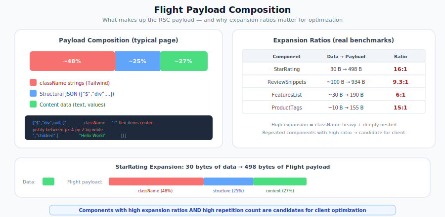
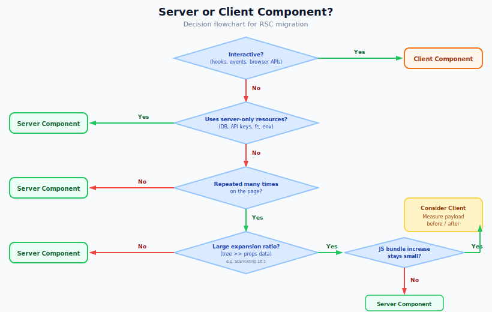

# RSC Migration: Flight Payload Optimization

This guide covers a critical and counterintuitive RSC performance nuance: not all non-interactive, stateless components should be Server Components. When presentational components produce element trees much larger than their data props, moving them to Client Components can dramatically reduce page weight.

> **Part 8 of the [RSC Migration Series](migrating-to-rsc.md)** | Previous:
> [Troubleshooting and Common Pitfalls](rsc-troubleshooting.md) | Next:
> [RSC Performance Validation Playbook](rsc-performance-validation.md)

## What's in the Flight Payload

When a Server Component renders, React serializes its output into the **RSC Flight payload** -- a JSON-like stream embedded in `<script>` tags alongside the server-rendered HTML. This payload tells React on the client how to reconcile the component tree without re-rendering from scratch.

Every server-rendered element becomes a JSON array in the payload:

```json
["$","div",null,{"className":"flex items-center justify-between px-4 py-2 bg-white shadow-sm rounded-lg","children":[...]}]
```

In contrast, when a Client Component is referenced from a Server Component, the payload contains only a lightweight **client reference** (module ID + chunk metadata) plus the serialized props. The browser renders the element tree locally from the JavaScript bundle it already has.

## Why "All Display-Only = Server" Is an Oversimplification

The standard RSC guidance says: "If a component doesn't use hooks, event handlers, or browser APIs, make it a Server Component." This is a good default, but it ignores the **expansion ratio** between data props and rendered element trees.

Consider a `StarRating` component:

```jsx
// StarRating as a Server Component
// Data: { rating: 4.5, count: 128 } — ~30 bytes
// Flight payload per instance: ~498 bytes of nested divs, ★ characters, and className strings
export default function StarRating({ rating, count }) {
  const fullStars = Math.floor(rating);
  const hasHalf = rating % 1 >= 0.5;
  return (
    <div className="flex items-center gap-1">
      {Array.from({ length: 5 }, (_, i) => (
        <span
          key={i}
          className={`text-lg ${i < fullStars ? 'text-yellow-400' : i === fullStars && hasHalf ? 'text-yellow-300' : 'text-gray-300'}`}
        >
          ★
        </span>
      ))}
      <span className="ml-2 text-sm text-gray-600">({count})</span>
    </div>
  );
}
```

As a Server Component, the Flight payload contains the **entire expanded element tree** -- every `<span>`, every className string, every `★` character. The 30 bytes of data (`rating` + `count`) expands to ~498 bytes in the payload. That's a 16:1 expansion ratio.

As a Client Component, the payload contains only the client reference plus serialized props -- a fraction of the expanded element tree. The browser renders the element tree from the JS bundle.

## The Counterintuitive Pattern: Presentational Client Components

Sometimes the right move is to make a purely presentational component a Client Component. This is counterintuitive because the component doesn't use hooks, state, or event handlers -- the usual reasons for `'use client'`.

### When to Apply This Pattern

A component is a candidate for this optimization when these signals line up:

1. **High per-instance expansion** -- the rendered element tree is several times larger than the data props
2. **Repeated many times on the page** -- the component renders per-item in a list (e.g., product cards, review snippets, tag lists)
3. **Heavy className density** -- the component has many utility CSS classes (especially Tailwind) that inflate the element tree
4. **Bundle scope is narrow** -- the component is not part of a shared client bundle loaded on many pages where it never renders

Treat ratio and repetition count together. A 3:1 component rendered 60 times can be a better target than a 10:1 component rendered once.

### Real-World Example

This was demonstrated on a product search page rendering 36 products, each with reviews, features, tags, and star ratings. Four purely presentational subtrees were moved from server to client components:

| Component          | Server element tree per card              | Client props per card            | Savings ratio |
| ------------------ | ----------------------------------------- | -------------------------------- | ------------- |
| **StarRating**     | ~498 B (nested divs, ★ chars, classNames) | ~30 B (2 numbers: rating, count) | 16:1          |
| **ReviewSnippets** | ~934 B per snippet                        | ~100 B (ReviewSnippet data)      | 9:1           |
| **FeaturesList**   | ~190 B per feature item                   | ~30 B (string)                   | 6:1           |
| **ProductTags**    | ~155 B per tag                            | ~10 B (string)                   | 15:1          |

These before/after numbers came from the same page in one benchmark environment. The large TTFB gain here is most representative of buffered or non-streaming SSR, where the server finishes more work before sending bytes. Streaming deployments may see smaller or different TTFB changes, and results will also vary under different server load, caching, or multi-region production setups.

Results:

| Metric                 | Before    | After                     | Change                         |
| ---------------------- | --------- | ------------------------- | ------------------------------ |
| **Raw Flight payload** | 158,267 B | 91,244 B                  | **-42.3%**                     |
| **Total HTML**         | 370,461 B | 273,901 B                 | **-26.1%**                     |
| **Client JS increase** | --        | +2,152 B (+471 B gzipped) | minimal                        |
| **TTFB**               | 808 ms    | 245 ms                    | -70%                           |
| **FCP**                | 982 ms    | 350 ms                    | -64%                           |
| **LCP**                | 982 ms    | 1,058 ms                  | +8% (tradeoff: more hydration) |

The **2.2 KB client JS increase** produced a **67 KB Flight payload reduction** -- a 31:1 ratio.
In this benchmark, the TTFB improvement came primarily from the server serializing far less Flight data before it could emit the first byte. The wire-size reduction alone would not normally explain the full change.

The savings were dominated by className strings. In the Tailwind-heavy benchmark, the Flight payload broke down as:

| Category              | Approximate share | Description                                                           |
| --------------------- | ----------------- | --------------------------------------------------------------------- |
| **className strings** | ~48%              | CSS class lists, especially verbose with utility-first CSS (Tailwind) |
| **Structural JSON**   | ~25%              | The `["$","div",null,{...}]` wrappers around every element            |
| **Content data**      | ~27%              | Actual text, numbers, and data values                                 |

<p align="center">
  
</p>

### How to Apply It

**Step 1:** Identify presentational subtrees with high expansion ratios.

**Step 2:** Add `'use client'` to those components. The directive must appear at the top of the file, before any `import` statements. It tells React to send a client reference instead of the expanded element tree.

Before adding `'use client'`, confirm the component and its import tree are free of server-only dependencies (`server-only`, direct DB queries, API-key-bearing helpers, async props, etc.). If any exist, move that work into a parent Server Component and pass the results down as props first.
After the change, inspect the resulting client bundle or import tree as well. Any direct or transitive import under that file now becomes client code, so server-only helpers must be pulled out before you keep the directive.

Note: Client Components cannot be `async` functions. If the component you want to convert is currently loading its own data with `async`/`await`, move that fetch into a parent Server Component first and pass the data down as props before adding `'use client'`.

```jsx
// Before: Server Component — entire element tree in Flight payload
// (No 'use client' directive — React renders this on the server.)
export default function ProductTags({ tags }) {
  return (
    <div className="flex flex-wrap gap-2 mt-3">
      {tags.map((tag) => (
        <span
          key={tag}
          className="inline-flex items-center px-2.5 py-0.5 rounded-full text-xs font-medium bg-blue-100 text-blue-800"
        >
          {tag}
        </span>
      ))}
    </div>
  );
}
```

```jsx
// After: Client Component — only tags array in Flight payload
'use client';

export default function ProductTags({ tags }) {
  return (
    <div className="flex flex-wrap gap-2 mt-3">
      {tags.map((tag) => (
        <span
          key={tag}
          className="inline-flex items-center px-2.5 py-0.5 rounded-full text-xs font-medium bg-blue-100 text-blue-800"
        >
          {tag}
        </span>
      ))}
    </div>
  );
}
```

The code is identical except for the `'use client'` directive. The component still receives the same props and renders the same output. The difference is where the rendering happens and what the Flight payload contains.

**Step 3:** Verify the savings by measuring the payload (see next section).

## How to Measure Your Flight Payload

The Flight payload is embedded in `<script>` tags in the HTML response. To extract and measure it:

### Browser DevTools

1. Open **Network** tab, load the page, find the document request
2. View the response and search for `<script>` tags containing RSC data
3. The payload is the JSON-like content between the script tags

### Programmatic Extraction

```js
// In browser console: extract RSC payload size
// Heuristic only: inspect your rendered RSC script tags first and adjust the filter if needed.
// If your framework exposes explicit RSC markers/attributes, prefer those over content matching.
const scripts = document.querySelectorAll('script');
let rscPayloadSize = 0;
scripts.forEach((script) => {
  // Heuristic: Flight records usually contain element tuples like ["$","div",...]
  if (script.textContent && /\["\$","[a-zA-Z]/.test(script.textContent)) {
    rscPayloadSize += new Blob([script.textContent]).size;
  }
});
console.log(`RSC payload: ${(rscPayloadSize / 1024).toFixed(1)} KB`);
```

This is still an approximation. Validate the marker pattern against how your app emits Flight chunks. For React on Rails specifically, inspect the actual `<script>` payload format in your rendered HTML before relying on this heuristic, and adapt the filter condition if your app uses a different wrapper format (a `0` result may mean the regex missed your format, not that RSC is disabled).

### Analyzing Payload Composition

To understand what's taking up space in your payload, parse the Flight data and categorize the content:

```js
// Rough breakdown of payload composition
const payload = Array.from(document.querySelectorAll('script'))
  .map((script) => script.textContent || '')
  .filter((text) => /\["\$","[a-zA-Z]/.test(text))
  .join('');
const classNameMatches = payload.match(/"className":"[^"]*"/g) || [];
const classNameBytes = classNameMatches.reduce((sum, m) => sum + new Blob([m]).size, 0);
const totalBytes = new Blob([payload]).size;
console.log(`className share: ${((classNameBytes / totalBytes) * 100).toFixed(1)}%`);
```

If className strings account for a large share of your payload, that is a strong signal to investigate this optimization. Even 30%+ can be worth examining on larger pages.

## Compression Effectiveness

Modern HTTP compression (gzip, Brotli) partially offsets the bloated payload because repetitive className strings compress well. However, raw payload size still matters for:

- **Parse time** -- the browser must parse the full decompressed payload before React can reconcile the tree
- **Memory usage** -- the decompressed payload is held in memory during reconciliation
- **Server generation time** -- serializing larger element trees takes more CPU time on the server

In the benchmark above, the payload reduction was significant even after compression because the savings came from eliminating entire subtrees, not just deduplicating strings.

## The LCP Tradeoff

Moving presentational components to the client increases the amount of JavaScript the browser must download and execute before those components fully hydrate. This can slightly increase Largest Contentful Paint (LCP):

- **TTFB and FCP improve** because the server generates and streams a smaller payload faster
- **LCP may increase** because the converted components now require their JavaScript bundle to be parsed and executed before hydration completes, which can slightly delay when React considers those subtrees ready. This is most noticeable when the LCP element itself sits inside a converted component.

In the benchmark, LCP increased by 8% (982 ms to 1,058 ms) -- a minor regression offset by the 64% FCP improvement and 42% payload reduction.

**Recommendation:** Always benchmark before and after. The tradeoff is favorable when:

- The payload reduction is large (> 20%)
- The client JS increase is small (< 5 KB gzipped)
- The page has many repeated components (lists, grids, cards)

If LCP is your critical metric (e.g., for a landing page with a hero image), be more conservative about moving components to the client.

## React on Rails: Double JSON.stringify (Resolved)

React on Rails previously double-encoded the RSC payload when embedding it in inline `<script>` tags — the Flight payload (already a serialized wire format) was JSON-encoded again, adding ~24% overhead. This was fixed in [issue #2522](https://github.com/shakacode/react_on_rails/issues/2522) with the length-prefixed streaming protocol, which sends HTML content as raw bytes with a length prefix instead of re-encoding it as JSON.

The Flight payload optimization patterns in this guide (expansion ratios, presentational client components) remain important regardless — they address the inherent size of the serialized element tree, not the encoding overhead.

## Decision Flowchart

Use this flowchart when deciding whether a presentational component should be a Server or Client Component:

<p align="center">
  
</p>

## Summary

The standard RSC advice -- "make everything a Server Component unless it needs interactivity" -- is a good starting point but not the full picture. For presentational components with high expansion ratios that render many times on a page, moving them to Client Components can dramatically reduce the Flight payload with minimal JS cost. Always measure to confirm the tradeoff is favorable for your specific page.

## Related Articles

- [Component Tree Restructuring Patterns](rsc-component-patterns.md) -- the foundational patterns for splitting server and client components
- [Troubleshooting and Common Pitfalls](rsc-troubleshooting.md) -- debugging payload duplication and other RSC issues
- [Data Fetching Migration](rsc-data-fetching.md) -- migrating data-fetching patterns to Server Components
