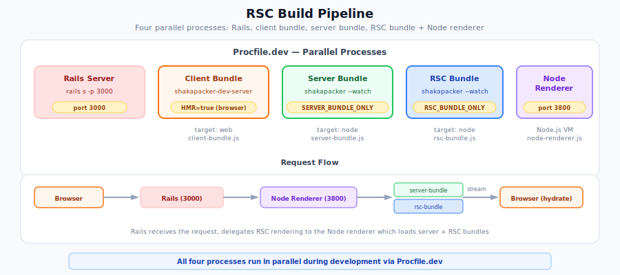

# RSC Migration: Preparing Your App

This guide walks you through the infrastructure changes needed to prepare an existing React on Rails application for React Server Components (RSC). After completing these steps, your app works exactly as before -- no component behavior changes -- but the RSC pipeline is in place so you can begin migrating components to Server Components.

> **Part 1 of the [RSC Migration Series](migrating-to-rsc.md)** | Next: [Component Tree Restructuring](rsc-component-patterns.md)

## What This Guide Covers

You will:

1. Install the RSC npm package
2. Enable RSC support in the Rails configuration
3. Mount the RSC payload route
4. Create the RSC webpack bundle and add the RSC plugin to existing bundles
5. Add `'use client'` to all your registered component entry points
6. Switch views and controllers to streaming rendering

After these steps, every component is still a Client Component (because of the `'use client'` directives), so the app behaves identically to before. The subsequent guides in this series cover how to progressively remove `'use client'` and convert components to Server Components.

## Prerequisites

Before starting, ensure you have:

- **React on Rails Pro** and **React on Rails** installed at the same version — current public releases (16.2.0+) are version-aligned, and the Pro gem depends on the exact matching `react_on_rails` release
- **React 19.2.x** (`react` and `react-dom` both at 19.2.x with patch `>= 19.2.7` for the React on Rails Pro 17 RSC path)
- **Node renderer** configured and running (RSC requires server-side JavaScript execution via the node renderer, not ExecJS). If you're still using ExecJS, migrate to the node renderer first -- see [Node Renderer Basics](../building-features/node-renderer/basics.md).
- **Shakapacker** (or webpack configured via Shakapacker)
- **Node.js 20+**

## Step 1: Install the RSC Package

Install `react-on-rails-rsc`, which provides the webpack loader, webpack plugin, and RSC client/server runtime:

```bash
yarn add react-on-rails-rsc
# or: npm install react-on-rails-rsc
# or: pnpm add react-on-rails-rsc
```

Verify that `react` and `react-dom` are on the supported 19.2.x line and that the versions match:

```bash
yarn why react
# Should show 19.2.x with patch >= 19.2.7

yarn why react-on-rails-rsc
# Check the package's README or changelog for React version compatibility
```

If you're on React 18 or earlier, upgrade first -- RSC requires React 19.

> **Version requirements:** React on Rails Pro 17 RSC requires React/React DOM 19.2.x with patch `>= 19.2.7` and a stable `react-on-rails-rsc` 19.2.x package with patch `>= 19.2.1`. Older 19.0.x packages and 19.2.1 prereleases no longer satisfy the Pro 17 runtime floor.

## Step 2: Configure Rails for RSC

Update your React on Rails Pro initializer:

```ruby
# config/initializers/react_on_rails_pro.rb
ReactOnRailsPro.configure do |config|
  # --- Required changes ---

  # Enable the RSC pipeline (default: false)
  config.enable_rsc_support = true

  # Enable promise-based rendering for streaming support (default: false)
  # Only takes effect when server_renderer is "NodeRenderer"
  config.rendering_returns_promises = true

  # --- Already correct defaults (shown for visibility) ---

  # RSC bundle filename -- must match your webpack output filename
  # Default: "rsc-bundle.js" -- no change needed if you follow the standard setup
  config.rsc_bundle_js_file = "rsc-bundle.js"

  # URL path for RSC payload requests from the browser
  # Default: "rsc_payload/" -- no change needed
  config.rsc_payload_generation_url_path = "rsc_payload/"

  # Manifest files generated by RSCWebpackPlugin
  # Defaults match the plugin's output filenames -- no change needed
  config.react_client_manifest_file = "react-client-manifest.json"
  config.react_server_client_manifest_file = "react-server-client-manifest.json"

  # ... your existing config (server_renderer, renderer_url, etc.)
end
```

The base gem's configuration (`ReactOnRails.configure`) does not require RSC-specific changes. If you're using Shakapacker >= 8.2.0 with Pro, `generated_component_packs_loading_strategy` already defaults to `:async`, which is optimal for streaming.

## Step 3: Mount the RSC Payload Route

The RSC payload route serves the RSC payload when the browser navigates to a page with Server Components. Add it to your routes:

```ruby
# config/routes.rb
Rails.application.routes.draw do
  rsc_payload_route

  # ... your existing routes
end
```

This mounts a `GET /rsc_payload/:component_name` endpoint that React on Rails Pro uses internally. The default path (`rsc_payload/`) matches the `rsc_payload_generation_url_path` config. If your app has a route conflict at that path, you can customize both:

```ruby
# Custom path (use the same value in both places, with trailing slash)
rsc_payload_route path: "flight-payload/"
```

```ruby
# config/initializers/react_on_rails_pro.rb
config.rsc_payload_generation_url_path = "flight-payload/"
```

## Step 4: Set Up the RSC Webpack Bundle

RSC requires a **third webpack bundle** alongside your existing client and server bundles. This RSC bundle contains only Server Component code -- the webpack loader strips out `'use client'` files and replaces them with client references.

> **Custom webpack configs:** The examples below assume you're using the default webpack configs generated by the React on Rails installer. If your webpack setup is substantially different (custom Webpack configs, different file structure, different loaders), read the **"What this does"** callouts in each subsection -- they explain the underlying intent of each change so you can apply the same logic to your own config.

### 4a. Create the RSC webpack config

**What this does (for custom configs):** You need a third webpack config that produces an `rsc-bundle.js` file. This RSC bundle is essentially a copy of your server bundle with three modifications:

1. **Add `react-on-rails-rsc/WebpackLoader`** to the JavaScript loader chain (after babel-loader or swc-loader). This loader intercepts files containing `'use client'` and replaces their exports with lightweight client reference stubs instead of actual component code. This is what keeps client code out of the RSC bundle.
2. **Add `react-server` to `resolve.conditionNames`**. This tells webpack to use the `react-server` export condition from `package.json` when resolving modules -- React itself ships different entry points for the RSC environment vs the normal server environment.
3. **Canonicalize React server imports to one package instance**. Every import of `react`, `react/jsx-runtime`, and `react/jsx-dev-runtime` inside the RSC bundle must resolve to the same React server files. This keeps React's request-local cache dispatcher shared between the RSC renderer and app Server Components, so `React.cache()` works correctly.
4. **Alias `react-dom/server` to `false`**. The RSC bundle generates RSC payloads (a serialization format), not HTML. Importing `react-dom/server` in the RSC environment causes a runtime error, so it must be excluded.

The entry point should be the **same file** as your server bundle (typically `server-bundle.js`), just with a different output filename (`rsc-bundle.js`). Do **not** add `RSCWebpackPlugin` to this config -- only the client and server bundles need it.

Create `config/webpack/rscWebpackConfig.js`:

```js
// React Server Components webpack configuration
// Creates the RSC bundle based on the server webpack config
// See: ../../pro/react-server-components/how-react-server-components-work.md

const { existsSync } = require('fs');
const { dirname, resolve } = require('path');
const serverWebpackModule = require('./serverWebpackConfig');

// Backward compatibility:
// - New Pro config exports: { default: configureServer, extractLoader }
// - Legacy config exports: module.exports = configureServer
const serverWebpackConfig = serverWebpackModule.default || serverWebpackModule;
const reactPackageRoot = dirname(require.resolve('react/package.json'));
// React 19+ ships these react-server entry files alongside the standard entries.
const resolveReactServerEntry = (entryFilename) => {
  const entryPath = resolve(reactPackageRoot, entryFilename);
  if (!existsSync(entryPath)) {
    throw new Error(
      `Expected React server entry "${entryFilename}" at "${entryPath}". ` +
        'React package layout changed; update the RSC webpack aliases.',
    );
  }
  return entryPath;
};
const extractLoader =
  serverWebpackModule.extractLoader ||
  ((rule, loaderName) => {
    if (!Array.isArray(rule.use)) return null;
    return rule.use.find((item) => {
      const testValue = typeof item === 'string' ? item : item.loader;
      return testValue && testValue.includes(loaderName);
    });
  });

const configureRsc = () => {
  // Pass true to skip RSCWebpackPlugin - RSC bundle doesn't need it
  const rscConfig = serverWebpackConfig(true);

  // Rename the entry from `server-bundle` to `rsc-bundle` so webpack
  // produces a different output filename, while keeping the same entry
  // point file used by the server bundle.
  const rscEntry = {
    'rsc-bundle': rscConfig.entry['server-bundle'],
  };
  rscConfig.entry = rscEntry;

  // Add the RSC WebpackLoader to the JS rule's loader chain.
  // This loader replaces 'use client' files with registerClientReference
  // proxies in the RSC bundle.
  // Webpack loaders execute right-to-left, so appending makes the RSC
  // loader run first (before babel/swc).
  const { rules } = rscConfig.module;
  rules.forEach((rule) => {
    if (typeof rule.use === 'function') {
      // SWC transpiler: rule.use is a function
      const originalUse = rule.use;
      rule.use = function rscLoaderWrapper(data) {
        const result = originalUse.call(this, data);
        const resultArray = Array.isArray(result) ? result : result ? [result] : [];
        const resolvedRule = { use: resultArray };
        const jsLoader =
          extractLoader(resolvedRule, 'babel-loader') || extractLoader(resolvedRule, 'swc-loader');
        if (jsLoader) {
          return [...resultArray, { loader: 'react-on-rails-rsc/WebpackLoader' }];
        }
        return result;
      };
    } else if (Array.isArray(rule.use)) {
      // Babel transpiler: rule.use is a static array
      const jsLoader = extractLoader(rule, 'babel-loader') || extractLoader(rule, 'swc-loader');
      if (jsLoader) {
        rule.use = [...rule.use, { loader: 'react-on-rails-rsc/WebpackLoader' }];
      }
    }
  });

  // Add the `react-server` condition to the resolve config.
  // This tells webpack (and React) that this bundle targets the RSC environment.
  // The `...` retains default conditions (e.g., `node` for server target).
  const rscAliases = { ...(rscConfig.resolve?.alias || {}) };
  delete rscAliases.react;
  delete rscAliases['react$'];
  delete rscAliases['react/jsx-runtime'];
  delete rscAliases['react/jsx-runtime$'];
  delete rscAliases['react/jsx-dev-runtime'];
  delete rscAliases['react/jsx-dev-runtime$'];
  delete rscAliases['react-dom/server'];
  delete rscAliases['react-dom/server$'];

  rscConfig.resolve = {
    ...rscConfig.resolve,
    conditionNames: ['react-server', '...'],
    alias: {
      ...rscAliases,
      // Keep the RSC renderer and app Server Components on the same React
      // server package instance so React.cache() sees the active dispatcher.
      react$: resolveReactServerEntry('react.react-server.js'),
      'react/jsx-runtime$': resolveReactServerEntry('jsx-runtime.react-server.js'),
      'react/jsx-dev-runtime$': resolveReactServerEntry('jsx-dev-runtime.react-server.js'),
      // Ignore react-dom/server in RSC bundle -- it's not needed for
      // RSC payload generation and importing it causes a runtime error
      // Prefix-match false covers both exact and subpath imports; no $-variant is needed.
      'react-dom/server': false,
    },
  };

  // Update the output filename
  rscConfig.output.filename = 'rsc-bundle.js';

  return rscConfig;
};

module.exports = configureRsc;
```

> **Mutation safety note:** This example assumes `serverWebpackConfig(true)` returns a fresh config object per call. If your setup reuses shared config objects, clone `module.rules` / `rule.use` before mutating them in `configureRsc`.
>
> **React aliases note:** Do not alias `react` to a package directory in the RSC bundle. Directory aliases can bypass the `react-server` condition or create duplicate React server modules. The exact file aliases in the example above keep `React.cache()` request-local memoization connected to the RSC renderer dispatcher.
> Before applying those aliases, remove any inherited `react`, `react$`, `react/jsx-runtime`, `react/jsx-runtime$`, `react/jsx-dev-runtime`, `react/jsx-dev-runtime$`, `react-dom/server`, and `react-dom/server$` aliases from the server config, matching the cleanup block shown above.

### 4b. Add RSCWebpackPlugin and the graph-derived resolver to the server webpack config

**What this does (for custom configs):** The server bundle needs to know which Client Components are reachable from the actual RSC graph. The generated `rscClientReferences` resolver normally reads `ssr-generated/rsc-client-references.json`, which the Shakapacker precompile hook produces from a discovery build of the server-component registration entry. `RSCWebpackPlugin` with `isServer: true` uses those graph-derived references to produce **`react-server-client-manifest.json`**, mapping the reachable client modules to their chunk locations.

Run `bin/rails generate react_on_rails:rsc` to install or refresh the resolver, discovery-enabled RSC config, and `bin/shakapacker-precompile-hook` together. If a customized config cannot be rewritten automatically, print the canonical CommonJS resolver generated by your installed React on Rails version:

```bash
bundle exec ruby -e 'require "generators/react_on_rails/rsc_generator"; puts ReactOnRails::Generators::RscGenerator.new.send(:rsc_client_references_js)'
```

For a CommonJS config, copy that complete `fallbackRscClientReferences` and `rscClientReferences` block into both the server and client webpack configs before applying the examples below. Keep `config` from `shakapacker` and `resolve` from `path` in scope, as they are in the generated configs. Do not replace the resolver with a static directory object: both plugin instances must use the same manifest-backed resolution cascade.

For a true ESM config, the printed resolver also needs CommonJS's `require` and `__dirname` bindings. Add this compatibility prelude before the unchanged resolver (and keep your existing ESM import for `config` from `shakapacker`):

```js
import { createRequire } from 'node:module';
import { dirname, resolve } from 'node:path';
import { fileURLToPath } from 'node:url';

const require = createRequire(import.meta.url);
const __dirname = dirname(fileURLToPath(import.meta.url));
```

The generator spec executes the exact printed resolver with this prelude as an `.mjs` module, so the ESM instructions stay aligned with the generated CommonJS implementation.

The server bundle needs `RSCWebpackPlugin` to generate the `react-server-client-manifest.json`. Update your `serverWebpackConfig.js` to accept an `rscBundle` parameter and conditionally add the plugin:

```js
// config/webpack/serverWebpackConfig.js
const { RSCWebpackPlugin } = require('react-on-rails-rsc/WebpackPlugin');

// Paste the complete resolver printed by the command above here.
// Keep the generated block identical in the client config.

const configureServer = (rscBundle = false) => {
  // ... your existing server config setup ...

  // Add RSCWebpackPlugin only for the server bundle (not the RSC bundle)
  if (!rscBundle) {
    serverWebpackConfig.plugins.push(
      new RSCWebpackPlugin({
        isServer: true,
        clientReferences: rscClientReferences,
      }),
    );
  }

  // ... rest of your server config ...

  return serverWebpackConfig;
};

module.exports = {
  default: configureServer,
  extractLoader, // Export if you have this utility function
};
```

> **Directory scanning is fallback-only.** The generated resolver uses the app source directory during the discovery build, while running an RSC-only build, when no server-component registration entry exists yet, or when it detects legacy configs without manifest-discovery support. Normal precompile and production builds read the graph-derived manifest. If you see the broad-scan fallback warning, re-run `bin/rails generate react_on_rails:rsc`, then run `bin/shakapacker-precompile-hook` before `bin/shakapacker`.

> **Do not use `clientReferences: []` as a global performance setting.** It bypasses discovery of Client Component boundaries and can produce incomplete client and server manifests. Use the generated resolver so the build includes the boundaries reachable from your RSC graph. See [Client Reference Scope and Empty `clientReferences`](rsc-troubleshooting.md#client-reference-scope-and-empty-clientreferences) for exceptional static-only cases.

> **Generator note (CommonJS only):** The `rails generate react_on_rails:rsc` migration only rewrites webpack configs that use CommonJS (`require`-style) imports. If your config has been converted to ESM (`import`/`export`) syntax, the generator emits an "expected webpack import anchor was not found" warning. Add the ESM compatibility prelude above, copy the complete generated manifest-backed resolver after it, and pass `clientReferences: rscClientReferences` to both plugin instances.

> **Upgrade note for apps already on RSC:** `verify_rsc_webpack_transforms` checks for the generated manifest-backed resolver in both webpack configs. Apps with a plugin but without that resolver report `"generated manifest-backed clientReferences resolver in {client,server}WebpackConfig.js"` as a missing transform. Re-run `bin/rails generate react_on_rails:rsc` to update the configs and precompile hook. For a custom config the generator cannot rewrite, copy the generated resolver (with the compatibility prelude when using ESM) and pass `clientReferences: rscClientReferences` into every `RSCWebpackPlugin` invocation.

### 4c. Add RSCWebpackPlugin to the client webpack config

**What this does (for custom configs):** The client bundle needs its own manifest so React on Rails Pro can map client component references from the RSC payload to browser chunks. `RSCWebpackPlugin` with `isServer: false` produces **`react-client-manifest.json`**. Pass the same generated `rscClientReferences` resolver used by the server plugin so both manifests describe the same graph-derived boundary set.

The client bundle needs `RSCWebpackPlugin` to generate the `react-client-manifest.json`:

```js
// config/webpack/clientWebpackConfig.js
const { RSCWebpackPlugin } = require('react-on-rails-rsc/WebpackPlugin');

// Paste the same complete resolver printed by the command above here too.

const configureClient = () => {
  // ... your existing client config ...

  clientConfig.plugins.push(
    new RSCWebpackPlugin({
      isServer: false,
      clientReferences: rscClientReferences,
    }),
  );

  return clientConfig;
};
```

### 4d. Update the build pipeline

**What this does (for custom configs):** Before RSC, you built 2 webpack bundles (client + server). Now you need to build 3 (client + server + RSC). However your build is orchestrated -- a multi-compiler config array, separate webpack commands, a CI script, or a tool like `ServerClientOrBoth.js` -- add the RSC config as a third entry. You also need a **separate watcher process** in development for the RSC bundle (similar to how you already watch the server bundle separately). Add an environment variable guard (e.g., `RSC_BUNDLE_ONLY`) so you can build each bundle independently in dev, and build all three together in production.

Update `ServerClientOrBoth.js` (or your equivalent webpack entry point) to include the RSC bundle:

```js
// config/webpack/ServerClientOrBoth.js
const clientWebpackConfig = require('./clientWebpackConfig');
const { default: serverWebpackConfig } = require('./serverWebpackConfig');
const rscWebpackConfig = require('./rscWebpackConfig');

const webpackConfig = (envSpecific) => {
  const clientConfig = clientWebpackConfig();
  const serverConfig = serverWebpackConfig();
  const rscConfig = rscWebpackConfig();

  if (envSpecific) {
    envSpecific(clientConfig, serverConfig);
  }

  let result;
  if (process.env.WEBPACK_SERVE || process.env.CLIENT_BUNDLE_ONLY) {
    result = clientConfig;
  } else if (process.env.SERVER_BUNDLE_ONLY) {
    result = serverConfig;
  } else if (process.env.RSC_BUNDLE_ONLY) {
    result = rscConfig;
  } else {
    // Build all three bundles
    result = [clientConfig, serverConfig, rscConfig];
  }

  return result;
};

module.exports = webpackConfig;
```

Add the RSC bundle watcher to your `Procfile.dev`:

<p align="center">
  
</p>

> **For full webpack configuration details**, including the technical background on how the RSC loader, plugin, and manifests work together, see [How React Server Components Work](../../pro/react-server-components/how-react-server-components-work.md).

## Step 5: Add `'use client'` to All Registered Component Entry Points

This is the critical step that preserves your app's existing behavior. By adding `'use client'` to every component entry point, you tell the RSC infrastructure: "all these components are Client Components." The app works exactly as before -- nothing renders on the server differently.

Later, when you're ready to migrate a component to a Server Component, you'll remove its `'use client'` directive. That's covered in [Component Tree Restructuring Patterns](rsc-component-patterns.md).

### Where to add `'use client'`

The directive goes on **the component source files** that are registered with React on Rails -- not on the bundle entry files (`client-bundle.js`, `server-bundle.js`).

### Pattern A: Manual registration (component imported into bundle)

If your bundle file imports components and registers them:

```js
// client-bundle.js -- do NOT add 'use client' here
import ReactOnRails from 'react-on-rails/client';
import ProductPage from '../components/ProductPage';
import CartPage from '../components/CartPage';

ReactOnRails.register({ ProductPage, CartPage });
```

Add `'use client'` to each **component file**:

```jsx
// components/ProductPage.jsx
'use client';

import React, { useState } from 'react';
// ... rest of your component
```

```jsx
// components/CartPage.jsx
'use client';

import React from 'react';
// ... rest of your component
```

Do the same for any component files imported in your `server-bundle.js`.

### Pattern B: Auto-bundling (single file per component)

If you use `auto_load_bundle` with a `components_subdirectory`, each component has a file in that directory. Once you start migrating components to Server Components, auto-bundling will automatically switch each component's registration between `ReactOnRails.register` and `registerServerComponent` based on whether the file starts with `'use client'`. For the complete reference, see [Auto-Bundling with React Server Components](../core-concepts/auto-bundling-file-system-based-automated-bundle-generation.md#auto-bundling-with-react-server-components).

```text
app/javascript/src/
  └── ProductPage/
      └── ror_components/          # your components_subdirectory
          └── ProductPage.jsx      # ← add 'use client' here
  └── CartPage/
      └── ror_components/
          └── CartPage.jsx         # ← add 'use client' here
```

```jsx
// app/javascript/src/ProductPage/ror_components/ProductPage.jsx
'use client';

import ProductPage from '../components/ProductPage';
export default ProductPage;
```

### Pattern C: Auto-bundling with `.client` / `.server` file pairs

If you use separate files for client and server rendering:

```text
app/javascript/src/
  └── ReduxApp/
      └── ror_components/
          ├── ReduxApp.client.jsx  # ← add 'use client' here
          └── ReduxApp.server.jsx  # ← add 'use client' here too
```

**Add `'use client'` to both the `.client` AND `.server` files:**

```jsx
// ReduxApp.client.jsx
'use client';

import React from 'react';
import { Provider } from 'react-redux';
// ... client-side rendering logic (hydrateRoot, etc.)
```

```jsx
// ReduxApp.server.jsx
'use client';

import React from 'react';
import { Provider } from 'react-redux';
// ... server-side rendering logic (returns JSX)
```

> **Why both?** The `.client` and `.server` suffixes control **which webpack bundle** includes the file -- `.client.jsx` goes into the client bundle, `.server.jsx` goes into the server bundle (and RSC bundle). This is a **React on Rails auto-bundling concept** that predates React Server Components.
>
> The `'use client'` directive controls **RSC classification** -- whether the RSC infrastructure treats the component as a Client Component or a Server Component. These are two independent systems.
>
> A `.server.jsx` file is **not** a React Server Component. It's a file included in the server bundle. Without `'use client'`, the RSC infrastructure would try to treat it as a Server Component, which would break your existing rendering logic.
>
> For more on this distinction, see [File Suffixes vs. RSC Directive](https://github.com/shakacode/react_on_rails/pull/2406).

### Transpiled languages (ReScript, Reason, etc.)

If you use ReScript or other transpiled languages, the compiled `.bs.js` files don't preserve directives. Add `'use client'` to the **wrapper `.jsx` files** in `ror_components/`, not to the `.res` source files.

For example, with `.client.jsx` / `.server.jsx` pairs:

```jsx
// ListingsShow.client.jsx — add 'use client' here
'use client';
import ListingsShow from '../ListingsShow';
export default ListingsShow;
```

```jsx
// ListingsShow.server.jsx — add 'use client' here too
'use client';
import ListingsShow from '../ListingsShow';
export default ListingsShow;
```

> **Common mistake:** Developers often add `'use client'` to JS/JSX entry points but forget the ReScript ones. The pack generator will **silently** register components without `'use client'` as server components via `registerServerComponent`. There is no warning — the component just breaks at runtime. After adding the directive, verify with `bin/rails react_on_rails:generate_packs` and check that the output shows all components as "Client components."

### What about the bundle entry files?

Adding `'use client'` to `client-bundle.js` or `server-bundle.js` would technically work -- it would make all imported components Client Components, achieving the same immediate effect. However, we recommend placing the directive on **individual component files** instead. The reason is forward-looking: when you later want to convert a specific component to a Server Component (by removing `'use client'`), you need granular control per component. If the directive is only on the bundle entry file, you'd have to move it to every individual component file at that point anyway.

### Verification

After adding `'use client'` to all entry points, rebuild all three bundles and verify the app works as before. If you're using auto-bundling, the generated packs should still use `ReactOnRails.register` (not `registerServerComponent`) for every component.

## Step 6: Switch to Streaming Rendering

Replace synchronous view helpers and controller rendering with their streaming equivalents.

> **Warning: Compression middleware callbacks.** Default `Rack::Deflater`, `Rack::Brotli`, and similar compression middleware work with streaming responses, but a custom `:if` condition that calls `body.each` to check response size will deadlock on `ActionController::Live::Buffer`. See the Pro guide [Compression for Streamed RSC Responses](../../pro/streaming-ssr.md#compression-middleware-compatibility) for the safe pattern.

### 6a. Update controllers

For each controller that renders React components, include the `ReactOnRailsPro::Stream` concern and replace `render` with `stream_view_containing_react_components`:

**Before:**

```ruby
class ProductsController < ApplicationController
  def show
    @product = Product.find(params[:id])
    # Implicit render of products/show template
  end
end
```

**After:**

```ruby
class ProductsController < ApplicationController
  include ReactOnRailsPro::Stream

  def show
    @product = Product.find(params[:id])
    stream_view_containing_react_components(template: "products/show")
  end
end
```

`ReactOnRailsPro::Stream` automatically includes `ActionController::Live`, which enables HTTP streaming. The `stream_view_containing_react_components` method renders the template and streams the response progressively as React components resolve.

> **Which actions need this?** Only actions whose views use `stream_react_component`. If an action's view only uses `react_component` (and you haven't migrated it yet in the step below), it can keep the standard `render`.

### 6b. Update view helpers (optional now)

This step can be done now for all components at once, or deferred and done per-component as you migrate each one to a Server Component. Either way works — `react_component` continues to function alongside the RSC pipeline.

In each view, replace `react_component` with `stream_react_component`:

**Before:**

```erb
<%# app/views/products/show.html.erb %>
<h1><%= @product.name %></h1>
<%= react_component("ProductPage",
      props: { product: @product.as_json(
                 include: { specs: { only: [:id, :label, :value] },
                            reviews: { only: [:id, :text, :rating] } }) },
      prerender: true) %>
```

**After:**

```erb
<%# app/views/products/show.html.erb %>
<h1><%= @product.name %></h1>
<%= stream_react_component("ProductPage",
      props: { product: @product.as_json(
                 include: { specs: { only: [:id, :label, :value] },
                            reviews: { only: [:id, :text, :rating] } }) }) %>
```

`stream_react_component` automatically sets `prerender: true`. The component renders identically — the difference is that the response is now streamed, which will matter when you start adding Suspense boundaries and async Server Components. React on Rails Pro automatically hydrates components early (before `DOMContentLoaded`), so selective hydration works out of the box.

When the view uses React on Rails Pro async props, use the async-props helper variant instead. Keep synchronous values in `props:` and emit slower values from the block:

```erb
<%= stream_react_component_with_async_props("ProductPage",
      props: { name: @product.name, price: @product.price }) do |emit|
  emit.call("reviews", @product.reviews.as_json(only: [:id, :text, :rating]))
  emit.call("recommendations",
            @product.recommended_products.as_json(only: [:id, :name, :price]))
end %>
```

The Server Component receives `getReactOnRailsAsyncProp` and reads those emitted values behind Suspense boundaries. See [Data Fetching in React on Rails Pro](./rsc-data-fetching.md#data-fetching-in-react-on-rails-pro) for the complete async-props pattern.

> [!IMPORTANT]
> The block runs normal Ruby code sequentially, so `emit.call` does **not** parallelize slow queries by itself. For independent slow data sources, start the work concurrently before emitting values; see [Avoiding Server-Side Waterfalls](./rsc-data-fetching.md#avoiding-server-side-waterfalls).

### 6c. Update script loading in layouts (recommended)

For streaming to deliver its full performance benefit, script tags should use `async` loading so the browser can hydrate components as they arrive:

```erb
<%# app/views/layouts/application.html.erb %>
<%= javascript_pack_tag('client-bundle', 'data-turbo-track': 'reload', async: true) %>
```

The `async: true` attribute enables React 18's Selective Hydration -- each component becomes interactive as soon as its code loads, without waiting for the entire page to finish streaming.

If you use `auto_load_bundle` with Shakapacker >= 8.2.0 and React on Rails Pro, the `generated_component_packs_loading_strategy` already defaults to `:async`, so auto-generated pack tags are already configured correctly.

## Common Setup Mistakes

These are the most frequent mistakes encountered during RSC infrastructure setup. Check this section if something isn't working after completing the steps above.

### Mistake 1: Wrong `react-on-rails-rsc` version

React on Rails Pro 17 RSC requires the coordinated React 19.2.x / `react-on-rails-rsc` 19.2.x line. Older 19.0.x RSC packages can pass older setup guides but now fail the Pro 17 runtime and Doctor checks.

**Fix:** Upgrade React, React DOM, and `react-on-rails-rsc` together:

```bash
yarn add react@~19.2.7 react-dom@~19.2.7 react-on-rails-rsc@19.2.1
```

### Mistake 2: Forgetting the RSC bundle watcher in development

After adding the RSC webpack config, you must also add a watcher process in `Procfile.dev`. Without it, the RSC bundle won't rebuild on file changes, and you'll see stale component output or errors about missing modules.

**Symptom:** Changes to Server Components don't appear until you manually rebuild. Or, after removing `'use client'` from a component, it still behaves as a Client Component.

**Fix:** Add the watcher line to `Procfile.dev`:

```text
rails-rsc-assets: HMR=true RSC_BUNDLE_ONLY=true bin/shakapacker --watch
```

### Mistake 3: Confusing `.server.jsx` with Server Components

The `.server.jsx` file suffix is a **React on Rails auto-bundling convention** -- it means "include this file in the server bundle." It has nothing to do with React Server Components.

**Symptom:** After enabling RSC, auto-bundled components with `.server.jsx` files break because the RSC infrastructure treats them as Server Components (they lack `'use client'`).

**Fix:** Add `'use client'` to both `.client.jsx` and `.server.jsx` files during the initial setup (Step 5). Only remove it when you're ready to actually migrate that component to a Server Component.

### Mistake 4: Treating `clientReferences` as a static-page toggle

Emptying `clientReferences` can make a purely static RSC page appear faster because there are no RSC
client islands to hydrate. That workaround is unsafe as a shared app default: the same build may
later render a `'use client'` component, but the manifest will not contain the reference needed to
load its browser chunks.

**Symptom:** Static RSC pages render, but a page with a client island fails with a missing-module
manifest error, or the client island never hydrates after `clientReferences` was narrowed.

**Fix:** Scope `clientReferences` to your app source directory instead of emptying it globally. If a
temporary static-only build is required, document the affected routes and add a smoke test that
renders at least one RSC client island for any build that is expected to support islands. See
[Client Reference Scope and Empty `clientReferences`](rsc-troubleshooting.md#client-reference-scope-and-empty-clientreferences).

### Mistake 5: Mutating shared webpack config objects

If your `serverWebpackConfig()` function returns the same object reference on repeated calls, `configureRsc()` will mutate the server config when modifying rules and resolve settings.

**Symptom:** The server bundle behaves unexpectedly after adding the RSC bundle -- for example, it starts resolving `react-server` conditions or has the RSC loader in its chain.

**Fix:** Ensure `serverWebpackConfig()` returns a fresh config object per call. If it doesn't, clone `module.rules` and `resolve` before mutating them in `configureRsc`.

### Mistake 6: Missing `react-server` condition in RSC bundle

If you're writing a custom RSC webpack config (not following Step 4a exactly), forgetting to add `react-server` to `resolve.conditionNames` means React will use its standard server entry points instead of the RSC-specific ones.

**Symptom:** Runtime errors in the RSC bundle, or Server Components that behave like Client Components.

**Fix:** Add `conditionNames: ['react-server', '...']` to the RSC bundle's `resolve` config.

## Verification Checklist

After completing all steps, verify everything works:

- [ ] All three webpack bundles build without errors (client, server, RSC)
- [ ] `react-client-manifest.json` and `react-server-client-manifest.json` are generated in your webpack output directory
- [ ] `rsc-bundle.js` is generated in your `server_bundle_output_path` directory
- [ ] The app starts without errors (`bin/dev` or equivalent)
- [ ] Pages render identically to before the migration
- [ ] If you narrowed `clientReferences`, at least one RSC route with a real Client Component still hydrates
- [ ] The browser Network tab shows chunked transfer encoding on pages with `stream_react_component`
- [ ] The `/rsc_payload/` route is accessible (returns an error like "component not found" for unknown components -- that's expected)

If everything passes, your app is ready for RSC migration. The infrastructure is in place -- you can now begin converting components to Server Components by removing their `'use client'` directives and restructuring them, as described in the next guide.

## Next Steps

- [Component Tree Restructuring Patterns](rsc-component-patterns.md) -- how to restructure your component tree for RSC, starting with the top-down migration strategy
- [Context, Providers, and State Management](rsc-context-and-state.md) -- how to handle Context and global state
- [Data Fetching Migration](rsc-data-fetching.md) -- migrating from useEffect to server-side fetching
