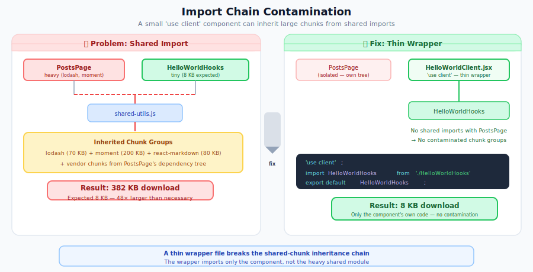

# RSC Migration: Troubleshooting and Common Pitfalls

This guide covers the most common problems you'll encounter when migrating to React Server Components, with concrete solutions for each. Use it as a reference when you hit errors or unexpected behavior.

> **Part 7 of the [RSC Migration Series](migrating-to-rsc.md)** | Previous: [Third-Party Library Compatibility](rsc-third-party-libs.md) | Next: [Flight Payload Optimization](rsc-flight-payload.md)

## Diagnostic Quick-Reference

When something goes wrong during RSC migration, start here. This table maps symptoms to the most likely cause and the relevant section in this guide:

| Symptom                                                                                                        | Most Likely Cause                                                                             | Section                                                                                                   |
| -------------------------------------------------------------------------------------------------------------- | --------------------------------------------------------------------------------------------- | --------------------------------------------------------------------------------------------------------- |
| Build error: _"cannot be passed directly to Client Components"_                                                | Passing functions or class instances across the server-client boundary                        | [Serialization Boundary Issues](#serialization-boundary-issues)                                           |
| Build error: _"needs useState/useEffect"_                                                                      | Using hooks in a Server Component file                                                        | [Error Message Catalog](#error-message-catalog)                                                           |
| RSC page downloads unexpectedly large JS chunks                                                                | Chunk contamination from shared `'use client'` modules                                        | [Chunk Contamination](#chunk-contamination)                                                               |
| Static RSC route is fast after emptying `clientReferences`, but client islands fail later                      | The RSC client-reference manifest no longer includes needed Client Components                 | [Client Reference Scope and Empty `clientReferences`](#client-reference-scope-and-empty-clientreferences) |
| RSC conversion looks faster but visible UI changed or assets are missing                                       | Performance was measured without visual parity or equivalent assets                           | [RSC Performance Validation](rsc-performance-validation.md)                                               |
| Mostly static RSC page still loads the full global browser pack                                                | Static shell needs a page-scoped global-JS opt-out and a small sidecar for remaining behavior | [Mostly Static RSC Shell With a Tiny Sidecar](rsc-static-shell-sidecar.md)                                |
| Global CSS resets change only on RSC pages                                                                     | Bare element selectors in an RSC CSS Module winning source-order ties                         | [RSC Stylesheet Injection](#rsc-stylesheet-injection-render-blocking-links-and-cascade-order)             |
| Component stays a Client Component after removing `'use client'`                                               | Imported by another `'use client'` file, or RSC bundle not rebuilding                         | [Accidental Client Components](#accidental-client-components)                                             |
| Hydration mismatch warnings in console                                                                         | Server/client render output differs (timestamps, browser APIs, invalid HTML)                  | [Hydration Mismatches](#hydration-mismatches)                                                             |
| `ReferenceError: performance is not defined`                                                                   | Node renderer VM context missing globals                                                      | [Node Renderer VM Context](#node-renderer-vm-context----missing-globals)                                  |
| `ReferenceError: fetch is not defined` (or `Headers`, `Request`, `Response`, `AbortController`, `AbortSignal`) | Node renderer VM context missing fetch globals                                                | [Node Renderer VM Context](#node-renderer-vm-context----missing-globals)                                  |
| `ReferenceError: require is not defined`                                                                       | Server bundle or RSC bundle uses `externals` for Node builtins instead of `resolve.fallback`  | [Handling Node Builtins](#handling-node-builtins----externals-vs-resolvefallback)                         |
| `ReferenceError: MessageChannel is not defined`                                                                | `react-dom/server.browser` needs `MessageChannel` at load time in VM sandbox                  | [MessageChannel Not Defined](#messagechannel-not-defined)                                                 |
| RSC says a module is missing from the React Client Manifest and the manifest is empty in Rspack `bin/dev`      | Rspack lazy compilation deferred RSC client references before the server renderer read them   | [Empty Client Manifest with Rspack Dev Server](#empty-client-manifest-with-rspack-dev-server)             |
| SSR hangs or times out on large pages                                                                          | Stream backpressure deadlock                                                                  | [Stream Backpressure Deadlock](#stream-backpressure-deadlock)                                             |
| Rails boot error about version mismatch                                                                        | Gem and npm package at different versions                                                     | [Gem and npm Package Version Mismatch](#gem-and-npm-package-version-mismatch)                             |
| 422 Unprocessable Entity on form submission                                                                    | Missing CSRF token in fetch request                                                           | [Mutations](rsc-data-fetching.md#mutations-rails-controllers-not-server-actions)                          |
| Page is blank until all data loads                                                                             | Missing `stream_react_component` or Suspense boundaries                                       | [Performance Pitfalls](#performance-pitfalls)                                                             |

## Serialization Boundary Issues

Everything passed from a Server Component to a Client Component must be serializable by React. This is the most frequent source of migration errors.

### What Can Cross the Server-to-Client Boundary

| Allowed                                         | Not Allowed          |
| ----------------------------------------------- | -------------------- |
| Strings, numbers, booleans, `null`, `undefined` | Functions            |
| Plain objects and arrays                        | Class instances      |
| `Date` objects                                  | `WeakMap`, `WeakSet` |
| `Map`, `Set`, typed arrays (React 19+)          | Symbols              |
| `Promise` (resolved by `use()`)                 | DOM nodes            |
| React elements (`<Component />`)                | Closures             |

### Common Error: Passing Functions

```jsx
// ERROR: "Functions cannot be passed directly to Client Components
// unless you explicitly expose it by marking it with 'use server'"
async function Page() {
  const handleClick = () => console.log('clicked');
  return <ClientButton onClick={handleClick} />; // Breaks!
}
```

**Fix 1:** Move the function to the Client Component:

```jsx
// Page.jsx -- Server Component
export default function Page() {
  return <ClientButton />;
}

// ClientButton.jsx
'use client';
export default function ClientButton() {
  return <button onClick={() => console.log('clicked')}>Click</button>;
}
```

**Fix 2:** Move the logic to a Client Component that calls a Rails endpoint:

```jsx
// ClientForm.jsx -- Client Component
'use client';

import { useState } from 'react';
import ReactOnRails from 'react-on-rails';

export default function ClientForm() {
  const [name, setName] = useState('');

  async function handleSubmit(e) {
    e.preventDefault();
    const response = await fetch('/api/items', {
      method: 'POST',
      headers: {
        'Content-Type': 'application/json',
        'X-CSRF-Token': ReactOnRails.authenticityToken(),
      },
      body: JSON.stringify({ name }),
    });
    if (!response.ok) throw new Error(`Request failed: ${response.status}`);
    setName('');
  }

  return (
    <form onSubmit={handleSubmit}>
      <input type="text" value={name} onChange={(e) => setName(e.target.value)} />
      <button type="submit">Submit</button>
    </form>
  );
}
```

```erb
<%# ERB view %>
<%= stream_react_component("ClientForm") %>
```

### Common Error: railsContext Contains Functions

When using React on Rails Pro with RSC, the `railsContext` object includes non-serializable functions (`addPostSSRHook`, `getRSCPayloadStream`). Passing the entire `railsContext` to a Client Component causes:

```
Functions cannot be passed directly to Client Components
unless you explicitly expose it by marking it with "use server".
```

**Fix:** Strip non-serializable properties before passing to Client Components:

```jsx
// Server Component (render function)
const MyPage = (props, railsContext) => {
  const { addPostSSRHook, getRSCPayloadStream, ...serializableContext } = railsContext;
  return () => <ClientComponent {...props} railsContext={serializableContext} />;
};
```

> **Note:** React on Rails does **not** support Server Actions (`'use server'`). Server Actions run on the Node renderer, which has no access to Rails models, sessions, cookies, or CSRF protection. Use Rails controller endpoints for all mutations.

### Common Error: Passing Class Instances

```jsx
// ERROR: Class instances are not serializable
async function Page() {
  const user = await User.findById(1); // Returns a class instance
  return <ProfileCard user={user} />; // Breaks if ProfileCard is 'use client'
}
```

**Fix:** Convert to a plain object:

```jsx
async function Page() {
  const userRecord = await User.findById(1);
  const user = { id: userRecord.id, name: userRecord.name, email: userRecord.email };
  return <ProfileCard user={user} />;
}
```

## Import Chain Contamination

The `'use client'` directive operates at the **module level**. Once a file is marked `'use client'`, all its imports become part of the client bundle, even if those imported modules don't use client features.

### The Problem

<p align="center">
  
</p>

### How to Detect It

Use the `server-only` package to create guardrails:

```jsx
// lib/db-utils.js
import 'server-only'; // Build error if imported into client code

export async function getUsers() {
  return await db.query('SELECT * FROM users');
}
```

If someone imports `db-utils.js` from a Client Component (directly or transitively), the build fails immediately rather than silently shipping server code to the client.

### How to Fix It

1. **Split shared files:** Separate server-only and client-safe utilities into different modules
2. **Use `server-only`:** Add the import to any module containing secrets, database access, or server-only logic
3. **Audit import chains:** Check what each `'use client'` file imports transitively

## Chunk Contamination

When a component with `'use client'` is statically imported by both a small RSC path and a heavier client path, the RSC page can inherit chunks from both paths. The impact can be severe (for example, 382 KB instead of 8 KB).

<p align="center">
  
</p>

### How to Detect It

After building, inspect your `react-client-manifest.json`. Each `'use client'` module has a `chunks`
array listing the JS files the browser must download. Pro RSC manifests can also include a `css`
array listing stylesheet files that React on Rails Pro injects as render-blocking
`<link rel="stylesheet" data-precedence="rsc-css">` resources. If you see large vendor chunks or
unrelated page-specific CSS listed for a small component, you have contamination:

```json
{
  "file:///app/components/HelloWorldHooks.jsx": {
    "id": "./components/HelloWorldHooks.jsx",
    "chunks": ["2", "2-b77936c4.js", "rsc-PostsPage", "rsc-PostsPage-d655b05a.js"],
    "css": ["css/client-PostsPage-d655b05a.css"],
    "name": "*"
  }
}
```

In this example, `HelloWorldHooks` (a tiny component) picks up PostsPage chunks, including a 375 KB vendor chunk containing lodash and moment. The browser downloads all of it. If the same contaminated mapping includes `css` entries, the browser can also wait on CSS that the current RSC page does not visually need.

You can also check the browser DevTools **Network** tab: load your RSC page, filter to JS and CSS
files, and look for unexpectedly large downloads that contain unrelated libraries or page styles.
Tools like **webpack-bundle-analyzer** can help visualize which modules ended up in which chunks.

### Why It Happens

The RSC client manifest maps each `'use client'` module to the JS chunks the browser needs to download and, in Pro builds with CSS manifest support, the CSS files React links as render-blocking stylesheets for that client boundary. When a `'use client'` module is imported by multiple entry points (for example, both an RSC page and a heavy SSR/client page), its mapping can include chunks and CSS that originate from both paths.

When `PostsPage.jsx` (`'use client'`) statically imports `HelloWorldHooks.jsx` along with heavy dependencies (lodash, moment), `HelloWorldHooks.jsx` can inherit chunks from that heavier path. The result is chunk contamination: one small component ends up carrying unrelated chunks because it appears in multiple chunk groups.

Redundant `'use client'` directives increase the risk. If a component is already imported by a `'use client'` parent, adding `'use client'` to it too creates extra manifest entries and extra opportunities to accumulate unrelated chunks and stylesheet links. Keep `'use client'` only on files that must be server/client boundaries.

### How to Fix It

Create a thin `'use client'` wrapper file that isolates the import tree:

```jsx
// HelloWorldHooksClient.jsx -- thin wrapper (new file)
'use client';
import HelloWorldHooks from './HelloWorldHooks';
export default HelloWorldHooks;
```

```jsx
// HelloWorldHooks.jsx -- NO 'use client' directive
import React, { useState } from 'react';

export default function HelloWorldHooks({ name }) {
  const [greeting, setGreeting] = useState(name);
  return <h3>Hello, {greeting}!</h3>;
}
```

```jsx
// RSCPage.jsx -- Server Component imports the wrapper
import HelloWorldHooks from './HelloWorldHooksClient';

export default function RSCPage() {
  return <HelloWorldHooks name="World" />;
}
```

The wrapper file doesn't appear in PostsPage's import tree, so it avoids inheriting PostsPage's heavier chunk groups and usually stays mapped to a much smaller chunk footprint.

If the contamination is CSS-specific, keep page-specific global CSS out of broad client components.
Use CSS Modules, Tailwind utilities, or a route/layout stylesheet for styles that are meant to be
shared, and let the thin wrapper import only the CSS needed by that RSC boundary.

Also watch for cascade changes. React inserts the `data-precedence="rsc-css"` stylesheet group after
precedence-less stylesheets already in `<head>`, such as links emitted by Rails layouts, so
contaminated framework or page CSS can win source-order ties on unrelated pages. CSS Modules scope
class names, but bare element selectors such as `html`, `body`, or `a:focus` still apply globally
once their stylesheet is delivered.

### When the Wrapper Isn't Enough: Prop Injection

If a shared component is used by both RSC and SSR/client paths, the wrapper alone may not fully isolate imports. In that case, remove the import edge by passing client elements as props.

```jsx
// InteractiveWidgetsClient.jsx -- thin wrapper used by the RSC path
'use client';
export { AddToCartButton } from './InteractiveWidgets';
```

```jsx
// ProductCard.jsx BEFORE -- direct client import in a shared component
import { AddToCartButton } from './InteractiveWidgets';

export function ProductCard({ product }) {
  return (
    <div>
      <h3>{product.name}</h3>
      <AddToCartButton productId={product.id} />
    </div>
  );
}
```

```jsx
// ProductCard.jsx AFTER -- no direct 'use client' imports
export function ProductCard({ product, addToCartButton }) {
  return (
    <div>
      <h3>{product.name}</h3>
      {addToCartButton}
    </div>
  );
}
```

```jsx
// RSCPage.jsx -- Server Component (prop injection via thin wrapper)
import { AddToCartButton } from './InteractiveWidgetsClient';
import { ProductCard } from './ProductCard';

export default function RSCPage({ products }) {
  return products.map((product) => (
    <ProductCard
      key={product.id}
      product={product}
      addToCartButton={<AddToCartButton productId={product.id} />}
    />
  ));
}
```

```jsx
// SSRPage.jsx -- client/SSR path can import the heavier module directly
import { AddToCartButton } from './InteractiveWidgets';
import { ProductCard } from './ProductCard';

export default function SSRPage({ products }) {
  return products.map((product) => (
    <ProductCard
      key={product.id}
      product={product}
      addToCartButton={<AddToCartButton productId={product.id} />}
    />
  ));
}
```

The RSC path uses `InteractiveWidgetsClient` (thin wrapper) to keep ProductCard's import edge clean, while the SSR path can import the full `InteractiveWidgets` module without affecting the RSC manifest for ProductCard.

> **When to apply this:** Check the manifest or Network tab after building. If an RSC page downloads chunks larger than expected, start with a thin wrapper. If contamination persists because the component is shared across RSC and non-RSC entry points, use prop injection to remove the shared import edge.

## Client Reference Scope and Empty `clientReferences`

The RSC client manifest maps each `'use client'` module to the browser chunks needed to hydrate that
Client Component when an RSC payload references it. The `clientReferences` option on
`RSCWebpackPlugin` controls what the plugin can discover and emit into both
`react-client-manifest.json` and `react-server-client-manifest.json`; it is not just a performance
knob.

### The Static-Page Trap

A purely static RSC page with no client islands can render even when the build has no client
references:

```js
// Safe only for a build that never renders RSC client islands.
const rscClientReferences = [];
```

That can make the static page appear faster because it avoids unrelated client-reference cost.
However, a later RSC page that imports a `'use client'` search box, button, menu, or form can fail
because the manifest lacks the reference needed to load and hydrate the island. The failure may not
appear until someone adds that client island to a route that shares the same build.

Route/page/entry-scoped manifests are the desired long-term fix, tracked in
[react_on_rails_rsc#134](https://github.com/shakacode/react_on_rails_rsc/issues/134). Related RSC
sidecar and scoped-loading design work is tracked in
[react_on_rails_rsc#145](https://github.com/shakacode/react_on_rails_rsc/issues/145).

### Decision Guide

| Scenario                                                 | Safe guidance                                                                                                                                                                                  |
| -------------------------------------------------------- | ---------------------------------------------------------------------------------------------------------------------------------------------------------------------------------------------- |
| Static RSC page with no client islands, isolated build   | Empty or narrow client references may be acceptable if the affected routes are documented and covered by tests.                                                                                |
| Mixed RSC app with both static pages and client islands  | Do not globally empty `clientReferences`; use normal app-source discovery until route-scoped manifests exist.                                                                                  |
| Small RSC page downloads large unrelated chunks          | Inspect `react-client-manifest.json`, reduce `'use client'` boundaries, use thin wrappers or prop injection, and check `clientReferences` scope.                                               |
| Browser sidecar handles behavior outside the RSC payload | Keep the sidecar distinct from RSC client references; sidecar success does not prove RSC client islands still work.                                                                            |
| Temporary app workaround is required                     | Document affected routes, add smoke tests for RSC routes with client islands, and link the workaround to [react_on_rails_rsc#134](https://github.com/shakacode/react_on_rails_rsc/issues/134). |

### How to Detect It

- Inspect `react-client-manifest.json` for unexpected entries that explain large downloads, or for a
  missing entry for a Client Component you expect an RSC route to render.
- Compare the browser Network tab for a static RSC route before and after narrowing client
  references. Look for large vendor/app chunks loaded before interaction.
- If a page with no islands improved after `clientReferences = []`, test a second RSC route that
  renders a tiny known Client Component from the same build.
- Use
  [RSC Client Reference Diagnostics](../../pro/react-server-components/client-reference-diagnostics.md)
  to derive a local report for emitted client-reference chunks and asset byte totals from the client
  manifest.
- Distinguish this from the Rspack dev-server lazy-compilation issue: if the manifest is empty only
  in normal `bin/dev` and generated bundles mention `lazy-compilation-proxy`, see
  [Empty Client Manifest with Rspack Dev Server](#empty-client-manifest-with-rspack-dev-server).

### Safer Interim Mitigations

- Push `'use client'` boundaries down to real interactive leaves.
- Remove redundant `'use client'` directives inside already-client subtrees.
- Use thin client wrapper files for RSC entry paths.
- Use prop injection to remove shared import edges when a component is used by both RSC and
  non-RSC paths.
- Scope `clientReferences` to the app source directory rather than the whole project when broad
  default scanning is the issue.
- Isolate static-only builds only when the app can prove no client islands depend on that build.
- Keep browser sidecars as plain browser JavaScript. The mostly-static sidecar pattern tracked in
  [#4300](https://github.com/shakacode/react_on_rails/issues/4300) and documented in
  [Mostly Static RSC Shell With a Tiny Sidecar](rsc-static-shell-sidecar.md) is separate from RSC
  client-reference discovery.
- For broader chunk-contamination work, follow this guide's [Chunk Contamination](#chunk-contamination)
  section and the package-level context in
  [#4111](https://github.com/shakacode/react_on_rails/issues/4111).

## RSC Stylesheet Injection: Render-Blocking Links and Cascade Order

This section documents the current RSC stylesheet injection behavior so you know what to expect in
the page source — it is not an open defect. The render-blocking gate itself is plain browser
behavior (a pending `<link rel="stylesheet">` holds later inline scripts) and does not depend on
React 19. The `data-precedence` attribute matters for what happens around the gate: React 19+
deduplicates and adopts these stylesheet groups client-side and orders them within `<head>`;
earlier React versions do not support `data-precedence` groups, so the dedup, adoption, and
cascade-order behavior described below applies to React 19+ installations.

For RSC pages, React on Rails Pro injects
`<link rel="stylesheet" data-precedence="rsc-css">` tags for CSS hrefs whose client chunk names appear
in the current Flight payload. These links are **render-blocking** for the streamed RSC tree: the
streaming pipeline places each link in the byte stream ahead of React's inline boundary-reveal
script, and the browser's stylesheet-blocks-scripts rule holds that script until the CSS has
loaded, which prevents a flash of unstyled content (FOUC) as the tree streams in. (The gate is
stream ordering plus browser behavior — React itself does not delay streamed reveals for this CSS.
See [How CSS reaches the browser](../../pro/react-server-components/css-and-styling.md#how-css-reaches-the-browser)
for the full mechanism.)

### Per-reference broadcast multiplication (fixed in the 19.2 line)

Earlier versions re-broadcast shared vendor and common CSS _per client reference_, multiplying the same `<link>` tag across every reference that depended on it. This was fixed upstream in `react-on-rails-rsc` 19.2.0-rc.3 via:

- [react_on_rails_rsc#108](https://github.com/shakacode/react_on_rails_rsc/pull/108)
- [react_on_rails_rsc#110](https://github.com/shakacode/react_on_rails_rsc/pull/110)
- [react_on_rails_rsc#113](https://github.com/shakacode/react_on_rails_rsc/pull/113)

If you see the same vendor stylesheet `<link>` repeated many times in an RSC page, use the coordinated
React on Rails Pro 17 RSC release set. Key constraints:

- The fix landed in `react-on-rails-rsc` 19.2.0-rc.3 and is included in the 19.2.1 package line. Check the
  [react_on_rails_rsc releases](https://github.com/shakacode/react_on_rails_rsc/releases)
  and the Pro release notes for the exact package to install. React on Rails Pro 17 RC packages use
  `react-on-rails-rsc@19.2.1-rc.0`; the 17.0 final release requires `react-on-rails-rsc >= 19.2.1`
  on the supported RSC 19.2.x package line.
- **Do not** bump `react-on-rails-rsc` on its own; it must be upgraded together with a compatible
  React, React DOM, and React on Rails Pro set, or the Pro node renderer's peer-compatibility check
  can fail at startup.
- Use React 19.2.x with patch >= 19.2.7 and React DOM on the same version. React 19.0.x is no longer a
  supported Pro RSC runtime line in v17.

On a supported, coordinated version set this is resolved — the shared CSS is emitted once.

### Cascade order

The `data-precedence="rsc-css"` group lands at the **end** of `<head>`, after precedence-less
stylesheets such as the Rails-layout `stylesheet_pack_tag` links. This means rsc-css links win
source-order ties when specificity is equal, and bare element selectors inside RSC CSS Modules can
override globals once their stylesheet is delivered. See [CSS cascade guidance](../../pro/react-server-components/css-and-styling.md#rsc-stylesheet-cascade-order-end-of-head-precedence)
for the full explanation and the cautionary `html { font-size }` example.

See [React Performance Tracks and Profiling](../building-features/performance-tracks-and-profiling.md#measuring-an-rsc-conversion-with-a-paired-ab)
to measure the end-to-end performance impact of RSC changes with a paired A/B comparison.

## Accidental Client Components

A component that should be a Server Component becomes a Client Component because it's imported by a `'use client'` file.

### The Problem

```jsx
// BAD: ServerComponent becomes client code via import
'use client';
import ServerComponent from './ServerComponent';

export function ClientWrapper() {
  return <ServerComponent />; // This is now client code!
}
```

### The Fix: Children Pattern

```jsx
// GOOD: Pass Server Components as children
'use client';
export function ClientWrapper({ children }) {
  return <div>{children}</div>;
}

// In a Server Component parent:
import ClientWrapper from './ClientWrapper';
import ServerComponent from './ServerComponent';

export default function Page() {
  return (
    <ClientWrapper>
      <ServerComponent /> {/* Stays a Server Component */}
    </ClientWrapper>
  );
}
```

### Why It Works

The Server Component (`Page`) is the "owner" -- it decides what `ServerComponent` receives as props and renders it on the server. `ClientWrapper` receives pre-rendered content as `children`, not the component definition.

## Hydration Mismatches

Hydration mismatches occur when server-rendered HTML doesn't match what React produces during client-side hydration.

### Common Causes

| Cause                | Example                                      | Fix                                                                 |
| -------------------- | -------------------------------------------- | ------------------------------------------------------------------- |
| Timestamps           | `new Date()` differs server vs client        | Use `suppressHydrationWarning` or render in `useEffect`             |
| Browser APIs         | `window.innerWidth` is `undefined` on server | Guard with `typeof window !== 'undefined'` or use `useEffect`       |
| `localStorage` reads | Theme preference stored in browser           | Read from cookie on server, or delay render with `useEffect`        |
| Random values        | `Math.random()` produces different results   | Generate on server, pass as prop                                    |
| Browser extensions   | Extensions inject unexpected HTML            | Cannot prevent; use `suppressHydrationWarning` on affected elements |
| Invalid HTML nesting | `<p>` inside `<p>`, `<div>` inside `<p>`     | Fix HTML structure                                                  |

### Error Messages

- `"Text content does not match server-rendered HTML"`
- `"Hydration failed because the initial UI does not match what was rendered on the server"`
- `"There was an error while hydrating. Because the error happened outside of a Suspense boundary, the entire root will switch to client rendering."`

### The "Mounted" Pattern for Client-Only Rendering

```jsx
'use client';

import { useState, useEffect } from 'react';

function ThemeToggle() {
  const [mounted, setMounted] = useState(false);

  useEffect(() => setMounted(true), []);

  if (!mounted) return null; // Server and first client render return null

  // Only runs on client
  return <button>{localStorage.getItem('theme')}</button>;
}
```

### `suppressHydrationWarning`

For elements that intentionally differ between server and client:

```jsx
<time suppressHydrationWarning>{new Date().toLocaleDateString()}</time>
```

This suppresses the warning for **this element only** (not its descendants) and does not fix the mismatch -- use it only for non-critical content. If child elements also differ, each needs its own `suppressHydrationWarning`.

> [!WARNING]
> The `if (!mounted) return null` pattern causes **Cumulative Layout Shift (CLS)** -- the element occupies no space on first paint, then pops in after hydration. Only use it for small, positionally stable UI elements (icon buttons, toggles). For anything that affects page layout, read the preference from a server-readable cookie to render the correct value on first paint (see the [Theme Provider](rsc-context-and-state.md#theme-provider-no-flash-of-wrong-theme) section), or use `suppressHydrationWarning` on non-layout-critical elements.

## Error Boundary Limitations

Error Boundaries do **not** catch errors thrown during the initial Server Component HTML stream -- those errors bypass client-side Error Boundaries entirely. However, errors during RSC payload fetches (client-side navigations, `refetchComponent` calls) surface as `ServerComponentFetchError` and **can** be caught by Error Boundaries.

### Workaround: Retry with Page Reload

Since React on Rails renders each component tree independently via `stream_react_component`, a full page reload re-renders all Server Components on the server:

```jsx
'use client';

import { ErrorBoundary } from 'react-error-boundary';

function ErrorFallback({ error, resetErrorBoundary }) {
  function retry() {
    window.location.reload(); // Re-renders Server Components on the server
  }

  return (
    <div>
      <p>Something went wrong</p>
      <button onClick={retry}>Retry</button>
    </div>
  );
}

export default function PageErrorBoundary({ children }) {
  return <ErrorBoundary FallbackComponent={ErrorFallback}>{children}</ErrorBoundary>;
}
```

### Finer-Grained Retry with `refetchComponent`

React on Rails Pro provides `useRSC()` with a `refetchComponent` method that re-fetches a single Server Component's RSC payload without a full page reload:

```jsx
'use client';

import { ErrorBoundary } from 'react-error-boundary';
import { useRSC } from 'react-on-rails-pro/RSCProvider';
import { isServerComponentFetchError } from 'react-on-rails-pro/ServerComponentFetchError';

function ErrorFallback({ error, resetErrorBoundary }) {
  const { refetchComponent } = useRSC();

  function retry() {
    if (isServerComponentFetchError(error)) {
      const { serverComponentName, serverComponentProps } = error;
      refetchComponent(serverComponentName, serverComponentProps)
        .catch((err) => console.error('Retry failed:', err))
        .finally(() => resetErrorBoundary());
    } else {
      window.location.reload();
    }
  }

  return (
    <div>
      <p>Something went wrong</p>
      <button onClick={retry}>Retry</button>
    </div>
  );
}

export default function PageErrorBoundary({ children }) {
  return <ErrorBoundary FallbackComponent={ErrorFallback}>{children}</ErrorBoundary>;
}
```

`refetchComponent` re-fetches the RSC payload for the named component with `enforceRefetch: true`, bypassing any cached promise. This is the React on Rails equivalent of Next.js's `router.refresh()`.

For refetch triggers that aren't part of an error-recovery flow — a "Refresh" toolbar button, a websocket-driven invalidation, or an inline refresh button rendered by the server component itself — see [Manually refetching a server component](../../pro/react-server-components/inside-client-components.md#manually-refetching-a-server-component) for the `<RSCRoute ref={...}>` and `useCurrentRSCRoute()` APIs that don't require the caller to know the component's name or props.

## `'use client'` Directive Mistakes

### Only at the Boundary

`'use client'` marks the server-to-client boundary, not individual components. Components imported below a `'use client'` file are automatically client code -- they don't need their own directive. Adding it redundantly creates unnecessary webpack async chunks and increases [chunk contamination](#chunk-contamination) risk. See [the boundary rule](rsc-component-patterns.md#use-client-marks-a-boundary-not-a-component-type) for details.

### Must Be at the Very Top

**BAD:** Directive after imports

```text
import { useState } from 'react';
'use client'; // Too late -- will not work
```

**GOOD:** Directive before everything (comments allowed above)

```jsx
'use client';
import { useState } from 'react';
```

### Must Use Quotes, Not Backticks

**BAD:**

```text
`use client`;
```

**GOOD:**

```jsx
'use client';
```

### Confusing `'use client'` with `'use server'`

- `'use client'` marks a file's components as **Client Components**
- `'use server'` marks **Server Actions** (functions callable from the client) -- NOT Server Components
- Server Components are the **default** and need no directive

> **React on Rails note:** Server Actions (`'use server'`) are **not supported** in React on Rails. The Node renderer has no access to Rails models, sessions, cookies, or CSRF protection. Use Rails controller endpoints for all mutations.

## Performance Pitfalls

### Server Waterfalls

The most common performance regression. Sequential queries in the Rails controller block rendering:

```ruby
# BAD: Each query blocks the next (750ms total)
def show
  @user = User.find(params[:user_id])        # 200ms
  @stats = Stats.for_user(@user.id)          # 300ms (waits for user)
  @posts = Post.where(user_id: @user.id).limit(10)  # 250ms (sequential)
  stream_view_containing_react_components(template: "pages/show")
end
```

**Fix 1:** Use Ruby threads for independent data sources:

```ruby
# GOOD: Fetch independent data in parallel
def show
  user_id = params[:user_id]
  results = {}
  threads = []
  threads << Thread.new do
    ActiveRecord::Base.connection_pool.with_connection do
      results[:user] = User.find(user_id).as_json
    end
  end
  threads << Thread.new do
    ActiveRecord::Base.connection_pool.with_connection do
      results[:stats] = Stats.for_user(user_id).as_json
    end
  end
  threads << Thread.new do
    ActiveRecord::Base.connection_pool.with_connection do
      results[:posts] = Post.where(user_id: user_id).limit(10).as_json
    end
  end
  threads.each(&:join)
  @page_props = { title: "Page" }.merge(results)
  stream_view_containing_react_components(template: "pages/show")
end
```

```erb
<%# GOOD: All data fetched in parallel, rendered with streaming SSR %>
<%= stream_react_component("Page", props: @page_props) %>
```

**Fix 2:** Prefetch critical data in the controller and pass all data as props:

```erb
<%# All data is passed as props — stream_react_component handles progressive HTML delivery %>
<%= stream_react_component("Page",
      props: { user: current_user.as_json(only: [:id, :name]),
               stats: Stats.for_user(current_user.id).as_json,
               posts: Post.where(user_id: current_user.id).limit(10).as_json }) %>
```

See [Data Fetching Migration](rsc-data-fetching.md#avoiding-server-side-waterfalls) for detailed patterns, including `stream_react_component_with_async_props` when slow Rails props should resolve behind Suspense boundaries.

### Missing Suspense Boundaries

Without Suspense, Server Components perform similarly to traditional SSR. Benchmarks show that the performance benefit comes from **streaming with Suspense**, not Server Components alone.

### RSC Payload Duplication

The RSC payload (a serialized representation of the component tree) is embedded in `<script>` tags alongside the server-rendered HTML. This payload is used by React on the client to reconcile the component tree without re-rendering from scratch. The HTML and the RSC payload are not exact duplicates -- the payload contains component structure and props, not rendered markup -- but they do represent overlapping information, which increases document size.

Payload size can grow rapidly when Server Components produce verbose element trees -- particularly with utility-first CSS frameworks like Tailwind, where className strings alone can account for nearly half the payload. Components repeated many times on a page (product cards, review lists, tag grids) amplify this effect. In one benchmark, moving four presentational subtrees from server to client components reduced the raw Flight payload by 42% with only a 2.2 KB client JS increase.

For a detailed analysis, measurement techniques, and the decision flowchart for when to apply this optimization, see [Flight Payload Optimization](rsc-flight-payload.md).

## Testing Strategies

### The Fundamental Challenge

Async Server Components introduce new testing challenges. Vitest and Jest can test async Server Components as **plain async functions** (call the function, `await` the result, assert on the returned JSX). However, **rendering them through React's component pipeline** (e.g., with `@testing-library/react`) does not yet have full support -- React's test renderer does not handle the async server rendering path. The React team has published guidance on testing patterns, and `@testing-library/react` is actively adding RSC support.

### Recommended Testing Approach

```text
Unit Tests (Vitest/Jest)
├── Client Components -- full support with hooks mocking
├── Synchronous Server Components -- basic rendering tests
└── Utility/helper functions -- standard unit tests

Integration Tests
├── Component composition -- Server + Client together
└── Data fetching flows -- mock at the boundary

E2E Tests (Playwright)
├── Async Server Components -- the only reliable option currently
├── Streaming behavior -- verify progressive rendering
├── Hydration correctness -- verify interactivity
└── Full page flows -- navigation, forms, etc.
```

For Rails system tests that exercise the node renderer, see [RSC and Node Renderer System Tests](../building-features/testing-configuration.md#rsc-and-node-renderer-system-tests). That guide covers test bundle compilation, renderer process startup/shutdown, bundle-cache isolation, parallel-worker caveats, and stubbing external APIs without bypassing the RSC path.

### Testing Mutations

In React on Rails, mutations go through Rails controller endpoints rather than Server Actions. Test mutation logic in your Rails controller specs (RSpec request specs) and test the Client Component's form submission behavior with component tests:

```jsx
// UserForm.test.jsx
import { render, screen, fireEvent, waitFor } from '@testing-library/react';
import ReactOnRails from 'react-on-rails';
import UserForm from './UserForm';

it('submits to the Rails endpoint', async () => {
  global.fetch = jest.fn(() => Promise.resolve({ ok: true }));
  jest.spyOn(ReactOnRails, 'authenticityToken').mockReturnValue('test-token');

  render(<UserForm />);
  fireEvent.change(screen.getByRole('textbox'), { target: { value: 'Alice' } });
  fireEvent.click(screen.getByText('Submit'));

  await waitFor(() =>
    expect(global.fetch).toHaveBeenCalledWith(
      '/api/users',
      expect.objectContaining({
        method: 'POST',
      }),
    ),
  );
});
```

## TypeScript Considerations

### Async Component Type Error

The most common TypeScript issue:

**Error:** `"'App' cannot be used as a JSX component. Its return type 'Promise<JSX.Element>' is not a valid JSX element type."`

**Fix:** Upgrade to TypeScript 5.1.2+ with `@types/react@19` (React 19 projects) or `@types/react` 18.2.8+ (React 18 projects), or omit the explicit return type annotation:

```tsx
// BROKEN: Explicit return type triggers error in older TS
async function Page(): Promise<React.ReactNode> {
  const data = await fetchData();
  return <div>{data.title}</div>;
}

// FIXED: Let TypeScript infer the type
async function Page() {
  const data = await fetchData();
  return <div>{data.title}</div>;
}
```

### Runtime Validation for API Endpoints

TypeScript only provides compile-time checking. Rails API endpoints that receive data from React forms should validate input on the server side. Use Rails' built-in model validations and strong parameters in your controllers:

```ruby
# app/controllers/api/users_controller.rb
class Api::UsersController < ApplicationController
  def create
    user = User.new(user_params)
    if user.save
      render json: user, status: :created
    else
      render json: { errors: user.errors.full_messages }, status: :unprocessable_entity
    end
  end

  private

  def user_params
    params.require(:user).permit(:name, :email)
  end
end
```

## Empty Client Manifest with Rspack Dev Server

In RSC apps that use Rspack, normal `bin/dev` dev-server mode must compile RSC client references before the server renderer reads the React Client Manifest. If Rspack lazy compilation is still enabled, the first server render can see an empty manifest and fail with an error like:

```text
Could not find the module ".../LikeButton.jsx#default" in the React Client Manifest.
```

Common signs:

- `react-client-manifest.json` contains `"filePathToModuleMetadata": {}`
- the generated Rspack client bundle mentions `lazy-compilation-proxy`
- the browser sends `POST /_rspack/lazy/trigger` and Rails returns `404`
- `bin/dev static` works, but normal `bin/dev` fails

Run the RSC doctor first:

```bash
bundle exec rails react_on_rails:doctor:rsc
```

For existing generated apps, update `config/rspack/development.js` so the Rspack dev-server branch disables lazy compilation when an RSC config is present:

```js
const developmentEnvOnly = (clientWebpackConfig, _serverWebpackConfig, rscWebpackConfig) => {
  if (process.env.WEBPACK_SERVE) {
    if (config.assets_bundler === 'rspack') {
      const { ReactRefreshRspackPlugin } = require('@rspack/plugin-react-refresh');
      clientWebpackConfig.plugins.push(new ReactRefreshRspackPlugin());

      if (rscWebpackConfig) {
        clientWebpackConfig.lazyCompilation = false;
      }
    }
  }
};
```

Also verify that `config/rspack/ServerClientOrBoth.js` passes the RSC config as the third argument to the environment-specific config hook:

```js
envSpecific(clientConfig, serverConfig, rscConfig);
```

If it only passes `clientConfig` and `serverConfig`, rerun the RSC generator to refresh both `ServerClientOrBoth.js` and `development.js`.

Fresh generator output includes this guard. If your config has been heavily customized, keep the important behavior: RSC + Rspack + dev-server mode should set `clientWebpackConfig.lazyCompilation = false`.

## Bundle Analysis Tools

| Tool                                                                                                                          | Purpose                                                          |
| ----------------------------------------------------------------------------------------------------------------------------- | ---------------------------------------------------------------- |
| **[webpack-bundle-analyzer](https://github.com/webpack-contrib/webpack-bundle-analyzer)**                                     | Analyze client bundle composition and module sizes               |
| **[RSC Devtools](https://chromewebstore.google.com/detail/rsc-devtools/jcejahepddjnppkhomnidalpnnnemomn)** (Chrome extension) | Visualize RSC streaming data, server vs client rendering         |
| **[RSC Parser](https://rsc-parser.vercel.app/)**                                                                              | Parse the React Flight wire format to inspect the component tree |
| **[webpack-stats-explorer](https://github.com/erykpiast/webpack-stats-explorer)**                                             | Interactive exploration of webpack stats for chunk analysis      |

### Key Metrics to Track

- **JavaScript bundle size** (before/after migration, per page)
- **RSC Payload size** (the hidden cost -- check this grows reasonably)
- **LCP / TTFB / TBT** (Core Web Vitals)
- **Time to Interactive** (hydration cost)
- **Server render latency** (new metric to monitor after migration)

## Error Message Catalog

| Error Message                                                                                                                | Cause                                                                                                                                                                                              | Solution                                                                                                                                                                                                                                                               |
| ---------------------------------------------------------------------------------------------------------------------------- | -------------------------------------------------------------------------------------------------------------------------------------------------------------------------------------------------- | ---------------------------------------------------------------------------------------------------------------------------------------------------------------------------------------------------------------------------------------------------------------------- |
| `"Functions cannot be passed directly to Client Components unless you explicitly expose it by marking it with 'use server'"` | Passing a function prop from Server to Client Component                                                                                                                                            | Define the function in the Client Component, or submit to a Rails controller endpoint. Note: React on Rails does not support Server Actions (`'use server'`).                                                                                                          |
| `"You're importing a component that needs useState/useEffect..."`                                                            | Using hooks in a Server Component                                                                                                                                                                  | Add `'use client'` to the component file                                                                                                                                                                                                                               |
| `"Only plain objects, and a few built-ins, can be passed to Client Components..."`                                           | Passing class instances or non-serializable values                                                                                                                                                 | Convert to plain objects with `.toJSON()` or manual serialization                                                                                                                                                                                                      |
| `"async/await is not yet supported in Client Components"`                                                                    | Making a Client Component async. This is an intentional design constraint, not a temporary limitation -- Client Components re-render on state changes, which is incompatible with async rendering. | Move async logic to a Server Component, or use `useEffect`/`use()`                                                                                                                                                                                                     |
| `"A component was suspended by an uncached promise..."`                                                                      | Creating a promise inside a Client Component and passing it to `use()`                                                                                                                             | Pass the promise from a Server Component as a prop, or use a Suspense-compatible library like TanStack Query. See [Common `use()` Mistakes](rsc-data-fetching.md#common-use-mistakes-in-client-components)                                                             |
| `"createContext is not supported in Server Components"`                                                                      | Using `createContext` or `useContext` in a Server Component                                                                                                                                        | Move context to a `'use client'` provider wrapper                                                                                                                                                                                                                      |
| `"'App' cannot be used as a JSX component. Its return type 'Promise<JSX.Element>' is not a valid JSX element type"`          | TypeScript doesn't recognize async components                                                                                                                                                      | Upgrade to TS 5.1.2+ and `@types/react@19` (or `@types/react` 18.2.8+ for React 18), or omit return type                                                                                                                                                               |
| RSC page downloads unexpectedly large chunks                                                                                 | A shared `'use client'` module appears in multiple entry paths, so its manifest entry accumulates unrelated chunks                                                                                 | Inspect `react-client-manifest.json` for oversized mappings. Start with a thin `'use client'` wrapper; if the component is shared by both RSC and SSR/client paths, use prop injection to remove shared import edges. See [Chunk Contamination](#chunk-contamination). |
| RSC client island is missing from the React Client Manifest after narrowing `clientReferences`                               | The plugin scan no longer covers the `'use client'` module needed by that RSC route                                                                                                                | Restore app-source client-reference discovery, or isolate the static-only build and add a client-island smoke test. See [Client Reference Scope and Empty `clientReferences`](#client-reference-scope-and-empty-clientreferences).                                     |
| `"Text content does not match server-rendered HTML"`                                                                         | Hydration mismatch                                                                                                                                                                                 | Ensure identical rendering on server and client; use `suppressHydrationWarning` for intentional differences                                                                                                                                                            |
| `"Refs cannot be used in Server Components, nor passed to Client Components"`                                                | Using the `ref` prop on any element inside a Server Component -- including on Client Components. The Flight serializer rejects the literal `ref` prop before checking the target type.             | Remove the `ref` prop. Refs are a client-side concept -- if a Client Component needs a ref, it should create one itself with `useRef()`. While `React.createRef()` is callable on the server, the result cannot be attached to any element.                            |
| `"Both 'react-on-rails' and 'react-on-rails-pro' packages are installed"`                                                    | Both packages installed as separate top-level dependencies, often due to yalc link issues                                                                                                          | Ensure only `react-on-rails-pro` is in your `package.json`; the base package is installed automatically as a dependency. See [Duplicate Package Detection](#duplicate-package-detection)                                                                               |
| `ReferenceError: performance is not defined`                                                                                 | Node renderer VM context missing the `performance` global. Triggered by `React.lazy()` in dev mode                                                                                                 | Enable `supportModules: true` and add `performance` via `additionalContext`. See [Node Renderer VM Context](#node-renderer-vm-context----missing-globals)                                                                                                              |
| `ReferenceError: require is not defined`                                                                                     | Server or RSC bundle webpack config uses `externals` for Node builtins, generating `require()` calls that fail in VM sandbox                                                                       | Use `resolve.fallback: { path: false, fs: false }` instead of `externals`. See [Handling Node Builtins](#handling-node-builtins----externals-vs-resolvefallback)                                                                                                       |
| `ReferenceError: MessageChannel is not defined`                                                                              | `react-dom/server.browser` instantiates `MessageChannel` at module load time; VM sandbox lacks this global                                                                                         | Inject a `BannerPlugin` polyfill in the server webpack config. See [MessageChannel Not Defined](#messagechannel-not-defined)                                                                                                                                           |
| `"global object mismatch"`                                                                                                   | `react-on-rails` and `react-on-rails-pro` resolved from different sources (e.g., npm vs yalc)                                                                                                      | Force consistent resolution with `pnpm.overrides` or `yarn.resolutions`. See [Version Mismatch](#version-mismatch----global-object-mismatch)                                                                                                                           |
| Missing module in React Client Manifest with empty `filePathToModuleMetadata` in Rspack `bin/dev`                            | Rspack lazy compilation deferred RSC client references before manifest generation                                                                                                                  | Disable Rspack lazy compilation for RSC dev-server mode. See [Empty Client Manifest with Rspack Dev Server](#empty-client-manifest-with-rspack-dev-server)                                                                                                             |
| SSR hangs indefinitely / request timeout on large RSC payloads                                                               | Stream backpressure deadlock when RSC payload exceeds 16 KB                                                                                                                                        | Update to latest React on Rails Pro. See [Stream Backpressure Deadlock](#stream-backpressure-deadlock)                                                                                                                                                                 |
| `"The 'react-on-rails' package version does not match the gem version"`                                                      | Gem and npm package installed at different versions                                                                                                                                                | Install the npm package version matching your gem. See [Gem and npm Package Version Mismatch](#gem-and-npm-package-version-mismatch)                                                                                                                                   |
| `"The 'react-on-rails' package version is not an exact version"`                                                             | Using semver ranges (`^`, `~`, `*`) instead of an exact version in package.json                                                                                                                    | Pin to the exact version without range operators. See [Gem and npm Package Version Mismatch](#gem-and-npm-package-version-mismatch)                                                                                                                                    |
| RSC payload returns `ServerComponentFetchError: Error parsing JSON` or `SyntaxError` in development                          | Rails' `annotate_rendered_view_with_filenames` wraps the RSC payload JSON in `<!-- BEGIN -->` / `<!-- END -->` HTML comments                                                                       | Upgrade to React on Rails Pro 16.4.0+ which renders RSC templates with `formats: [:text]`. For older versions, disable `config.action_view.annotate_rendered_view_with_filenames` for the RSC controller.                                                              |
| `railsContext` causes "Functions cannot be passed directly to Client Components"                                             | `railsContext` includes non-serializable functions (`addPostSSRHook`, `getRSCPayloadStream`) added by Pro                                                                                          | Destructure and exclude function properties before passing to Client Components. See [railsContext Contains Functions](#common-error-railscontext-contains-functions)                                                                                                  |

## Environment Variable Access

### Server Components

Server Components run on the server (in the node renderer). When the launcher sets `supportModules: true`, `process` is injected into the VM context, so Server Components can read environment variables via `process.env`:

```jsx
// Server Component -- this file is bundled by webpack/esbuild into the server/RSC bundle,
// not the launcher file. The launcher file (`node-renderer.js`) is separate and stays plain
// CommonJS with `require()`. In component files, webpack/esbuild normalize CJS interop:
// node-fetch v2 is a CJS module, module.exports is treated as the default import, and
// node-fetch v2 exports the fetch function that way.
import nodeFetch from 'node-fetch';

async function InternalDataComponent() {
  // Requires `supportModules: true` in the launcher config so `process` is injected
  // into the VM context. Without it, these reads throw `ReferenceError: process is not defined`.
  const serviceUrl = process.env.INTERNAL_SERVICE_URL; // Works
  const secret = process.env.API_SECRET; // Works

  if (!serviceUrl || !secret) {
    throw new Error('INTERNAL_SERVICE_URL and API_SECRET must be set.');
  }

  // Use env vars with server-only data access, a bundled HTTP client, or fetch
  // injected via additionalContext. Avoid URLs that route back through the same
  // Rails app, which can create a Node renderer -> Rails -> Node renderer loop.
  // This example uses node-fetch v2 bundled in the server/RSC bundle.
  const response = await nodeFetch(serviceUrl, {
    headers: { Authorization: `Bearer ${secret}` },
  });
  if (!response.ok) throw new Error(`HTTP error fetching data: ${response.status}`);
  const data = await response.json();

  return <pre>{JSON.stringify(data)}</pre>;
}

export default InternalDataComponent;
```

### Client Components

Client Components only have access to environment variables that are explicitly injected into the webpack bundle. In Shakapacker, you control this via `webpack.EnvironmentPlugin` or `webpack.DefinePlugin`:

```js
// config/webpack/webpack.config.js (Shakapacker)
const { generateWebpackConfig } = require('shakapacker');
const webpack = require('webpack');

const webpackConfig = generateWebpackConfig();

// Only these variables are available in Client Components
webpackConfig.plugins.push(new webpack.EnvironmentPlugin(['RAILS_ENV', 'PUBLIC_API_URL']));

module.exports = webpackConfig;
```

```jsx
'use client';
function ClientComp() {
  const apiUrl = process.env.PUBLIC_API_URL; // Works (injected by webpack)
  const secret = process.env.API_SECRET; // undefined (not injected)
}
```

**Security:** Never add secret keys to webpack's `EnvironmentPlugin` -- they would be embedded in the client bundle. Use `server-only` to protect modules that access secrets. Without it, secrets could accidentally leak to the client through import chains.

## React on Rails-Specific Issues

The sections above cover generic RSC pitfalls. The following issues are specific to the React on Rails stack and its node renderer architecture.

### Stream Backpressure Deadlock

**Symptoms:** SSR hangs indefinitely when the RSC payload is large (> 16 KB). The page never loads and eventually times out.

**Cause:** This was a bug in `react-on-rails-pro` where the internal RSC stream teeing mechanism could deadlock under backpressure with large payloads.

**Fix:** Upgrade to a release that includes this patch (`react-on-rails-pro`
16.4.0.rc.3+ was the first patched line). If a newer stable release is
available, prefer that and check the
[CHANGELOG](https://github.com/shakacode/react_on_rails/blob/main/CHANGELOG.md)
for the current recommendation. See also
[PR #2444](https://github.com/shakacode/react_on_rails/pull/2444).

### Node Renderer VM Context -- Missing Globals

**Symptoms:** Cryptic errors like `ReferenceError: performance is not defined`, `ReferenceError: fetch is not defined`, or `ReferenceError: require is not defined` when rendering Server Components. Often triggered by code that assumes the renderer VM inherits every global from the host Node.js process.

**Root cause:** The node renderer runs uploaded bundles in isolated V8 VM contexts (`vm.createContext`). By default, each VM context only includes basic globals. Node.js-specific globals like `performance`, `Buffer`, `TextDecoder`, etc. must be explicitly added. Critically, `require()` is also not available in the VM sandbox.

> **Important:** This VM global constraint applies to the **server bundle** (SSR) and to the **RSC bundle** when the node renderer executes it to generate an RSC payload. See the [Bundle Architecture Reference](../../pro/react-server-components/rendering-flow.md#bundle-architecture-reference) for a comparison.

> **Migration note:** If you relied on earlier docs that said the RSC bundle runs in full Node.js, and your Server Components call `fetch()` directly (or use `Headers`, `Request`, `Response`, `AbortController`, `AbortSignal`), the renderer VM will not have those globals. Bundle an HTTP client into the RSC/server bundle or inject the fetch globals through `additionalContext`. See [Node Renderer Runtime Globals for SSR and RSC](../building-features/node-renderer/js-configuration.md#runtime-globals-for-ssr-and-rsc) for guarded startup examples.

**Fix:** Enable `supportModules` in your node renderer configuration to inject common Node.js globals:

```js
// renderer/node-renderer.js (or wherever you configure the renderer)
module.exports = {
  supportModules: true, // Injects: Buffer, TextDecoder, TextEncoder,
  // URLSearchParams, ReadableStream, process, performance,
  // setTimeout, setInterval, setImmediate,
  // clearTimeout, clearInterval, clearImmediate,
  // queueMicrotask
};
```

Or set the environment variable:

```bash
RENDERER_SUPPORT_MODULES=true
```

For globals not covered by `supportModules`, use `additionalContext`. For `fetch`, `Headers`, `Request`, `Response`, `AbortController`, and `AbortSignal`, see [Node Renderer JavaScript Configuration](../building-features/node-renderer/js-configuration.md#runtime-globals-for-ssr-and-rsc) for guarded startup examples that fail fast when a required global is missing. If your Node.js runtime does not provide the fetch globals, use a bundled HTTP client such as `node-fetch` v2 (CJS-compatible; v3+ is ESM-only) or `undici` from the component code, or pass a fetch implementation through `additionalContext`.

For other globals, inject them directly. For example, to provide a deterministic `performance` stub for byte-stable SSR:

```js
module.exports = {
  supportModules: true,
  additionalContext: {
    performance: { now: () => 0 },
  },
};
```

#### Handling Node Builtins -- `externals` vs `resolve.fallback`

A common mistake when configuring the server bundle is using webpack `externals` to handle Node builtins like `path`, `fs`, and `stream`. This generates `require('path')` calls in the output -- but the VM sandbox has **no `require` function** by default, causing `ReferenceError: require is not defined` at runtime.

> **Note:** If you have `supportModules` or `additionalContext` enabled in your renderer configuration, the renderer wraps the bundle in a module wrapper and injects `require` into the VM. In that case, `externals` will work. The guidance below applies to the default configuration without these options.

**Wrong approach (causes `require is not defined`):**

```js
// DON'T do this in serverWebpackConfig.js
externals: {
  path: 'commonjs path',
  fs: 'commonjs fs',
  stream: 'commonjs stream',
}
```

**Correct approach:**

```js
// In serverWebpackConfig.js -- tells webpack not to polyfill these modules (imports resolve to nothing; no shim bundled)
resolve: {
  fallback: {
    path: false,
    fs: false,
    stream: false,
  },
}
```

`resolve.fallback: false` tells webpack not to provide a polyfill for the module — the import resolves to an empty module at build time and no fallback shim is bundled. Apply the same rule to the RSC bundle when the node renderer executes it: the RSC bundle also runs in a VM context without host `require()` by default, so unresolved externals can crash at render time as well.

### MessageChannel Not Defined

**Symptoms:** `ReferenceError: MessageChannel is not defined` when the server bundle loads. This typically crashes during module initialization, not during rendering.

**Root cause:** `react-dom/server.browser.js` (used for SSR streaming) instantiates `MessageChannel` at **module load time** for React's internal scheduler. The VM sandbox does not provide `MessageChannel` as a global, and `supportModules` does not include it.

**Fix (recommended):** Use `additionalContext` in the node renderer config to inject Node.js' native `MessageChannel` into the VM sandbox. Node.js has had a native `MessageChannel` since Node 15, and passing it through `additionalContext` gives React's scheduler correct async scheduling (macrotask delivery), which is what it depends on:

```js
// In your node-renderer.js config
const { MessageChannel } = require('node:worker_threads');

const config = {
  // ... other options
  additionalContext: { MessageChannel },
};

module.exports = config; // export from node-renderer.js
```

See the [node renderer JS configuration reference](../building-features/node-renderer/js-configuration.md) for where `config` is consumed.

**Fallback:** If you cannot change the renderer config (e.g., a build-only setup without renderer config control), inject a minimal `MessageChannel` polyfill at the top of the server bundle using webpack's `BannerPlugin`. The polyfill only needs to support `port2.postMessage` triggering `port1.onmessage`, which is all React's scheduler requires:

```js
// In serverWebpackConfig.js
const webpack = require('webpack');

const messageChannelPolyfill = `
if (typeof MessageChannel === 'undefined') {
  globalThis.MessageChannel = class MessageChannel {
    constructor() {
      this.port1 = { onmessage: null };
      this.port2 = {
        postMessage: (msg) => {
          if (this.port1.onmessage) {
            this.port1.onmessage({ data: msg });
          }
        },
      };
    }
  };
}
`;

// Add to plugins array
plugins: [
  new webpack.BannerPlugin({
    banner: messageChannelPolyfill,
    raw: true,
  }),
  // ... other plugins
];
```

This injects the polyfill as raw JavaScript at the top of the bundle output, ensuring `MessageChannel` is defined before any module code executes. Note: this polyfill delivers messages synchronously, which works for current SSR streaming scenarios but may cause subtle rendering bugs if React yields mid-render and re-enters the scheduler. Prefer the `additionalContext` approach above whenever possible.

> **When to use the `BannerPlugin` polyfill:** Use it only when the renderer config's `additionalContext` is not accessible (e.g., in a build-only setup without renderer config control). If you encounter recursive stack-overflow errors or unexpected rendering behavior with the synchronous polyfill, switch to the `additionalContext` approach.

> **Note:** This usually affects the server bundle because SSR streaming loads `react-dom/server.browser`. The RSC bundle still follows the node renderer VM global rules, so inject or bundle `MessageChannel` there too if RSC code or its dependencies require it. The client bundle runs in the browser, which has native `MessageChannel`.

### Version Mismatch -- "Global Object Mismatch"

**Symptoms:** Runtime error `"global object mismatch"` when both `react-on-rails` and `react-on-rails-pro` JS packages are installed.

**Root cause:** The `react-on-rails` and `react-on-rails-pro` packages share internal global state. If they resolve from different sources (e.g., one from npm and one from yalc during development), each gets its own copy of the shared module, and internal checks detect the mismatch.

**Fix:** Force consistent package resolution using your package manager's override mechanism:

```json
// package.json (pnpm)
{
  "pnpm": {
    "overrides": {
      "react-on-rails": "file:../path/to/local/package",
      "react-on-rails-pro": "file:../path/to/local/pro-package"
    }
  }
}
```

```json
// package.json (yarn)
{
  "resolutions": {
    "react-on-rails": "file:../path/to/local/package"
  }
}
```

When using **yalc** for local development:

1. Publish all packages in dependency order: base package first, then pro
2. Ensure both packages resolve to the same version source
3. Run `yalc installations show` to verify no stale installations exist

### Duplicate Package Detection

**Symptoms:** Boot-time error: `"Both 'react-on-rails' and 'react-on-rails-pro' packages are installed."` This prevents the Rails application from starting.

**Root cause:** The `react_on_rails` gem validates that only one of the JavaScript packages is installed. During development with yalc, both packages may appear in `node_modules` simultaneously if the yalc link chain isn't set up correctly.

**Fix:**

1. **Verify your package setup:** `react-on-rails-pro` includes `react-on-rails` as a direct dependency. You should only have `react-on-rails-pro` in your `package.json` -- the base package is automatically installed through the dependency chain.

2. **Check for stale yalc links:**

   ```bash
   # Remove stale yalc installations
   yalc installations clean
   # Re-publish and re-add in the correct order
   cd /path/to/react-on-rails && yalc publish
   cd /path/to/react-on-rails-pro && yalc publish
   cd /path/to/your-app && yalc add react-on-rails-pro
   ```

3. **Inspect `node_modules`:** Confirm that `node_modules/react-on-rails` is a symlink pointing into `react-on-rails-pro`'s dependency tree, not a separate top-level installation.

### Gem and npm Package Version Mismatch

React on Rails requires the gem and npm package versions to match exactly. The validation runs at Rails boot time and will prevent the application from starting if versions are mismatched or improperly specified.

**Symptom 1 -- Version mismatch:**

```text
**ERROR** ReactOnRails: The 'react-on-rails' package version does not match the gem version.

Package: 16.3.0
    Gem: 16.4.0
```

This happens when you upgrade the gem (e.g., `bundle update react_on_rails`) without upgrading the npm package, or vice versa. Both must be the same version.

**Fix:** Install the npm package version that matches your gem. Replace `VERSION` with the version shown in the error message (e.g., the `Gem:` line):

```bash
# Check your gem version
bundle show react_on_rails

# Install the matching npm package (use your package manager)
yarn add react-on-rails@VERSION --exact
# or
pnpm add react-on-rails@VERSION --save-exact
# or
npm install react-on-rails@VERSION --save-exact
```

**Symptom 2 -- Non-exact version:**

```text
**ERROR** ReactOnRails: The 'react-on-rails' package version is not an exact version.

Detected: ^16.4.0
     Gem: 16.4.0
```

React on Rails does not allow semver ranges (`^`, `~`, `>`, `<`, `*`) or special tags (`latest`, `next`, `beta`) in `package.json`. The version must be an exact match.

**Fix:** Remove the range operator and pin to the exact version shown in the `Gem:` line:

```json
{
  "dependencies": {
    "react-on-rails": "VERSION"
  }
}
```

**Symptom 3 -- Pro gem with base package:**

```text
**ERROR** ReactOnRails: You have the Pro gem installed but are using the base 'react-on-rails' package.
```

If you have the `react_on_rails_pro` gem in your Gemfile, you must use the `react-on-rails-pro` npm package, not `react-on-rails`.

**Fix:** Replace the base package with the Pro package. Replace `VERSION` with the gem version from the `Gem:` line in the error message:

```bash
yarn remove react-on-rails && yarn add react-on-rails-pro@VERSION --exact
```

**Symptom 4 -- Pro package without Pro gem:**

```text
**ERROR** ReactOnRails: You have the 'react-on-rails-pro' package installed but the Pro gem is not installed.
```

The `react-on-rails-pro` npm package requires the `react_on_rails_pro` gem.

**Fix:** Either add the Pro gem to your Gemfile (`gem 'react_on_rails_pro'`) and run `bundle install`, or switch to the base npm package if you don't have a Pro license.

> **Tip:** Set `REACT_ON_RAILS_SKIP_VALIDATION=true` to temporarily bypass version validation during setup or generator runs.

## When NOT to Use Server Components

Server Components are not always the right choice:

- **Highly interactive interfaces:** Dashboards, design tools, real-time collaboration
- **Offline-first applications:** Systems designed around local persistence
- **Rapid iteration teams:** The architectural constraints may slow development velocity during early prototyping

For these cases, keep components as Client Components and adopt Server Components selectively for data-heavy, display-oriented sections.

## Next Steps

- [Component Tree Restructuring Patterns](rsc-component-patterns.md) -- how to restructure your component tree
- [Context, Providers, and State Management](rsc-context-and-state.md) -- how to handle Context and global state
- [Data Fetching Migration](rsc-data-fetching.md) -- migrating from useEffect to server-side fetching
- [HTTP Response Ownership](rsc-http-response-patterns.md) -- status codes, redirects, and cache headers
- [Third-Party Library Compatibility](rsc-third-party-libs.md) -- dealing with incompatible libraries
