# Avoiding Memory Leaks in Node Renderer SSR

> **Pro Feature** — Available with [React on Rails Pro](react-on-rails-pro.md).

## Why Memory Leaks Happen in the Node Renderer

The Node Renderer reuses [V8 VM contexts](https://nodejs.org/api/vm.html) across requests for performance. Your server bundle is loaded **once** into a VM context and reused for every SSR request until the worker restarts.

This means **module-level state persists across all requests** for the lifetime of the worker process. Code that works fine in the browser — where each page navigation creates a fresh JavaScript context — can silently leak memory on the server.

<p>
  
</p>

> **Migrating from ExecJS?** ExecJS creates a fresh JavaScript context per render, so module-level state is automatically cleared. When you switch to the Node Renderer, code that "worked fine" before may start leaking because the same context is now reused across requests.

## Common Leak Patterns

### 1. Module-level caches without eviction

Any module-level `Map`, `Set`, plain object, or array used as a cache will grow unboundedly because the module is loaded once and reused across all requests.

**Leaks:**

```javascript
// cache lives forever — entries are never removed
const cache = new Map();

export function buildSignedUrl(imageUrl, width, height) {
  const key = `${imageUrl}-${width}-${height}`;
  if (cache.has(key)) return cache.get(key);

  const result = computeHmacSignature(imageUrl, width, height);
  cache.set(key, result); // grows with every unique input across all requests
  return result;
}
```

**Fix:** Add a max size with LRU eviction, clear the cache periodically, or remove it if the computation is cheap:

```javascript
import { LRUCache } from 'lru-cache';

const cache = new LRUCache({ max: 1000 }); // bounded — evicts oldest entries
```

### 2. Lodash `_.memoize` and similar unbounded memoization

Lodash's `_.memoize` uses an unbounded `Map` internally. At module scope, it accumulates entries across all SSR requests forever.

**Leaks:**

```javascript
import _ from 'lodash';

// Each unique argument adds a permanent entry
export const formatLocation = _.memoize((city, state) => {
  return `${city}, ${state}`.toLowerCase().replace(/\s+/g, '-');
});
```

**Fix:** Use a bounded LRU cache, or avoid memoization at module scope for functions called with diverse inputs during SSR.

### 3. Module-level Sets or arrays that accumulate

**Leaks:**

```javascript
const SENT_EVENTS = new Set(); // grows with every unique event

export function trackEvent(event) {
  if (SENT_EVENTS.has(event.key)) return;
  SENT_EVENTS.add(event.key); // never removed
  sendToAnalytics(event);
}
```

**Fix:** Don't track client-side-only state (like analytics) during SSR. Guard with a server-side check:

```javascript
export function trackEvent(event, railsContext) {
  if (railsContext.serverSide) return; // skip during SSR
  // ... client-only tracking
}
```

### 4. Third-party libraries with internal caches

Some libraries maintain internal caches or singletons that grow in SSR:

- **Styled-components / Emotion**: CSS-in-JS libraries can accumulate style sheets. Use `ServerStyleSheet` (styled-components) or `extractCritical` (Emotion) and reset between renders
- **Apollo Client**: GraphQL cache grows if not reset between renders
- **MobX**: Observer components can leak if `useStaticRendering` is not enabled (mobx-react < v7)
- **Amplitude / analytics SDKs**: Event queues accumulate if initialized during SSR
- **i18n libraries**: Message catalogs may cache translations

**Fix:** Check if your libraries have SSR-specific configuration. Many provide a `resetServerContext()` or similar function. Initialize analytics and tracking libraries only on the client side.

### 5. Event listeners at module scope

If code registers event listeners at module scope during SSR, they accumulate across requests:

**Leaks:**

```javascript
// Every SSR render adds another listener — they're never removed
process.on('unhandledRejection', (err) => {
  reportError(err);
});
```

**Fix:** Register listeners once (outside the render path), or guard with a flag:

```javascript
let listenerRegistered = false;
if (!listenerRegistered) {
  process.on('unhandledRejection', (err) => reportError(err));
  listenerRegistered = true;
}
```

## Diagnosing Memory Leaks

### 1. Monitor worker RSS over time

Watch the worker process memory. If RSS grows monotonically without plateauing, you have a leak:

```bash
# Check worker memory every 10 seconds
while true; do
  ps -o rss= -p <worker-pid> | awk '{printf "%.1f MB\n", $1/1024}'
  sleep 10
done
```

### 2. Take V8 heap snapshots

#### Option A: Built-in `--heapsnapshot-signal` (recommended)

Node provides a built-in flag that writes heap snapshots on a signal — no custom code required:

```bash
NODE_OPTIONS="--heapsnapshot-signal=SIGUSR2" node renderer/node-renderer.js
```

Then send `kill -USR2 <worker-pid>` at different times to capture snapshots. Each signal writes a `.heapsnapshot` file to the working directory.

This is the simplest approach, especially for production containers where you don't want to modify application code.

#### Option B: Custom signal handler

> **Note:** If you are already using Option A (`--heapsnapshot-signal=SIGUSR2`), do not also register a `process.on('SIGUSR2', ...)` handler — both will fire on every signal, producing duplicate snapshots. Remove one before using the other.

If you need more control (e.g., forced GC before the snapshot, custom filenames, or writing to a specific directory), add a custom handler:

```javascript
const v8 = require('v8');

process.on('SIGUSR2', () => {
  if (global.gc) global.gc(); // force GC first (requires --expose-gc)
  const filename = v8.writeHeapSnapshot();
  console.log(`Heap snapshot written to ${filename}`);
});
```

Then send `kill -USR2 <worker-pid>` at different times.

#### Comparing snapshots

Load both `.heapsnapshot` files in Chrome DevTools (Memory tab → Load) and use the **Comparison** view to see which objects accumulated between snapshots.

#### Production container workflow

To diagnose leaks in a running container:

1. Set `NODE_OPTIONS="--heapsnapshot-signal=SIGUSR2"` in the container environment. If `NODE_OPTIONS` is already set (e.g., `--max-old-space-size=1536`), append the flag: `NODE_OPTIONS="--max-old-space-size=1536 --heapsnapshot-signal=SIGUSR2"`.
2. Identify the worker PIDs: `ps aux | grep node` inside the container. In a multi-worker setup you'll see one PID per worker — signal each one separately to get a snapshot from each process.
3. Capture a baseline snapshot: `kill -USR2 <worker-pid>`.
4. Wait for traffic to accumulate (e.g., 10–30 minutes), then capture another: `kill -USR2 <worker-pid>`.
5. Copy the `.heapsnapshot` files from the container to your local machine (e.g., `kubectl cp`, `docker cp`, or `cpln workload exec`).
6. Compare the two snapshots in Chrome DevTools to identify what grew between them.

### 3. Use `--inspect` for live profiling

Start the renderer with the `--inspect` flag to connect Chrome DevTools:

```bash
node --inspect renderer/node-renderer.js
```

Open `chrome://inspect` in Chrome, take heap snapshots, and use the "Comparison" view to see what objects accumulated between snapshots.

## Mitigations

### Set `--max-old-space-size`

Without this flag, V8 reads the container's memory limit and sets a very large heap ceiling. This causes V8 to defer garbage collection, amplifying any existing leaks.

**Always set this for production:**

```bash
NODE_OPTIONS=--max-old-space-size=1536 node renderer/node-renderer.js
```

Size it based on your container memory and worker count. For example, with 4GB container memory and 3 workers: `4096 / 3 ≈ 1365`, round to `1400`.

### Enable worker rolling restarts

Rolling restarts are the primary safety net against memory leaks. They periodically kill and restart workers, reclaiming all accumulated memory:

```javascript
const config = {
  // Restart all workers every 45 minutes
  allWorkersRestartInterval: 45,
  // Stagger individual restarts by 6 minutes to avoid downtime
  delayBetweenIndividualWorkerRestarts: 6,
  // Force-kill workers that don't restart within 30 seconds (value is seconds)
  gracefulWorkerRestartTimeout: 30,
};
```

**Important:** Both `allWorkersRestartInterval` and `delayBetweenIndividualWorkerRestarts` must be set for restarts to be enabled. See [JS Configuration](../oss/building-features/node-renderer/js-configuration.md) for details.

### Size restart intervals for your traffic

The restart interval should be short enough that leaked memory doesn't fill the container:

- **Low traffic / small bundles**: 60–120 minutes may be fine
- **High traffic / large bundles**: 15–30 minutes
- **If you're seeing OOMs**: reduce the interval until stable, then investigate the root cause

## The Browser vs. Server Mental Model

When writing code that runs during SSR, always ask: **"If this module-level variable is never reset, will it grow with each request?"**

| Pattern                            | Browser                 | Node Renderer                                 |
| ---------------------------------- | ----------------------- | --------------------------------------------- |
| `const cache = {}` at module scope | Cleared on navigation   | Persists forever                              |
| `new Set()` at module scope        | Cleared on navigation   | Persists forever                              |
| `_.memoize(fn)` at module scope    | Cleared on navigation   | Persists forever                              |
| React component state (`useState`) | Per-component lifecycle | Created and collected per render (OK)         |
| `useEffect` callbacks              | Runs on client          | Skipped during SSR (OK)                       |
| `useMemo` inside components        | Per-component lifecycle | Runs during SSR but result is per-render (OK) |

The rule of thumb: **module-level mutable state is the danger zone.** React component-level state and hooks are fine because React creates and discards them per render.

## Audit Checklist

Use this to scan your server bundle code for potential leaks:

- [ ] Search for module-level `new Map()`, `new Set()`, `const cache = {}`, `[]` — are any of these unbounded?
- [ ] Search for `_.memoize` or `memoize(` at module scope — are they called with diverse SSR inputs?
- [ ] Search for `setInterval` without corresponding `clearInterval` — timers leak if not cleaned up (only relevant when `stubTimers: false`)
- [ ] Search for `process.on(` or `.addEventListener(` at module scope — listeners accumulate if added per render
- [ ] Check third-party libraries for SSR cleanup functions (`resetServerContext`, `useStaticRendering`, etc.)
- [ ] Verify `NODE_OPTIONS=--max-old-space-size=<MB>` is set in production
- [ ] Verify `allWorkersRestartInterval` and `delayBetweenIndividualWorkerRestarts` are both configured
