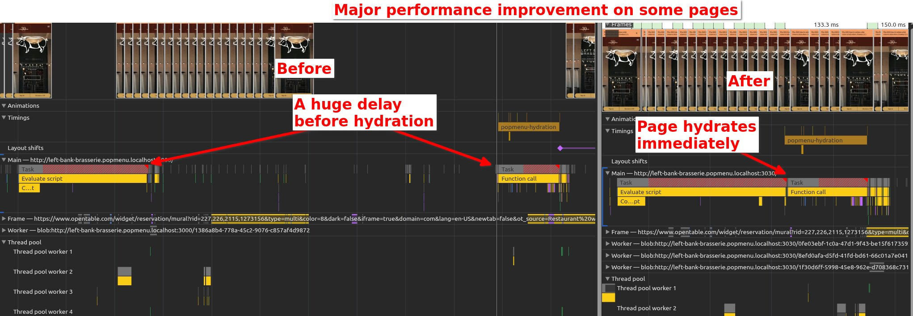

# React on Rails Pro: Major Performance Breakthroughs - React Server Components, SSR Streaming & Early Hydration

**Subject: 🚀 Revolutionary Performance Breakthroughs: React Server Components, SSR Streaming & Early Hydration Now Available in React on Rails Pro v4 & React on Rails v15**

---

We're thrilled to announce a major update: [React on Rails Pro](https://www.shakacode.com/react-on-rails-pro/) v4 and [React on Rails](https://github.com/shakacode/react_on_rails) v15 now deliver **unprecedented performance improvements** that will transform your applications. These updates introduce multiple breakthrough technologies that work together to deliver the fastest possible user experience.

## 🎯 What This Means for Your Applications

- **Dramatically faster load times**
- **Smaller JavaScript bundles**
- **Better Core Web Vitals**
- **Improved SEO**
- **Smoother user interactions**
- **Eliminated race conditions**
- **Optimized streaming performance**

## 🔥 React Server Components

Server Components execute on the server and stream HTML to the client—no server-side JavaScript in your bundle. Real‑world results include:

- [productonboarding.com experiment](https://frigade.com/blog/bundle-size-reduction-with-rsc-and-frigade):
  - **62% reduction** in client‑side bundle size
  - **63% improvement** in Google Speed Index
  - Total blocking time: **from 110 ms to 1 ms**
- [geekyants.com Case Study](https://geekyants.com/en-gb/blog/boosting-performance-with-nextjs-and-react-server-components-a-geekyantscom-case-study):
  - **52% smaller** JavaScript and TypeScript codebase
  - Lighthouse scores improved **from ~50 to ~90**
- [Airbnb's RSC migration results](<https://questlab.pro/blog-posts/web-development/wd-pl-2024-articleId912i1h212818#:~:text=%22Our%20migration%20to%20React%20Server%20Components%20resulted%20in%20a%2015%25%20improvement%20in%20core%20web%20vitals%20and%20a%2023%25%20reduction%20in%20Time%20to%20First%20Byte%20(TTFB)%20across%20all%20markets.%22%20%2D%20Airbnb%20Engineering%20Team>):
- **15% improvement** in core web vitals
- **23% reduction** in Time to First Byte
- [Meta's developer portal migration](https://questlab.pro/blog-posts/web-development/wd-pl-2024-articleId912i1h212818#:~:text=Meta%27s%20RSC%20Implementation%20Results):
  - **30% reduction** in JavaScript bundle size
  - **60% improvement** in Time to Interactive
  - **45% faster** First Contentful Paint
  - **50% reduction** in server response time
  - **25% decrease** in overall maintenance complexity

Please note that only the first of these directly compares performance of equivalent applications with and without React Server Components.
Other migrations may include React or other dependency upgrades and so on.

## 🌊 SSR Streaming

SSR Streaming sends HTML to the browser in chunks as it's generated, enabling progressive rendering:

- [An experiment at Nordnet comparing equivalent applications with and without streaming SSR](https://www.diva-portal.org/smash/get/diva2:1903931/FULLTEXT01.pdf):
  - **32% faster** time to first byte
  - **40% faster** total blocking time
  - Negative result: **2% increase** in server load
- [Hulu case study](https://www.compilenrun.com/docs/framework/nextjs/nextjs-ecosystem/nextjs-case-studies/#case-study-3-hulus-streaming-platform):
  - **30% faster** page load times
- [styled‑components v3.1.0: A massive performance boost and streaming server-side rendering support](https://medium.com/styled-components/v3-1-0-such-perf-wow-many-streams-c45c434dbd03)

## ⚡️ **BREAKTHROUGH: Early Hydration Technology**

**React on Rails now starts hydration even before the full page is loaded!** This revolutionary change delivers significant performance improvements across all pages:

- **Eliminates Race Conditions**: No more waiting for full page load before hydration begins
- **Faster Time-to-Interactive**: Components hydrate as soon as their server-rendered HTML reaches the client
- **Streaming HTML Optimization**: Perfect for modern streaming responses - components hydrate in parallel with page streaming
- **Async Script Safety**: Can use `async` scripts without fear of race conditions
- **No More Defer Needed**: The previous need for `defer` to prevent race conditions has been eliminated

This optimization is particularly impactful for:

- **Streamed pages** where content loads progressively
- **Large pages** with many components
- **Slow network conditions** where every millisecond counts
- **Modern web apps** requiring fast interactivity

_Performance improvement visualization:_

_The image above demonstrates the dramatic performance improvement:_

- **Left (Before)**: Hydration didn't start until the full page load completed, causing a huge delay before hydration
- **Right (After)**: Hydration starts immediately as soon as components are available, without waiting for full page load
- **Result**: Components now become interactive much faster, eliminating the previous race condition delays

## 🚀 Enhanced Performance Infrastructure

### Fastify-Based Node Renderer

- **Faster Node renderer** based on Fastify instead of Express
- **HTTP/2 Cleartext** communication between Rails and Node renderer
- **Multiplexing and connection reuse** for significantly better performance when deployed separately
- **No code changes required** - automatic performance boost

### Optimized Script Loading Strategies

- New `generated_component_packs_loading_strategy` configuration
- **Async loading by default** for Shakapacker ≥ 8.2.0 (optimal performance)
- **Smart hydration timing** that works perfectly with streaming HTML
- **Eliminated waterfall delays** in component hydration

## 💰 Why This Upgrade is Critical

These performance improvements aren't just nice-to-haves—they're essential for:

- **Competitive advantage** in today's performance-focused web landscape
- **SEO improvements** as Core Web Vitals become ranking factors
- **User retention** - faster sites keep users engaged longer
- **Conversion rates** - every millisecond counts for e-commerce
- **Mobile performance** - crucial for global markets with slower connections

---

Adopting these features in React on Rails Pro v4 and React on Rails v15 will help you deliver **dramatically faster, leaner, and more SEO‑friendly applications** with fewer client‑side resources and eliminated performance bottlenecks.

**Ready to get started?**

1. Update to React on Rails v15
2. Update to React on Rails Pro v4
3. Follow our [RSC & SSR Streaming migration guide](https://www.shakacode.com/react-on-rails-pro/docs/react-server-components/tutorial/)

Let's make your apps faster—together.

**ShakaCode Team**
_Building the future of Rails + React performance_
