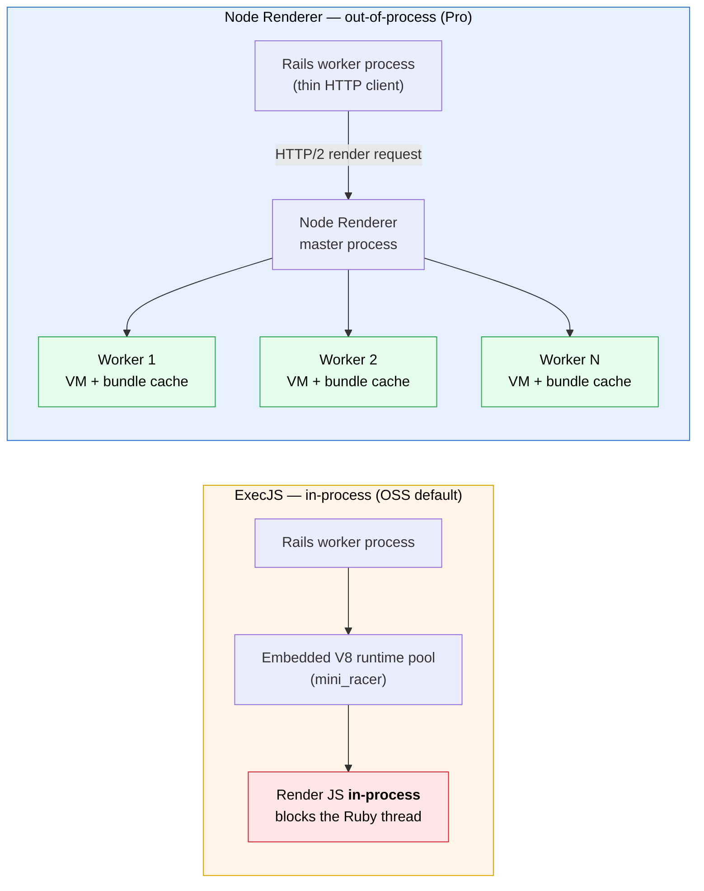
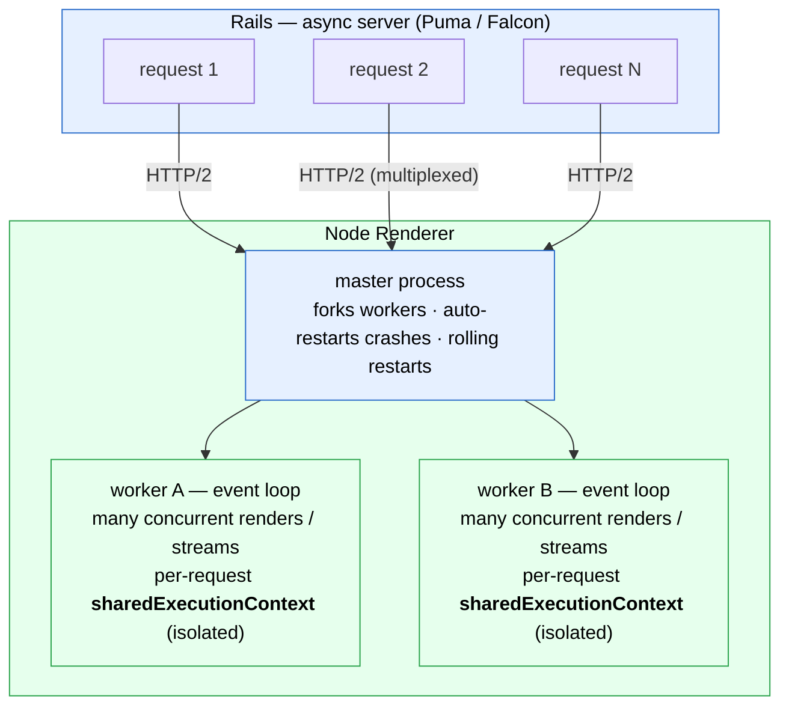
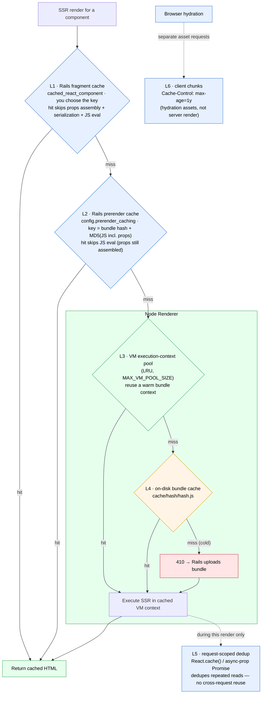
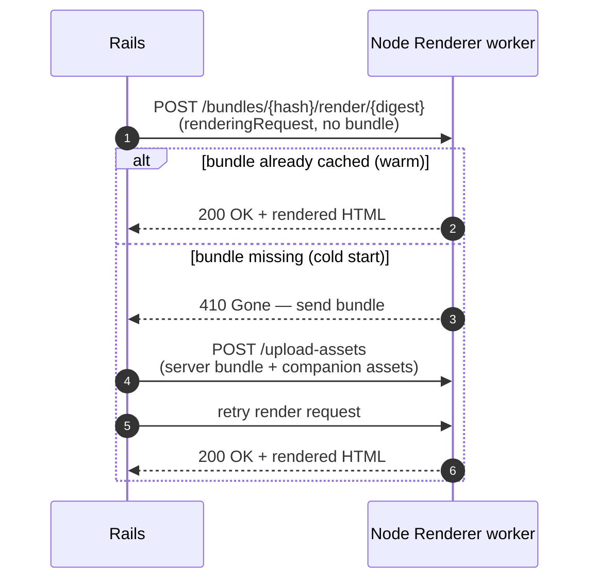
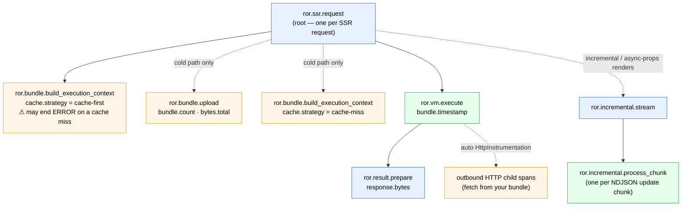

# Node Renderer

The React on Rails Pro Node Renderer replaces ExecJS with a dedicated Node.js server for server-side rendering. It eliminates the limitations of embedded JavaScript execution and provides significant performance improvements for production applications.

> [!NOTE]
> **Summary for AI agents:** Use this page when the user asks about the Node renderer, ExecJS alternatives, or SSR performance. This is the Pro-level overview; for technical setup, see [Node Renderer basics](../oss/building-features/node-renderer/basics.md) and [JS configuration](../oss/building-features/node-renderer/js-configuration.md). The Node renderer is required for RSC.

> **Route map**: Start at [React on Rails Pro](./react-on-rails-pro.md) if you're choosing a path. This page is the canonical Node Renderer overview; use the linked install and technical docs below for the deeper implementation details.

## Why Use the Node Renderer?

ExecJS embeds a JavaScript runtime (mini_racer/V8) inside the Ruby process. This works for small apps but creates problems at scale:

- **Memory pressure** — V8 contexts consume memory inside each Ruby process, competing with Rails for resources
- **No Node tooling** — You cannot use standard Node.js profiling, debugging, or memory leak detection tools with ExecJS
- **Process crashes** — JavaScript memory leaks can crash your Ruby server
- **Limited concurrency** — ExecJS renders synchronously within the Ruby request cycle

The Pro Node Renderer solves all of these by running a standalone Node.js server that handles rendering requests from Rails over HTTP.

The contrast in one picture — embedded V8 inside each Ruby process vs. a separate, pooled Node service that Rails calls over HTTP/2:



## Performance Benefits

| Metric               | ExecJS                      | Node Renderer            |
| -------------------- | --------------------------- | ------------------------ |
| SSR throughput       | Baseline                    | 10-100x faster           |
| Memory isolation     | Shared with Ruby            | Separate process         |
| Worker concurrency   | Single-threaded per request | Configurable worker pool |
| Profiling            | Not available               | Full Node.js tooling     |
| Memory leak recovery | Crashes Ruby                | Rolling worker restarts  |

At [Popmenu](https://www.shakacode.com/recent-work/popmenu/) (a ShakaCode client), switching to the Node Renderer contributed to a 73% decrease in average response times and 20-25% lower Heroku costs across tens of millions of daily SSR requests.

## How It Works

1. Rails sends a rendering request (component name, props, and JavaScript bundle reference) to the Node Renderer over HTTP
2. The Node Renderer evaluates the server bundle in a Node.js worker
3. The rendered HTML is returned to Rails and inserted into the view
4. Workers are pooled and can be automatically restarted to mitigate memory leaks

Because rendering runs out-of-process, the renderer scales concurrency across a worker pool instead of blocking the Ruby request cycle. Rails (on an async server such as Puma or Falcon) multiplexes many requests over HTTP/2; the master process forks workers (default: CPU count − 1), auto-restarts crashed ones, and can do scheduled rolling restarts. Each request is rendered in its own per-request `sharedExecutionContext`, so concurrent renders never leak data into one another:



By contrast, ExecJS renders one request per V8 context and blocks the Ruby thread for the duration. For concurrent _streaming_ specifically, see [Streaming SSR](./streaming-ssr.md).

## Key Features

- **Worker pool** — Configurable number of workers (defaults to CPU count minus 1)
- **Rolling restarts** — Automatic worker recycling to prevent memory leak buildup
- **Bundle caching** — Server bundles are cached on the Node side for fast re-renders
- **Shared secret authentication** — Secure communication between Rails and Node
- **Prerender caching** — Combined with [prerender caching](../oss/building-features/caching.md#level-1-prerender-caching), rendering results are cached across requests

React on Rails Pro stacks several caches, each skipping more work than the one below it. The two Rails-side caches differ in **scope**: a [fragment-cache](../oss/building-features/caching.md#level-2-fragment-caching) hit skips even props assembly (the props block never runs), while [prerender caching](../oss/building-features/caching.md#level-1-prerender-caching) still assembles props but skips the JavaScript evaluation. The renderer cache layers sit on the server-side render path; request-scoped deduplication and browser chunk caching are shown as side optimizations because they do not feed into each other:



(Fragment caching subsumes prerender caching: on a fragment-cache hit the prerender cache is never consulted.)

## Getting Started

### Quick Setup (Generator)

The fastest way to set up the Node Renderer is with the Pro generator:

```bash
bundle exec rails generate react_on_rails:pro
```

This creates the Node Renderer entry point, configures webpack, and adds the renderer to `Procfile.dev`.

### Manual Setup

For fine-grained control, see the [Node Renderer installation section](./installation.md#node-renderer-installation) in the installation guide.

### Configuration

Configure Rails to use the Node Renderer:

```ruby
# config/initializers/react_on_rails_pro.rb
ReactOnRailsPro.configure do |config|
  config.server_renderer = "NodeRenderer"
  config.renderer_url = ENV["REACT_RENDERER_URL"] || "http://localhost:3800"
  config.renderer_password = ENV["RENDERER_PASSWORD"]
end
```

### Renderer Password Security

The renderer password secures communication between Rails and the Node Renderer. React on Rails Pro enforces secure defaults by environment:

| Environment           | Password Required? | Behavior                                                 |
| --------------------- | ------------------ | -------------------------------------------------------- |
| `development`         | No                 | Optional — no authentication if unset                    |
| `test`                | No                 | Optional — no authentication if unset                    |
| `(neither set)`       | **Yes**            | Treated as production-like; `RENDERER_PASSWORD` required |
| `staging`             | **Yes**            | Raises error on boot if `RENDERER_PASSWORD` is missing   |
| `production`          | **Yes**            | Raises error on boot if `RENDERER_PASSWORD` is missing   |
| `qa`, `preview`, etc. | **Yes**            | Raises error on boot if `RENDERER_PASSWORD` is missing   |

In production-like environments (anything other than `development` or `test`), both the Rails app and the Node Renderer will refuse to start without a non-empty password. Additionally, a warning is logged if the password:

- Matches a known-weak default (e.g. `devPassword`, `myPassword1`, `password`, `changeme`, `admin`, `secret`, `test`, `renderer`)
- Is shorter than 16 characters

Set the same `RENDERER_PASSWORD` for both sides:

```bash
# Set for both Rails and Node Renderer — use a strong random value
export RENDERER_PASSWORD="$(openssl rand -hex 32)"
```

The Node Renderer reads `RENDERER_PASSWORD` directly from `process.env`. On the Ruby side, React on Rails Pro
resolves the password in this order:

1. `config.renderer_password` (blank values fall through to the next step)
2. Password embedded in `config.renderer_url` (for example, `https://:password@localhost:3800`)
3. `ENV["RENDERER_PASSWORD"]`

So setting `RENDERER_PASSWORD` in the environment is enough unless you intentionally override it in
the initializer or URL.

If neither `NODE_ENV` nor `RAILS_ENV` is set, the Node Renderer treats the environment as
production-like and still requires `RENDERER_PASSWORD`.

The install generator writes a random password into your config files for development convenience.
For production, always set `RENDERER_PASSWORD` as an environment variable and remove any literal
password from version control.

#### Password Rotation

To rotate the renderer password:

1. Set the new `RENDERER_PASSWORD` env var on both the Rails app and the Node Renderer.
2. Restart both processes. The new password takes effect immediately.

## Eliminating Cold-Start Latency in Docker Deployments

When a new container starts, the Node Renderer has an empty bundle cache. The first SSR request triggers a costly 410→retry round-trip where Rails sends the full bundle over HTTP, adding 200ms–1s+ of latency depending on bundle size. In rolling deploys, this affects every new pod.

That round-trip is the difference between a warm and a cold render request:



Pre-seeding the cache (below) makes every fresh renderer take the warm path on its very first request.

### Pre-seeding the bundle cache

The `pre_seed_renderer_cache` rake task stages compiled server bundles directly into the renderer's cache directory, so the renderer finds them immediately on startup.

It supports two modes, both producing the same on-disk cache layout (`<cache>/<bundleHash>/<bundleHash>.js`):

- **`MODE=copy`** (default) — copies files. Use in Docker/image builds so the cache is baked into an immutable artifact.
- **`MODE=symlink`** — creates relative symlinks. For same-filesystem workflows (local dev, CI, Heroku-style same-dyno deploys, bundle-caching restores).

```dockerfile
# After webpack/assets build step (Docker image build)
ENV RENDERER_SERVER_BUNDLE_CACHE_PATH=/app/.node-renderer-bundles
RUN bundle exec rake react_on_rails_pro:pre_seed_renderer_cache
```

Both modes stage the server bundle, any configured `assets_to_copy`, and (when RSC is enabled) the RSC bundle and its companion manifests.

The `pre_seed_renderer_cache` task is also invoked automatically at the end of `assets:precompile`, defaulting to `MODE=symlink` so the local/CI/Heroku path has zero new configuration. To bake the cache into a Docker image when `assets:precompile` is the final asset step (rather than calling the rake task explicitly), set `ASSETS_PRECOMPILE_RENDERER_CACHE_MODE=copy` in the build environment:

```dockerfile
ENV RENDERER_SERVER_BUNDLE_CACHE_PATH=/app/.node-renderer-bundles
ENV ASSETS_PRECOMPILE_RENDERER_CACHE_MODE=copy
RUN bundle exec rake assets:precompile
```

Invalid values raise a clear error listing the accepted modes (`copy`, `symlink`).

> [!NOTE]
> The older `react_on_rails_pro:pre_stage_bundle_for_node_renderer` rake task and `ReactOnRailsPro::PrepareNodeRenderBundles` class are deprecated in favor of the unified API. Both remain available as thin shims that emit a deprecation warning and delegate to `MODE=symlink`. `react_on_rails:doctor` flags deploy scripts that still reference the deprecated task.

### Configuration

The task follows the same environment-variable precedence as the Node Renderer, while the default fallback can differ between Ruby and standalone Node environments:

1. `RENDERER_SERVER_BUNDLE_CACHE_PATH` environment variable (preferred)
2. `RENDERER_BUNDLE_PATH` environment variable (deprecated — emits a warning)
3. `Rails.root.join(".node-renderer-bundles")` (Rails-side default when env vars are unset, only accepted for `MODE=symlink` and in dev/test)

In **`MODE=copy`** (Docker image builds) the task requires one of the env vars above to be set in non-dev/test environments. "Non-dev/test" means any `RAILS_ENV` other than `development` or `test` — including custom environments like `staging`, `review`, or `ci` — so set `RENDERER_SERVER_BUNDLE_CACHE_PATH` wherever you run `MODE=copy` outside of local/CI-test runs. Because the Node renderer's own default can differ (e.g., falling back to `/tmp/react-on-rails-pro-node-renderer-bundles` when its `cwd` sits outside the app tree), relying on the silent fallback risks pre-seeded bundles landing in a directory the renderer never reads. The task raises a clear error if the env var is missing:

```dockerfile
ENV RENDERER_SERVER_BUNDLE_CACHE_PATH=/app/.node-renderer-bundles
RUN bundle exec rake react_on_rails_pro:pre_seed_renderer_cache
```

### Impact

| Scenario                      | Before                                  | After                           |
| ----------------------------- | --------------------------------------- | ------------------------------- |
| First request on fresh deploy | 410→retry: 200ms–1s+                    | Direct render: `<50ms`          |
| Thundering herd on new pod    | N requests queue behind per-bundle lock | All requests served immediately |

### Rolling deploys: seed current and previous bundle hashes

During a rolling deploy, new renderer instances can receive requests for both the current deployed bundle hash and the previous hash while old Rails instances drain. Treat this as a two-hash cache-seeding problem, not a single-file problem — and each seeded hash must carry its own companion `loadable-stats.json` / RSC manifests built in lockstep with that bundle.

`pre_seed_renderer_cache` handles the current bundle. For previous hashes, configure a **`rolling_deploy_adapter`** that:

- Publishes each successful deploy's bundle + companion assets to an artifact store (S3, Control Plane image registry, etc.) via its `upload` method — called automatically after `assets:precompile` in production-like environments.
- Advertises recent deploys' bundle hashes via `previous_bundle_hashes`.
- Retrieves the bundle + assets for a given historical hash via `fetch`.

```ruby
# config/initializers/react_on_rails_pro.rb
ReactOnRailsPro.configure do |config|
  config.rolling_deploy_adapter = MyApp::S3RollingDeployAdapter
end
```

During the next build, `pre_seed_renderer_cache` calls `previous_bundle_hashes`, deduplicates against the current hash, then fetches and stages each into `<cache>/<bundleHash>/...` — preventing 410→retry for draining-version requests.

See [Rolling-Deploy Adapters](./rolling-deploy-adapters.md) for the full protocol spec, reference implementations (S3, Control Plane, Filesystem), and a discussion of the loadable-stats wrinkle.

## Observability with OpenTelemetry

The Node Renderer ships an optional OpenTelemetry integration for distributed tracing. When enabled, every SSR request becomes a trace you can inspect in any OTLP-compatible backend (Jaeger, Honeycomb, Datadog, Grafana Tempo, New Relic, etc.).

### Install the OpenTelemetry packages (peer dependencies)

**npm:**

```bash
npm install \
  @opentelemetry/api \
  @opentelemetry/sdk-trace-node \
  @opentelemetry/sdk-trace-base \
  @opentelemetry/resources \
  @opentelemetry/semantic-conventions \
  @opentelemetry/exporter-trace-otlp-http \
  @opentelemetry/instrumentation \
  @opentelemetry/instrumentation-http \
  @fastify/otel
```

**yarn:**

```bash
yarn add \
  @opentelemetry/api \
  @opentelemetry/sdk-trace-node \
  @opentelemetry/sdk-trace-base \
  @opentelemetry/resources \
  @opentelemetry/semantic-conventions \
  @opentelemetry/exporter-trace-otlp-http \
  @opentelemetry/instrumentation \
  @opentelemetry/instrumentation-http \
  @fastify/otel
```

**pnpm:**

```bash
pnpm add \
  @opentelemetry/api \
  @opentelemetry/sdk-trace-node \
  @opentelemetry/sdk-trace-base \
  @opentelemetry/resources \
  @opentelemetry/semantic-conventions \
  @opentelemetry/exporter-trace-otlp-http \
  @opentelemetry/instrumentation \
  @opentelemetry/instrumentation-http \
  @fastify/otel
```

### Enable from your renderer entrypoint

OpenTelemetry must be initialized **before** the Fastify server starts so that the auto-instrumentation can patch the modules at require-time. Call `init()` first in your entrypoint:

```js
import { init as initOpenTelemetry } from 'react-on-rails-pro-node-renderer/integrations/opentelemetry';

initOpenTelemetry({
  serviceName: 'my-app-node-renderer', // optional; defaults to "react-on-rails-pro-node-renderer"
  fastify: true, // register HTTP + Fastify auto-instrumentation
  tracing: true, // wrap SSR rendering in spans
});

// Now start the renderer:
const { reactOnRailsProNodeRenderer } = await import('react-on-rails-pro-node-renderer');
await reactOnRailsProNodeRenderer().catch((e) => {
  throw e;
});
```

> [!NOTE]
> With `fastify: true`, OpenTelemetry patches the HTTP and Fastify modules process-wide. If a later init step fails after those patches are installed, OpenTelemetry does not provide a rollback API; the patched modules remain installed and use a no-op tracer until the process restarts.

### Configuration via standard OpenTelemetry environment variables

| Env var                                          | Purpose                                                                                                                     | Default                            |
| ------------------------------------------------ | --------------------------------------------------------------------------------------------------------------------------- | ---------------------------------- |
| `OTEL_EXPORTER_OTLP_ENDPOINT`                    | OTLP collector endpoint                                                                                                     | `http://localhost:4318`            |
| `OTEL_EXPORTER_OTLP_HEADERS`                     | Auth headers (e.g. `api-key=xxx`)                                                                                           | none                               |
| `OTEL_SERVICE_NAME`                              | Service name in traces (overrides `init({ serviceName })`)                                                                  | `react-on-rails-pro-node-renderer` |
| `OTEL_RESOURCE_ATTRIBUTES`                       | Additional resource attributes (csv); `service.name` applies when `OTEL_SERVICE_NAME` and `init({ serviceName })` are unset | none                               |
| `OTEL_TRACES_SAMPLER`, `OTEL_TRACES_SAMPLER_ARG` | Trace sampling                                                                                                              | parent-based, always-on            |

### Span taxonomy

| Span                                 | Where                                                             | Attributes                                                                |
| ------------------------------------ | ----------------------------------------------------------------- | ------------------------------------------------------------------------- |
| `ror.ssr.request`                    | Root span for each SSR render request                             | (none — root)                                                             |
| `ror.bundle.build_execution_context` | Loading a bundle into the VM                                      | `bundle.timestamp`, `bundle.paths.count`, `cache.strategy`                |
| `ror.bundle.upload`                  | When new bundles are uploaded mid-request or via `/upload-assets` | `bundle.count`, `assets.count`, `bytes.total` (sum of upload source size) |
| `ror.vm.execute`                     | The actual SSR JS execution inside the VM                         | `bundle.timestamp`                                                        |
| `ror.result.prepare`                 | Building the response payload                                     | `response.bytes` (UTF-8 byte length; omitted for streamed responses)      |
| `ror.incremental.stream`             | Wraps the incremental NDJSON request lifecycle                    | (none)                                                                    |
| `ror.incremental.process_chunk`      | Processing each NDJSON update chunk                               | (none)                                                                    |

Outbound HTTP calls inside your SSR bundle are automatically captured by `HttpInstrumentation` as child spans.

**Cache-miss note:** On a cache-miss path `ror.bundle.build_execution_context` appears twice. The first span has `cache.strategy=cache-first` and can end with ERROR status when the VM cache probe misses. The second span has `cache.strategy=cache-miss` for the real VM build after bundle upload or bundle discovery. Scope error alerts to exclude `cache.strategy=cache-first` when that miss is expected.

As a trace, the spans nest under the root `ror.ssr.request`. The upload and `cache-miss` build spans appear only on a cold path; outbound `fetch` calls from your bundle are captured automatically as HTTP child spans; and incremental (async-props) renders add their own stream/chunk spans:



### Production defaults

- **Span processor**: `BatchSpanProcessor` in production (`NODE_ENV=production` or `RAILS_ENV=production`), `SimpleSpanProcessor` otherwise. Override with `init({ spanProcessor })`.
- **Exporter**: OTLP HTTP. Override with `init({ exporter })`.
- **Graceful shutdown**: Pending batched spans are flushed when Fastify's `onClose` hook fires (during worker shutdown), so traces are not lost on rolling restarts. The renderer waits up to 5000ms by default before continuing worker shutdown; override with `init({ shutdownTimeoutMs })`. The worker also has a 10s `app.close()` watchdog, so keep custom OTel shutdown timeouts below that window.

### Privacy note

The `renderingRequest` payload and rendered response body are **never** included in span attributes. Only bundle hashes, counts, and byte sizes (`bytes.total`, `response.bytes`) are recorded. This matches the renderer's existing logging policy.

## Further Reading

- [Streaming SSR](./streaming-ssr.md) — Progressive HTML streaming and the async-props data flow (with diagrams)
- [React Server Components rendering flow](./react-server-components/rendering-flow.md) — How the RSC, server, and client bundles fit together
- [RSC data fetching patterns](../oss/migrating/rsc-data-fetching.md) — How Rails data reaches components during render (async props vs. direct fetch)
- [Rolling-Deploy Adapters](./rolling-deploy-adapters.md) — Protocol spec and reference implementations for `rolling_deploy_adapter`
- [Node Renderer basics](../oss/building-features/node-renderer/basics.md) — Architecture and core concepts
- [JavaScript configuration](../oss/building-features/node-renderer/js-configuration.md) — Node-side config options
- [Error reporting and tracing](../oss/building-features/node-renderer/error-reporting-and-tracing.md) — Monitoring in production
- [Heroku deployment](../oss/building-features/node-renderer/heroku.md) — Deploy the renderer on Heroku
- [Debugging](../oss/building-features/node-renderer/debugging.md) — Troubleshooting renderer issues
- [Troubleshooting](../oss/building-features/node-renderer/troubleshooting.md) — Common problems and solutions
