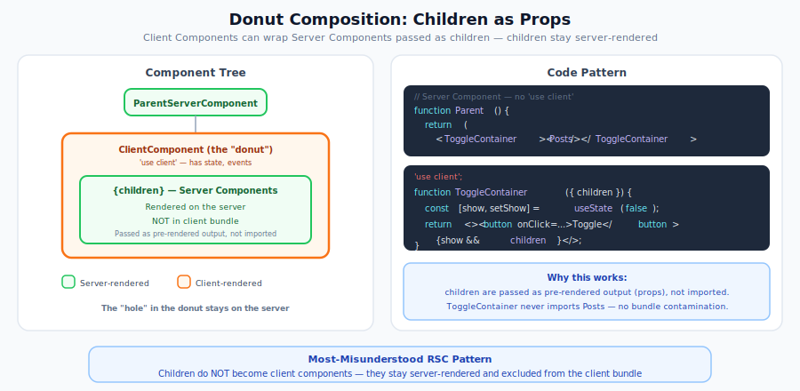

# Add Streaming and Interactivity to RSC Page

Before reading this document, please read the [Create React Server Component without SSR](./create-without-ssr.md) document.

## Add a Posts Component

Let's create a `Posts` React Server Component. It receives its `posts` from Rails as a prop and renders synchronously — the component doesn't fetch its own data (see the [React on Rails note](#where-the-data-comes-from) below).

For **progressive loading** — where slow data streams in while the rest of the page is already interactive — you need [async props](../../oss/migrating/rsc-data-fetching.md#async-props-stream-each-slow-prop-independently), which require SSR. That pattern is covered in [Server-Side Rendering](./server-side-rendering.md) and [Selective Hydration](./selective-hydration-in-streamed-components.md).

<p align="center">
  
</p>

```js
// app/javascript/components/Posts.jsx
import React from 'react';
import _ from 'lodash';
import moment from 'moment';

const Posts = ({ posts }) => {
  const postsByUser = _.groupBy(posts, 'user_id');
  const onePostPerUser = _.map(postsByUser, (group) => group[0]);

  return (
    <div>
      {onePostPerUser.map((post) => (
        <div style={{ border: '1px solid black', margin: '10px', padding: '10px' }}>
          <h1>{post.title}</h1>
          <p>{post.body}</p>
          <p>
            Created <span style={{ fontWeight: 'bold' }}>{moment(post.created_at).fromNow()}</span>
          </p>
          
        </div>
      ))}
    </div>
  );
};

export default Posts;
```

The `Posts` component displays a list of posts it receives as a prop, showing one post per user with title, body, timestamp and thumbnail image.

Let's add the Posts component to the React Server Component Page, forwarding the `posts` prop down to it.

```js
// app/javascript/packs/components/ReactServerComponentPage.jsx
import React, { Suspense } from 'react';
import ReactServerComponent from '../../components/ReactServerComponent';
import Posts from '../../components/Posts';

const ReactServerComponentPage = ({ posts }) => {
  return (
    <div>
      <ReactServerComponent />
      <Suspense fallback={<div>Loading...</div>}>
        <Posts posts={posts} />
      </Suspense>
    </div>
  );
};

export default ReactServerComponentPage;
```

The `Suspense` component is used to wrap the Posts component to handle its loading state. The `fallback` prop is used to display a loading message while the Posts component is loading.

### Where the data comes from {#where-the-data-comes-from}

Rails prepares the `posts` data and passes it into the page as a prop. Update the view from the previous tutorial to pass the data:

```erb
<%# app/views/pages/react_server_component_without_ssr.html.erb %>
<%# Scope the query — in the no-SSR flow these props are serialized into the
    RSC payload request URL, so avoid passing an unbounded table. %>
<%= react_component("ReactServerComponentPage",
      prerender: false,
      props: { posts: Post.order(created_at: :desc).limit(20)
                          .as_json(only: [:id, :title, :body, :user_id, :created_at]) }) %>
```

> **React on Rails note:** In React on Rails, Rails is the backend. The component receives `posts` as a prop instead of calling `fetch('/api/posts')` itself — an in-component fetch bypasses Rails' authorization and caching, and the Node renderer has no `fetch` global by default. When the **data** itself is slow to load, stream each prop as it resolves with [async props](../../oss/migrating/rsc-data-fetching.md#async-props-stream-each-slow-prop-independently) (covered after you [add SSR](./server-side-rendering.md)). See [RSC Data Fetching Patterns](../../oss/migrating/rsc-data-fetching.md). In a larger app you'd typically prepare this query in the controller (`@posts = Post.order(created_at: :desc).limit(20)`) and pass `@posts`; it's inline here to keep the tutorial in one file.

## Run the Development Server

Run the development server:

```bash
bin/dev
```

Navigate to the React Server Component Page:

```text
http://localhost:3000/react_server_component_without_ssr
```

When you open the page, you'll see both the React Server Component and the Posts component render with the data passed from Rails.

## How the Page Loads

The page loads through the `rsc_payload/ReactServerComponentPage` fetch request that React on Rails Pro initiates. In this synchronous example, all data is available immediately so the entire page renders at once.

For **progressive data streaming** — where slow data sources resolve independently via `<Suspense>` boundaries — you need [async props](../../oss/migrating/rsc-data-fetching.md#async-props-stream-each-slow-prop-independently). With async props:

1. Rails sends fast props immediately and streams each slow prop as it resolves
2. The component awaits each prop via `getReactOnRailsAsyncProp()`
3. React shows the `<Suspense>` fallback until the data arrives, then swaps in the real content

Async props require SSR, which is covered in [Server-Side Rendering](./server-side-rendering.md). See [RSC Data Fetching Patterns](../../oss/migrating/rsc-data-fetching.md) for the full pattern.

## Add Interactivity

Let's add interactivity to the Posts component. Only client components can be interactive, so we'll create a new client component that helps us to show or hide the post image and call it `ToggleContainer`. It can receive any component as a child and toggle the visibility of the child component.

```js
// app/javascript/components/ToggleContainer.jsx
'use client';

import React, { useState } from 'react';

const ToggleContainer = ({ children }) => {
  const [isVisible, setIsVisible] = useState(false);

  return (
    <div>
      <button onClick={() => setIsVisible((prev) => !prev)}>Toggle</button>
      {isVisible && children}
    </div>
  );
};

export default ToggleContainer;
```

Now, let's use the `ToggleContainer` component to wrap the post image.

```js
// app/javascript/components/Posts.jsx
import ToggleContainer from './ToggleContainer';

const Posts = ({ posts }) => {
  // existing code..

  return (
    <div>
      {onePostPerUser.map((post) => (
        <div>
          {/* existing code.. */}
          <ToggleContainer>
            
          </ToggleContainer>
        </div>
      ))}
    </div>
  );
};

export default Posts;
```

Now when you visit the page, you'll see a "Toggle" button for each post. Clicking the button will show/hide that post's image. This demonstrates how we can add client-side interactivity to a React Server Component by creating a client component (`ToggleContainer`) that manages its own state.

The `ToggleContainer` is marked with [`'use client'`](https://react.dev/reference/rsc/use-client) directive, indicating it runs on the client-side and can handle user interactions. It uses the `useState` hook to maintain the visibility state of its children. Meanwhile, the parent `Posts` component remains a server component, rendering the Rails-provided posts data on the server.

It's important to note that while client components (like `ToggleContainer`) cannot directly import server components, they can receive server components as props (like children in this case). This is why we can pass the server-rendered image element as a child to our client-side `ToggleContainer` component. This pattern allows for flexible composition while maintaining the boundaries between server and client code.

<p align="center">
  
</p>

This pattern allows us to optimize performance by keeping most of the component logic on the server while selectively adding interactivity where needed on the client.

## Checking The Network Requests

Let's check what bundles are being loaded for this page. By opening the browser's developer tools and going to the "Network" tab, you can see JavaScript bundles being loaded for this page.


Looking at the network requests, you'll notice two key JavaScript bundles:

1. The original `ReactServerComponentPage.js` bundle (1.4KB) - This contains the core server component code.
2. A new `client25.js` (can be different for you) bundle - This contains the client-side interactive code, specifically the `ToggleContainer` component and React hooks like `useState`.

The browser automatically knows to load this additional client bundle because of how React Server Components work:

1. When the server renders the RSC tree, it includes references to any client components used (in this case, `ToggleContainer`).
2. These references point to the specific JavaScript chunks needed to hydrate those client components.
3. The React runtime on the client then ensures those chunks are loaded before hydrating the interactive parts of the page.

This demonstrates one of the key benefits of React Server Components - automatic code splitting and loading of just the client-side JavaScript needed for interactivity, while keeping the bulk of the application logic on the server.

For more details on this architecture, see React's [Server Components documentation](https://react.dev/learn/thinking-in-react#how-react-server-components-work).

## Next Steps

Now that you understand how to add streaming and interactivity to React Server Components, you can proceed to the next article: [SSR React Server Components](./server-side-rendering.md) to learn how to enable server-side rendering (SSR) for your React Server Components.
