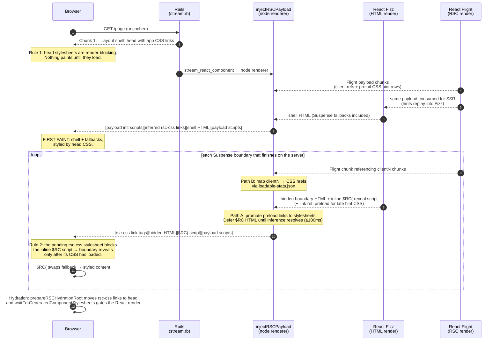
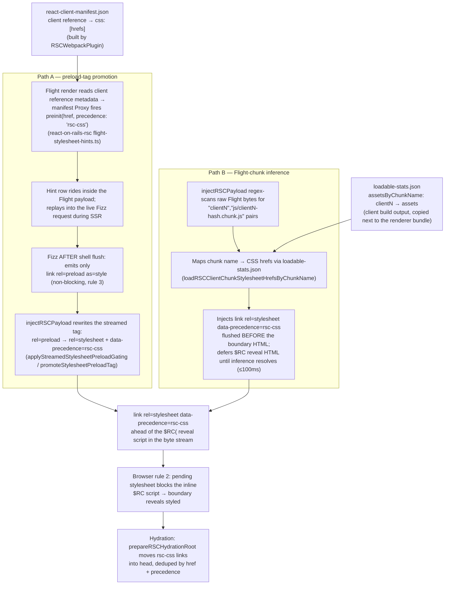
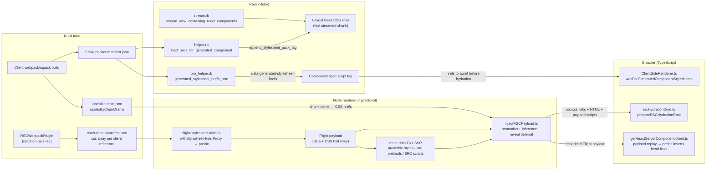

# CSS and Styling with React Server Components

This guide documents how CSS works across Server Components, Client Components, and traditional SSR in
React on Rails Pro. It covers the three-bundle CSS architecture, the FOUC prevention pipeline, and
per-approach setup guidance for every major CSS strategy.

## Quick reference

| Approach                                                      | Server Component                           | Client Component (RSC)      | Traditional SSR      | FOUC prevention          |
| ------------------------------------------------------------- | ------------------------------------------ | --------------------------- | -------------------- | ------------------------ |
| [Global CSS](#global-css)                                     | Use class names; CSS loads from layout     | Works                       | Works                | Rails layout `<link>`    |
| [CSS Modules](#css-modules)                                   | `exportOnlyLocals` renders class names     | Full extraction + chunk CSS | Full extraction      | RSC client-chunk links   |
| [SCSS Modules](#sassscss)                                     | Same as CSS Modules                        | Same as CSS Modules         | Same as CSS Modules  | RSC client-chunk links   |
| [Tailwind CSS](#tailwind-css)                                 | Use utility classes; CSS loads from layout | Use utility classes         | Use utility classes  | Rails layout `<link>`    |
| [Inline styles](#inline-styles)                               | Works (serialized in RSC payload)          | Works                       | Works                | N/A (no external CSS)    |
| [Vanilla Extract](#vanilla-extract)                           | Needs client-boundary wrapper              | Works with build plugin     | Works                | RSC client-chunk links   |
| [styled-components](#styled-components)                       | Not supported                              | Works behind `'use client'` | Works with SSR setup | None (runtime injection) |
| [Emotion](#emotion)                                           | Not supported                              | Works behind `'use client'` | Works with SSR setup | None (runtime injection) |
| [Other static extraction](#other-static-extraction-libraries) | Expected to work via layout CSS            | Expected to work            | Expected to work     | Depends on setup         |

Status: entries marked with specific verification notes below. See the [full compatibility matrix](#compatibility-matrix) for details.

Note: for extracted-CSS client-boundary approaches such as CSS Modules, SCSS Modules, and Vanilla
Extract, the `rsc-css` path reliably protects CSS known before the first flush. For late Suspense
reveals on stock Shakapacker production builds, see
[Late-boundary caveat for 17.0.0](#late-boundary-caveat-for-1700) and
[Known limitations](#known-limitations).

## How CSS reaches the browser

This section explains the whole system from first principles, assuming you know the traditional SSR
model but have never looked inside RSC streaming. It is grounded in the actual implementation
(file and function references are given so you can verify against the source).

### Three browser rules everything is built on

The entire FOUC story — in both traditional SSR and streamed RSC — reduces to three rules of
browser behavior:

1. **A parser-created `<link rel="stylesheet">` in `<head>` is render-blocking.** The browser
   paints nothing until every head stylesheet has loaded. This is why traditional SSR has no FOUC:
   put all the CSS in `<head>`, and the first paint is styled by construction.
2. **A stylesheet link in the `<body>` does not block paint of content parsed before it — but
   while it is loading, the browser will not execute any later parser-inserted `<script>`**
   (the HTML spec's "a style sheet that is blocking scripts" rule). Chromium additionally delays
   painting content that appears _after_ an in-body stylesheet link.
3. **`<link rel="preload" as="style">` only downloads.** A preload never applies styles and never
   blocks anything.

Rule 1 protects the initial shell. Rule 2 is the load-bearing mechanism for everything streamed
after the shell: React on Rails Pro's streamed-CSS gating works by placing a real stylesheet
`<link>` in the byte stream _before_ React's inline reveal script, so the reveal script cannot run
until the CSS has loaded. It is a browser-spec mechanism, not a React feature.

### What is in `<head>` at first paint

The Rails layout owns `<head>`. The node renderer (the process that streams React HTML) never
writes into it. The head CSS set at first paint is:

- **Layout stylesheet tags** — whatever `stylesheet_pack_tag` links your layout declares (global
  CSS, Tailwind, design tokens).
- **Auto-appended generated component packs** — for every `stream_react_component` /
  `react_component` call with `auto_load_bundle`, React on Rails calls
  `append_stylesheet_pack_tag("generated/<ComponentName>")`
  (`react_on_rails/lib/react_on_rails/helper.rb`, `load_pack_for_generated_component`), and the
  layout's argless `<%= stylesheet_pack_tag %>` renders those links in `<head>`. This is the CSS
  extracted for each component's _entry_ chunk — the synchronously imported client CSS of each
  streamed root.

Rails renders the entire layout (head included) as the **first streamed chunk**
(`react_on_rails_pro/lib/react_on_rails_pro/concerns/stream.rb`,
`stream_view_containing_react_components`). By rule 1, that head CSS — and only that CSS — blocks
first paint.

What is deliberately **not** in `<head>` at first paint: CSS for code-split client components
deeper in the RSC tree (the `clientN` chunks). Putting the whole page's CSS in `<head>` would make
first paint wait for below-the-fold styling — the exact tradeoff streaming exists to avoid. That
late CSS is delivered mid-stream instead, which is what the rest of this section is about.

### What blocks first paint — and what does not

| Blocks first paint                                            | Does NOT block first paint                                               |
| ------------------------------------------------------------- | ------------------------------------------------------------------------ |
| `<head>` stylesheet links (layout + appended generated packs) | `rsc-css` stylesheet links streamed into the body for later boundaries\* |
| Synchronous head scripts (standard browser behavior)          | RSC payload `<script>` tags (inline data pushes)                         |
| —                                                             | `defer`/`async` JavaScript bundles                                       |
| —                                                             | The Flight (RSC payload) stream itself                                   |
| —                                                             | Suspense boundary content still streaming (fallbacks paint first)        |

\* One qualification: when Flight data arrives before the first HTML flush, the streaming pipeline
writes inferred `rsc-css` links **ahead of the shell markup** in the first component chunk (flush
order is payload-init scripts → stylesheet links → HTML). Because Chromium delays painting content
that follows an in-body pending stylesheet, those early links can delay the first visible paint of
the shell/fallbacks until that CSS loads. This is the intended trade — that CSS belongs to client
components rendered in the shell itself, so painting the shell before it would be a FOUC — but it
means "does not block first paint" is guaranteed only for links emitted after the shell chunk.

### Timeline of a streamed RSC response



Key point for readers coming from SSR: the reveal of each streamed boundary is **not** gated by
React knowing about CSS. React's own CSS-aware reveal path (`$RR` / `completeBoundaryWithStyles`)
only engages for `<link precedence="...">` elements rendered _inside_ a boundary, which the
framework's automatic pipeline never does. The gate is byte ordering plus browser rule 2.

### Where the late CSS comes from: two paths, one bucket

CSS for a `'use client'` component inside the RSC tree is known to the framework in two independent
ways, and both converge on the same `data-precedence="rsc-css"` link format:



Why two paths exist:

- **Path A alone is racy.** It can only promote a preload tag that Fizz already wrote, which
  requires the Flight hint to have replayed into the Fizz request before that HTML flushed. If the
  Flight stream lags the HTML stream, the boundary's `$RC` script can flush with no preceding link.
- **Path B closes the race** by deriving CSS directly from the same Flight bytes the transform is
  embedding into the page, and by holding back the reveal HTML until the inference has had a chance
  to emit links — with a **100ms fail-open timeout** (`RSC_CLIENT_STYLESHEET_INFERENCE_TIMEOUT_MS`
  in `injectRSCPayload.ts`). Fail-open means: if Flight data lags more than 100ms behind a reveal,
  the reveal flushes ungated. A brief FOUC under heavy server delay is a designed-in tail risk, not
  a bug in your app.
- **Both paths routinely fire for the same stylesheet.** Path B's dedup set is not consulted by
  Path A, so the stream can carry two `rsc-css` links for one href. This is benign — one network
  fetch (HTTP cache), and the hydration fixup dedupes by href + precedence — but you may notice it
  when reading page source.

#### Late-boundary caveat for 17.0.0

On stock Shakapacker production builds, late-revealed boundaries are the primary silent-no-op
case. Numeric chunk ids disable Path B, and id-named extracted CSS disables Path A's old
`css/clientN-*.css` filename fallback. In that default production posture, a boundary that resolves
after the first flush can still end up with only the preload head start unless manifest-backed
preload promotion lands before the reveal, so a cold-cache FOUC is still possible. Compatible or
custom asset naming that keeps Preload Promotion or Flight-Chunk Inference active can still gate
those late reveals. See
[When the FOUC pipeline silently does nothing](#when-the-fouc-pipeline-silently-does-nothing) for
the full matrix.

> [!NOTE]
> RSC CSS collection is request driven — only the client references actually rendered by a request
> emit stylesheet hints, not every client reference in the manifest. The emitted CSS can still be
> broader than a single component when a rendered client reference's chunk contains shared, vendor,
> or page-specific global CSS. Keep client boundaries thin so the references rendered by a page do
> not drag unrelated CSS into the render-blocking `rsc-css` group.

> [!CAUTION]
> These stylesheet links are render-blocking for the streamed content that follows them. Broad
> `'use client'` entry points that import page-specific global CSS can make unrelated RSC pages wait
> on that CSS even when they do not visually need it. Prefer thin client wrappers, CSS Modules,
> Tailwind utilities, or layout-level global CSS for styles that are truly shared across pages.
>
> Contaminated global CSS can also win source-order ties because the `rsc-css` links end up after
> earlier Rails layout styles in `<head>`. Avoid bare element selectors in component stylesheets; if
> app globals must override framework CSS, make that specificity explicit in the app's global
> stylesheet.

### Module map: everything that touches CSS during RSC streaming



Data handoffs to know by name:

| Data                                    | Producer                                                  | Consumer                                                   |
| --------------------------------------- | --------------------------------------------------------- | ---------------------------------------------------------- |
| `css` arrays in the RSC client manifest | `RSCWebpackPlugin` (react-on-rails-rsc)                   | `withStylesheetHints` Proxy → `preinit` hint rows          |
| `loadable-stats.json`                   | Client build (must be copied next to the renderer bundle) | `injectRSCPayload` chunk-name → CSS map (Path B)           |
| `data-precedence="rsc-css"` links       | `injectRSCPayload` (both paths)                           | Browser rule 2 gating; `prepareRSCHydrationRoot` head move |
| `data-generated-stylesheet-hrefs`       | `pro_helper.rb` (requires `auto_load_bundle`)             | `waitForGeneratedComponentStylesheets` pre-hydration wait  |
| Embedded Flight payload scripts         | `injectRSCPayload`                                        | `getReactServerComponent.client.ts` hydration replay       |

### What makes a streamed component wait for its own CSS

To answer it in one place, because it is the most commonly misunderstood part:

1. `injectRSCPayload` guarantees a parser-created `<link rel="stylesheet" data-precedence="rsc-css">`
   appears in the byte stream **before** the boundary's inline `$RC(` reveal script (via Path A
   promotion in place, and/or Path B injection plus reveal deferral).
2. Browser rule 2 does the rest: the pending stylesheet blocks execution of the inline script, so
   the hidden boundary HTML is not swapped in until the CSS has loaded.
3. After the swap, at hydration time, `prepareRSCHydrationRoot` moves those links into `<head>`
   (so React's hydration does not see unexpected nodes in the component container), and
   `waitForGeneratedComponentStylesheets` additionally waits (up to 10s) for the component's
   generated-pack stylesheets before the React render begins — this protects the client-render
   path (`prerender: false`), where React would otherwise insert DOM before head CSS finished
   loading.

React's own commit-blocking for precedence stylesheets applies only on the browser-side payload
replay path (client-inserted styles during hydration/navigation), not to the server-streamed reveal.

### When the FOUC pipeline silently does nothing

Each of these conditions disables part or all of the streamed-CSS gating **without any error**.
The page still works — CSS eventually arrives via the browser-side payload replay after hydration —
but the streamed reveal is no longer gated, so a styled-late flash becomes possible. Two of these
conditions are not edge cases but the **production defaults verified in the dummy app** (numeric
chunk ids from `chunkIds: 'deterministic'`, and id-named extracted CSS like
`css/[id]-[hash].css`) — verified against a production dummy build on 2026-07-09, where the
streamed reveal was confirmed ungated under both bundlers:

| Condition                                                                                          | What is disabled                                                                             |
| -------------------------------------------------------------------------------------------------- | -------------------------------------------------------------------------------------------- |
| `loadable-stats.json` missing/unreadable next to the renderer bundle (retries 100ms → 30s backoff) | Path B entirely, including reveal deferral; Path A still runs                                |
| Chunk names not matching `client<N>` (custom `chunkName` option, or numeric webpack `chunkIds`)    | Path B (Flight regex never matches); Path A then depends on manifest-backed preload matching |
| CSS output filenames not matching `css/clientN-*.css`                                              | Path A's `clientN` filename fallback (manifest-listed preloads can still promote)            |
| Flight data lagging a reveal by more than 100ms                                                    | Reveal deferral for that flush (fail-open by design)                                         |
| Rspack builds omitting CSS assets from the stats consumed by `injectRSCPayload`                    | Path B (empty chunk→CSS map) — see Known limitations                                         |
| `auto_load_bundle` off (or non-Pro)                                                                | `data-generated-stylesheet-hrefs` + the pre-hydration stylesheet wait                        |
| React configured with the external Fizz runtime (no inline `$RC(` scripts)                         | Reveal-split detection — deferral silently never fires                                       |

If you are debugging a flicker, check these in order; the first two are by far the most common.

### Coupling to React internals (what breaks where)

The streamed-CSS gating reads React's Fizz output as text. These are the assumptions, all in
`packages/react-on-rails-pro/src/injectRSCPayload.ts` unless noted:

- **`$RC(` reveal-script literal** (`REACT_SUSPENSE_REVEAL_SCRIPT`) — assumes Fizz inlines a
  completion script calling `$RC("...")`. The reveal implementation already changed shape within
  React 19 (19.2 batches reveals through `$RB`/`$RV`), but the literal survived. React's external
  Fizz runtime option would remove inline scripts entirely and silently disable reveal deferral.
- **Hidden boundary markup** (`findReactSuspenseRevealSplitIndex`) — assumes completed segments
  arrive as `<div hidden id="...">`. Non-`div` segment containers (table contexts) fall back to
  splitting at the script tag — degraded, not broken.
- **Flight wire format** (`RSC_CLIENT_CHUNK_NAME_WITH_JS_ASSET`) — assumes client-reference
  metadata serializes as adjacent `"clientN","js/clientN-<hash>.chunk.js"` string pairs in the
  payload text. This is React's internal wire protocol plus the bundler's naming convention.
- **`destination.flush()` signal** — an internal Fizz convention used for chunk timing; a
  `setTimeout(0)` fallback means failure degrades to coarser chunking, not breakage.
- **`data-precedence` attribute mechanics** — the precedence _feature_ is documented React 19 API;
  the attribute name and hydration adoption mechanics are implementation details, matched in
  `rscDomMarkers.ts` / `rscHydrationDom.ts`.

Re-verify these against Fizz output on every React upgrade, including minors.

### What this means for different CSS approaches

- **Build-time CSS** (CSS Modules, SCSS, Tailwind, Vanilla Extract) is extracted into files by
  the client bundle. If the import is behind `'use client'`, the extracted CSS file appears in
  `react-client-manifest.json` and gets FOUC prevention. If the import is in a global/layout pack,
  FOUC prevention comes from the Rails layout `<link>` tag.

- **Runtime CSS-in-JS** (styled-components, Emotion) injects CSS via `<style>` tags at runtime.
  Their CSS is **not** in extracted files and **not** in `react-client-manifest.json`. There is no
  FOUC prevention from the manifest pipeline for these approaches.

- **Inline styles** (`style` prop) are serialized directly in the HTML or RSC payload. No external
  CSS file is needed, so FOUC is not a concern.

## Three-bundle CSS architecture

React on Rails Pro builds three webpack/Rspack graphs for an RSC app. Each handles CSS differently:

| Bundle           | Runtime          | CSS handling                                                                                                                                                                                          |
| ---------------- | ---------------- | ----------------------------------------------------------------------------------------------------------------------------------------------------------------------------------------------------- |
| **Client**       | Browser          | CSS is extracted by `MiniCssExtractPlugin` (webpack) or Rspack's built-in CSS extraction. The RSC manifest plugin records CSS files for each `'use client'` module.                                   |
| **Server** (SSR) | Node renderer VM | CSS extraction is disabled. CSS Modules use `exportOnlyLocals: true` in `css-loader`, which emits only the class-name-to-hash mapping without any CSS output. Plain CSS imports become empty modules. |
| **RSC**          | Node renderer VM | Same CSS handling as the server bundle, plus the RSC loader transforms `'use client'` modules into client references. No browser CSS is extracted.                                                    |

The key insight: **only the client bundle produces browser-loadable CSS**. The server and RSC bundles
need just enough CSS processing to render correct class names during SSR, but they never emit
stylesheets.

> [!NOTE] > `sass-loader` and `postcss-loader` still run in the server and RSC bundles because `css-loader`
> needs valid CSS input to parse class names from CSS Modules. This means SCSS compilation and
> PostCSS processing (including Tailwind) run in all three builds, but only the client build
> produces CSS output.

## Where to import CSS

### Server Components

Server Components render in the RSC bundle, which does not extract CSS. Importing a CSS file only from
a Server Component does not produce a browser stylesheet.

**Recommended pattern:** Use class names from a globally loaded stylesheet (Tailwind utilities, global
CSS, or design tokens imported in the client pack):

```tsx
// app/javascript/components/ProductSummary.tsx (Server Component)
type Product = { name: string; description: string };

export default function ProductSummary({ product }: { product: Product }) {
  return (
    <article className="product-summary">
      <h2>{product.name}</h2>
      <p>{product.description}</p>
    </article>
  );
}
```

```css
/* app/javascript/styles/application.css — imported by client-bundle.ts */
.product-summary {
  display: grid;
  gap: 0.5rem;
}
```

The class name is server-rendered by the RSC component. The CSS loads from the Rails layout's
`stylesheet_pack_tag`.

**CSS Modules in Server Components** are a special case. The server and RSC bundles process CSS Modules
with `exportOnlyLocals`, which means the `import styles from './Foo.module.css'` statement works and
returns the class name mapping. The server renders the hashed class names. However, the actual CSS rules
are only extracted by the client bundle, so the component's CSS file must also be imported somewhere
in the client graph (typically by a `'use client'` component that uses the same module, or by
including it in the global stylesheet).

### Client Components inside an RSC tree

Put CSS imports behind the `'use client'` boundary. This keeps the CSS in the client graph, where it is
extracted into a file and recorded in the RSC manifest:

```tsx
// app/javascript/components/FavoriteButton.tsx
'use client';

import styles from './FavoriteButton.module.scss';

export default function FavoriteButton({ active }: { active: boolean }) {
  return (
    <button className={active ? styles.activeButton : styles.button} type="button">
      Favorite
    </button>
  );
}
```

```tsx
// app/javascript/components/ProductPage.tsx (Server Component)
import FavoriteButton from './FavoriteButton';

export default async function ProductPage({ product }: { product: Product }) {
  return (
    <section>
      <h1>{product.name}</h1>
      <FavoriteButton active={product.favorite} />
    </section>
  );
}
```

The RSC bundle turns `FavoriteButton` into a client reference. The client build extracts the SCSS
Module CSS, the RSC manifest records the CSS href, and the RSC stream injects `<link>` tags.

### Shared components

A module can be imported as a Server Component in one path and as part of the client graph in another.
React's `'use client'` directive marks a module dependency subtree, not a render-tree subtree.

Guidelines:

- Use global classes from a layout-loaded stylesheet when the component renders as a Server Component.
- Import CSS Modules from a `'use client'` wrapper when the component needs scoped styles and renders
  as a Client Component.
- Avoid CSS side effects in shared utility modules. They make it unclear whether CSS is emitted by the
  client bundle, ignored by the server/RSC bundle, or duplicated across packs.

## CSS approaches in detail

### Global CSS

Import global CSS from the client pack entry point. The stylesheet loads from the Rails layout
regardless of rendering mode.

```ts
// app/javascript/packs/client-bundle.ts
import '../styles/application.css';
```

```erb
<%= stylesheet_pack_tag "client-bundle", media: "all" %>
```

**Server Components:** Use class names freely. CSS loads from the layout.
**Client Components:** Works. CSS is part of the client bundle.
**Traditional SSR:** Works when `stylesheet_pack_tag` is in `<head>`.
**Limitations:** Not component-scoped. Ordering depends on import order and layout tag placement.
**Status:** Verified.

### CSS Modules

CSS Modules provide component-scoped class names with build-time hashing. They are the recommended
approach for scoped styling in React on Rails Pro RSC apps.

```tsx
// app/javascript/components/Card.tsx
'use client';

import styles from './Card.module.css';

export default function Card({ title }: { title: string }) {
  return <div className={styles.card}>{title}</div>;
}
```

```css
/* app/javascript/components/Card.module.css */
.card {
  padding: 1rem;
  border: 1px solid #e5e7eb;
  border-radius: 0.5rem;
}
```

**How it works across bundles:**

- **Client bundle:** `css-loader` processes the `.module.css` file with CSS Modules mode, generating
  hashed class names (e.g., `.card` becomes `.K8av1vsiP9K1YYs501EV`). `MiniCssExtractPlugin` extracts
  the CSS rules into the output stylesheet. The JavaScript module exports the mapping
  `{ card: 'K8av1vsiP9K1YYs501EV' }`.

- **Server bundle:** `css-loader` runs with `exportOnlyLocals: true`. It generates the same class name
  mapping but emits no CSS output. SSR renders the correct hashed class names in the HTML.

- **RSC bundle:** Same as the server bundle for Server Component imports. For `'use client'` modules,
  the RSC loader replaces the module with a client reference, so the CSS Module import is not
  evaluated in the RSC bundle.

**Server Components:** Can import CSS Modules and render hashed class names. The CSS rules must also be
available in the client bundle (via a `'use client'` component or global import).
**Client Components:** Full support. CSS is extracted and recorded in the RSC manifest.
**Traditional SSR:** Full support. Server renders class names; client stylesheet provides CSS.
**FOUC prevention:** Yes before the first flush via manifest `<link>` tags when behind `'use client'`.
For late reveals on stock Shakapacker production builds, see
[Late-boundary caveat for 17.0.0](#late-boundary-caveat-for-1700).
**Status:** Verified by Pro dummy app specs.

### Sass/SCSS

SCSS Modules work identically to CSS Modules. `sass-loader` compiles SCSS to CSS before `css-loader`
processes it. The same `exportOnlyLocals` behavior applies in server/RSC bundles.

```tsx
// app/javascript/components/FavoriteButton.tsx
'use client';

import styles from './FavoriteButton.module.scss';

export default function FavoriteButton({ active }: { active: boolean }) {
  return (
    <button className={active ? styles.activeButton : styles.button} type="button">
      Favorite
    </button>
  );
}
```

**Required packages:** `sass`, `sass-loader`, configured via Shakapacker's default rules.
**FOUC prevention:** Same as CSS Modules: before the first flush via manifest `<link>` tags, with
the same late-boundary caveat on stock Shakapacker production builds. See
[Late-boundary caveat for 17.0.0](#late-boundary-caveat-for-1700).
**Status:** Verified for SCSS Modules in RSC client boundary.

Plain (non-module) SCSS files follow the same rules as plain CSS: import from the client pack for
global styles, or from a `'use client'` component for scoped usage.

### Tailwind CSS

Tailwind CSS is a PostCSS plugin that generates utility CSS at build time. It scans source files for
class names and emits only the CSS needed. Since it produces static CSS, it works seamlessly with the
three-bundle architecture.

**How Tailwind works with RSC:**

1. Tailwind/PostCSS follows each bundle's CSS loader pipeline when CSS imports are processed, but
   only the client bundle emits browser-loadable CSS.
2. Tailwind scans configured source roots for utility class names. Tailwind v4 uses CSS `@source`
   directives; Tailwind v3 uses the `content` array.
3. The generated CSS is delivered through a layout-owned client pack.
4. Server Components and Client Components both use Tailwind class names as plain strings.
5. The CSS loads according to the Rails layout's Shakapacker pack tags.

**Critical configuration:** Tailwind must scan every directory that contains utility class names,
including React component files and ERB views. Tailwind v4 configures those roots from CSS
`@source` directives; Tailwind v3 uses the `content` array.

#### Tailwind CSS v4 (new apps)

The React on Rails generator supports Tailwind v4 via `--tailwind`. Tailwind v4 uses a CSS-first
configuration model:

<!-- prettier-ignore -->
```css
/* app/javascript/stylesheets/application.css */
@import "tailwindcss" source("../..");
```

```js
// app/javascript/packs/react_on_rails_tailwind.js
import '../stylesheets/application.css';
```

The generated React on Rails layout declares that pack from the layout:

```erb
<% prepend_javascript_pack_tag "react_on_rails_tailwind" %>
<%= stylesheet_pack_tag "react_on_rails_tailwind", media: "all" %>
<%= javascript_pack_tag %>
```

Tailwind v4 uses CSS-level source discovery. The generated stylesheet points at the Rails `app/`
directory by default so Tailwind scans app source without scanning the whole repository, build
output, logs, or runtime directories. If your components live outside that source tree, add
additional Tailwind `@source` lines to the stylesheet.

#### Tailwind CSS v3 (existing apps)

Tailwind v3 requires explicit `content` paths. **Include both Rails views and JavaScript component
directories:**

```js
// config/tailwind.config.js
module.exports = {
  content: ['./app/views/**/*.{erb,haml,slim}', './app/javascript/**/*.{js,jsx,ts,tsx}'],
  theme: {
    extend: {},
  },
  plugins: [],
};
```

> [!WARNING]
> If the `content` array does not include your React component directory, Tailwind will silently
> drop any utility classes used only in React components. The classes will appear in source code
> but have no effect — there will be no build error, just unstyled elements.

**Server Components:** Use Tailwind class names freely. CSS loads from the layout.
**Client Components:** Use Tailwind class names freely. CSS loads from the layout.
**Traditional SSR:** Works when the Tailwind stylesheet is in `<head>`.
**FOUC prevention:** Via Rails layout `<link>` tag (global CSS path).
**Limitations:** Dynamic class names (template literals, string concatenation) must be statically
discoverable by Tailwind's scanner or explicitly safelisted.
**Status:** Verified by build analysis; dummy app uses Tailwind v3 globally.

### Inline styles

React inline styles (`style` prop) work everywhere because they are serialized directly in the HTML
or RSC payload. No external CSS file is needed.

```tsx
// Works in Server Components, Client Components, and SSR
export default function Badge({ color }: { color: string }) {
  return (
    <span style={{ backgroundColor: color, padding: '0.25rem 0.5rem', borderRadius: '0.25rem' }}>New</span>
  );
}
```

**Server Components:** Works. Style objects are serialized in the RSC Flight payload.
**Client Components:** Works.
**Traditional SSR:** Works.
**FOUC prevention:** Not needed — styles are inline in the HTML.
**Limitations:** No pseudo-classes, media queries, or keyframe animations. Not ideal for complex
styling. Can increase HTML payload size.
**Status:** Verified by build analysis.

### Vanilla Extract

[Vanilla Extract](https://vanilla-extract.style/) compiles TypeScript style definitions to static CSS
at build time. Since it produces extracted CSS files, it integrates with the RSC manifest pipeline.

**Setup:** Add the Vanilla Extract webpack plugin to your client webpack config. Do not add it to the
server or RSC configs — those bundles should not extract CSS.

```js
// config/webpack/clientWebpackConfig.js (append to existing configureClient)
const { VanillaExtractPlugin } = require('@vanilla-extract/webpack-plugin');
const MiniCssExtractPlugin = require('mini-css-extract-plugin');

const vanillaExtractCssRule = {
  test: /\.vanilla\.css$/i,
  use: [MiniCssExtractPlugin.loader, { loader: require.resolve('css-loader'), options: { url: false } }],
};

// Exclude .vanilla.css from the broad CSS rule to avoid double processing
const excludeVanillaExtractCss = (rule) => {
  if (!rule || typeof rule !== 'object') return;
  if (Array.isArray(rule.oneOf)) rule.oneOf.forEach(excludeVanillaExtractCss);
  if (rule.test instanceof RegExp && rule.test.test('app.css')) {
    rule.exclude = [rule.exclude, /\.vanilla\.css$/i].flat().filter(Boolean);
  }
};

const applyVanillaExtract = (clientConfig) => {
  clientConfig.plugins.push(new VanillaExtractPlugin());
  clientConfig.module.rules.forEach(excludeVanillaExtractCss);
  clientConfig.module.rules.push(vanillaExtractCssRule);
};
```

**Usage pattern:** Keep Vanilla Extract imports behind `'use client'` for RSC apps:

```ts
// app/javascript/components/productCard.css.ts
import { style } from '@vanilla-extract/css';

export const card = style({
  display: 'grid',
  gap: '0.75rem',
});
```

```tsx
// app/javascript/components/ProductCard.tsx
'use client';

import { card } from './productCard.css';

export default function ProductCard({ product }: { product: Product }) {
  return <article className={card}>{product.name}</article>;
}
```

The import specifier uses `productCard.css` (no `.ts`). Vanilla Extract's bundler plugin resolves the
authored `.css.ts` module and emits `.vanilla.css`. The broad CSS rule must exclude `.vanilla.css`
so the custom rule handles it.

**Server Components:** Importing `.css.ts` directly from a Server Component requires additional
server/RSC bundle configuration. Use the `'use client'` wrapper pattern instead.
**Client Components:** Works when the build plugin and CSS extraction rules are configured.
**FOUC prevention:** Yes before the first flush via manifest `<link>` tags when behind `'use client'`.
For late reveals on stock Shakapacker production builds, see
[Late-boundary caveat for 17.0.0](#late-boundary-caveat-for-1700).
**Limitations:** Not verified end-to-end with React on Rails Pro RSC. The `.css.ts` import may need
an `swc-plugin-vanilla-extract` workaround in some setups. Inspect your `react-client-manifest.json`
to confirm CSS appears.
**Status:** Assumed from build-tool behavior. Not covered by a Pro regression test.

### styled-components

styled-components is a runtime CSS-in-JS library. It generates CSS at runtime by injecting `<style>`
tags into the DOM. This means its CSS is **not** extracted into files and **not** recorded in
`react-client-manifest.json`.

```tsx
// app/javascript/components/StyledButton.tsx
'use client';

import styled from 'styled-components';

const Button = styled.button`
  background-color: peachpuff;
  padding: 0.5rem 1rem;
  border: none;
  border-radius: 0.25rem;
  cursor: pointer;
`;

export default function StyledButton() {
  return <Button>Click me</Button>;
}
```

> [!IMPORTANT]
> styled-components **must** be used behind a `'use client'` boundary. Using it in a Server Component
> will crash because it depends on React Context and `useRef`.

**Server Components:** Not supported. Will throw runtime errors.
**Client Components:** Works behind `'use client'`. styled-components v6 includes React 19
compatibility fixes.
**Traditional SSR:** Works with `ServerStyleSheet` for style extraction during SSR. Requires
app-specific integration with the node renderer.
**FOUC prevention:** None from the RSC manifest pipeline. Runtime-injected styles load after
JavaScript executes, which can cause a flash of unstyled content on RSC pages.
**Limitations:**

- Context-based theming (`ThemeProvider`) is not available in Server Components. Use CSS custom
  properties for cross-boundary theming.
- styled-components is in maintenance mode. The maintainer has stated: "For new projects, I would not
  recommend adopting styled-components."
- SSR style collection requires `ServerStyleSheet` wrapping, which is not built into React on Rails
  Pro's node renderer by default.
  **Status:** Unknown for React on Rails Pro RSC integration. Works in client-only usage.

### Emotion

Emotion is a runtime CSS-in-JS library similar to styled-components. The same architectural
constraints apply: runtime `<style>` injection, no extracted CSS chunk recording, no RSC FOUC prevention.

```tsx
// app/javascript/components/EmotionCard.tsx
'use client';

import styled from '@emotion/styled';

const Card = styled.div`
  background-color: powderblue;
  padding: 1rem;
  border-radius: 0.5rem;
`;

export default function EmotionCard() {
  return <Card>Emotion-styled card</Card>;
}
```

**Server Components:** Not supported. Emotion depends on React Context (`CacheProvider`).
**Client Components:** Works behind `'use client'`.
**Traditional SSR:** Works with Emotion's SSR cache/extraction setup (`@emotion/server`,
`extractCriticalToChunks`). Requires app-specific integration.
**FOUC prevention:** None from the RSC manifest pipeline.
**Status:** Unknown for RSC. Assumed to work for client-only usage.

### Other static extraction libraries

Libraries like [Linaria](https://linaria.dev/), [Panda CSS](https://panda-css.com/),
[StyleX](https://stylexjs.com/), and [Compiled](https://compiledcssinjs.com/) extract CSS at build
time, producing static CSS files that Shakapacker can serve.

**General principle:** If the library produces a CSS file that can be imported from a client pack or
a `'use client'` component, it will work with React on Rails Pro's RSC architecture. The CSS enters
the client bundle and is extracted normally.

**Setup pattern:**

1. Add the library's bundler plugin to your **client webpack/Rspack config only**.
2. Import the library's generated CSS from a `'use client'` component or the global stylesheet.
3. Verify the extracted CSS appears in `react-client-manifest.json` if using the `'use client'` path.
4. Do not add the library's plugin to the server or RSC bundle configs unless the library specifically
   requires it for class name resolution (check the library's RSC documentation).

**Status:** Assumed. None of these libraries are covered by React on Rails Pro regression tests.

### Class name utilities (clsx, classnames, CVA)

These libraries compose class name strings at runtime. They do not emit CSS themselves.

```tsx
import clsx from 'clsx';

export default function Alert({ type }: { type: 'info' | 'error' }) {
  return <div className={clsx('alert', `alert-${type}`)}>...</div>;
}
```

They work everywhere — Server Components, Client Components, SSR — because they are pure functions
that return strings. Pair them with a CSS approach that provides the actual class definitions
(Tailwind, CSS Modules, global CSS).

**Status:** Assumed; low risk.

## React on Rails asset rendering

### Manual pack loading

```erb
<%= stylesheet_pack_tag "client-bundle", media: "all" %>
<%= javascript_pack_tag "client-bundle", defer: true %>
```

### Auto-loaded component packs

With `auto_load_bundle: true`, use argless tag placeholders. React on Rails appends component pack
names during rendering:

```erb
<%= stylesheet_pack_tag media: "all" %>
<%= javascript_pack_tag defer: true %>
```

When using SSR with `auto_load_bundle`, render the body before the `<head>` so the component pack
names are available when the stylesheet tags are emitted:

```erb
<% content_for :body_content do %>
  <%= yield %>
<% end %>

<!DOCTYPE html>
<html>
  <head>
    <%= csrf_meta_tags %>
    <%= csp_meta_tag %>
    <%= stylesheet_pack_tag "client-bundle", media: "all" %>
    <%= stylesheet_pack_tag media: "all" %>
  </head>
  <body>
    <%= yield :body_content %>
    <%= javascript_pack_tag "client-bundle", defer: true %>
    <%= javascript_pack_tag defer: true %>
  </body>
</html>
```

### RSC pages

For pages rendered by `stream_react_component`, CSS for `'use client'` references is handled by the
streamed-CSS pipeline described in [How CSS reaches the browser](#how-css-reaches-the-browser).
Keep the Rails stylesheet tags anyway: they carry global CSS, the generated entry-pack CSS that
styles the shell at first paint, and CSS for non-RSC components.

## Verifying CSS in production builds

Development HMR can hide or introduce FOUC that does not exist in production. Always verify with
production-like builds:

```bash
RAILS_ENV=production NODE_ENV=production CLIENT_BUNDLE_ONLY=true bin/shakapacker
RAILS_ENV=production NODE_ENV=production SERVER_BUNDLE_ONLY=true bin/shakapacker
RAILS_ENV=production NODE_ENV=production RSC_BUNDLE_ONLY=true bin/shakapacker
```

Then inspect:

1. **`public/<public_output_path>/manifest.json`** — Shakapacker asset manifest. Check that your CSS
   files are listed.
2. **`public/<public_output_path>/react-client-manifest.json`** — RSC client manifest. Check that
   `'use client'` modules have `css` arrays pointing to the correct stylesheet files.
3. **Server-rendered HTML** — Look for `<link rel="stylesheet">` tags before the first styled
   component. For RSC pages, look for `<link rel="stylesheet" data-precedence="rsc-css">` tags.

## Compatibility matrix

Status key:

- **Verified**: covered by current repo code, docs, or build analysis.
- **Assumed**: expected from current architecture and package behavior, but not covered by a
  React on Rails Pro regression fixture.
- **Unsupported**: does not fit the current generated RSC/server CSS pipeline.
- **Unknown**: needs a fixture or package-specific investigation before recommendation.

| Approach                            | Server Component                               | Client Component (RSC)               | Traditional SSR                        | FOUC prevention                           | Required config                                            | Status              |
| ----------------------------------- | ---------------------------------------------- | ------------------------------------ | -------------------------------------- | ----------------------------------------- | ---------------------------------------------------------- | ------------------- |
| Global CSS (layout pack)            | Works (class names render; CSS loads globally) | Works                                | Works                                  | Rails `<link>`                            | Import CSS in client pack; `stylesheet_pack_tag` in layout | Verified            |
| CSS Modules (`'use client'`)        | `exportOnlyLocals` renders class names         | Works; CSS extracted and in manifest | Works; server renders locals           | Manifest `<link>` tags before first flush | Shakapacker CSS Modules config; RSC manifest plugin        | Verified            |
| CSS Modules (Server Component only) | Class names render but CSS is not emitted      | N/A                                  | Class names render but CSS not emitted | None                                      | Move CSS to client graph                                   | Unsupported         |
| SCSS Modules (`'use client'`)       | Same as CSS Modules                            | Same as CSS Modules                  | Same as CSS Modules                    | Manifest `<link>` tags before first flush | `sass`, `sass-loader`                                      | Verified            |
| Tailwind CSS                        | Works (utility class names)                    | Works (utility class names)          | Works                                  | Rails `<link>`                            | PostCSS config; content paths must include component dirs  | Verified (build)    |
| Inline styles                       | Works (serialized in RSC payload)              | Works                                | Works                                  | N/A                                       | None                                                       | Verified (build)    |
| `clsx`/`classnames`/CVA             | Works (pure string functions)                  | Works                                | Works                                  | N/A                                       | None; pair with a CSS source                               | Assumed             |
| Vanilla Extract                     | Needs `'use client'` wrapper                   | Works with build plugin              | Works                                  | Manifest `<link>` tags before first flush | `@vanilla-extract/webpack-plugin` in client config         | Assumed             |
| Linaria                             | Needs `'use client'` wrapper                   | Works after Babel/loader setup       | Works                                  | Depends on import path                    | WyW Babel preset; `@wyw-in-js/webpack-loader`              | Assumed             |
| Panda CSS                           | Works (classes are static strings)             | Works                                | Works                                  | Rails `<link>`                            | Panda CLI or PostCSS; import generated CSS in layout       | Assumed             |
| StyleX                              | Works (classes are static strings)             | Works                                | Works                                  | Rails `<link>`                            | StyleX Babel plugin; import generated CSS                  | Assumed             |
| Compiled                            | Needs `'use client'` wrapper                   | Works with webpack loader            | Works                                  | Depends on import path                    | `@compiled/webpack-loader`; CSS extraction                 | Assumed             |
| styled-components v6                | **Not supported** (crashes)                    | Works behind `'use client'`          | Works with `ServerStyleSheet`          | **None** (runtime injection)              | Recent v6; optional Babel/SWC plugin                       | Unknown for Pro RSC |
| Emotion                             | **Not supported** (crashes)                    | Works behind `'use client'`          | Works with SSR cache                   | **None** (runtime injection)              | `@emotion/react`, `@emotion/styled`; SSR setup             | Unknown for RSC     |
| Runtime component libraries         | Treat as Client Components                     | Works behind `'use client'`          | Depends on library SSR support         | **None** usually                          | Library-specific                                           | Unknown             |

## Common pitfalls

### Importing CSS only from a Server Component

```tsx
// WRONG: CSS is not emitted to the browser
import './ProductSummary.css'; // only imported here, a Server Component

export default function ProductSummary() {
  return <div className="product-summary">...</div>;
}
```

The server renders `<div class="product-summary">`, but no stylesheet is loaded. The element appears
unstyled. Move the CSS import to the client pack or a `'use client'` component.

### Missing component directories in Tailwind content paths

If Tailwind classes work in ERB views but not in React components, check that the component directory
is in Tailwind's `content` array. Tailwind v3 does not scan files outside its configured paths.

### Using runtime CSS-in-JS without understanding FOUC implications

styled-components and Emotion work in Client Components, but their CSS loads after JavaScript
executes. On RSC pages, this means a visible flash where the component renders with no styles,
then styles appear once JavaScript hydrates. For new components, prefer CSS Modules or Tailwind.

### Adding CSS extraction plugins to server/RSC webpack configs

The server and RSC bundles should **not** have `MiniCssExtractPlugin`, `style-loader`, or any CSS
injection mechanism. CSS Modules should use `exportOnlyLocals: true`. The generated Pro configs
handle this correctly — do not override it.

### Forgetting to rebuild all three bundles after CSS changes

CSS changes that affect the RSC manifest (new `'use client'` components with CSS imports, new CSS
Module files) require rebuilding all three bundles. The manifest is generated from the client build
but consumed by the RSC renderer.

### Shakapacker v9 CSS Modules default change

Shakapacker v9 changed CSS Modules defaults to `namedExport: true` and
`exportLocalsConvention: 'camelCaseOnly'`. This breaks code using the default export pattern
(`import styles from './Foo.module.scss'`). The generated Pro configs override this to preserve
the original behavior (`namedExport: false`, `exportLocalsConvention: 'camelCase'`). If you
customize your webpack CSS rules, check that the overrides are still in place.

### Importing global CSS in the server bundle entry point

The server bundle entry (`server-bundle.js`) should **not** import `application.css` or other
global CSS files. CSS imports in the server bundle resolve to empty modules or class-name-only
mappings. Importing Tailwind's CSS in the server entry wastes build time without producing usable
output.

### RSC stylesheet cascade order (end-of-`<head>` precedence)

This pitfall applies to React 19+ installations, where React manages stylesheet precedence groups
via the `data-precedence` attribute. React 18 does not hoist these stylesheet groups.

The RSC client-chunk stylesheet pipeline emits each CSS href referenced by the current Flight payload
as a `<link rel="stylesheet" data-precedence="rsc-css">` tag. React places every
`data-precedence="rsc-css"` link at the **end** of `<head>`, after framework and vendor CSS, so when
specificity is equal, these stylesheets win source-order ties against precedence-less stylesheets —
including the Rails-layout `stylesheet_pack_tag` links that have no `data-precedence` attribute.

This matters when an RSC CSS Module contains an **unscoped global selector**. CSS Module _class names_
are scoped, but selectors such as `html`, `body`, `:root`, the universal selector `*`, bare
pseudo-elements like `::before` or `::placeholder`, and attribute selectors like `[data-theme]` still
apply globally. Because the `data-precedence="rsc-css"` group lands last, an unscoped selector inside a
CSS Module can override your global styles unexpectedly once that stylesheet is delivered:

```css
/* WRONG: a Bootstrap-style bare element selector inside an RSC CSS Module.
   It is NOT scoped, and the rsc-css group lands at the end of <head>, so this
   will win source-order ties against a global html rule and reset the root
   font-size site-wide. */
html {
  font-size: 14px;
}

.card {
  /* scoped class names are fine */
  padding: 1rem;
}
```

Defensive-specificity guidance: never put bare element selectors at the top of (or anywhere in) an
RSC CSS Module — scope every rule to a class. Keep global resets like `html { font-size }` in a
dedicated global stylesheet loaded through the Rails layout, not in a CSS Module that rides along
with a `'use client'` reference.

For teams that want the strictest no-type-selector convention, including rejecting scoped descendants
such as `.card a`, add a per-file override so CI catches element selectors in CSS Modules before they
reach production:

Example `.stylelintrc.json`:

```json
{
  "overrides": [
    {
      "files": ["**/*.module.css", "**/*.module.scss", "**/*.module.sass"],
      "rules": { "selector-max-type": 0 }
    }
  ]
}
```

If your CSS Module convention intentionally permits scoped descendants such as `.card a`, use
`selector-max-type: [0, { "ignore": ["descendant"] }]` instead — this still blocks bare top-level
selectors like `html` or `body` while allowing `.card a`:

```json
{
  "overrides": [
    {
      "files": ["**/*.module.css", "**/*.module.scss", "**/*.module.sass"],
      "rules": { "selector-max-type": [0, { "ignore": ["descendant"] }] }
    }
  ]
}
```

```css
/* ProductCard.module.css -- CORRECT: class-scoped rules only */
.card {
  font-size: 0.875rem;
  padding: 1rem;
}
```

```css
/* application.css -- CORRECT: global reset loaded through the Rails layout */
html {
  font-size: 14px;
}
```

See [RSC stylesheet injection troubleshooting](../../oss/migrating/rsc-troubleshooting.md#rsc-stylesheet-injection-render-blocking-links-and-cascade-order)
for the render-blocking, client-chunk-driven injection, and cascade behavior behind these links.

See [React Performance Tracks and Profiling](../../oss/building-features/performance-tracks-and-profiling.md#measuring-an-rsc-conversion-with-a-paired-ab)
to measure the end-to-end performance impact of RSC changes with a paired A/B comparison.

## Known limitations

- RSC stylesheet links are filtered by client chunk names found in the current Flight payload, not by
  blindly linking every client manifest entry. The links can still include any CSS bundled into those
  referenced chunks, so broad client boundaries or shared chunks can make more CSS render-blocking than
  a single component appears to need.
- The streamed reveal gate is **fail-open** (100ms budget) — see
  [When the FOUC pipeline silently does nothing](#when-the-fouc-pipeline-silently-does-nothing).
- The same stylesheet href can legitimately appear twice in the stream — see
  [two paths, one bucket](#where-the-late-css-comes-from-two-paths-one-bucket).
- The reveal-deferral mechanism reads React's inline `$RC(` scripts — see
  [Coupling to React internals](#coupling-to-react-internals-what-breaks-where) and re-verify on
  every React upgrade, including minors.
- Older `react-client-manifest.json` files without `css` arrays (pre `react-on-rails-rsc@19.0.5-rc.6`)
  cannot produce RSC stylesheet links. Rebuild all three bundles after upgrading.
- For client-side RSC navigation (`RSCRoute`), the RSC payload still needs stylesheet links. Verify
  this path separately for route-heavy apps.
- **Production builds are the primary silent-no-op case (both bundlers, verified 2026-07-09):**
  in a default `NODE_ENV=production` build, chunk ids are numeric (`optimization.chunkIds:
'deterministic'`) and extracted chunk CSS is id-named (`css/[id]-[hash].css`), so Path B's
  Flight regex is disabled. Path A's old `css/clientN-*.css` filename fallback is disabled too, so
  streamed reveal gating then depends on the preload href matching
  `rscClientManifestStylesheetHrefs` and arriving before the reveal. The reviewed production dummy
  capture under both bundlers still emitted only a non-blocking preload, so the reveal was ungated
  and only the hint-driven preload's head start mitigated the flash. Note that CSS split into async
  `clientN` chunks is **not** covered by the Rails layout `stylesheet_pack_tag` (layout pack tags
  emit only the entrypoint's initial-chunk CSS); until this gap is closed, the styles for such
  components apply at hydration time. The dev/test posture (`chunkIds: 'named'`), which is what CI
  exercises, is not affected.
- **Rspack manifest `css` omission:** the `RSCRspackPlugin` collects `css` arrays only on the
  `react-on-rails-rsc` 19.2.1+ line, and omits them (with only a compile warning) when
  `output.publicPath` is `'auto'` or a function, or when CSS is extracted by something other than
  `CssExtractRspackPlugin` (`css/mini-extract` module type). Without `css` arrays there are no
  stylesheet hints and no preload head start at all. See
  [Rspack compatibility](./rspack-compatibility.md#css--fouc-status).
- **Rspack CSS Module class name divergence:** When using Rspack with CSS Modules, avoid
  `[contenthash]` in `localIdentName`. Rspack client and server builds may produce different
  content hashes for the same file, causing SSR class name mismatches. Use a stable `getLocalIdent`
  function based on file path and class name instead. See the
  [webpack-to-Rspack migration guide](../../oss/migrating/migrating-from-webpack-to-rspack.md).
- This page does not include regression fixtures for Tailwind, Vanilla Extract, Linaria, Panda CSS,
  Compiled, StyleX, styled-components, Emotion, or component-library styling systems.

## See also

- [RSC rendering flow](./rendering-flow.md) — client, server, and RSC bundle lifecycle
- [Styling with Tailwind CSS](../../oss/building-features/styling-with-tailwind.md) — generator setup
  for Tailwind v4
- [View helpers API](../../oss/api-reference/view-helpers-api.md) — `stream_react_component`,
  `stylesheet_pack_tag`, and related helpers
- [Third-party library compatibility](../../oss/migrating/rsc-third-party-libs.md) — RSC migration
  notes for CSS-in-JS and other libraries
- [Rspack compatibility](./rspack-compatibility.md) — bundler compatibility matrix
