# Embedding Server Components in Client Components

React doesn't normally allow a client component to directly render a server component. React on Rails Pro provides a way around this using the `RSCRoute` component, which lets you embed server components inside client component trees. This guide covers when to use it, how it works, the complete setup, and the patterns for routing, error handling, and performance.

## When to use this feature

Use this feature when a `'use client'` component needs to render server components at some point in its tree. The most common case is **client-side routing with server-rendered routes** — for example, a React Router app where some routes are server components that render server-prepared data.

**You probably don't need this feature if:**

- Your server component is the top-level component rendered by Rails. Use `registerServerComponent` directly. See [Create a React Server Component](./create-without-ssr.md).
- The server component's props change frequently. Every unique combination of `componentName` and props triggers an HTTP request for a fresh RSC payload, so this is not a good fit for components whose props change on every keystroke, interval, or animation frame.

## How it works

When React on Rails Pro encounters `<RSCRoute componentName="Dashboard" componentProps={{ userId: 42 }} />` inside a client component, it does **not** look up a client-side implementation of `Dashboard`. Instead, it references the server component by name and relies on the framework to deliver its RSC payload. By default, `RSCRoute` uses `ssr={true}`, so it participates in server-side rendering for the initial request:

1. **During server-side rendering**, the server renders `Dashboard` alongside the client component tree and embeds its RSC payload directly in the HTML response. When the browser hydrates, `RSCRoute` reads the embedded payload — no extra HTTP request.
2. **During client-side navigation**, when `RSCRoute` appears in the tree for the first time (e.g., the user navigates to a new route), the client fetches the RSC payload from the server over HTTP and renders it.
3. **When props change**, a new HTTP request is made for each unique combination of `componentName` and props. Identical combinations are cached (see [Performance and caching behavior](#performance-and-caching-behavior)).

<p align="center">
  
</p>

For this to work, `RSCRoute` needs the `RSCProvider` context it relies on internally. A client component tree that server-renders `RSCRoute` payloads must be wrapped with `wrapServerComponentRenderer`, which provides that context automatically. You never need to create an `RSCProvider` yourself.

When you use `ssr={false}` to skip server rendering for a route, there is no server RSC payload work for the wrapper to do. The route still needs provider context in the browser so it can fetch its payload; if the component is not wrapped with `wrapServerComponentRenderer`, React on Rails Pro can provide that client-side `RSCProvider` context automatically. If the same tree server-renders any `RSCRoute` payloads, keep using `wrapServerComponentRenderer`.

### Deferring initial server rendering with `ssr={false}`

For lower-priority server component routes, pass `ssr={false}` to skip that route during the initial server render:

```tsx
<RSCRoute componentName="Recommendations" componentProps={{ userId }} ssr={false} />
```

Use this for below-the-fold, collapsed, or secondary content that does not need to be fully rendered in the initial HTML. Deferring a route has two main performance benefits:

- **Less SSR work:** the server does not generate that route's RSC payload during the initial render.
- **Smaller initial HTML:** the skipped payload is not embedded in `window.REACT_ON_RAILS_RSC_PAYLOADS` script tags.

During streaming SSR, an `ssr={false}` route skips generating or embedding its initial RSC payload. Place the route inside a scoped `Suspense` boundary so React can stream that fallback HTML and retry the route on the client.

If the component is rendered without SSR, the Rails response only contains the React mount point, and the deferred route fetches its payload after the React tree renders. If the component is streamed and all `RSCRoute` usages in that tree are `ssr={false}`, React on Rails Pro can stream their scoped `Suspense` fallbacks without a manual RSC renderer wrapper. If the same tree server-renders any `RSCRoute` payloads, keep using `wrapServerComponentRenderer`.

In all cases, `ssr={false}` only changes the initial server-render decision. Once the route renders on the client, it still uses the normal `RSCProvider` path: provider cache lookup, payload fetch or embedded-payload reuse, `PromiseWrapper`, `ServerComponentFetchError`, and the existing retry behavior.

The tradeoff is that the deferred content appears later. The browser must resolve the RSC payload during hydration or client rendering, so users will see the nearest `Suspense` fallback until the server component appears. Without a nearby `Suspense` boundary, the nearest parent boundary handles the bailout; in wrapped streaming roots, that may be the root `fallback={null}`, leaving an empty area until the client retry resolves. Place `Suspense` close to the deferred route so the loading UI is scoped to that route instead of replacing a large part of the page.

```tsx
import { Suspense } from 'react';
import RSCRoute from 'react-on-rails-pro/RSCRoute';

export default function Sidebar({ userId }) {
  return (
    <Suspense fallback={<div>Loading recommendations…</div>}>
      <RSCRoute componentName="Recommendations" componentProps={{ userId }} ssr={false} />
    </Suspense>
  );
}
```

## Walkthrough: A router with server component routes

This walkthrough builds a client-side router where some routes are server components that render server-prepared data. Let's build an app with two routes: a `Dashboard` and a `Profile`, each rendered as a server component.

### 1. Create the server components

Server components are regular React components **without** a `'use client'` directive. They run on the server and render from data passed as props — in React on Rails, Rails prepares that data (see [step 5](#5-render-from-the-rails-view)).

```jsx
// components/Dashboard.jsx (no 'use client' — this is a server component)
const Dashboard = ({ user }) => {
  return <div>Welcome back, {user.name}</div>;
};
export default Dashboard;
```

```jsx
// components/Profile.jsx
const Profile = ({ user }) => {
  return (
    <div>
      <h1>{user.name}</h1>
      <p>{user.bio}</p>
    </div>
  );
};
export default Profile;
```

> **React on Rails note:** These server components receive `user` as a prop rather than calling `await fetchUser(userId)`. The Node renderer that produces the RSC payload has no Rails models or database connection, and an in-component fetch would bypass Rails' authorization and caching. Rails loads the user in the controller and passes it down the tree (Rails view → `AppRouter` → `RSCRoute` `componentProps`). If you want data to resolve asynchronously while the rest of the page streams, don't fetch inside the component — use [async props](../../oss/migrating/rsc-data-fetching.md#async-props-stream-each-slow-prop-independently), where Rails emits each prop as it's ready and the component awaits it under `<Suspense>`. See [RSC Data Fetching Patterns](../../oss/migrating/rsc-data-fetching.md).
>
> **Security — don't trust `componentProps` for authorization:** they're serialized into the RSC payload and sent from the browser to the RSC payload endpoint verbatim on each client-side navigation, so they're visible in the network tab and can be tampered with. Pass only display-safe fields (the [step-5 view](#5-render-from-the-rails-view) uses `only: [:id, :name, :bio]`). `user.id` is fine for display or linking; for **authorization** the endpoint must identify the current user from the Rails session, not from props, and re-derive anything security-sensitive server-side.
>
> **Security — cache-key abuse:** the client-side RSC payload cache is keyed on `JSON.stringify(componentProps)` (see [Caching](#caching)), so varying any prop forces a fresh fetch — an attacker can use that to hammer an expensive RSC endpoint. Keep costly endpoints guarded or rate-limited server-side.

### 2. Create the client component that uses `RSCRoute`

This component references server components **by name** via `RSCRoute` — it does not import them. It doesn't need a `'use client'` directive itself because it's imported by the wrapper files (Step 3), which declare the client boundary.

```tsx
// components/AppRouter.tsx
import { Routes, Route, Link } from 'react-router-dom';
import RSCRoute from 'react-on-rails-pro/RSCRoute';

export default function AppRouter({ user }) {
  return (
    <>
      <nav>
        <Link to="/dashboard">Dashboard</Link>
        <Link to="/profile">Profile</Link>
      </nav>
      <Routes>
        <Route path="/dashboard" element={<RSCRoute componentName="Dashboard" componentProps={{ user }} />} />
        <Route path="/profile" element={<RSCRoute componentName="Profile" componentProps={{ user }} />} />
      </Routes>
    </>
  );
}
```

Notice that `AppRouter.tsx` imports `RSCRoute` but does **not** import `Dashboard` or `Profile`. The server components' code stays on the server — only their names travel to the client.

### 3. Wrap the client component for both bundles

`RSCRoute` needs context that is set up by `wrapServerComponentRenderer`. You need two wrapper files — one for client-side hydration and one for server-side rendering — **both with `'use client'`**.

```tsx
// components/AppRouter.client.tsx
'use client';
import wrapServerComponentRenderer from 'react-on-rails-pro/wrapServerComponentRenderer/client';
import { BrowserRouter } from 'react-router-dom';
import AppRouter from './AppRouter';

export default wrapServerComponentRenderer((props) => (
  <BrowserRouter>
    <AppRouter {...props} />
  </BrowserRouter>
));
```

```tsx
// components/AppRouter.server.tsx
'use client';
import wrapServerComponentRenderer from 'react-on-rails-pro/wrapServerComponentRenderer/server';
import { StaticRouter } from 'react-router-dom/server';
import type { RailsContext } from 'react-on-rails-pro';
import AppRouter from './AppRouter';

function ServerAppRouter(props: object, railsContext: RailsContext) {
  const path = railsContext.pathname;
  return () => (
    <StaticRouter location={path}>
      <AppRouter {...props} />
    </StaticRouter>
  );
}

export default wrapServerComponentRenderer(ServerAppRouter);
```

The server wrapper uses `StaticRouter` with the current URL derived from `railsContext` because the router needs to know which route to render during SSR. The client wrapper uses `BrowserRouter` for normal client-side navigation.

### 4. Register the components

If you're **not** using `auto_load_bundle`, you need to register the components manually. The wrapped `AppRouter` is registered with `ReactOnRails.register` in both the client and server bundles. The server components referenced by `RSCRoute` are registered with `registerServerComponent` in the client and server bundles — plus they must be imported in the RSC bundle (the RSC webpack config handles this automatically via the RSC loader; see [Create a React Server Component](./create-without-ssr.md) for the RSC bundle setup).

> [!NOTE]
> Server components only need client-bundle registration if they will also be rendered directly from Rails views via `stream_react_component`. If a server component is **only** used via `RSCRoute` inside a client component (as `Dashboard` and `Profile` are in this walkthrough), you can skip its client-bundle registration. The walkthrough registers them as a safe default.

On the client side, follow the [manual bundle splitting pattern](../../oss/core-concepts/auto-bundling-file-system-based-automated-bundle-generation.md#manual-bundle-splitting-pre-auto-bundling-pattern) — one pack file per component so each view only loads the code it needs:

```tsx
// packs/client/AppRouter.tsx
import ReactOnRails from 'react-on-rails-pro';
import AppRouter from '../../components/AppRouter.client';

ReactOnRails.register({ AppRouter });
```

```tsx
// packs/client/Dashboard.tsx
import registerServerComponent from 'react-on-rails-pro/registerServerComponent/client';

registerServerComponent('Dashboard');
```

```tsx
// packs/client/Profile.tsx
import registerServerComponent from 'react-on-rails-pro/registerServerComponent/client';

registerServerComponent('Profile');
```

On the server side, one aggregated entry file registers everything:

```tsx
// packs/server-bundle.tsx
import ReactOnRails from 'react-on-rails-pro';
import registerServerComponent from 'react-on-rails-pro/registerServerComponent/server';
import AppRouter from '../components/AppRouter.server';
import Dashboard from '../components/Dashboard';
import Profile from '../components/Profile';

ReactOnRails.register({ AppRouter });
registerServerComponent({ Dashboard, Profile });
```

Notice the two different shapes of `registerServerComponent`:

- The **server bundle** takes an object (`{ Dashboard, Profile }`) because the actual component code needs to be bundled into the server.
- The **client bundle** takes names as strings (`'Dashboard'`, `'Profile'`) because the client only needs a placeholder — the server component code stays on the server.

For the full reference on the two signatures and how auto-bundling handles them, see [Auto-Bundling with React Server Components](../../oss/core-concepts/auto-bundling-file-system-based-automated-bundle-generation.md#auto-bundling-with-react-server-components).

If you **are** using `auto_load_bundle`, you can skip the registration files entirely. See [Auto-bundling with server components](#auto-bundling-with-server-components) below.

### 5. Render from the Rails view

Use `stream_react_component` to render the wrapped component. Rails loads the user and passes it as a prop, so the server components don't fetch it themselves:

```erb
<%= stream_react_component("AppRouter",
      props: { user: current_user.as_json(only: [:id, :name, :bio]) }) %>
```

> [!IMPORTANT]
> Choose the Rails helper based on how the root should render:
>
> - Use `stream_react_component` when the initial response should server-render `RSCRoute` content or stream `Suspense` fallback HTML for `ssr={false}` routes.
> - Use `react_component(..., prerender: false)` when you intentionally want a client-rendered root whose `ssr={false}` routes fetch after the React tree renders.
> - Do not use `react_component(..., prerender: true)` for `RSCRoute` server rendering. That helper uses React's non-streaming SSR path; use `stream_react_component` instead.

That's the complete setup. The rest of this guide covers how to simplify registration with auto-bundling, understand performance and caching, handle errors, and apply common patterns.

## Auto-bundling with server components

If you enable `auto_load_bundle: true`, React on Rails generates the registration code for you based on the `'use client'` directive and file naming. For the complete story on how auto-bundling classifies components, how it produces client packs and server bundle files, and the rules for using `.client.tsx` / `.server.tsx` variants with RSC, see the canonical reference: [Auto-Bundling with React Server Components](../../oss/core-concepts/auto-bundling-file-system-based-automated-bundle-generation.md#auto-bundling-with-react-server-components).

This section covers only what's specific to the `RSCRoute` + `wrapServerComponentRenderer` pattern from this walkthrough.

### File layout for this walkthrough

The auto-bundle directory holds the files you want auto-bundling to **register as entry points** — the components you actually render from Rails views via `react_component` or `stream_react_component`, plus the server components rendered by `RSCRoute` (they also need to be registered so the framework can fetch their RSC payloads by name). In this walkthrough, the entry points are the wrapped variants `AppRouter.client.tsx` and `AppRouter.server.tsx` (not the raw `AppRouter.tsx`), because they are what you want registered under the name `"AppRouter"` in each bundle, plus the server components `Dashboard.jsx` and `Profile.jsx`, which are referenced by name from `RSCRoute`. The raw `AppRouter.tsx` is just implementation code imported by those wrappers, so it lives outside the auto-bundle directory regardless of its filename:

```text
client/app/
├── components/
│   └── AppRouter.tsx                         # implementation only — imported by the wrappers, not an entry point
└── ror-auto-load-components/
    ├── AppRouter.client.tsx                  # 'use client' — entry point, wraps with wrapServerComponentRenderer/client
    ├── AppRouter.server.tsx                  # 'use client' — entry point, wraps with wrapServerComponentRenderer/server
    ├── Dashboard.jsx                         # server component entry point (no 'use client')
    └── Profile.jsx                           # server component entry point (no 'use client')
```

The wrappers import the raw `AppRouter` from `../../components/AppRouter`. Since that file isn't in the scanned directory, auto-bundling never sees it as its own entry point — it's pulled in transitively as part of the wrapped variants' bundles.

### What auto-bundling does and doesn't handle

Auto-bundling takes care of the **registration** layer: it generates the per-component client packs (using `ReactOnRails.register` for the wrapped `AppRouter` and `registerServerComponent` for `Dashboard` / `Profile`) and adds everything to the aggregated server bundle file. You don't need to write `packs/client-bundle.tsx` or modify `packs/server-bundle.tsx` for these components.

For streaming SSR that server-renders any `RSCRoute` payload, auto-bundling does **not** replace the explicit wrappers. You must still author `AppRouter.client.tsx` and `AppRouter.server.tsx` yourself with `wrapServerComponentRenderer` as shown in [Step 3 of the walkthrough](#3-wrap-the-client-component-for-both-bundles). The generator uses whatever you export from those files as the "AppRouter" component in each bundle.

However, when you use `ssr={false}` to skip server rendering for the route, there is no server RSC payload work for the wrapper to do. The route still needs provider context in the browser so it can fetch its payload. If the component is not wrapped with `wrapServerComponentRenderer`, auto-bundling sets up a default client provider before registering the component. Fully manual client entrypoints can mirror that setup by importing `react-on-rails-pro/registerDefaultRSCProvider/client` before calling `ReactOnRails.register`.

> [!IMPORTANT]
> The `.server.tsx` / `.client.tsx` variants here are legitimate because both wrappers are **client components** (both start with `'use client'`) that happen to use different imports for client-side vs server-side rendering. **Do not** apply the `.client` / `.server` suffixes to the actual server components referenced by `RSCRoute` (`Dashboard.jsx`, `Profile.jsx`). Server components have no client-side variant — their code never runs in the browser. See [the RSC variant rules](../../oss/core-concepts/auto-bundling-file-system-based-automated-bundle-generation.md#when-to-use-client--server-variants-with-rsc) for details.

## Performance and caching behavior

Understanding how RSC payloads are fetched and cached is critical to using this feature effectively.

### Server-side rendering (initial page load)

When the page is server-rendered, the RSC payloads for `RSCRoute` components are generated during SSR and embedded directly in the HTML response by default. When the browser hydrates, `RSCRoute` reads the embedded payload — **no extra network round-trip**.

If a route uses `ssr={false}`, that route is skipped during the initial server render and does not generate an embedded payload for that request. A scoped `Suspense` boundary can still render fallback HTML in the streamed response. On the client retry, the route resolves through the existing provider path and may reuse an equivalent cached payload from the same provider when one already exists; otherwise, it fetches the payload over HTTP.

### Client-side navigation

When a user navigates client-side and a new `RSCRoute` enters the tree, the client makes an HTTP request to fetch the RSC payload from the server. The request URL is derived from the `rsc_payload_generation_url_path` configuration plus the component name and props.

### Caching

RSC payloads are cached in memory by a key of `componentName` + `JSON.stringify(componentProps)`. This means:

- **Identical props** → cached, no new request.
- **Different props** → new request.
- Object identity doesn't matter — the cache compares the serialized JSON.

### Why the "rarely changing props" rule exists

Because every unique prop combination triggers a new HTTP request, `RSCRoute` is a poor fit for components whose props change on every re-render. The router use case works well because route changes are discrete events — the props for each route are stable across navigations.

**Bad example — don't do this:**

```tsx
'use client';
import { useState } from 'react';
import RSCRoute from 'react-on-rails-pro/RSCRoute';

export default function Counter() {
  const [count, setCount] = useState(0);
  return (
    <div>
      <button onClick={() => setCount(count + 1)}>Increment</button>
      {/* BAD: every click triggers a new HTTP request */}
      <RSCRoute componentName="ServerCounter" componentProps={{ count }} />
    </div>
  );
}
```

## Error handling

When a server component fetch fails (e.g., network hiccup, server crash, transient error), `RSCRoute` throws a `ServerComponentFetchError` that you can catch with a React error boundary. You can then use the `useRSC` hook to manually refetch the component without a full page reload.

```tsx
'use client';
import { ErrorBoundary } from 'react-error-boundary';
import RSCRoute from 'react-on-rails-pro/RSCRoute';
import { useRSC } from 'react-on-rails-pro/RSCProvider';
import { isServerComponentFetchError } from 'react-on-rails-pro/ServerComponentFetchError';

function RetryFallback({ error, resetErrorBoundary }) {
  const { refetchComponent } = useRSC();

  if (isServerComponentFetchError(error)) {
    const { serverComponentName, serverComponentProps } = error;
    return (
      <div>
        <p>Failed to load {serverComponentName}.</p>
        <button
          onClick={() => {
            refetchComponent(serverComponentName, serverComponentProps)
              .catch((err) => console.error('Retry failed:', err))
              .finally(() => resetErrorBoundary());
          }}
        >
          Retry
        </button>
      </div>
    );
  }

  // Not a server component fetch error — let a higher boundary handle it
  throw error;
}

export default function ProfilePage({ user }) {
  return (
    <ErrorBoundary FallbackComponent={RetryFallback}>
      <RSCRoute componentName="Profile" componentProps={{ user }} />
    </ErrorBoundary>
  );
}
```

> [!NOTE]
> `useRSC` is available anywhere inside a tree where React on Rails Pro sets up `RSCProvider` context. That includes trees wrapped with `wrapServerComponentRenderer`, trees rendered through `registerServerComponent`, and unwrapped `ssr={false}` routes that use the default client provider. You never need to create an `RSCProvider` manually.

## Common patterns

### Nested routes

You can nest client and server components to arbitrary depth:

```tsx
'use client';
import { Routes, Route } from 'react-router-dom';
import RSCRoute from 'react-on-rails-pro/RSCRoute';
import ClientSettings from './ClientSettings';

export default function AppRouter() {
  return (
    <Routes>
      <Route path="/admin" element={<RSCRoute componentName="AdminLayout" />}>
        <Route path="users" element={<RSCRoute componentName="UserList" />} />
        <Route path="settings" element={<ClientSettings />} />
      </Route>
    </Routes>
  );
}
```

### Client router loaders

Client router loaders can still choose which server component a route renders. Keep the loader as a
coordinator that returns plain route data, then render `RSCRoute` from the route component. React on
Rails Pro then owns the RSC payload fetch, embedded SSR payload reuse, cache, and retry lifecycle.

```tsx
import { createRoute } from '@tanstack/react-router';
import RSCRoute from 'react-on-rails-pro/RSCRoute';
import { rootRoute } from './rootRoute';

export const panelRoute = createRoute({
  getParentRoute: () => rootRoute,
  path: '/panel',
  loader: () => ({
    componentName: 'Panel',
    componentProps: { requestedBy: 'TanStack Router loader' },
  }),
  component: PanelRouteComponent,
});

function PanelRouteComponent() {
  const { componentName, componentProps } = panelRoute.useLoaderData();

  return <RSCRoute componentName={componentName} componentProps={componentProps} />;
}
```

### Using `Outlet` in server components

React Router's `Outlet` is a client component (it uses context). To use it inside a server component, re-export it as a client component:

```tsx
// components/Outlet.tsx
'use client';
export { Outlet as default } from 'react-router-dom';
```

Then use it in your server component:

```jsx
// components/AdminLayout.jsx (server component)
import Outlet from './Outlet';

export default function AdminLayout() {
  return (
    <div>
      <h1>Admin</h1>
      <Outlet />
    </div>
  );
}
```

### `Suspense` for loading states

Wrap `RSCRoute` in `Suspense` to show a loading indicator while the RSC payload is being fetched during client-side navigation:

```tsx
'use client';
import { Suspense } from 'react';
import RSCRoute from 'react-on-rails-pro/RSCRoute';

export default function Page({ user }) {
  return (
    <Suspense fallback={<div>Loading…</div>}>
      <RSCRoute componentName="SlowServerComponent" componentProps={{ user }} />
    </Suspense>
  );
}
```

This same scoped `Suspense` pattern is important for `ssr={false}` routes during the initial streaming response. With default `ssr={true}`, the payload is already embedded during SSR. With `ssr={false}`, React on Rails Pro skips the route's server payload work, streams the nearest `Suspense` fallback, and retries the route on the client.

### Conditional rendering

When a server component becomes visible for the first time on the client, it triggers an HTTP request to fetch the RSC payload. Wrap it in `Suspense` to handle the loading state:

```tsx
'use client';
import { useState, Suspense } from 'react';
import RSCRoute from 'react-on-rails-pro/RSCRoute';

export default function DetailsPanel({ id }) {
  const [isOpen, setIsOpen] = useState(false);
  return (
    <div>
      <button onClick={() => setIsOpen(!isOpen)}>{isOpen ? 'Hide' : 'Show'} details</button>
      {isOpen && (
        <Suspense fallback={<div>Loading details…</div>}>
          <RSCRoute componentName="Details" componentProps={{ id }} />
        </Suspense>
      )}
    </div>
  );
}
```

## Manually refetching a server component

Sometimes you need to refresh an `<RSCRoute>` outside of an error-recovery flow — a "Refresh" toolbar button, a websocket-driven invalidation, an inline button rendered by the server component itself. There are three APIs, designed for different positions in the tree:

### `ref` handle on `<RSCRoute>`

When the trigger is a parent or a sibling of the `<RSCRoute>` (or anything else that can hold a ref to it), put a ref on the route and call `ref.current.refetch()`.

```tsx
import { useRef } from 'react';
import RSCRoute, { type RSCRouteHandle } from 'react-on-rails-pro/RSCRoute';

function Dashboard() {
  const cardRef = useRef<RSCRouteHandle>(null);

  return (
    <>
      <Toolbar>
        <button onClick={() => void cardRef.current?.refetch().catch(() => undefined)}>Refresh</button>
      </Toolbar>
      <RSCRoute ref={cardRef} componentName="UserCard" componentProps={{ userId: 123 }} />
    </>
  );
}
```

`ref.current.refetch()` returns a `Promise<ReactNode>` that resolves with the new tree and rejects with `ServerComponentFetchError` when the refetch fails. If you don't await the promise, attach a `.catch(...)` as shown so failed refetches don't become unhandled rejections. The `<RSCRoute>` still updates on its own, and the current content stays visible while the new payload streams in (no Suspense fallback flash) thanks to an internal React transition.

In production, failed client-control refetches are recoverable: the last successful route content remains visible, `ref.current.refetchError` is set, and `ref.current.retry()` fetches the route's current `componentName` and `componentProps`. If props changed after the failure, `retry()` attempts the new request; call `clearRefetchError()` to dismiss the old error without fetching. Pass `onRefetchError` to `<RSCRoute>` when a parent or sibling needs to report the failure or update its own error UI. The callback receives the error after the handle's `refetchError` state has committed. In development, the failed refetch still throws through the route so the real `ServerComponentFetchError` and component context are visible.

Recoverable refetches keep the last successful rendered `ReactNode` promise in the provider cache for each unique `componentName` and `componentProps` pair until the provider unmounts. Use this pattern for stable, low-cardinality route props; high-churn props such as per-user IDs in a long-lived single-page session can retain more rendered subtrees. Bounded eviction is tracked in [issue 3564](https://github.com/shakacode/react_on_rails/issues/3564).

### `useCurrentRSCRoute()` from inside the RSC subtree

When the trigger lives inside the server component's own subtree — for example, an inline "Refresh" button that the server component itself renders — that descendant client component can call `useCurrentRSCRoute()` and refetch without being passed any props.

```tsx
'use client';
import { useCurrentRSCRoute } from 'react-on-rails-pro/RSCRoute';

export function InlineRefreshButton() {
  const { refetch, refetchError, retry } = useCurrentRSCRoute();

  return (
    <>
      <button onClick={() => refetch().catch(console.error)}>Refresh</button>
      {refetchError ? (
        <div>
          <p>Refresh failed: {refetchError.message}</p>
          <button onClick={() => retry().catch(console.error)}>Retry</button>
        </div>
      ) : null}
    </>
  );
}
```

The hook returns the same `RSCRouteHandle` as the ref. In production, descendants can render `refetchError` and call `retry()` while the previous server-rendered content remains mounted. Calling it outside an `<RSCRoute>` ancestor throws an error.

### `useRSC().refetchComponent(name, props)` for error retry

Use this when the props come from a `ServerComponentFetchError` caught in an error boundary — the typical retry-after-failure flow. See [Error handling](#error-handling) above for the full pattern.

```tsx
const { refetchComponent } = useRSC();
refetchComponent(error.serverComponentName, error.serverComponentProps);
```

> **Note:** `refetchComponent` only refreshes the cache. When an error boundary is currently displaying its fallback, the `<RSCRoute>` underneath is unmounted, so it cannot react to the cache change on its own — you still have to call `resetErrorBoundary()` (or otherwise unmount the fallback) for the route to re-mount and pick up the new payload. The example in [Error handling](#error-handling) shows the full pattern. The `ref` and `useCurrentRSCRoute()` APIs below do not have this constraint, since both can only be invoked while the route is currently mounted (and therefore not in an error state).

### When to use which

| Trigger lives…                                | Use                                                               |
| --------------------------------------------- | ----------------------------------------------------------------- |
| In a parent or sibling that can hold a ref    | `ref` handle on `<RSCRoute>`                                      |
| Inside the server component's own RSC subtree | `useCurrentRSCRoute()`                                            |
| In an error-boundary fallback                 | `useRSC().refetchComponent(name, props)` + `resetErrorBoundary()` |

For the `ref` and `useCurrentRSCRoute()` rows, refetching updates the visible tree automatically — no caller-side `setKey` / `useState` workaround, and if multiple `<RSCRoute>` instances share the same `componentName`+`componentProps` (and therefore the same cache key), refetching any one of them updates all of them. For the error-boundary row, you still pair `refetchComponent` with the boundary's reset (see Note above).

## API reference

Unless noted otherwise, each API below is a default export — use default-import syntax.

| API                                    | Import                                                                                       | Export type | Purpose                                                                                                                                                                                                                                                                            |
| -------------------------------------- | -------------------------------------------------------------------------------------------- | ----------- | ---------------------------------------------------------------------------------------------------------------------------------------------------------------------------------------------------------------------------------------------------------------------------------- |
| `RSCRoute`                             | `react-on-rails-pro/RSCRoute`                                                                | Default     | Renders a server component inside a client component. Props: `componentName: string`, `componentProps: object`, `ssr?: boolean` (defaults to `true`; use `false` to defer initial server rendering for this route), `onRefetchError?: (error: ServerComponentFetchError) => void`. |
| `wrapServerComponentRenderer` (client) | `react-on-rails-pro/wrapServerComponentRenderer/client`                                      | Default     | Wraps a `'use client'` component for client-side hydration. Provides the context `RSCRoute` needs internally. The wrapped result must be registered with `ReactOnRails.register` unless you use auto-bundling.                                                                     |
| `wrapServerComponentRenderer` (server) | `react-on-rails-pro/wrapServerComponentRenderer/server`                                      | Default     | Same as above, for server-side rendering. The wrapped function receives `railsContext` as its second argument.                                                                                                                                                                     |
| `registerServerComponent` (client)     | `react-on-rails-pro/registerServerComponent/client`                                          | Default     | Registers server component placeholders in the client bundle. Takes names as strings: `registerServerComponent('A', 'B')`. The client fetches the RSC payload from the server or uses the payload already embedded in the HTML.                                                    |
| `registerServerComponent` (server)     | `react-on-rails-pro/registerServerComponent/server`                                          | Default     | Registers server components in the server bundle. Takes an object: `registerServerComponent({ A, B })`.                                                                                                                                                                            |
| `useRSC`                               | `import { useRSC } from 'react-on-rails-pro/RSCProvider'`                                    | **Named**   | Hook providing `refetchComponent(name, props)` for manual refetch and error recovery. Available anywhere inside a tree set up by `wrapServerComponentRenderer`, `registerServerComponent`, or the default client provider.                                                         |
| `RSCRouteHandle`                       | `import type { RSCRouteHandle } from 'react-on-rails-pro/RSCRoute'`                          | **Named**   | TypeScript type of the imperative handle exposed by `<RSCRoute ref={...} />`. Includes `refetch(): Promise<ReactNode>`, `retry(): Promise<ReactNode>`, `refetchError: ServerComponentFetchError \| null`, and `clearRefetchError(): void`.                                         |
| `useCurrentRSCRoute`                   | `import { useCurrentRSCRoute } from 'react-on-rails-pro/RSCRoute'`                           | **Named**   | Hook returning the `RSCRouteHandle` of the nearest ancestor `<RSCRoute>`. Lets a client component rendered inside the server component's subtree refetch its parent route without being passed any props.                                                                          |
| `isServerComponentFetchError`          | `import { isServerComponentFetchError } from 'react-on-rails-pro/ServerComponentFetchError'` | **Named**   | Type guard to check if an error came from a failed server component fetch. The error has `serverComponentName` and `serverComponentProps` fields.                                                                                                                                  |

## Troubleshooting

**Error: "Component 'X' is registered as a server component but is being rendered with the react_component helper"**

This error occurs when a component that needs the RSC server-rendering context is rendered through `react_component` with `prerender: true` (or the default prerender setting). `react_component` supports normal SSR, but it does not provide the RSC streaming context required by `wrapServerComponentRenderer/server`.

Use `stream_react_component` when the initial response should server-render RSC payloads or stream `Suspense` fallback HTML. If you do not need SSR for the RSC route, use `react_component(..., prerender: false)` with `RSCRoute ssr={false}`. In that client-rendered path, the route fetches its RSC payload over HTTP in the browser; the required client provider context can come from `wrapServerComponentRenderer/client` or from the default client provider setup.

**Empty content where the server component should appear**

If the route uses `ssr={false}` without a nearby `Suspense` boundary, the supported streaming wrapper's root `Suspense fallback={null}` may produce an empty area until the route resolves on the client. Add a scoped `Suspense` boundary around the route if you want loading UI in the streamed HTML while the deferred payload is pending.

Check the browser's network tab — is the request to your RSC payload endpoint (derived from `rsc_payload_generation_url_path` config, default `/rsc_payload/:componentName`) succeeding? If not:

- Make sure the server component is registered in your server bundle with `registerServerComponent({ ComponentName })`.
- Make sure `rsc_payload_route` is mounted in `config/routes.rb`.
- Make sure the component name in `<RSCRoute componentName="…" />` matches the registration exactly.

**`useRSC` returns `undefined` or throws**

`useRSC` only works inside a tree with `RSCProvider` context. You do not need to create that provider manually; React on Rails Pro sets it up through the supported entrypoints.

If you are server-rendering any `RSCRoute` payloads, make sure the `.client.tsx` and `.server.tsx` wrapper files are registered as shown in the walkthrough.

If you are using `RSCRoute ssr={false}` only to fetch payloads in the browser, the client still needs provider context. Generated client packs set up the default client provider automatically. Fully manual client entrypoints can mirror that setup by importing `react-on-rails-pro/registerDefaultRSCProvider/client` before calling `ReactOnRails.register`.

**The bundler complains about importing a server component from a client component**

You should never import a server component directly from a client component. Reference it by name with `<RSCRoute componentName="…" />` instead.
