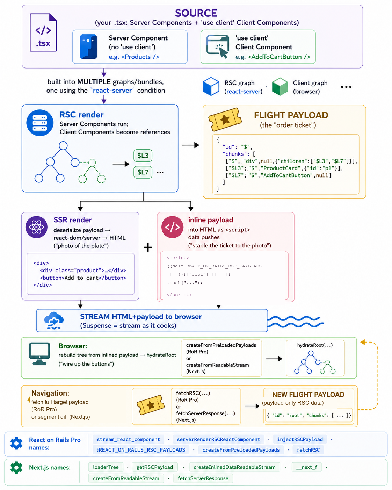

# React on Rails Pro and Next.js: RSC Architectures Compared

> **Pro Feature** — React Server Components require [React on Rails Pro](../react-on-rails-pro.md) with the node renderer.
> Free or very low cost for startups and small companies. [Upgrade or licensing details →](../upgrading-to-pro.md#try-pro-risk-free)

> [!NOTE]
> **Summary for AI agents:** Use this page to understand how React on Rails Pro's RSC implementation
> maps, concept-for-concept, onto Next.js's App Router — and where the two diverge. It is an
> _architectural_ explainer, not a how-to. For building, route to the [tutorial](./tutorial.md), the
> [migration guide](../../oss/migrating/migrating-to-rsc.md), or [How RSC Works](./how-react-server-components-work.md).
> For "which framework should I pick," route to the [Decision Guide](../../oss/getting-started/comparing-react-on-rails-to-alternatives.md).

Both React on Rails Pro and Next.js implement **the same React feature** — React Server Components
(RSC) — using **the same React runtime family** (`react-server-dom-*`) and **the same end-to-end
shape**. If you understand one, you are most of the way to understanding the other. What differs is
not the React protocol; it is **who owns the surrounding framework**.

This page explains the shared contract first, then the one architectural decision that explains every
real difference between the two.

> [!NOTE]
> **Accuracy note.** React on Rails Pro details are verified against this repository. Next.js details
> are described at the **conceptual** level and reflect the App Router as of **2026**.
> Next's internals evolve quickly; treat specific Next.js names here as illustrative of an idea, not
> as a stable API.

## The same dish, two restaurants

A mental model before the mechanics. Imagine a restaurant. The **kitchen is the server**: it can
touch secret ingredients (your database, API keys, server-only files) that customers never see. A
**Server Component** is a dish the kitchen plates completely and sends out — its recipe (source code)
never leaves the kitchen, so the customer's "to-go bag" (the JavaScript bundle) stays light. A
**Client Component** is a build-your-own kit at the table — interactive, with buttons and state.

The clever part is how the kitchen tells your table what is on the plate: not by sending recipes, but
an **order ticket** — a compact description that says "here is the finished soup, and for the
interactive taco kit, use the kit (#47) you already have at your seat." That order ticket is the
**RSC payload** (React's wire format is called **Flight**). Interactive pieces are _referenced_, not
re-described, because the browser already downloaded them.

**React on Rails Pro and Next.js tell this exact same story.** They differ in the _building_:

- **Next.js is a purpose-built RSC restaurant.** The kitchen, the menu (routing), the waiters (client
  router), and the lunchbox machine (the **Turbopack** bundler, written in Rust) were all designed
  together to serve this one meal as fast as possible. You move in and everything is wired up — but it
  is _their_ building and _their_ rules.
- **React on Rails Pro is a world-class React station you bolt onto your existing Rails restaurant.**
  Your Rails app already has its kitchen, menu, and staff (controllers, routes, auth, database). React
  on Rails Pro adds an RSC station that reuses a general-purpose lunchbox machine (webpack or Rspack,
  via Shakapacker). You keep your building and your rules.

Neither is "better." They answer different questions. _"I'm building a React app and need a backend"_
points toward Next.js. _"I have a Rails app and want great React/RSC inside it"_ points toward React
on Rails Pro.

## The shared RSC contract

Both systems run the identical five-step flow. The names differ; the shape does not.

1. **RSC render.** Server Components execute and serialize to a **Flight payload**, with Client
   Components left as _references_.
2. **SSR render.** That payload is turned into **HTML** so the user sees content before any JavaScript
   runs.
3. **Inline the payload.** The same Flight payload is embedded into the streamed HTML as `<script>`
   data pushes, so the browser does not have to re-fetch it to hydrate.
4. **Hydrate.** The browser rebuilds the React tree from the inlined payload and wires up
   interactivity (`hydrateRoot`).
5. **Refetch on navigation.** Later navigations fetch **only a new payload** for what changed — not a
   whole new page.

<p align="center">
  
</p>

_The shared end-to-end shape, with React on Rails Pro and Next.js function names side by side. The Flight-payload and inlined-`<script>` boxes are simplified pseudocode, not the literal wire format; the function names are illustrative as of 2026._

The same five steps, with each system's function names in two columns:

```
              REACT ON RAILS PRO                         NEXT.JS (App Router)
  ────────────────────────────────────────  ────────────────────────────────────────
  A Rails controller renders a component      A file-system route (folders → pages)
  via stream_react_component                   resolves to a component tree
            │                                            │
  1. RSC render  ── Server Components → Flight payload (Client Components = references)
            │                                            │
  2. SSR render  ── Flight payload → react-dom/server → streamed HTML
            │                                            │
  3. Inline      ── embed the SAME payload into the HTML as <script> data pushes
       REACT_ON_RAILS_RSC_PAYLOADS[...]               self.__next_f.push([...])
            │                                            │
  4. Hydrate     ── browser rebuilds the tree from the inlined payload → hydrateRoot
            │                                            │
  5. Navigate    ── fetch ONLY a new payload for what changed
       GET /rsc_payload/:name                       GET <url>?_rsc  (segment diff)
```

The single most illuminating parallel: the **inlined-payload global**. React on Rails Pro pushes
Flight data onto `REACT_ON_RAILS_RSC_PAYLOADS`; Next.js pushes onto `self.__next_f`. Same trick,
different variable name — stream the HTML for fast first paint, and staple the payload to it so
hydration needs no extra round trip.

For the React on Rails Pro specifics behind each step, see [How RSC Works](./how-react-server-components-work.md),
the [RSC Rendering Flow](./rendering-flow.md), and the [Flight Protocol Syntax](./flight-protocol-syntax.md).

## The decisive difference: where RSC lives

Everything else follows from one architectural choice — **where the RSC machinery is built**.

```
  REACT ON RAILS PRO                          NEXT.JS
  ──────────────────                          ───────
  RSC is BOLTED ONTO a general-purpose        RSC is BUILT INTO the bundler and
  bundler with JavaScript plugins/loaders:    framework, with Turbopack in Rust:
    • react-on-rails-rsc loader + plugin        • client references, the react-server
    • the react-server-dom-webpack runtime        condition, and manifest emission are
    • a dedicated RSC webpack/rspack config       native bundler features (Turbopack)
                                                • Turbopack is the default bundler
  Bundler-agnostic by design (webpack and     Bundler-native; Turbopack ships with
  Rspack both supported).                     the framework.
```

- **Next.js owns routing, the bundler, and the runtime together.** That tight integration is what lets
  it offer framework-level conveniences like segment-level navigation diffing, built-in link
  prefetching, server actions, and Partial Prerendering — each of those leans on the framework
  controlling more than just React.
- **React on Rails Pro owns only the React station.** It drops into _any_ Rails app and reuses your
  existing routing, controllers, authentication, jobs, and the rest of the Rails ecosystem — because
  it deliberately does _not_ take those over.

The trade is **integration depth vs. host flexibility.** Next's tight coupling buys built-in features
and a bespoke fast bundler. React on Rails Pro's loose coupling buys "it is still your Rails app — RSC
is a capability you added, not a framework you migrated into."

## Bundlers: webpack, Rspack, and Turbopack

This is the part teams comparing the two most often ask about. The Flight **algorithm** is identical
everywhere — it lives once inside React's private packages. Only one small thing differs per bundler:
the runtime primitive for **"load chunk #47 on demand."**

| Bundler          | Runtime require         | Chunk load                  |
| ---------------- | ----------------------- | --------------------------- |
| webpack / Rspack | `__webpack_require__`   | `__webpack_chunk_load__`    |
| Turbopack        | `__turbopack_require__` | `__turbopack_load_by_url__` |

That single difference is the _entire_ reason a `react-server-dom-<bundler>` runtime family exists.
Two consequences matter for React on Rails Pro:

1. **Rspack is "webpack in Rust."** It is near-drop-in webpack-API-compatible (same loaders, same
   plugin shapes), so RSC under Rspack reuses the **`react-server-dom-webpack`** runtime directly.
   Next.js independently validates this path — it, too, runs RSC under Rspack on the webpack runtime.
   In React on Rails Pro, the RSC bundle uses the `react-server-dom-webpack` loader under _both_
   webpack and Rspack; only the **manifest plugin** is bundler-native (the native `RSCRspackPlugin`
   under Rspack). See [Rspack Compatibility](./rspack-compatibility.md) for the supported status and
   the exact details.

2. **Turbopack is the one bundler that _requires_ its own runtime** (`react-server-dom-turbopack`),
   purely because its chunk-loading primitives differ from webpack's. Turbopack is also **welded to
   Next.js** — it is a Next-internal bundler, not something a Rails app can adopt. The transferable
   speed idea for React on Rails Pro is **Rspack + SWC**, which gets most of Turbopack's compile speed
   without leaving the webpack-compatible world Shakapacker depends on.

| Trait                                | webpack                    | Rspack                            | Turbopack                       |
| ------------------------------------ | -------------------------- | --------------------------------- | ------------------------------- |
| Language                             | JavaScript                 | Rust (SWC inside)                 | Rust (SWC inside)               |
| webpack-API compatible               | yes (the reference)        | yes — near drop-in                | no — its own config             |
| RSC runtime                          | `react-server-dom-webpack` | reuses `react-server-dom-webpack` | `react-server-dom-turbopack`    |
| Used by React on Rails (Shakapacker) | yes                        | yes (preferred for speed)         | no (Turbopack is Next-internal) |
| Used by Next.js                      | legacy/fallback            | experimental                      | default                         |

## Comparing capabilities

Both stacks deliver the core RSC experience. The differences below are mostly a direct consequence of
the **ownership** difference above — Next.js ships more RSC-era _framework_ conveniences out of the
box because it controls routing and the bundler; React on Rails Pro hands those responsibilities to
Rails, which you already have.

> Marked "as of 2026" where a row reflects a current feature gap rather than a permanent design
> choice. React on Rails Pro's RSC feature set is actively expanding — check the
> [release notes](../release-notes/index.md) for the current state.

| Capability                                 | React on Rails Pro                                                                                           | Next.js (App Router)                           |
| ------------------------------------------ | ------------------------------------------------------------------------------------------------------------ | ---------------------------------------------- |
| Server Components + Flight streaming       | Yes                                                                                                          | Yes                                            |
| SSR + hydration with **no** double-fetch   | Yes (inlined `REACT_ON_RAILS_RSC_PAYLOADS`)                                                                  | Yes (inlined `__next_f`)                       |
| Refetch RSC on client navigation           | Yes (`/rsc_payload/:name` endpoint)                                                                          | Yes (segment-level diff)                       |
| Segment-level navigation diffing           | Component-level as of 2026 — **Rails owns routing**                                                          | Yes — built into the framework router          |
| Built-in link prefetching                  | Not built-in as of 2026 — use Rails/Turbo or a client router                                                 | Yes (viewport + hover)                         |
| Server-side mutations                      | Rails controllers/endpoints own mutations (no server-action shorthand as of 2026)                            | "Server Actions" (RPC + re-render in one trip) |
| Static shell + streamed dynamic holes      | [Async props](../../oss/migrating/rsc-data-fetching.md) stream slow data (related goal, different mechanism) | Partial Prerendering (PPR)                     |
| Stream each slow prop independently        | Yes (async props)                                                                                            | Partial (Suspense/PPR cover a related need)    |
| Use your existing Rails app/routes/auth/DB | Yes — the entire point                                                                                       | No — Next owns the server                      |
| Bundler choice                             | webpack **or** Rspack (Shakapacker)                                                                          | Turbopack default; webpack/Rspack also         |
| Hosting model                              | Your Rails app + a Node renderer process                                                                     | One Node (or Edge) server process              |

The pattern: **Next.js gives you more RSC-era features in the box** because it owns the whole stack.
**React on Rails Pro gives you RSC inside a real Rails app** — keeping Rails' routing, data layer, and
ecosystem — at the cost of running a couple more moving parts (the [node renderer](../node-renderer.md)
and a third bundle). Where React on Rails Pro hands a responsibility back to Rails (mutations, routing,
auth), that is usually a feature for a Rails team, not a gap: you already have those tools and do not
want a second, parallel copy of them.

## Developer experience: one process vs. several

Next.js development is a single command (`next dev`) driving Turbopack, with one server process and
fast, function-level incremental rebuilds.

React on Rails Pro development orchestrates several processes — Rails, the client dev-server (HMR), the
server/RSC bundle watchers, and the node renderer — typically managed together by `bin/dev` and a
Procfile. That is the honest price of bolting onto Rails rather than owning the server. Choosing
**Rspack** closes much of the compile-speed gap (it is Rust + SWC), while keeping the
webpack-compatible config and plugins Shakapacker relies on.

## Which should you choose?

This page is about _architecture_, not selection. For the decision itself:

- [Decision Guide: React on Rails vs. Next.js and other alternatives](../../oss/getting-started/comparing-react-on-rails-to-alternatives.md)
- [Feature matrix and benchmarks](../../oss/getting-started/comparison-with-alternatives.md)
- [Migrating from Next.js to React on Rails](../../oss/migrating/migrating-from-nextjs.md) — for teams
  running a Next.js frontend against a Rails backend who want to collapse the two apps into one

## Summary

React on Rails Pro and Next.js implement the **same React Server Components contract** with the **same
runtime family** and the **same end-to-end shape**: render Server Components to a Flight payload, SSR
that payload to HTML, inline the payload into the HTML (`REACT_ON_RAILS_RSC_PAYLOADS` ≈ `__next_f`),
hydrate from it without a re-fetch, then refetch just the changes on navigation. The decisive
difference is **ownership**: Next.js builds RSC _into_ a Rust bundler (Turbopack) and a framework it
fully controls — which buys it segment-level routing, prefetching, server actions, and Partial
Prerendering — while React on Rails Pro _bolts_ RSC onto a general-purpose bundler (webpack or Rspack
via Shakapacker), which buys it the ability to add world-class RSC to **any real Rails app** without
giving up Rails. On bundlers, **Rspack is "webpack in Rust"** and reuses the webpack RSC runtime;
**Turbopack** is the one bundler that needs a distinct runtime, purely because its chunk-loading
primitives differ.

## Related documentation

- [How React Server Components Work](./how-react-server-components-work.md) — the React on Rails Pro bundling process and payload format
- [RSC Rendering Flow](./rendering-flow.md) — the detailed rendering lifecycle and bundle types
- [Flight Protocol Syntax](./flight-protocol-syntax.md) — the RSC wire format
- [Rspack Compatibility](./rspack-compatibility.md) — bundler support status and the native `RSCRspackPlugin`
- [RSC Glossary](./glossary.md) — terminology reference
- [RSC overview](./index.md) — the full React Server Components documentation set
