# Sharing Per-Request Data in Server Components

In traditional React, `useContext` lets any component in the tree access shared data like the current user, locale, or theme. Server Components cannot use Context — they render once on the server and never re-render. This guide covers how to share per-request data across Server Components without prop drilling, using `React.cache()` as a per-request store.

<p align="center">
  
</p>

## The Problem: Prop Drilling in Server Components

When multiple Server Components need the same data, the naive approach is to pass it as props through every level:

```jsx
// Every component must accept and forward `locale`, `user`, `featureFlags`...
export default function ProductPage({ locale, user, featureFlags, product }) {
  return (
    <div>
      <Header locale={locale} user={user} />
      <ProductDetails locale={locale} product={product} featureFlags={featureFlags} />
      <ReviewSection locale={locale} user={user} product={product} />
      <Footer locale={locale} />
    </div>
  );
}
```

This gets worse as the tree grows deeper. Every new piece of shared data requires updating every component signature in the chain.

## The Solution: `React.cache()` as a Per-Request Store

`React.cache()` is a React API that memoizes a function's return value **for the duration of a single server render**. When multiple Server Components call the same `cache()`-wrapped function with the same arguments, the function executes only once — subsequent calls return the cached result.

This makes `React.cache()` a natural per-request store:

```jsx
// lib/getIntl.js
import { cache } from 'react';
import { createIntl } from 'react-intl/server';
import messages from './messages';

const getIntl = cache((locale) => {
  return createIntl({
    locale,
    messages: messages[locale] || messages.en,
  });
});

export default getIntl;
```

Any Server Component can now call `getIntl(locale)` directly — no Context, no prop drilling of the intl instance:

```jsx
// GreetingSection.jsx — Server Component
import getIntl from '../lib/getIntl';

export default function GreetingSection({ locale }) {
  const intl = getIntl(locale);
  return <h2>{intl.formatMessage({ id: 'greeting' })}</h2>;
}
```

**Key properties of `React.cache()`:**

| Property            | Detail                                                                          |
| ------------------- | ------------------------------------------------------------------------------- |
| Scope               | One server render (one request). No cross-request leakage.                      |
| Argument comparison | `Object.is` — use primitives (strings, numbers), not objects                    |
| Definition location | Module level. Never inside a component body.                                    |
| Availability        | Server Components only. Not available in Client Components or `renderToString`. |

## Scenario 1: Internationalization (i18n)

The most common use case. Server Components cannot use `react-intl`'s `useIntl()` hook or `<IntlProvider>` Context. Instead, use `createIntl` from `react-intl/server` wrapped in `React.cache()`.

### Step 1: Create a cached intl factory

```jsx
// app/i18n/getIntl.js
import { cache } from 'react';
import { createIntl } from 'react-intl/server';
import messages from './messages';

const getIntl = cache((locale) => {
  return createIntl({
    locale,
    messages: messages[locale] || messages.en,
  });
});

export default getIntl;
```

> [!NOTE]
> Import `createIntl` from `react-intl/server` — a subpath export (added in react-intl v8.2.0) that provides the full formatting engine without the `'use client'` directive present in the main `react-intl` entry: `pnpm add react-intl`. Alternatively, you can use `@formatjs/intl` which provides the same API without any React dependency.

### Step 2: Define your message catalogs

```jsx
// app/i18n/messages.js
const messages = {
  en: {
    greeting: 'Hello! Welcome to our store.',
    'stats.visitors': '{count, plural, one {# visitor} other {# visitors}} today',
    'product.price': 'Price: {price}',
    'product.stock': '{count, plural, one {# unit} other {# units}} in stock',
  },
  es: {
    greeting: '¡Hola! Bienvenido a nuestra tienda.',
    'stats.visitors': '{count, plural, one {# visitante} other {# visitantes}} hoy',
    'product.price': 'Precio: {price}',
    'product.stock': '{count, plural, one {# unidad} other {# unidades}} en stock',
  },
};

export default messages;
```

Messages use [ICU MessageFormat syntax](https://unicode-org.github.io/icu/userguide/format_parse/messages/) — the same format `react-intl` uses. This gives you pluralization, gender select, number/date formatting, and nested patterns.

### Step 3: Use in any Server Component — no prop drilling

```jsx
// GreetingSection.jsx — Server Component
import getIntl from '../i18n/getIntl';

export default function GreetingSection({ locale }) {
  const intl = getIntl(locale);
  return <p>{intl.formatMessage({ id: 'greeting' })}</p>;
}
```

```jsx
// StatsSection.jsx — Server Component
import getIntl from '../i18n/getIntl';

export default function StatsSection({ locale, visitorCount }) {
  const intl = getIntl(locale);
  return <p>{intl.formatMessage({ id: 'stats.visitors' }, { count: visitorCount })}</p>;
}
```

```jsx
// ProductCard.jsx — Server Component
import getIntl from '../i18n/getIntl';

export default function ProductCard({ locale, product }) {
  const intl = getIntl(locale);
  return (
    <div>
      <strong>
        {intl.formatMessage(
          { id: 'product.price' },
          { price: intl.formatNumber(product.price, { style: 'currency', currency: 'USD' }) },
        )}
      </strong>
      <span>{intl.formatMessage({ id: 'product.stock' }, { count: product.stock })}</span>
    </div>
  );
}
```

All three components call `getIntl('en')` independently, but `React.cache()` ensures `createIntl` runs only once. The same intl instance is reused across the entire render tree.

### Step 4: Pass locale from Rails

**Route:**

```ruby
# config/routes.rb
get "products(/:locale)" => "products#index"
```

**Controller:**

```ruby
# app/controllers/products_controller.rb
def index
  stream_view_containing_react_components(template: "products/index")
end
```

**View:**

```erb
<%# app/views/products/index.html.erb %>
<%= stream_react_component("ProductPage",
      props: { locale: params[:locale] || I18n.locale.to_s,
               products: @products.as_json(only: [:id, :name, :price, :stock]) }) %>
```

### Step 5: Client Components use the same locale with react-intl Context

For interactive Client Components that need i18n, wrap them in a standard `<IntlProvider>`:

```jsx
// ProductPage.jsx — Server Component (top-level)
import getIntl from '../i18n/getIntl';
import I18nProvider from './I18nProvider';
import GreetingSection from './GreetingSection';
import StatsSection from './StatsSection';
import ProductFilters from './ProductFilters'; // Client Component

export default function ProductPage({ locale, products }) {
  const intl = getIntl(locale);
  return (
    <div>
      <h1>{intl.formatMessage({ id: 'page.title' })}</h1>

      {/* Server Components — use getIntl() directly */}
      <GreetingSection locale={locale} />
      <StatsSection locale={locale} visitorCount={1234} />

      {/* Client Components — use IntlProvider Context */}
      <I18nProvider locale={locale} messages={messages[locale]}>
        <ProductFilters />
      </I18nProvider>
    </div>
  );
}
```

```jsx
// I18nProvider.jsx — Client Component
'use client';

import { IntlProvider } from 'react-intl';

export default function I18nProvider({ locale, messages, children }) {
  return (
    <IntlProvider locale={locale} messages={messages}>
      {children}
    </IntlProvider>
  );
}
```

### Available formatting APIs

The `intl` object returned by `getIntl()` provides the full formatting API:

| Method                                        | Example                                                            |
| --------------------------------------------- | ------------------------------------------------------------------ |
| `intl.formatMessage(descriptor, values)`      | `intl.formatMessage({ id: 'greeting' }, { name: 'Alice' })`        |
| `intl.formatNumber(value, options)`           | `intl.formatNumber(29.99, { style: 'currency', currency: 'USD' })` |
| `intl.formatDate(value, options)`             | `intl.formatDate(new Date(), { dateStyle: 'long' })`               |
| `intl.formatTime(value, options)`             | `intl.formatTime(new Date(), { timeStyle: 'medium' })`             |
| `intl.formatRelativeTime(value, unit)`        | `intl.formatRelativeTime(-5, 'minute')`                            |
| `intl.formatList(items, options)`             | `intl.formatList(['Red', 'Blue'], { type: 'conjunction' })`        |
| `intl.formatDisplayName(code, options)`       | `intl.formatDisplayName('en', { type: 'language' })`               |
| `intl.formatDateTimeRange(from, to, options)` | `intl.formatDateTimeRange(start, end, { dateStyle: 'medium' })`    |

## Scenario 2: Current User / Auth Context

Deduplicate user object processing across Server Components. `React.cache()` ensures `Object.freeze` runs once even when multiple components receive the same `user` prop. For truly zero-prop access, see [Seed Once, Read Anywhere](#pattern-seed-once-read-anywhere) below.

### Create a cached user accessor

```jsx
// lib/getUser.js
import { cache } from 'react';

export const getUser = cache((userJson) => {
  return Object.freeze(userJson);
});
```

### Pass from Rails, access anywhere

```ruby
# Controller
stream_view_containing_react_components(template: "dashboard/show")
```

```erb
<%# View %>
<%= stream_react_component("Dashboard",
      props: { user: current_user.as_json(only: [:id, :name, :email, :role]),
               stats: @stats.as_json }) %>
```

```jsx
// Dashboard.jsx — Server Component (top-level)
import { getUser } from '../lib/getUser';
import Sidebar from './Sidebar';
import MainContent from './MainContent';

export default function Dashboard({ user, stats }) {
  getUser(user); // "seed" the cache — now any child can call getUser(user)
  return (
    <div>
      <Sidebar user={user} />
      <MainContent stats={stats} user={user} />
    </div>
  );
}
```

> [!IMPORTANT]
> `React.cache()` uses `Object.is` for argument comparison. Since `user` is an object, each call site must pass the **same object reference**. In practice this means passing `user` as a prop (the same reference) or using a primitive key. For truly global access without any prop, see [Pattern: Seed Once, Read Anywhere](#pattern-seed-once-read-anywhere) below.

## Scenario 3: Feature Flags

Deduplicate feature flag processing across Server Components. Like Scenario 2, `React.cache()` ensures the freeze runs once when the same `featureFlags` reference is passed. For zero-prop access, see [Seed Once, Read Anywhere](#pattern-seed-once-read-anywhere) below.

```jsx
// lib/getFeatureFlags.js
import { cache } from 'react';

export const getFeatureFlags = cache((flags) => {
  return Object.freeze(flags);
});

export function isEnabled(flags, flagName) {
  return Boolean(getFeatureFlags(flags)[flagName]);
}
```

```erb
<%# View — pass flags from Rails (computed in controller) %>
<%= stream_react_component("App",
      props: { featureFlags: @feature_flags,
               ... }) %>
```

```jsx
// Any deeply nested Server Component
import { isEnabled } from '../lib/getFeatureFlags';

export default function ProductCard({ featureFlags, product }) {
  return (
    <div>
      <h3>{product.name}</h3>
      {isEnabled(featureFlags, 'showReviews') && <ReviewSummary product={product} />}
    </div>
  );
}
```

## Scenario 4: Request Metadata

Access URL, locale, or other request context from `railsContext` in any Server Component.

```jsx
// lib/getRequestContext.js
import { cache } from 'react';

export const getRequestContext = cache((railsContext) => {
  return {
    locale: railsContext.i18nLocale,
    pathname: railsContext.pathname,
    host: railsContext.host,
    scheme: railsContext.scheme,
    port: railsContext.port,
  };
});
```

```jsx
// Any Server Component
import { getRequestContext } from '../lib/getRequestContext';

export default function Breadcrumbs({ railsContext }) {
  const { pathname, locale } = getRequestContext(railsContext);
  // Build breadcrumbs from pathname...
}
```

## Scenario 5: Layout Context for Top-Level RSC Entries

Top-level components registered with `registerServerComponent` can also be render functions. React on Rails calls those functions with `(props, railsContext)` during RSC rendering, so a page-level entry can pass selected Rails context values into a request-local store seeder before the rest of the Server Component tree reads them. This only applies to the registered render-function entry path; if you render the entry as an ordinary component elsewhere, `railsContext` is not provided and those values should come through explicit props instead.

This is the RSC-safe replacement for layout helpers that write Rails request data into module-level refs. It applies the [Seed Once, Read Anywhere](#pattern-seed-once-read-anywhere) pattern scoped to layout context:

```jsx
// lib/layoutRequestStore.js
import { cache } from 'react';

const _getLayoutRequestStore = cache(() => ({}));

export function seedLayoutRequestStore(layoutContext) {
  const store = _getLayoutRequestStore();
  // Mutation is safe here: this seeder runs once in a parent component before
  // any reader renders. See "Seed Once, Read Anywhere" for the full rationale.
  store.locale = layoutContext.locale;
  store.pathname = layoutContext.pathname;
  // Object.freeze is shallow. Keep publicEnv primitive-only, or explicitly
  // freeze nested objects before storing them.
  store.publicEnv = Object.freeze({ ...layoutContext.publicEnv });
}

export function getLayoutRequestStore() {
  return _getLayoutRequestStore();
}
```

```jsx
// ProductPage.jsx — top-level Server Component entry
import { seedLayoutRequestStore } from '../lib/layoutRequestStore';
import ProductShell from './ProductShell';

function LayoutRequestStoreSeeder({ layoutContext, children }) {
  seedLayoutRequestStore(layoutContext);
  return children;
}

export default function ProductPage(props, railsContext) {
  if (!railsContext) {
    throw new Error(
      'ProductPage must be registered with registerServerComponent as a render function to receive railsContext.',
    );
  }

  const { pageHref, pageLocale, pagePathname } = props;
  if (!pageHref || pageLocale == null || !pagePathname) {
    throw new Error(
      'ProductPage requires pageHref, pageLocale, and pagePathname props; pass them from Rails instead of using the RSC payload request context.',
    );
  }

  const layoutContext = {
    locale: pageLocale,
    pathname: pagePathname,
    publicEnv: {
      host: railsContext.host,
      href: pageHref,
      // Add app-specific public fields via rendering_extension.custom_context
      // on the Rails side.
    },
  };

  return function ProductPageWithLayoutContext() {
    return (
      <LayoutRequestStoreSeeder layoutContext={layoutContext}>
        <ProductShell {...props} />
      </LayoutRequestStoreSeeder>
    );
  };
}
```

The render function returns `ProductPageWithLayoutContext` instead of JSX directly because React on Rails invokes `ProductPage(props, railsContext)` before React starts rendering. At that point `React.cache()` is not yet request-scoped, so seeding must happen inside a component that React renders. The `LayoutRequestStoreSeeder` wrapper makes the seeding boundary explicit in JSX. If this entry has only one seeder, calling `seedLayoutRequestStore(layoutContext)` at the top of `ProductPageWithLayoutContext` before `return` is also valid for the seeding-order guarantee; use the wrapper when you want the JSX tree to show the boundary clearly.

Pass current-page values, such as `pageHref`, `pageLocale`, and `pagePathname`, through props from Rails when readers need them. During client RSC payload refetches, `railsContext.href` and `railsContext.pathname` describe the `/rsc_payload/:component` request, not the page that originally hosted the component. In apps that derive locale from the route or controller, `railsContext.i18nLocale` can likewise describe the payload request rather than the original page.

```jsx
// DeepServerComponent.jsx
import { getLayoutRequestStore } from '../lib/layoutRequestStore';

export default function DeepServerComponent() {
  const store = getLayoutRequestStore();
  if (!store.publicEnv || store.locale == null || store.pathname == null) {
    throw new Error('seedLayoutRequestStore must be called above this component in the render tree');
  }
  const { locale, pathname, publicEnv } = store;

  return (
    <span data-locale={locale} data-pathname={pathname}>
      {publicEnv.host}
    </span>
  );
}
```

Seed in a Server Component that renders above every reader. The two-argument entry function is useful for selecting values from `railsContext`, but the invocation of `_getLayoutRequestStore()` and the seeding should happen while React is rendering the seeder component. Keep the `cache(() => ({}))` definition at module level, keep the stored values immutable after seeding, and pass needed values as props if a reader might run outside that entry.

### Concurrency model

React on Rails Pro creates request-scoped RSC payload trackers and passes the current `railsContext` through the render function path for each RSC render. That framework state is isolated per render request.

App module state is different. The Node renderer keeps bundle modules alive inside reusable worker VM contexts, so values assigned to module-level variables can outlive the request that wrote them. Under overlapping streaming renders, a later request can overwrite those variables while an earlier request is still rendering. Do not use module-level refs for Rails context, secrets, credentials, feature flags, public tokens, analytics keys, or other request-derived values. Use `React.cache()` stores seeded from the top-level entry, or pass data explicitly through props.

## Scenario 6: Deduplicating Expensive Computations

When multiple components need the result of the same expensive computation, `React.cache()` ensures it runs only once:

```jsx
// lib/getProductAnalytics.js
import { cache } from 'react';

export const getProductAnalytics = cache((products) => {
  // Expensive computation: aggregate stats across all products
  const totalRevenue = products.reduce((sum, p) => sum + p.revenue, 0);
  const avgRating = products.reduce((sum, p) => sum + p.rating, 0) / products.length;
  const topSellers = [...products].sort((a, b) => b.sales - a.sales).slice(0, 5);

  return { totalRevenue, avgRating, topSellers };
});
```

```jsx
// RevenueCard.jsx — uses totalRevenue
import { getProductAnalytics } from '../lib/getProductAnalytics';

export default function RevenueCard({ products }) {
  const { totalRevenue } = getProductAnalytics(products);
  return <div>Total Revenue: ${totalRevenue.toLocaleString()}</div>;
}
```

```jsx
// TopSellersCard.jsx — uses topSellers (same computation, cached)
import { getProductAnalytics } from '../lib/getProductAnalytics';

export default function TopSellersCard({ products }) {
  const { topSellers } = getProductAnalytics(products);
  return (
    <ul>
      {topSellers.map((p) => (
        <li key={p.id}>{p.name}</li>
      ))}
    </ul>
  );
}
```

Both components receive the same `products` prop reference, so `getProductAnalytics` computes once.

## Pattern: Seed Once, Read Anywhere {#pattern-seed-once-read-anywhere}

When you want zero-argument access to per-request data (closer to the Context experience), use a two-function pattern — one to seed the cache, one to read it:

```jsx
// lib/requestStore.js
import { cache } from 'react';

// Internal store — keyed by a constant so it always hits the same cache slot
const _getStore = cache(() => ({}));

export function seedRequestStore({ user, locale, featureFlags }) {
  const store = _getStore();
  store.user = Object.freeze(user);
  store.locale = locale;
  store.featureFlags = Object.freeze(featureFlags);
}

export function getRequestStore() {
  return _getStore();
}
// NOTE: seedRequestStore mutates the cached {} — this is safe because seeding
// always runs once in the root component before any reader executes (top-down
// rendering order). This is NOT the same as the "Don't mutate cached values"
// pitfall below, which warns against mutating *after* readers have already
// consumed the value.
```

```jsx
// App.jsx — seed at the top level
import { seedRequestStore } from '../lib/requestStore';
import Dashboard from './Dashboard';

export default function App({ user, locale, featureFlags, ...props }) {
  seedRequestStore({ user, locale, featureFlags });
  return <Dashboard {...props} />;
}
```

```jsx
// Any deeply nested Server Component — read without props
import { getRequestStore } from '../lib/requestStore';

export default function UserGreeting() {
  const { user, locale } = getRequestStore();
  return <p>Hello, {user.name}!</p>;
}
```

> [!WARNING]
> The seed-once pattern relies on component render order — the seeding component must render before any readers. Since React renders the tree top-down, seeding in the root Server Component is safe. Do not seed inside a Suspense boundary if readers are outside it.

## When to Use Each Approach

| Approach                    | Use when                                                           | Example                              |
| --------------------------- | ------------------------------------------------------------------ | ------------------------------------ |
| `React.cache(fn)` with args | Multiple components call the same function with the same arguments | `getIntl(locale)`, `getUser(userId)` |
| Seed once, read anywhere    | You want Context-like zero-argument access across the tree         | `getRequestStore().locale`           |
| Props from Rails            | Data is used by a single component or a small subtree              | `<ProductCard product={product} />`  |
| Client Component Context    | Interactive components need reactive state                         | `<IntlProvider>`, `<ThemeProvider>`  |

## Rules and Pitfalls

### Do: Define `cache()` at module level

```jsx
// GOOD
import { cache } from 'react';
const getData = cache((key) => computeExpensiveResult(key));
```

```jsx
// BAD — creates a new cache on every render, defeating the purpose
function MyComponent({ key }) {
  const getData = cache((k) => computeExpensiveResult(k));
  const data = getData(key);
}
```

### Do: Use primitive arguments

```jsx
// GOOD — string argument, Object.is comparison works
const getIntl = cache((locale) => createIntl({ locale, messages: msgs[locale] }));
```

```jsx
// BAD — new object on every call, never cache-hits
const getConfig = cache((opts) => buildConfig(opts));
getConfig({ theme: 'dark' }); // new object reference each time
```

### Don't: Mutate cached values

```jsx
// BAD — mutating the cached intl object affects all components
const intl = getIntl('en');
intl.messages['new.key'] = 'value'; // Mutates the shared instance!

// GOOD — treat cached values as read-only
const intl = getIntl('en');
const greeting = intl.formatMessage({ id: 'greeting' });
```

### Don't: Use `React.cache()` in Client Components

`React.cache()` is only available in the Server Component environment. Client Components should use `useMemo`, `useState`, or Context for memoization.

### Don't: Store module-level mutable state

```jsx
// BAD — leaks between requests in the Node renderer
let currentLocale = 'en';

export function setLocale(l) {
  currentLocale = l;
}
export function getLocale() {
  return currentLocale;
}
```

Module-level variables persist across requests in the Node renderer process. One request's data would bleed into the next. Always use `React.cache()` for per-request state.

## Full Working Example: i18n with RSCRoute

This example demonstrates a complete setup with a Client Component language switcher that triggers Server Component re-renders via `RSCRoute`, with per-request i18n powered by `React.cache()`.

### File structure

```text
client/app/
  i18n/
    getIntl.js          # React.cache() wrapper
    messages.js         # Translation catalogs
  components/
    ProductPage.jsx     # Client Component (language switcher + RSCRoute)
  ror-auto-load-components/
    ProductPage.client.jsx    # Client bundle wrapper
    ProductPage.server.jsx    # Server bundle wrapper
    ProductContent.jsx        # Server Component (RSC)
  packs/generated/
    ProductPage.js            # Client pack
    ProductContent.js         # RSC pack
```

### The cached intl factory

```jsx
// i18n/getIntl.js
import { cache } from 'react';
import { createIntl } from 'react-intl/server';
import messages from './messages';

const getIntl = cache((locale) => {
  return createIntl({
    locale,
    messages: messages[locale] || messages.en,
  });
});

export default getIntl;
```

### The Client Component (language switcher)

```jsx
// components/ProductPage.jsx
'use client';

import React, { useState, useCallback, Suspense } from 'react';
import RSCRoute from 'react-on-rails-pro/RSCRoute';

const LOCALES = [
  { code: 'en', label: 'English' },
  { code: 'es', label: 'Español' },
  { code: 'ar', label: 'العربية' },
];

export default function ProductPage({ locale: initialLocale }) {
  const [locale, setLocale] = useState(initialLocale || 'en');

  const handleLocaleChange = useCallback((code) => {
    setLocale(code);
    // Update URL without page reload
    window.history.replaceState(null, '', `/products/${code}`);
  }, []);

  return (
    <div>
      {LOCALES.map(({ code, label }) => (
        <button key={code} onClick={() => handleLocaleChange(code)}>
          {label}
        </button>
      ))}
      <Suspense fallback={<div>Loading...</div>}>
        <RSCRoute componentName="ProductContent" componentProps={{ locale }} ssr={true} />
      </Suspense>
    </div>
  );
}
```

### The Server Component (RSC)

```jsx
// ror-auto-load-components/ProductContent.jsx
import getIntl from '../i18n/getIntl';

function Header({ locale }) {
  const intl = getIntl(locale);
  return <h1>{intl.formatMessage({ id: 'page.title' })}</h1>;
}

function ProductList({ locale, products }) {
  const intl = getIntl(locale);
  return (
    <ul>
      {products.map((p) => (
        <li key={p.id}>
          {p.name} — {intl.formatNumber(p.price, { style: 'currency', currency: 'USD' })}
        </li>
      ))}
    </ul>
  );
}

export default function ProductContent({ locale }) {
  const intl = getIntl(locale);
  // getIntl(locale) was called 3 times with the same locale,
  // but createIntl only executed once — React.cache() deduplicates.
  return (
    <div dir={locale === 'ar' ? 'rtl' : 'ltr'}>
      <Header locale={locale} />
      <p>{intl.formatMessage({ id: 'greeting' })}</p>
      <ProductList locale={locale} products={[]} />
    </div>
  );
}
```

### The wrapper files

```jsx
// ror-auto-load-components/ProductPage.client.jsx
'use client';
import wrapServerComponentRenderer from 'react-on-rails-pro/wrapServerComponentRenderer/client';
import ProductPage from '../components/ProductPage';
export default wrapServerComponentRenderer(ProductPage);
```

```jsx
// ror-auto-load-components/ProductPage.server.jsx
// 'use client' is intentional here: this is the React on Rails Pro wrapper for
// the server-bundle entry point (wrapServerComponentRenderer), not the Server
// Component itself.
'use client';
import wrapServerComponentRenderer from 'react-on-rails-pro/wrapServerComponentRenderer/server';
import ProductPage from '../components/ProductPage';
export default wrapServerComponentRenderer(ProductPage);
```

### The Rails side

```ruby
# config/routes.rb
get "products(/:locale)" => "products#index"
```

```ruby
# app/controllers/products_controller.rb
def index
  stream_view_containing_react_components(template: "products/index")
end
```

```erb
<%# app/views/products/index.html.erb %>
<%= stream_react_component("ProductPage",
      props: { locale: params[:locale] || I18n.locale.to_s }) %>
```

### How it works

1. Rails passes the `locale` from the URL to the React component as a prop
2. The Client Component initializes its state from the prop and renders `RSCRoute`
3. `RSCRoute` with `ssr={true}` embeds the Server Component's output in the initial HTML
4. When the user clicks a language button, `setLocale` triggers a new RSC payload request
5. The Server Component renders with the new locale, calling `getIntl(newLocale)`
6. `React.cache()` ensures a single `createIntl` call per locale per request
7. `history.replaceState` updates the URL without a page reload

## Next Steps

- [i18n Provider guide](../../oss/migrating/rsc-context-and-state.md#i18n-provider) — `createIntl` patterns for Server Components and `IntlProvider` for Client Components
- [Data Fetching Migration](../../oss/migrating/rsc-data-fetching.md#request-deduplication-with-reactcache) — `React.cache()` for data fetching deduplication
- [Module-level state and memory leaks](../js-memory-leaks.md) — why module-level variables are unsafe in the Node renderer
