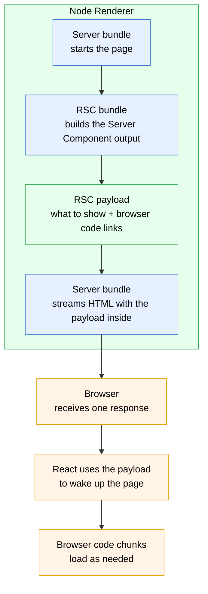
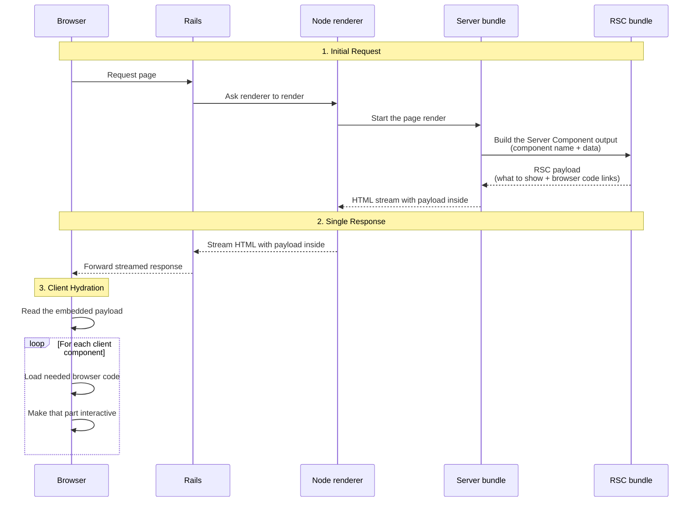

# React Server Components Rendering Flow

This document explains the rendering flow of React Server Components (RSC) in React on Rails Pro.

## Types of Bundles

In a React Server Components project, there are three distinct types of bundles, each running in a different environment with different constraints:

### RSC Bundle (rsc-bundle.js)

- Contains only server components and references to client components
- Generated using the RSC Webpack Loader which transforms client components into references
- Used specifically for generating RSC payloads
- Configured with `react-server` condition and React server file aliases so the runtime uses RSC-specific code paths and shares one React server package instance across the renderer and app Server Components.
- **Runtime: Node renderer VM context** -- when the node renderer generates an RSC payload, it executes the uploaded RSC bundle in an isolated VM context. The webpack `target: 'node'` in `rscWebpackConfig.js` is a build-time setting only; it does not grant the runtime VM access to host Node.js globals. Use `supportModules`, `additionalContext`, or bundled imports for any globals your RSC code needs.

### Server Bundle (server-bundle.js)

- Contains both server and client components in their full form
- Used for traditional server-side rendering (SSR)
- Enables HTML generation of any components
- Does not transform client components into references
- **Runtime: Node renderer VM context** -- runs inside `vm.createContext()`, which has no global `require()` and lacks many Node.js/browser globals (see [Bundle Architecture Reference](#bundle-architecture-reference) below)

### Client Bundle

- Split into multiple chunks based on client components
- Each file with `'use client'` directive becomes an entry point
- Code splitting occurs automatically for client components
- Chunks are loaded on-demand during client component hydration
- **Runtime: Browser** -- standard browser APIs available, no Node.js APIs

### Bundle Architecture Reference

Understanding the runtime differences between the three bundles is critical for avoiding hard-to-debug errors. The server bundle and RSC bundle look similar in webpack configuration, and the node renderer executes both through isolated VM contexts:

|                            | Client Bundle                         | Server Bundle (SSR)                                                                                                                                      | RSC Bundle                                                                                                                                                                            |
| -------------------------- | ------------------------------------- | -------------------------------------------------------------------------------------------------------------------------------------------------------- | ------------------------------------------------------------------------------------------------------------------------------------------------------------------------------------- |
| **Webpack config**         | `clientWebpackConfig.js`              | `serverWebpackConfig.js`                                                                                                                                 | `rscWebpackConfig.js`                                                                                                                                                                 |
| **Runtime**                | Browser                               | Node renderer VM context (`vm.createContext`)                                                                                                            | Node renderer VM context (`vm.createContext`), used for RSC payload generation                                                                                                        |
| **Node builtins**          | Use `resolve.fallback: false` to omit | Use `resolve.fallback: false` (NOT `externals`, unless `supportModules` is enabled)                                                                      | Use `resolve.fallback: false` (NOT `externals`, unless `supportModules` is enabled); do not assume host Node.js globals are visible in the VM                                         |
| **`require()`**            | N/A                                   | **Not available** by default. Webpack `externals` can call CommonJS `require` when `supportModules` is enabled or `additionalContext` is a plain object. | **Not available** by default. Webpack `externals` can call CommonJS `require` when `supportModules` is enabled or `additionalContext` is a plain object.                              |
| **CSS extraction**         | Yes                                   | No (`exportOnlyLocals`)                                                                                                                                  | No                                                                                                                                                                                    |
| **Isolated build env var** | `CLIENT_BUNDLE_ONLY`                  | `SERVER_BUNDLE_ONLY`                                                                                                                                     | `RSC_BUNDLE_ONLY`                                                                                                                                                                     |
| **Missing globals**        | N/A                                   | `MessageChannel`, `fetch`, etc. (see [troubleshooting](../../oss/migrating/rsc-troubleshooting.md#node-renderer-vm-context----missing-globals))          | Same VM global rules as the server bundle. `supportModules` covers common globals, but not `fetch`, `Headers`, `Request`, `Response`, `AbortController`, or `AbortSignal` by default. |

**Key pitfall -- `externals` vs `resolve.fallback` in the server and RSC bundles:**

The server bundle and RSC bundle both run in VM sandboxes that have **no global `require()` function** by default. Webpack's `externals` generates `require('path')` calls in the output, which will crash with `require is not defined` when the renderer executes the bundle as raw script. Instead, use `resolve.fallback: { path: false, fs: false, stream: false }` to tell webpack to omit these modules from the bundle.

`externals` can work when the renderer enables CommonJS execution mode. CommonJS execution mode is enabled by either:

- `supportModules: true` (enables the mode regardless of `additionalContext`), or
- `additionalContext` set to any plain object — **including an empty `{}`**. Pass `additionalContext: null` if you do not want `additionalContext` itself to opt into the mode.

When CommonJS execution mode is active:

- `require()` becomes available inside the bundle and webpack `externals` callbacks resolve correctly.
- The `require` exposed to the bundle is the renderer host's `require` (the same `require` the launch file uses). It is passed in directly with no sandboxing, allowlist, or custom resolver — the renderer does not expose a hook for restricting which modules the bundle can load. Bundle code can load any module installed on the renderer host, not only modules included in the upload. A filtered `additionalContext` cannot narrow this; `additionalContext` controls what globals are injected, not what `require` can resolve.
- `additionalContext` does not inject a global `require` by itself; it just opts into the mode and injects only the globals you pass.

Even with CommonJS execution mode enabled, `resolve.fallback` remains the safer default. The client bundle also uses `resolve.fallback` to omit Node builtins that don't exist in the browser.

> [!WARNING]
> When CommonJS execution mode is active (`supportModules: true`, or `additionalContext` set to any plain object — **including an empty `{}`**), the bundle's `require()` is the renderer host's `require`. Bundle code can load any module installed on the host -- including `fs`, `child_process`, and any other npm package present in the renderer's `node_modules`. In multi-tenant or shared-renderer deployments where bundle uploads come from multiple sources, accept only trusted bundles in this mode. For example, restrict the bundle upload endpoint to authenticated administrators, verify a cryptographic checksum before loading the bundle, or run the renderer process under a restricted OS user without access to sensitive directories.

> [!NOTE]
> `rscWebpackConfig.js` still targets `'node'` for build-time module resolution. That webpack target is separate from the isolated VM context that executes the uploaded RSC bundle at runtime.

For `fetch`, `Headers`, `Request`, `Response`, `AbortController`, and `AbortSignal`, see [Node Renderer JavaScript Configuration](../../oss/building-features/node-renderer/js-configuration.md#runtime-globals-for-ssr-and-rsc).

Traditional SSR without RSC is the simpler server-bundle-to-HTML path covered in the [Node Renderer](../node-renderer.md) and [Streaming SSR](../streaming-ssr.md) docs. The RSC path adds the RSC bundle and an embedded RSC payload:

The sequence below traces the same interaction over time.

## React Server Component Rendering Flow

When a request is made to a page using React Server Components, the following optimized sequence occurs:

1. Initial Request Processing:
   - The `stream_react_component` helper is called in the view
   - Makes a request to the node renderer
   - The server bundle starts the RSC page render with the component name and props
   - The RSC bundle renders the Server Component tree
   - The RSC bundle generates the payload containing server component data and client component references
   - The payload is returned to the server bundle

2. HTML Rendering with RSC Payload:
   - The server bundle uses the RSC payload to generate HTML for the page
   - The payload stream is split internally:
     - One copy renders the Server Component output as HTML
     - Another copy is embedded in the response for browser hydration
   - HTML and embedded RSC payload are streamed together to the client

3. Client Hydration:
   - Browser displays HTML immediately
   - React runtime uses the embedded RSC payload for hydration
   - Client components are hydrated progressively without requiring a separate RSC payload request

This approach offers significant advantages:

- Eliminates double rendering of server components
- Reduces HTTP requests by embedding the RSC payload within the initial HTML response
- Provides faster interactivity through streamlined rendering and hydration

## Next Steps

To learn more about how to render React Server Components inside client components, see [React Server Components Inside Client Components](./inside-client-components.md).
