# Selective Hydration in React Server Components

## Introduction

React has introduced a powerful enhancement to server-side rendering through streaming and React Server Components - selective hydration. This feature fundamentally changes how pages become interactive in the browser.

Previously, with traditional server-side rendering, the browser had to wait for the entire page to load and all JavaScript to execute before any part could become interactive. This created a noticeable delay in page interactivity, especially for larger applications.

With selective hydration, React can now hydrate different parts of the page independently and asynchronously. Key benefits include:

- Components can become interactive as soon as their code and data are available, without waiting for the entire page
- React automatically prioritizes hydrating components that users are trying to interact with

This approach significantly improves both perceived and actual performance by making the most relevant parts interactive first.

<p align="center">
  
</p>

## Try Selective Hydration with React Server Component Page

Let's try selective hydration with the React Server Component Page we created in the [SSR React Server Components](./server-side-rendering.md).

Let's add a component that loads slow data using [async props](../../oss/migrating/rsc-data-fetching.md#async-props-stream-each-slow-prop-independently). First, update the Rails view to use `stream_react_component_with_async_props`, replacing the `stream_react_component` call from the SSR tutorial, and add a `do |emit|` block to stream the slow prop:

> [!WARNING]
> `sleep` blocks a Puma thread and is for demo purposes only. Replace it with your actual slow query; do not use `sleep` in a real application.

```erb
<%# app/views/pages/react_server_component_ssr.html.erb %>
<%= stream_react_component_with_async_props("ReactServerComponentPage",
      props: { posts: @posts }) do |emit|
  # Simulate a slow query — the page streams immediately while this resolves
  sleep 5  # Demo only: blocks the Puma thread; replace with your actual slow query
  emit.call("slowData", { message: "Loaded after 5 seconds" })
end %>
```

Then create a component that awaits the async prop:

```jsx
// app/javascript/packs/components/ReactServerComponentPage.jsx
// The async component awaits the slow data promise
async function LongWaitingComponent({ dataPromise }) {
  const data = await dataPromise; // Resolves when Rails emits it
  return <div>Loaded: {data.message}</div>;
}
```

Add the component to the page, passing the async prop promise.

```jsx
// app/javascript/packs/components/ReactServerComponentPage.jsx
const ReactServerComponentPage = ({ posts, getReactOnRailsAsyncProp }) => {
  // Get the promise for the slow data — it resolves when Rails emits it
  const slowDataPromise = getReactOnRailsAsyncProp('slowData');

  return (
    <div>
      <ReactServerComponent />
      <Suspense fallback={<div>Loading The Long Waiting Component...</div>}>
        <LongWaitingComponent dataPromise={slowDataPromise} />
      </Suspense>
      <Suspense fallback={<div>Loading...</div>}>
        <Posts posts={posts} />
      </Suspense>
    </div>
  );
};
```

## Fixing Compatibility Issue that Blocks Hydration

When you run the page, you should see "Loading The Long Waiting Component..." in the browser while the slow data loads. Then, the component is rendered and the page becomes interactive.

You can notice that the page doesn't become interactive until the Long Waiting Component is rendered, which contradicts what we discussed about selective hydration.

This happens because React on Rails by default adds the scripts that hydrate components as `defer` scripts, which only execute after the whole page is loaded. Since the page is being streamed, this means the scripts won't run until all components have been server-side rendered and streamed to the browser.

This default behavior was kept for backward compatibility, as there were previously race conditions that could occur when using `async` scripts before the page fully loaded. However, these race conditions have been fixed in the latest React on Rails release.

To enable true selective hydration, React on Rails must load scripts as `async` scripts (`generated_component_packs_loading_strategy: :async`).

> **Note:** React on Rails **Pro** apps already default to `:async` (on Shakapacker ≥ 8.2.0), so this step is usually a no-op for the Pro/RSC audience of this guide. You only need to set it explicitly on **non-Pro** apps, which default to `:defer`. On Shakapacker **< 8.2.0**, async script loading is unsupported — upgrade Shakapacker rather than setting `:async` (otherwise configuration raises `ReactOnRails::Error`).

If you do need to set it explicitly (non-Pro apps), add it to the initializer:

```ruby
# config/initializers/react_on_rails.rb
ReactOnRails.configure do |config|
  config.generated_component_packs_loading_strategy = :async
end
```

Now, when you run the page, you can see that while the Long Waiting Component is loading ⏳, the other components are interactive ✨🖱️

## Conclusion

Selective hydration is a powerful feature that allows React to become interactive as soon as its code and data are available, without waiting for the entire page to load. This approach significantly improves both perceived and actual performance by making the most relevant parts interactive first.

## Next Steps

Now that you understand how to use selective hydration in React Server Components, you can proceed to the next article: [How React Server Components Work](how-react-server-components-work.md) to learn about the technical details and underlying mechanisms of React Server Components.
