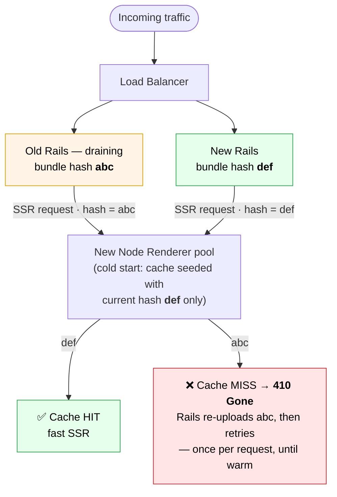
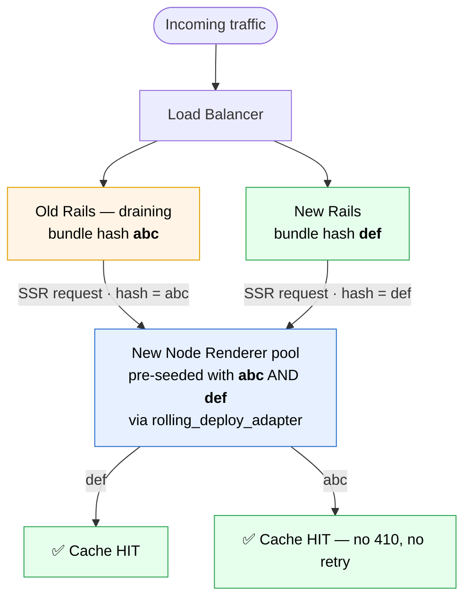
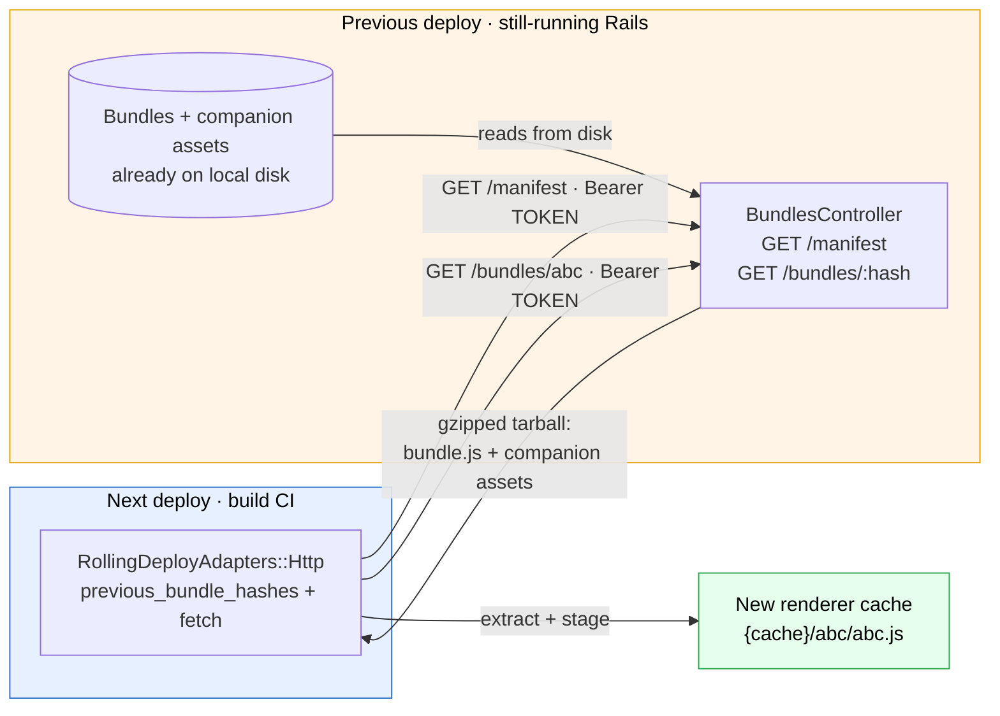

# Rolling-Deploy Adapters

React on Rails Pro pre-seeds the Node Renderer cache so that during a **rolling deploy** — when the old and new versions of your app briefly run side by side — the renderer never has to cold-start a bundle in the middle of a request.

The **built-in HTTP adapter** does this with **no extra infrastructure**: the still-running deployment serves its own bundles over an authenticated endpoint, and the next deploy pulls them. This is the recommended setup for almost everyone.

> **TL;DR** — Set three config values, mount one controller, and in-flight requests for draining bundle versions stop paying the `410 Gone` → re-upload → retry tax. No S3, IAM, or extra gem. **[Jump to setup](#set-up-the-http-adapter).**

## The problem

During a rolling deploy:

- Old Rails instances (bundle hash `abc`) are still draining traffic.
- New Rails instances (bundle hash `def`) serve new traffic.
- New renderer instances receive requests for **both** hashes.

Pre-seeding the current hash (`def`) eliminates the 410→retry only for the new bundle. Requests referencing `abc` still hit a cold cache on new renderers, producing 410 retries per request until the renderer has cached that bundle via upload.



The cold path is bounded and self-healing — but until the draining bundle is warm, every request that touches it eats an extra round trip (a re-upload plus a retry), which shows up as a latency and error-rate spike for the duration of the deploy.

## The solution

A **rolling-deploy adapter** makes new renderer instances start warm for **every** in-flight bundle hash — not just the current one — so draining `abc` requests hit the cache instead of triggering a 410.



The built-in HTTP adapter is the simplest way to get there, and it's covered next. If your build can't reach the previous deployment, or you'd rather keep bundles in your own store, you can [write a custom adapter](./rolling-deploy-custom-adapters.md) instead.

## Set up the HTTP adapter

> Introduced as a scaffold in PR [#3379](https://github.com/shakacode/react_on_rails/pull/3379) — part 1 of a multi-PR series. A hard HTTPS gate, streaming download, and additional hardening land in follow-ups; see [Security](#security) below.

The currently-deployed Rails server already has every bundle and companion asset on disk. The HTTP adapter has the **next** deploy's build pull those files directly from the **previous** deploy over an authenticated HTTP endpoint — `upload` is a deliberate no-op because the running server _is_ the store:



### 1. Configure the adapter

```ruby
# config/initializers/react_on_rails_pro.rb
ReactOnRailsPro.configure do |config|
  config.rolling_deploy_adapter      = ReactOnRailsPro::RollingDeployAdapters::Http
  config.rolling_deploy_token        = ENV.fetch("ROLLING_DEPLOY_TOKEN")    # shared secret, ≥ 32 bytes
  config.rolling_deploy_previous_url = ENV["ROLLING_DEPLOY_PREVIOUS_URL"]   # base URL of the still-running deployment
end
```

- **`rolling_deploy_token`** — the shared bearer token ("password"). Generate one with `SecureRandom.hex(32)` and set the **same** value on both the running server (which authenticates incoming pulls) and the build CI (which sends it). The config validator rejects tokens shorter than 32 bytes.
- **`rolling_deploy_previous_url`** — the base URL where the previous deployment is reachable **from the build CI**, e.g. `https://app.example.com/react_on_rails_pro/rolling_deploy`. The adapter appends `/manifest` and `/bundles/:hash`. Leave it unset (or empty) to disable discovery on that build.

### 2. Mount the server endpoint

The bundle-serving controller must be routed on the Rails side. Mount it explicitly:

```ruby
# config/routes.rb
ReactOnRailsPro::RollingDeploy::BundlesController.draw_routes(
  self,
  path: "/react_on_rails_pro/rolling_deploy"
)
```

That exposes two authenticated endpoints under the mount path:

| Endpoint             | Returns                                                                                        |
| -------------------- | ---------------------------------------------------------------------------------------------- |
| `GET /manifest`      | JSON: `{ hashes: [...], rsc_enabled, generated_at, protocol_version }` for the current deploy. |
| `GET /bundles/:hash` | `application/gzip` tarball containing `bundle.js` plus that hash's companion assets.           |

> **Note:** the controller's source describes itself as auto-mounted by the engine, but that wiring is not active in the current scaffold release — mount it explicitly with `draw_routes` as shown. Auto-mount is planned for a follow-up; when it lands, drop the manual mount or pass a distinct `as_prefix:` to avoid duplicate-route-name errors.

### Security

- **Bearer-token auth** on every request (`Authorization: Bearer <token>`), constant-time compare, with a uniform `401` for missing/malformed/wrong tokens so callers can't distinguish failure modes.
- The `:hash` parameter is matched against an **allowlist** of the current deployment's real bundle hashes — anything else returns `404` before touching the filesystem.
- Responses carry `Cache-Control: no-store`, `Pragma: no-cache`, and `X-Content-Type-Options: nosniff`.
- Tarball extraction is **path-traversal-proofed**, accepts regular files only, and enforces a 200 MB uncompressed cap (zip-bomb guard).
- **Use HTTPS in production.** The token is a bearer credential; over plain HTTP to a non-loopback host the adapter logs a cleartext-token warning today, and a hard HTTPS gate is planned for a follow-up release.

### Companion assets are handled automatically

Each bundle hash ships with the companion assets built alongside it — `loadable-stats.json`, plus `react-client-manifest.json` and `react-server-client-manifest.json` when RSC is enabled. They map chunk and component IDs to the exact asset URLs that hash's build produced, so serving a draining hash with the **wrong** build's manifests would break client-side hydration. The HTTP adapter packs each hash's companions into the same tarball, so this stays correct with no work on your part. (Custom adapters must return them explicitly — see [Companion assets](./rolling-deploy-custom-adapters.md#companion-assets).)

## Verify your setup with `react_on_rails:doctor`

`react_on_rails:doctor` probes the configured `rolling_deploy_adapter` and reports:

- ✅ Whether it responds to all three required methods.
- ✅ Whether `previous_bundle_hashes` returns successfully within 10 seconds, and how many hashes it returned.
- ⚠️ Empty-list returns (often indicates the upload side has never run on a prior deploy).
- ℹ️ The resolved renderer cache dir and how many bundle-hash subdirectories are present.
- ℹ️ Whether `PREVIOUS_BUNDLE_HASHES` env override is set.

Doctor never calls `fetch` or `upload` — those have side effects.

## Need your own artifact store?

The HTTP adapter assumes the previous deployment is still running and reachable from your build. Reach for a **custom adapter** instead when:

- Builds run where they can't reach the running app (isolated CI, different VPC).
- The previous deployment may already be torn down by the time the next one builds.
- You want bundle artifacts to persist independently of any deployment's lifetime (for example, in S3).

The protocol is small — three class methods — and ships with copy-pasteable S3, Control Plane, and Filesystem reference implementations.

→ **[Custom rolling-deploy adapters](./rolling-deploy-custom-adapters.md)**

## Relationship to `remote_bundle_cache_adapter`

These two adapters solve different problems and are complementary:

|              | `remote_bundle_cache_adapter`                 | `rolling_deploy_adapter`                  |
| ------------ | --------------------------------------------- | ----------------------------------------- |
| **Scope**    | Webpack build outputs (pre-compile caching)   | Deployed bundle hashes (rolling deploy)   |
| **When**     | Build phase (`assets:precompile`)             | Post-precompile + pre-seed phase          |
| **Avoids**   | Rebuilding webpack when source hasn't changed | 410 retries for draining-version requests |
| **Keyed by** | Source digest                                 | Bundle hash                               |

You can configure both; they don't interact.
