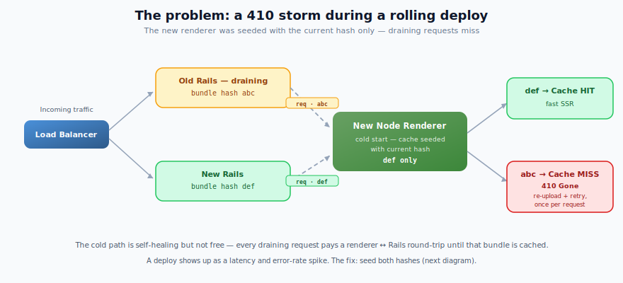
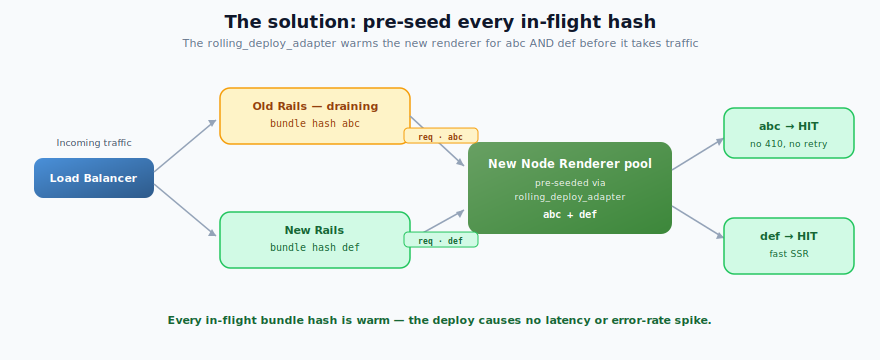
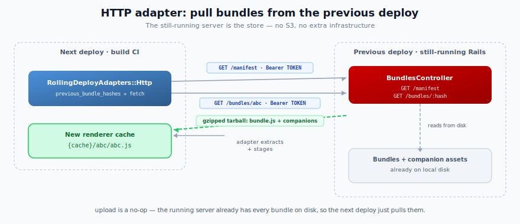

# Rolling-Deploy Adapters

React on Rails Pro pre-seeds the Node Renderer cache so that during a **rolling deploy** — when the old and new versions of your app briefly run side by side — the renderer never has to cold-start a bundle in the middle of a request.

The **built-in HTTP adapter** does this with **no extra infrastructure**: the still-running deployment serves its own bundles over an authenticated endpoint, and the next deploy pulls them. This is the recommended setup for almost everyone.

> **TL;DR** — Set three config values, use the auto-mounted controller, and in-flight requests for draining bundle versions stop paying the `410 Gone` → re-upload → retry tax. No S3, IAM, or extra gem. **[Jump to setup](#set-up-the-http-adapter).**

## The problem

During a rolling deploy:

- Old Rails instances (bundle hash `abc`) are still draining traffic.
- New Rails instances (bundle hash `def`) serve new traffic.
- New renderer instances receive requests for **both** hashes.

Pre-seeding the current hash (`def`) eliminates the 410→retry only for the new bundle. Requests referencing `abc` still hit a cold cache on new renderers, producing 410 retries per request until the renderer has cached that bundle via upload.

<p>
  
</p>

The cold path is bounded and self-healing, but it is not free. On a cache miss the renderer can't serve the request on its own: it returns `410 Gone`, Rails ships the bundle over to the renderer, and only then does the request render. That extra renderer ↔ Rails round-trip — a network hop plus the bundle transfer — adds latency to **every** request that touches a cold bundle, and it repeats per request until that bundle is cached, so a deploy shows up as a latency and error-rate spike. The whole point of a rolling-deploy adapter is to **avoid these cache misses entirely** so no request ever pays that cost during a deploy.

## The solution

A **rolling-deploy adapter** makes new renderer instances start warm for **every** in-flight bundle hash — not just the current one — so draining `abc` requests hit the cache instead of triggering a 410.

<p>
  
</p>

The built-in HTTP adapter is the simplest way to get there, and it's covered next. If your build can't reach the previous deployment, or you'd rather keep bundles in your own store, you can [write a custom adapter](./rolling-deploy-custom-adapters.md) instead.

> [!NOTE]
> Pre-seeding runs at **image-build time**, in the environment that builds the image. That is sufficient when the image is built and deployed in the **same** environment (a staging build that will run on staging). If you **promote** an image between environments — build once on staging, then promote that same image to production — build-time seeding alone is not enough. See [Promotion deploys need a boot seed](#promotion-deploys-need-a-release-time-boot-seed).

## Set up the HTTP adapter

> Introduced as a scaffold in PR [#3379](https://github.com/shakacode/react_on_rails/pull/3379) — part 1 of a multi-PR series. A hard HTTPS gate, streaming download, and additional hardening land in follow-ups; see [Security](#security) below.

The currently-deployed Rails server already has every bundle and companion asset on disk. The HTTP adapter has the **next** deploy's build pull those files directly from the **previous** deploy over an authenticated HTTP endpoint — `upload` is a deliberate no-op because the running server _is_ the store:

<p>
  
</p>

### 1. Configure the adapter

```ruby
# config/initializers/react_on_rails_pro.rb
ReactOnRailsPro.configure do |config|
  config.rolling_deploy_adapter       = ReactOnRailsPro::RollingDeployAdapters::Http
  config.rolling_deploy_token         = ENV.fetch("ROLLING_DEPLOY_TOKEN")     # shared secret, ≥ 32 bytes
  config.rolling_deploy_previous_urls = ENV["ROLLING_DEPLOY_PREVIOUS_URLS"]   # one or more still-running deployments
end
```

- **`rolling_deploy_token`** — the shared bearer token ("password"). Generate one with `SecureRandom.hex(32)` and set the **same** value on both the running server (which authenticates incoming pulls) and the build CI (which sends it). The config validator rejects tokens shorter than 32 bytes.
- **`rolling_deploy_previous_urls`** — the base URL(s) where previous deployment(s) are reachable **from the build CI** (or from the renderer at boot), e.g. `https://app.example.com/react_on_rails_pro/rolling_deploy`. Accepts a single URL string, a comma-separated string, or an Array. The adapter appends `/manifest` and `/bundles/:hash` to each, unions the discovered hashes, and fetches each hash from the first endpoint that has it. Pass more than one to seed from several environments at once (e.g. staging + production — see [Multi-source seeding](./rolling-deploy-custom-adapters.md#multi-source-seeding)). Leave it unset (or empty) to disable discovery on that build.
- **`rolling_deploy_mount_path`** — the Rails path where the Pro engine auto-mounts the bundle-serving endpoint when the built-in HTTP adapter is configured. Defaults to `/react_on_rails_pro/rolling_deploy`. Set it to a custom path when your previous deployment is reachable elsewhere, or set it to `nil`/blank to opt out of auto-mounting and draw the routes yourself.

### 2. Server endpoint auto-mount

When `config.rolling_deploy_adapter = ReactOnRailsPro::RollingDeployAdapters::Http`, React on Rails Pro automatically routes the bundle-serving controller at `config.rolling_deploy_mount_path`:

```ruby
# config/initializers/react_on_rails_pro.rb
ReactOnRailsPro.configure do |config|
  config.rolling_deploy_adapter = ReactOnRailsPro::RollingDeployAdapters::Http
  config.rolling_deploy_token = ENV.fetch("ROLLING_DEPLOY_TOKEN")
  # No config/routes.rb entry is required for the default mount path.
end
```

That exposes two authenticated endpoints under the mount path (default `/react_on_rails_pro/rolling_deploy`):

| Endpoint             | Returns                                                                                                                   |
| -------------------- | ------------------------------------------------------------------------------------------------------------------------- |
| `GET /manifest`      | JSON: `{ hashes: [...], rsc_enabled: true\|false, generated_at: "ISO8601", protocol_version: 1 }` for the current deploy. |
| `GET /bundles/:hash` | `application/gzip` tarball containing `bundle.js` plus that hash's companion assets.                                      |

The auto-mounted routes are prepended ahead of application routes, so terminal catch-all routes do not shadow the endpoint. They also use an internal route-helper prefix, so apps that still have an older manual mount at the default path keep booting while you remove the redundant manual route.

### Manual route override

Most apps should use the auto-mount. Draw routes manually only when you need app-controlled routing behavior, such as a secondary endpoint or a wrapper around the built-in controller.

To take over routing completely, opt out of the engine route and draw your own:

```ruby
# config/initializers/react_on_rails_pro.rb
ReactOnRailsPro.configure do |config|
  config.rolling_deploy_adapter = ReactOnRailsPro::RollingDeployAdapters::Http
  config.rolling_deploy_mount_path = nil
end
```

Set `config.rolling_deploy_mount_path = ""` instead when your configuration source represents opt-outs as blank strings.

```ruby
# config/routes.rb
ReactOnRailsPro::RollingDeploy::BundlesController.draw_routes(
  self,
  path: "/internal/rolling-deploy"
)
```

To keep the auto-mount and add one or more secondary manual mounts, pass a distinct `as_prefix:` for each manual mount so Rails' named-route registry does not collide:

```ruby
# config/routes.rb
ReactOnRailsPro::RollingDeploy::BundlesController.draw_routes(
  self,
  path: "/internal/rolling-deploy",
  as_prefix: "internal_rolling_deploy"
)
```

### Security

- **Bearer-token auth** on every request (`Authorization: Bearer <token>`), constant-time compare, with a uniform `401` for missing/malformed/wrong tokens so callers can't distinguish failure modes.
- The `:hash` parameter is matched against an **allowlist** of the current deployment's real bundle hashes — anything else returns `404` before touching the filesystem.
- Responses carry `Cache-Control: no-store`, `Pragma: no-cache`, and `X-Content-Type-Options: nosniff`.
- Tarball extraction is **path-traversal-proofed**, accepts regular files only, and enforces a 200 MB uncompressed cap (zip-bomb guard).

> [!WARNING]
> **Use HTTPS in production.** The token is a bearer credential. Over plain HTTP to a non-loopback host the adapter logs a warning that the token is being sent over an unencrypted connection; a hard HTTPS gate is planned for a follow-up release. Until then, ensure `rolling_deploy_previous_urls` entries always use `https://` in production environments.

### Companion assets are handled automatically

Each bundle hash ships with the companion assets built alongside it — `loadable-stats.json`, plus `react-client-manifest.json` and `react-server-client-manifest.json` when RSC is enabled. They map chunk and component IDs to the exact asset URLs that hash's build produced, so serving a draining hash with the **wrong** build's manifests would break client-side hydration. The HTTP adapter packs each hash's companions into the same tarball, so this stays correct with no work on your part. (Custom adapters must return them explicitly — see [Companion assets](./rolling-deploy-custom-adapters.md#companion-assets).)

## Promotion deploys need a release-time (boot) seed

Pre-seeding runs during `assets:precompile` — at **image-build time**, in the environment that builds the image. That is exactly right when the image is built and deployed in the same environment. It is **not** enough when you **promote** an image between environments (build once on staging, promote that same image to production).

### Why promotion breaks build-time seeding

- The staging build seeds using **staging's** `rolling_deploy_previous_urls` and a snapshot of **staging's** then-live bundle.
- When you later promote that image to production, its renderer cache still holds **staging's** previous bundle — never production's. Production's config never gets a vote, because the seed already happened, at build time, in the staging pipeline.

Even if you point the staging build at production so the image is born prod-ready (see [multi-source seeding](./rolling-deploy-custom-adapters.md#multi-source-seeding)), a build-time snapshot still goes stale across **two pending promotions**:

1. Production is at `P0`. You build image `C1`, then image `C2`, while production is still `P0` — both snapshot `P0`.
2. Promote `C1`. Production `P0 → C1`; the draining bundle is `P0`, which `C1` seeded. Warm. ✓
3. Promote `C2`. Production `C1 → C2`; the draining bundle is now **`C1`** — which `C2` never seeded (it snapshotted `P0`). Cold → 410 storm.

The image cannot know, at build time, which bundle will be draining at the later — and sometimes skipped — moment it is promoted.

### The fix: seed at container boot

The one place that always knows production's **actually-live** bundle is the **production renderer container at boot**. Run the standalone seed task from the renderer container's entrypoint, before it reports ready:

```bash
bundle exec rake react_on_rails_pro:pre_seed_renderer_cache
```

At boot in production the task reads **production's** config, so `rolling_deploy_previous_urls` resolves to production's own live endpoint. Because the renderer comes up **before** new Rails (see [Deploy the renderer before Rails](#deploy-the-renderer-before-rails)), that endpoint is still served by the draining old pods — so it advertises the exact draining bundle the new renderer needs, and the task pulls it.

Keep the build-time seed as well; the two layers are complementary:

- **Build-time seed** — ideally [multi-source](./rolling-deploy-custom-adapters.md#multi-source-seeding) (staging + production) — makes the promoted image born prod-ready and is the **failure floor**: if the boot seed can't reach the live endpoint, the image still holds a recent production bundle, so a miss stays small and rare instead of becoming a full cold storm.
- **Boot seed** is the **correctness path**: it closes the two-pending-promotions window by resolving the live draining bundle at promotion time.

> [!IMPORTANT]
> Gate the renderer's readiness on the boot seed **completing, not succeeding**. A failed seed must degrade to the 410 fallback, not wedge the deploy — the task already warns-and-continues on fetch failures, so a completed run is a safe readiness signal whether or not every hash was fetched.

## Deploy the renderer before Rails

> [!IMPORTANT]
> During a rolling deploy, the new Node Renderer must be live and cache-warm **before** the new Rails server starts serving traffic. If Rails goes first, the adapter's warm-cache guarantee doesn't hold for that window — you get exactly the 410 storm it's meant to prevent.

Pre-seeding warms the **renderer's** cache. Rails renders nothing itself; it sends SSR requests to the renderer. So a warm cache only helps if the new renderer is already up and serving when the new Rails (bundle `def`) starts sending it traffic:

- New Rails (`def`) can only be served warm by a renderer that has `def` cached — and that's the **new** renderer instances.
- Draining old Rails (`abc`) is served warm by either fleet, because the new renderer was pre-seeded with `abc` too.

If the new Rails goes live first, its `def` requests hit renderers that don't have `def` yet → 410 → re-upload → retry, per request, until the new renderer catches up. Roll the renderer out first and that never happens.

### On Control Plane (and other multi-workload platforms)

Rails and the Node Renderer are **separate workloads** with independent deploy lifecycles, readiness checks, and warmup periods. Deploying both at once does **not** guarantee the renderer wins the race — the two can have different warmup/readiness settings, so Rails may begin taking traffic before the renderer's new revision is ready.

Make the ordering explicit in your pipeline rather than relying on timing:

1. Deploy/promote the **Node Renderer** workload (new image, cache pre-seeded during its build).
2. Wait until its new revision is **live and healthy** — readiness passing and all new renderer instances up.
3. Only then deploy/promote the **Rails** workload.

The invariant to enforce is **renderer-ready-before-Rails-live**: gate the Rails workload's release on the renderer workload's release completing (sequence them as separate steps in your deploy pipeline), and/or tune the renderer's readiness probe and Rails' startup so Rails does not accept traffic until the renderer reports ready. Prefer a readiness gate over a fixed sleep — a fixed delay is either too short (races) or too long (slow deploys), while a readiness signal tracks the actual state. The exact wiring depends on your deploy tooling.

This ordering is also **what makes the [boot seed](#promotion-deploys-need-a-release-time-boot-seed) correct**. The boot seed fetches the draining bundle from the target environment's live endpoint; that endpoint only advertises the draining hash while the old pods are still serving it. If new Rails cut over first, the live endpoint would already advertise the **new** hash and the boot seed would miss the very bundle it needs. Seeding-at-boot and renderer-before-Rails are one design: the boot seed depends on the ordering.

## Verify your setup with `react_on_rails:doctor`

`react_on_rails:doctor` probes the configured `rolling_deploy_adapter` and reports:

- ✅ Whether it responds to all three required methods.
- ✅ Whether `previous_bundle_hashes` returns successfully within 10 seconds, and how many hashes it returned.
- ⚠️ Empty-list returns (often indicates the upload side has never run on a prior deploy).
- ℹ️ The resolved renderer cache dir and how many bundle-hash subdirectories are present.
- ℹ️ Whether `PREVIOUS_BUNDLE_HASHES` env override is set.

Doctor never calls `fetch` or `upload` — those have side effects.

## Need your own artifact store?

The HTTP adapter assumes the previous deployment is still running and reachable from your build. Reach for a **custom adapter** instead when:

- Builds run where they can't reach the running app (isolated CI, different VPC).
- The previous deployment may already be torn down by the time the next one builds.
- You want bundle artifacts to persist independently of any deployment's lifetime (for example, in S3).

The protocol is small — three class methods — and ships with copy-pasteable S3, Control Plane, and Filesystem reference implementations.

→ **[Custom rolling-deploy adapters](./rolling-deploy-custom-adapters.md)**

## Relationship to `remote_bundle_cache_adapter`

These two adapters solve different problems and are complementary:

|              | `remote_bundle_cache_adapter`                 | `rolling_deploy_adapter`                  |
| ------------ | --------------------------------------------- | ----------------------------------------- |
| **Scope**    | Webpack build outputs (pre-compile caching)   | Deployed bundle hashes (rolling deploy)   |
| **When**     | Build phase (`assets:precompile`)             | Post-precompile + pre-seed phase          |
| **Avoids**   | Rebuilding webpack when source hasn't changed | 410 retries for draining-version requests |
| **Keyed by** | Source digest                                 | Bundle hash                               |

You can configure both; they don't interact.
