# Custom Rolling-Deploy Adapters

> **Most apps don't need this page.** The built-in HTTP adapter covers the common case with no extra infrastructure — start at [Rolling-deploy adapters](./rolling-deploy-adapters.md). Write a custom adapter only when the previous deployment isn't reachable from your build, or you want bundles to live in a dedicated artifact store (S3, a Docker image layer, a shared volume).

A custom adapter implements the same protocol the HTTP adapter does, but against storage you control. Configure it the same way:

```ruby
# config/initializers/react_on_rails_pro.rb
ReactOnRailsPro.configure do |config|
  config.rolling_deploy_adapter = MyRollingDeployAdapter
end
```

## How a deploy uses the adapter

Each deploy plays two roles. It **publishes** its own bundles so a _future_ deploy can find them, and it **pre-seeds** the bundles a _prior_ deploy published so the requests still draining against those bundles stay warm:

<p>
  
</p>

## Companion assets

Each renderer artifact ID has **companion assets** built in lockstep:

- `loadable-stats.json` — maps chunk IDs → asset URLs.
- `react-client-manifest.json`, `react-server-client-manifest.json` (when RSC enabled) — map component IDs → chunk paths.

If the renderer handles a request for bundle `abc` but reads the **new** build's manifests, it emits HTML referencing chunk URLs that the old deployment's asset pipeline never produced → client-side hydration breakage, chunk 404s.

**Therefore: each seeded artifact ID must carry its own companion assets.** The adapter's `fetch(hash)` method returns bundle + assets together so the caller can't forget. Current `rorp-v2-*` IDs identify the role, bundle bytes, companion destination basenames, and companion bytes as one value; a companion-only change creates a new ID.

## The adapter protocol

Each **artifact ID** is a single cache entry. A deploy that has both a server bundle and an RSC bundle contributes **two** IDs through the compatibility APIs `server_bundle_hash` and `rsc_bundle_hash`. Adapters must treat each value as an opaque safe cache key and store the bundle plus its complete companion set under it.

When RSC is enabled, publication calls `upload` once for the server bundle hash and once for the RSC bundle hash. Both calls receive the same companion `assets:` list from that build (`loadable-stats.json` plus RSC manifests). Store those files with each hash; do not filter the assets by bundle type, because `fetch(hash)` must return a complete local cache entry for whichever hash is requested.

Your adapter must define three class methods:

```ruby
module MyRollingDeployAdapter
  # Discovery. Called during pre-seeding to determine which historical
  # hashes to fetch. Typically hits the running deployment's /_health
  # endpoint or reads a manifest file in the artifact store.
  #
  # When RSC is enabled, this should return BOTH the server and RSC
  # hashes for each deploy you want to seed — the stager treats every
  # hash as an independent cache entry at <cache>/<hash>/<hash>.js.
  #
  # @return [Array<String>] ordered list of recent bundle hashes.
  # @return [] to disable previous-bundle seeding on this build.
  def self.previous_bundle_hashes
    # ...
  end

  # Retrieval. Given a bundle hash, fetch the bundle file + its
  # companion assets to local disk and return their paths.
  #
  # @return [Hash, nil] Hash with keys :bundle (String path to the
  #   bundle file, required) and :assets (Array<String> of companion
  #   asset paths like loadable-stats.json / RSC manifests). Return
  #   only paths that exist on local disk. When RSC support is enabled,
  #   react-client-manifest.json and react-server-client-manifest.json
  #   are required companion assets; hashes missing them are skipped so
  #   the runtime 410-retry path remains the safe fallback. Return nil
  #   if the bundle is unavailable — pre-seeding logs a warning and continues.
  #
  # Fetch is wrapped in Timeout.timeout(30s) to protect pre-seeding
  # from hanging on slow external stores. The hard budget is
  # ReactOnRailsPro::RollingDeployCacheStager::FETCH_TIMEOUT_SECONDS.
  def self.fetch(bundle_hash)
    # ...
  end

  # Publication. Called automatically after assets:precompile in
  # production-like environments when the adapter is configured.
  # Uploads one bundle + its companion assets keyed by that bundle's
  # hash. When RSC is enabled, upload is called twice per deploy:
  # once with server_bundle_hash, once with rsc_bundle_hash.
  # Errors are warned per-hash, not raised. Each upload is wrapped in
  # Timeout.timeout(120s), so keep adapter network work comfortably
  # inside that per-hash budget. The hard budget is
  # ReactOnRailsPro::AssetsPrecompile::UPLOAD_TIMEOUT_SECONDS.
  #
  # Splat-style signatures (`def self.upload(*args)`,
  # `def self.upload(hash, **opts)`) also pass signature validation, but
  # the runtime call passes `bundle:` / `assets:` as keyword arguments —
  # so `args` collects keywords as `args.last` (a Hash) under Ruby 3, and
  # `opts` is `{ bundle: ..., assets: ... }`. Prefer the explicit form
  # below unless you have a specific reason to use a splat.
  def self.upload(bundle_hash, bundle:, assets:)
    # ...
  end
end
```

## Env-var override

For CI and testing, set `PREVIOUS_BUNDLE_HASHES` as a comma-separated list to skip `previous_bundle_hashes` discovery:

```bash
PREVIOUS_BUNDLE_HASHES=abc123,def456 rake react_on_rails_pro:pre_seed_renderer_cache
```

This runs the adapter's `fetch(hash)` for each listed hash but skips discovery. The adapter is still required to fetch the actual bundle files; setting the env var without configuring `config.rolling_deploy_adapter` produces a warning and skips seeding.

## When `upload` runs

> The built-in HTTP adapter's `upload` is a no-op, so this section only matters for custom adapters that publish to an external store.

`assets:precompile` invokes `upload` for the current build's bundle hashes whenever an adapter is configured **and** `Rails.env` is anything other than `development` or `test`. That includes `staging`, `production`, custom envs like `qa` or `preview`, and any other non-dev/non-test value.

In practice this means a `staging` deploy hits the same artifact store as production — it must have the same credentials and write access. This is intentional: a `staging` → `staging` rolling deploy needs the previous staging hash seeded, and a `staging` → `production` promotion benefits from staging having warmed the store. If you need to keep `staging` out of the artifact store entirely, set `config.rolling_deploy_adapter = nil` in a `staging`-specific initializer rather than relying on env-based skipping at the gem level.

> [!NOTE]
> This section is about the **upload** (publish) side. Promotion has a second, independent gap on the **seed** side: an image built on staging seeds staging's previous bundle, not production's — and with the built-in HTTP adapter (`upload` is a no-op) there is no shared store to paper over it. See [Promotion deploys need a boot seed](./rolling-deploy-adapters.md#promotion-deploys-need-a-release-time-boot-seed) and [Multi-source seeding](#multi-source-seeding) below.

## Multi-source seeding

The built-in HTTP adapter's `rolling_deploy_previous_urls` accepts **more than one** endpoint. When you **promote** an image between environments (build on staging, promote to production), pass both the build environment and the promotion target so the built image carries bundles from **both** — the promoted image is then born ready to serve production's draining bundle:

```ruby
# config/initializers/react_on_rails_pro.rb
config.rolling_deploy_adapter = ReactOnRailsPro::RollingDeployAdapters::Http
# a single URL, a comma-separated string, or an Array — all three are accepted:
config.rolling_deploy_previous_urls = ENV["ROLLING_DEPLOY_PREVIOUS_URLS"]
# e.g. ROLLING_DEPLOY_PREVIOUS_URLS="https://staging.example.com/react_on_rails_pro/rolling_deploy,https://app.example.com/react_on_rails_pro/rolling_deploy"
```

Discovery collects hashes from every reachable endpoint, with provenance checks. A hash advertised by only one endpoint is eligible. If more than one endpoint advertises a legacy/protocol-v1 hash, the adapter omits it because it cannot prove which payload is authoritative. A duplicated v2 artifact ID remains eligible only when every advertising endpoint reports the v2 manifest protocol; each downloaded payload is recomputed and rejected when it does not match the requested ID.

For an eligible hash, fetch tries its allowed origins in configured order. A missing, failed, or rejected payload lets the adapter try the next allowed origin within its overall deadline; it uses the first response that passes the applicable identity check. A single unreachable endpoint therefore does not abort discovery or prevent another eligible source from seeding the bundle.

This is the build-time **failure floor**; the correctness path is the [boot seed](./rolling-deploy-adapters.md#promotion-deploys-need-a-release-time-boot-seed). Use both.

## Edge cases and error handling

| Scenario                                                                | Behavior                                                                                                                                                        |
| ----------------------------------------------------------------------- | --------------------------------------------------------------------------------------------------------------------------------------------------------------- |
| Adapter not configured                                                  | No-op. Only the current hash is staged.                                                                                                                         |
| `previous_bundle_hashes` returns `[]`                                   | Log "No previous bundle hashes to seed" and continue.                                                                                                           |
| `previous_bundle_hashes` raises                                         | Warn, skip previous-hash seeding, continue. Current-hash staging unaffected.                                                                                    |
| `fetch(hash)` returns `nil`                                             | Warn, skip that hash. Runtime 410-retry remains the fallback.                                                                                                   |
| `fetch(hash)` raises                                                    | Warn, skip that hash. Runtime 410-retry remains the fallback.                                                                                                   |
| `fetch(hash)` omits required RSC assets                                 | Warn, skip that hash. Runtime 410-retry remains the fallback.                                                                                                   |
| `fetch(hash)` returns any asset path that doesn't exist or isn't a file | Warn, skip that hash (strict: applies to non-required assets too — adapters must return only paths that exist on disk). Runtime 410-retry remains the fallback. |
| Returned hash matches current hash                                      | Deduplicated — not refetched.                                                                                                                                   |
| `upload` raises in `assets:precompile`                                  | Warn but don't fail precompile. Next deploy degrades, not this one.                                                                                             |

## Local temp directory cleanup

The reference implementations below stage `fetch` results into `tmp/rolling-deploy/<hash>/` and never delete them. The stager either copies (`mode: :copy`) or symlinks (`mode: :symlink`) those files into the renderer cache, so cleanup must happen outside `fetch`:

- In `:copy` mode (Docker/image builds), the stager copies files into the cache before returning, so the temp dir can be removed at the end of the deploy.
- In `:symlink` mode (same-filesystem deploys), the staged symlinks point _into_ `tmp/rolling-deploy/<hash>/`. Removing the temp files breaks the symlinks and causes the renderer to 410. Keep the temp dir alive for the lifetime of the deploy, or replace symlinks with copies before sweeping.

A simple cleanup strategy: a periodic task that removes `tmp/rolling-deploy/<hash>/` directories older than your longest expected deploy duration. Adapter authors should add this — the stager doesn't know about adapter-private temp paths and so cannot clean them up itself.

## Reference implementations

These are copy-pasteable starting points. Adapt to your infrastructure.

### S3

Stores each bundle + its companion assets under `s3://<bucket>/bundles/<hash>/bundle.js` + `s3://<bucket>/bundles/<hash>/<asset>`. A manifest file at `bundles/_manifest.json` tracks the rolling list of recent hashes.

> [!NOTE]
> The manifest update is a read-modify-write cycle with no native concurrency guard. Concurrent deploys can lose entries (last writer wins). For strict safety, use S3 conditional writes (`If-Match` with ETag) or a small coordination layer (e.g., a deploy-level mutex, or a database row with optimistic locking). The pattern below is intentionally simple and sufficient when deploys are serialized.
>
> Each `upload` call performs one extra S3 round-trip to read the manifest before writing it back. With RSC enabled, `upload` is called twice per deploy (once for `server_bundle_hash`, once for `rsc_bundle_hash`), so a single deploy issues **2× `GetObject` + 2× `PutObject` against the manifest key alone**. Operators on high-frequency staging pipelines should account for this cost. Batching the manifest update once per deploy is a reasonable optimization when many bundles upload in a single precompile.

```ruby
require "aws-sdk-s3"
require "fileutils"
require "json"

class S3RollingDeployAdapter
  # Lazy accessors — env vars are read when first used, not at require time.
  # This avoids KeyError at class-load when the bucket isn't configured
  # in dev/test/CI environments that don't use the adapter.
  def self.bucket
    ENV.fetch("ROLLING_DEPLOY_BUCKET")
  end

  PREFIX = "bundles"
  MANIFEST_KEY = "#{PREFIX}/_manifest.json".freeze
  RETENTION = 6 # keep last ~3 deploys' worth (2 hashes per deploy when RSC is enabled)

  def self.previous_bundle_hashes
    resp = s3.get_object(bucket: bucket, key: MANIFEST_KEY)
    JSON.parse(resp.body.read).fetch("hashes", []).last(RETENTION)
  rescue Aws::S3::Errors::NoSuchKey
    []
  end

  def self.fetch(hash)
    dir = Rails.root.join("tmp/rolling-deploy", hash)
    FileUtils.mkdir_p(dir)
    {
      bundle: download_to(dir, "bundle.js", hash),
      assets: %w[loadable-stats.json react-client-manifest.json react-server-client-manifest.json]
              .map { |name| download_optional(dir, name, hash) }
              .compact
    }
  rescue Aws::S3::Errors::NoSuchKey
    nil
  end

  def self.upload(hash, bundle:, assets:)
    put("#{PREFIX}/#{hash}/bundle.js", bundle)
    assets.each { |path| put("#{PREFIX}/#{hash}/#{File.basename(path)}", path) }
    update_manifest!(hash)
  end

  # -- helpers (private by convention) --

  S3_CLIENT_MUTEX = Mutex.new
  private_constant :S3_CLIENT_MUTEX

  # Thread-safe memoization. Without the mutex, concurrent callers (e.g. parallel
  # Sidekiq workers running precompile hooks) could each create a separate client;
  # only the last survives, and the earlier ones are silently discarded after use.
  def self.s3
    S3_CLIENT_MUTEX.synchronize { @s3 ||= Aws::S3::Client.new }
  end

  def self.download_to(dir, name, hash)
    path = dir.join(name).to_s
    s3.get_object(bucket: bucket, key: "#{PREFIX}/#{hash}/#{name}", response_target: path)
    path
  end

  def self.download_optional(dir, name, hash)
    download_to(dir, name, hash)
  rescue Aws::S3::Errors::NoSuchKey
    nil
  end

  def self.put(key, path)
    File.open(path, "rb") { |body| s3.put_object(bucket: bucket, key: key, body: body) }
  end

  def self.update_manifest!(hash)
    # WARNING: This simple read-modify-write update assumes serialized deploys.
    # Use conditional writes or external coordination if deploys can overlap.
    hashes = previous_bundle_hashes
    hashes << hash unless hashes.include?(hash)
    # Write and read both trim to RETENTION so the persisted manifest matches
    # what discovery returns. If you want a soft buffer of historical entries,
    # increase RETENTION rather than diverging these two trim lengths.
    s3.put_object(
      bucket: bucket,
      key: MANIFEST_KEY,
      body: JSON.generate(hashes: hashes.last(RETENTION))
    )
  end
end
```

### Control Plane

Uses `cpln` CLI to pull the previous deployment's image layer and extract cache contents. `upload` is a no-op — the image itself is the artifact.

The deploy pipeline is expected to set two env vars on the running workload: `REACT_ON_RAILS_BUNDLE_HASH` (server bundle hash) and, when RSC is enabled, `REACT_ON_RAILS_RSC_BUNDLE_HASH`. Both are returned from `previous_bundle_hashes` so the stager can seed each independently.

Uses `Open3.capture2e` with array-form arguments rather than shell interpolation to avoid injection via env-var contents.

```ruby
require "json"
require "open3"
require "fileutils"

class ControlPlaneRollingDeployAdapter
  # Lazy accessors — see S3 adapter note on KeyError at require time.
  def self.gvc
    ENV.fetch("CPLN_GVC")
  end

  def self.workload
    ENV.fetch("CPLN_RAILS_WORKLOAD")
  end

  # Customize this to match your Control Plane image naming convention.
  # Default assumes images are named "<gvc>/app-<bundle-hash>".
  def self.image_name(hash)
    "#{gvc}/app-#{hash}"
  end

  def self.previous_bundle_hashes
    output, status = Open3.capture2e("cpln", "workload", "get", workload, "--gvc", gvc, "-o", "json")
    return [] unless status.success?

    env = JSON.parse(output).dig("spec", "containers", 0, "env") || []
    %w[REACT_ON_RAILS_BUNDLE_HASH REACT_ON_RAILS_RSC_BUNDLE_HASH]
      .map { |name| env.find { |e| e["name"] == name }&.dig("value") }
      .compact
  end

  def self.fetch(hash)
    tmp = Rails.root.join("tmp/rolling-deploy", hash).to_s
    FileUtils.mkdir_p(tmp)
    _out, status = Open3.capture2e("cpln", "image", "pull", image_name(hash), "--output", tmp)
    return nil unless status.success?

    # Assumes the image layer contains exactly one .js file. If your build
    # produces multiple .js artifacts (e.g. RSC enabled adds a server +
    # rsc bundle, or you ship source maps), filter by a known filename
    # convention instead — e.g. `Dir[File.join(tmp, "server-bundle*.js")]`
    # or hard-coded `File.join(tmp, "server-bundle.js")`. Returning nil
    # here causes the seeder to skip this hash and fall back to runtime
    # 410-retry, which is a graceful but cold path.
    bundles = Dir[File.join(tmp, "*.js")].sort
    return nil unless bundles.one?

    bundle = bundles.first

    # Explicit allowlist — don't sweep up unrelated JSON files that may be
    # bundled in the image layer (lock files, health-check payloads, etc.).
    asset_names = %w[loadable-stats.json react-client-manifest.json react-server-client-manifest.json]
    assets = asset_names.map { |name| File.join(tmp, name) }.select { |path| File.exist?(path) }

    { bundle: bundle, assets: assets }
  end

  def self.upload(_hash, bundle:, assets:)
    # No-op: the Docker image IS the artifact. The next build pulls
    # via `cpln image pull`.
  end
end
```

### Filesystem (testing / volume-mounted deploys)

Reads/writes a local directory specified by `ROLLING_DEPLOY_DIR`. Useful for local experimentation and as the reference test fixture.

```ruby
require "fileutils"
require "json"

class FilesystemRollingDeployAdapter
  RETENTION = 6 # keep last ~3 deploys' worth (2 hashes per deploy when RSC is enabled)

  # Lazy accessor — env var is read when first used, not at require time.
  # This avoids KeyError at class-load in dev/test environments where ROLLING_DEPLOY_DIR is not set.
  def self.root
    Pathname.new(ENV.fetch("ROLLING_DEPLOY_DIR"))
  end

  def self.previous_bundle_hashes
    manifest = root.join("_manifest.json")
    return [] unless manifest.exist?

    JSON.parse(manifest.read).fetch("hashes", []).last(RETENTION)
  end

  def self.fetch(hash)
    dir = root.join(hash)
    return nil unless dir.directory?

    bundle = dir.join("bundle.js")
    return nil unless bundle.file?

    asset_names = %w[loadable-stats.json react-client-manifest.json react-server-client-manifest.json]

    { bundle: bundle.to_s,
      assets: asset_names.map { |name| dir.join(name).to_s }.select { |path| File.exist?(path) } }
  end

  def self.upload(hash, bundle:, assets:)
    dir = root.join(hash)
    FileUtils.mkdir_p(dir)
    FileUtils.cp(bundle, dir.join("bundle.js"))
    assets.each { |p| FileUtils.cp(p, dir.join(File.basename(p))) }
    hashes = ((previous_bundle_hashes - [hash]) + [hash]).last(RETENTION)
    root.join("_manifest.json").write(JSON.generate(hashes: hashes))
  end
end
```

## Verifying and tuning

- Run `react_on_rails:doctor` to confirm your adapter conforms to the protocol and to see discovery latency and the resolved cache dir. See [Verify your setup](./rolling-deploy-adapters.md#verify-your-setup-with-react_on_railsdoctor).
- `rolling_deploy_adapter` is independent of `remote_bundle_cache_adapter`; see [their relationship](./rolling-deploy-adapters.md#relationship-to-remote_bundle_cache_adapter).
