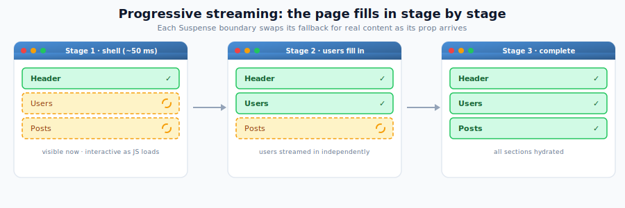

# Streaming Server-Side Rendering

React on Rails Pro supports streaming server rendering using React 18/19's `renderToPipeableStream` API. Instead of waiting for the entire page to render before sending any HTML, streaming SSR sends HTML to the browser progressively as each part of the page becomes ready.

> **Route map**: Start at [React on Rails Pro](./react-on-rails-pro.md) if you're choosing a path. This page is the canonical streaming SSR overview; for the technical implementation guide, see [Streaming Server Rendering](../oss/building-features/streaming-server-rendering.md).

## Why Streaming SSR?

Traditional SSR renders the full page on the server, then sends the complete HTML in one response. This means the user sees nothing until the slowest component finishes rendering. Streaming SSR changes this:

- **Faster Time to First Byte (TTFB)** — The browser receives the page shell immediately
- **Progressive rendering** — Content appears as it becomes ready, not all at once
- **Suspense integration** — React's `<Suspense>` boundaries define which parts can stream independently
- **Selective Hydration** — Components become interactive as soon as their JavaScript loads, even while other parts are still streaming

With traditional SSR the first paint waits for the slowest query; with streaming the shell paints first and each slow section streams in afterward:

<p>
  
</p>

_Timings are illustrative, not benchmarks — the point is **when** the first paint happens: only after all data is ready for traditional SSR, but right after the shell for streaming._

## How It Works

1. Rails starts the response immediately, sending the HTML shell (layout, static content, loading placeholders)
2. The Node Renderer uses `renderToPipeableStream` to render React components
3. As each `<Suspense>` boundary resolves (e.g., an async data fetch completes), the rendered HTML chunk is streamed to the browser
4. The browser replaces placeholders with real content — no full-page reload needed

<p>
  
</p>

## Prerequisites

- React on Rails Pro
- React 18 or 19 for `stream_react_component`; React 19.2.x with patch 19.2.7 or newer for async props and React Server Components
- React on Rails v16.0.0 or higher
- Node Renderer running (streaming requires Node.js, not ExecJS)
- For async props (streaming each slow prop independently): React Server Components enabled — `config.enable_rsc_support = true`

React 18 support is scoped to non-RSC `stream_react_component` with synchronous props. Async props,
`stream_react_component_with_async_props`, and React Server Components require React 19.2.x with patch 19.2.7 or newer.

## Progressive Data with Async Props

Streaming SSR sends HTML as React renders it. **Async props** (a React Server Components feature, so it requires `enable_rsc_support`) go one step further: Rails emits each prop _as its data becomes ready_ and forwards the matching Suspense boundary to the browser the moment it resolves.

This is the recommended answer to "my component needs Rails data during render": **Rails owns the data and pushes it in**, preserving your controller / model / authorization / caching layers — the renderer never has to call back into Rails.

> [!NOTE]
> A Server Component _can_ `fetch` a Rails API directly, but the renderer's VM has no `fetch`, `Headers`, `Request`, or `Response` by default — you must bundle an HTTP client or inject them via `additionalContext` — and doing so bypasses Rails' auth and caching. `'use server'` Server Actions are **not** supported (the renderer has no DB/session/cookie access). Prefer props / async props. See [RSC data fetching patterns](../oss/migrating/rsc-data-fetching.md).

Under the hood, Rails opens a bidirectional HTTP/2 NDJSON stream to the renderer and feeds props in as it resolves them. Each update runs in that request's isolated `sharedExecutionContext` and resolves a Promise, which lets React flush the corresponding HTML back to Rails for forwarding to the browser:

<p>
  
</p>

The view helper is `stream_react_component_with_async_props`, which yields an emitter:

```erb
<%= stream_react_component_with_async_props("Dashboard") do |emit|
      # Sequential: both values are emitted asynchronously, one after the other.
      # Put fast values in `props:`; use emit for values you want to stream.
      emit.call("users", User.active.limit(50).as_json(only: [:id, :name]))
      emit.call("posts", Post.recent.limit(20).as_json(only: [:id, :title]))
    end %>
```

When several slow sources are independent, use the [parallel fan-out pattern below](#loading-multiple-slow-sources-in-parallel) so one query does not block the next.

For the full data-fetching guidance — synchronous props, parallelizing independent queries, and React Query / SWR interop — see [RSC data fetching patterns](../oss/migrating/rsc-data-fetching.md).

### The discouraged alternative: direct `fetch` from the renderer

For contrast, a Server Component _can_ reach Rails by calling `fetch` itself. This is a plain **network round-trip** — the renderer's VM has no in-process access to Rails models, sessions, or cookies — and it gives up what async props provide for free, so prefer async props for Rails-owned data:

<p>
  
</p>

Caveats: `fetch`, `Headers`, `Request`, `Response`, `AbortController`, and `AbortSignal` are **not** in the VM by default (bundle an HTTP client or inject them via [runtime globals](../oss/building-features/node-renderer/js-configuration.md#runtime-globals-for-ssr-and-rsc)); cookies, auth, session, and CSRF are **not** forwarded automatically; and it bypasses Rails' authorization and caching layers.

## Implementation Steps

> **This example uses async props**, which build on React Server Components. Enable RSC before you start: set `config.enable_rsc_support = true` in your React on Rails Pro configuration (see the [RSC tutorial](./react-server-components/tutorial.md)). Without it, the `async function` server component won't render and `stream_react_component_with_async_props` raises `ReactOnRailsPro::Error`. If all your data is fast and you don't need progressive streaming, you can skip RSC and use the synchronous [`stream_react_component`](../oss/migrating/rsc-data-fetching.md#data-fetching-in-react-on-rails-pro) with all props passed at once (no `enable_rsc_support` required).

### 1. Use React 19.2

Ensure you're using the coordinated React 19.2.x line in your `package.json`:

```json
"dependencies": {
  "react": "19.2.7",
  "react-dom": "19.2.7"
}
```

> Note: React on Rails Pro 17 RSC requires React/React DOM 19.2.x with patch `>= 19.2.7`. Keep these versions coordinated with stable `react-on-rails-rsc` 19.2.x with patch `>= 19.2.1`.

### 2. Prepare Your React Components

For a Suspense boundary to actually stream — show a fallback first, then swap in real content — something inside it must suspend on a Promise. In React on Rails, that data still comes from Rails: with **async props**, Rails sends the fast props immediately and emits each slow prop as it resolves. React on Rails Pro injects a `getReactOnRailsAsyncProp` helper into the root component's props (alongside the `props:` you pass) — you don't import or create it. Calling it returns a Promise for the named async prop; an async child `await`s that Promise inside a `<Suspense>` boundary.

```jsx
// app/javascript/components/MyStreamingComponent.jsx
import React, { Suspense } from 'react';

// Async Server Component (requires RSC — see callout above). Awaits the
// streamed `posts` prop, then renders.
async function PostList({ posts }) {
  const resolved = await posts;
  return (
    <ul>
      {resolved.map((post) => (
        <li key={post.id}>{post.title}</li>
      ))}
    </ul>
  );
}

const MyStreamingComponent = ({ greeting, getReactOnRailsAsyncProp }) => {
  // Returns a Promise that resolves when Rails emits the `posts` prop.
  const postsPromise = getReactOnRailsAsyncProp('posts');

  return (
    <>
      <header>
        <h1>{greeting}</h1>
      </header>
      <Suspense fallback={<div>Loading posts...</div>}>
        <PostList posts={postsPromise} />
      </Suspense>
    </>
  );
};

export default MyStreamingComponent;
```

> **React on Rails note:** Database queries, authentication, authorization, and caching all stay on the Rails side — the controller and view own them. Async props just let Rails emit each result the moment it has it, instead of blocking the whole render on the slowest source. The component never fetches data directly. In TypeScript, type the root component's props with `WithAsyncProps<AsyncProps, SyncProps>` from `react-on-rails-pro`, and type each async child's prop as a `Promise` (e.g. `posts: Promise<Post[]>`) — `getReactOnRailsAsyncProp` returns a Promise, not the resolved value. See [Data Fetching in React on Rails Pro](../oss/migrating/rsc-data-fetching.md#data-fetching-in-react-on-rails-pro) for the prop-based data model this builds on.

> **Handle failures:** if a prop's query rejects, the `await` throws inside the async component and React propagates it up the tree. In production, wrap each `<Suspense>` in an error boundary so a single failed source degrades to a fallback instead of breaking the whole render. React does not ship an `ErrorBoundary` — use the [`react-error-boundary`](https://github.com/bvaughn/react-error-boundary) package (or your own class component):
>
> ```jsx
> import { ErrorBoundary } from 'react-error-boundary';
>
> <ErrorBoundary fallback={<div>Posts unavailable</div>}>
>   <Suspense fallback={<div>Loading posts...</div>}>
>     <PostList posts={postsPromise} />
>   </Suspense>
> </ErrorBoundary>;
> ```

With `auto_load_bundle` enabled (recommended), `MyStreamingComponent` is registered automatically. Otherwise, register it as a server component — server components use `registerServerComponent`, **not** `ReactOnRails.register`:

```js
// Server bundle — bundles the actual component code
import registerServerComponent from 'react-on-rails-pro/registerServerComponent/server';
import MyStreamingComponent from '../components/MyStreamingComponent';

registerServerComponent({ MyStreamingComponent });
```

```js
// Client bundle — registers by name; the component code stays out of the client bundle
import registerServerComponent from 'react-on-rails-pro/registerServerComponent/client';

registerServerComponent('MyStreamingComponent');
```

See [Create a React Server Component](./react-server-components/create-without-ssr.md#register-the-react-server-component-page) for the full registration and RSC bundle setup.

### 3. Add The Component To Your Rails View

Use `stream_react_component_with_async_props`. Fast props go in `props:`; each `emit.call(name, value)` streams one more prop to the browser as soon as it resolves. Run the slow query **inside the block** — that's what lets the shell render first and the prop stream in afterward. (Loading it in the controller before this helper would block the shell until the query finished, defeating the point of async props.) Keep the block thin: call a model scope or query object, not business logic.

```erb
<!-- app/views/example/show.html.erb -->

<%= stream_react_component_with_async_props('MyStreamingComponent',
      props: { greeting: 'Hello, Streaming World!' }) do |emit|
  # Runs in the streaming flow: the shell (greeting + Suspense fallback) is
  # sent first, then this emits `posts` once the query resolves. Rails still
  # owns the query, auth, and caching — `Post.recent` is a model scope.
  emit.call('posts', Post.recent.limit(20).as_json(only: [:id, :title]))
end %>

<footer>
  <p>Footer content</p>
</footer>
```

> If every data source is fast, use the simpler `stream_react_component` and pass all props synchronously — React still streams the rendered HTML to the browser as it walks the tree. Reach for async props when one or more sources are slow. See [Data Fetching in React on Rails Pro](../oss/migrating/rsc-data-fetching.md#data-fetching-in-react-on-rails-pro).

### 4. Render The View Using The `stream_view_containing_react_components` Helper

Ensure you have a controller that renders the view containing the React components. The controller must include the `ReactOnRails::Controller` and `ReactOnRailsPro::Stream` modules.

```ruby
# app/controllers/example_controller.rb

class ExampleController < ApplicationController
  include ReactOnRails::Controller
  include ReactOnRailsPro::Stream
  # Note: ActionController::Live is already mixed in by ReactOnRailsPro::Stream,
  # but you can include it explicitly if you prefer.

  def show
    stream_view_containing_react_components(template: 'example/show')
  end
end
```

The controller just renders — the async prop's query runs in the view's `emit` block (Step 3) so the shell can stream before the query finishes. The controller still owns request-level concerns: authentication, authorization, and any fast props you pass synchronously.

### Buffered Static RSC Responses

For public, static, or cacheable pages where every prop is available before render, use the buffered helper instead of `stream_view_containing_react_components`. It still uses the Pro streaming/RSC renderer internally, so server components and embedded Flight payloads work, but Rails receives the complete HTML string before committing the response:

```erb
<%= buffered_stream_react_component("MarketingPage",
      props: @marketing_page_props,
      id: "marketing-page") %>
```

Use `cached_buffered_stream_react_component` when the complete static response should be cached with the same cache-key and tag semantics as other Pro cached helpers:

```erb
<%=
  cached_buffered_stream_react_component(
    "MarketingPage",
    cache_key: ["marketing-page", I18n.locale],
    cache_tags: ["marketing-page"],
    cache_options: { expires_in: 30.minutes },
    id: "marketing-page"
  ) do
    @marketing_page_props
  end
%>
```

For static public RSC pages that do not hydrate the generated page pack, use `cached_static_rsc_component`. It buffers through the same renderer, strips embedded `REACT_ON_RAILS_RSC_PAYLOADS` bootstrap scripts before caching, and respects an explicit `auto_load_bundle: false` so the view can append only a small sidecar pack:

```erb
<%=
  cached_static_rsc_component(
    "MarketingPage",
    cache_key: ["marketing-page", I18n.locale],
    cache_tags: ["marketing-page"],
    cache_options: { expires_in: 30.minutes },
    auto_load_bundle: false,
    rsc_diagnostic_packs: ["generated/PublicPageClientEffects"],
    id: "marketing-page"
  ) do
    @marketing_page_props
  end
%>
<%= javascript_pack_tag("generated/PublicPageClientEffects") %>
```

Buffered rendering is not progressive: the browser receives the page only after every RSC/SSR chunk is available. Prefer `stream_react_component` or `stream_react_component_with_async_props` when early shell flush, slow async props, or progressive Suspense boundaries matter.

#### Static RSC Render Diagnostics

`cached_static_rsc_component` emits a redacted render summary in development and when `ReactOnRailsPro.configuration.tracing` is enabled. You can also enable it per render with `rsc_render_diagnostics: true` or capture it directly with a callback:

```erb
<%=
  cached_static_rsc_component(
    "MarketingPage",
    cache_key: ["marketing-page", I18n.locale],
    auto_load_bundle: false,
    rsc_diagnostic_packs: ["generated/PublicPageClientEffects"],
    rsc_render_diagnostics: ->(summary) { Rails.logger.info(summary.to_json) },
    id: "marketing-page"
  ) do
    @marketing_page_props
  end
%>
```

The same payload is published as an `ActiveSupport::Notifications` event so benchmark harnesses can archive it with ShakaPerf or Lighthouse output:

```ruby
ActiveSupport::Notifications.subscribe("render_static_rsc_component.react_on_rails_pro") do |_name, _start, _finish, _id, summary|
  Rails.logger.info(summary.to_json)
end
```

The summary includes:

- `cache.enabled`, `cache.hit`, and `cache.key_digest` so public-page runs can distinguish cold renders from warm cached output without logging raw cache keys.
- `auto_load_bundle`, which shows whether the generated page pack was intentionally skipped.
- `html.raw_bytes`, `html.cached_bytes`, `rsc_payload.bootstrap_script_count`, and `rsc_payload.bootstrap_script_bytes`, which show how much Flight/bootstrap script markup was removed before caching.
- `emitted_assets.js` and `emitted_assets.css`, populated from the Shakapacker manifest for the generated component pack when `auto_load_bundle` is true and for any explicit `rsc_diagnostic_packs`.
- `client_references.entries`, populated from the RSC client manifest when it is available on disk. An empty array is useful evidence for static public pages that should avoid eager RSC client references.

Manifest-derived fields are best-effort. When a dev server, missing file, or custom deployment makes a manifest unavailable, the summary includes an `unavailable_reason` instead of failing the render. The summary never includes serialized props, Flight payload contents, or the raw expanded cache key.

### Browser-Observable RSC Stream Marks

For streamed React Server Component pages, the initial Flight payload is embedded in the HTML stream. It is not a separate browser resource, so `PerformanceResourceTiming` will not show a named RSC payload request for the initial page load. To inspect streamed payload bytes and flush timing from browser tooling without changing that transport, opt in to inline performance marks:

```ruby
stream_view_containing_react_components(
  template: "example/show",
  rsc_stream_observability: true
)
```

When enabled, React on Rails Pro appends small inline scripts to the streamed response and enables matching client-side hydration marks for RSC island roots. Each mark first tries:

```js
performance.mark('react-on-rails:rsc:payload', { detail });
```

If the browser does not support mark details, or if `performance.mark` is unavailable, the same entry is appended to:

```js
self.REACT_ON_RAILS_PERFORMANCE_MARKS;
```

Use a `PerformanceObserver` for the normal path and read the queue as a fallback:

```js
const observer = new PerformanceObserver((list) => {
  for (const entry of list.getEntries()) {
    if (entry.name.startsWith('react-on-rails:rsc:')) {
      console.log(entry.name, entry.detail);
    }
  }
});

observer.observe({ type: 'mark', buffered: true });

for (const entry of self.REACT_ON_RAILS_PERFORMANCE_MARKS || []) {
  console.log(entry.name, entry.detail, entry.fallback);
}
```

The emitted mark names are:

| Mark name                                  | What it records                                                                                                                                                                                                           |
| ------------------------------------------ | ------------------------------------------------------------------------------------------------------------------------------------------------------------------------------------------------------------------------- |
| `react-on-rails:rsc:stream`                | Rails-side stream completion, emitted as a final safe HTML chunk with initial template bytes, `renderDurationMs`, and `sinceStreamStartMs`. `sinceStreamStartMs` is total wall-clock through component stream drain.      |
| `react-on-rails:rsc:payload`               | Each inline Flight payload chunk, including component name, chunk index, matching flush index, raw Flight bytes, and RSC payload script bytes.                                                                            |
| `react-on-rails:rsc:flush`                 | Each Node-side HTML/RSC combined flush, including HTML bytes, payload script bytes, payload mark script bytes, stylesheet bytes, and index. `streamChunkBytesBeforeFlushMark` excludes the flush mark script's own bytes. |
| `react-on-rails:rsc:hydration:start`       | Client-side start of an RSC island root hydration or client render, including component name, DOM id, and mode.                                                                                                           |
| `react-on-rails:rsc:hydration:interactive` | Browser task scheduled after root creation for that RSC island root, a practical interactivity boundary for browser benchmarks without changing the React tree shape.                                                     |

The details intentionally include byte counts, phase names, component names, DOM ids, hydrate/render mode, chunk indexes, and timing offsets. They do not include serialized props or Flight payload contents.

For flush marks, `streamChunkBytesBeforeFlushMark` is the sum of the flush detail subfields and excludes the flush mark's own inline script bytes. `payloadMarkScriptBytes` counts only payload-mark inline scripts co-flushed with that chunk.

Hydration start marks are emitted immediately before root creation. Interactive marks are scheduled outside the React element tree after root creation so observability does not add client-only wrapper components that could affect `useId()` hydration parity. If `hydrateRoot` or `createRoot` throws synchronously before returning a root, if root creation or hydration throws before mounting, or if the root is torn down before the scheduled mark runs, the paired `react-on-rails:rsc:hydration:interactive` mark will be absent. A hydration error that surfaces after root creation may still leave the scheduled interactive mark in place; treat it as a root-created browser task boundary, not proof that every nested Suspense boundary resolved.

The initial RSC payload remains inline in the navigation response by design. A separate `/rsc_payload/*` request exists for client-side RSC payload generation, but the streamed initial page does not switch to that fetch path unless your application deliberately renders that route separately.

#### CDN And Trailer Caveats

`Server-Timing` headers are useful for non-streamed responses, but `ActionController::Live` commits headers on the first stream write. HTTP trailers can theoretically carry late timing data, but browser, proxy, and CDN support varies, and intermediaries may buffer, strip, rewrite, or hide trailer/header timing values. React on Rails Pro therefore does not make HTTP trailers the default streamed observability path. Inline marks travel in the response body, so they survive the same CDN path as the streamed HTML and are visible to `PerformanceObserver` or the fallback queue after the browser parses them.

#### Server-Timing Attribution

The browser-observable marks above close the client loop. To attribute the server/renderer side of a streamed RSC response's `responseEnd` tail (see [issue #4239](https://github.com/shakacode/react_on_rails/issues/4239)), `rsc_stream_observability: true` also emits a `Server-Timing` **response header**. Because the header is set in the narrow window before the first stream write — the only point at which `ActionController::Live` will still accept header changes — it can only carry timing known before the first byte is flushed:

| `Server-Timing` metric | Emitted by               | What it records                                                                                                                 |
| ---------------------- | ------------------------ | ------------------------------------------------------------------------------------------------------------------------------- |
| `ror_stream_shell`     | Rails (gem)              | Duration of the shell `render_to_string`, which blocks on the first renderer chunk for each streamed component — the wait tail. |
| `ror_renderer_prepare` | Node renderer (response) | Execution-context build (cold or cached) plus the synchronous render that produces the stream object, before the first chunk.   |

Both `ror_stream_shell` and `ror_renderer_prepare` appear on the navigation response your browser sees, visible in the Network panel and in `PerformanceResourceTiming.serverTiming`. Rails captures the renderer response's `Server-Timing` value while waiting for the first streamed chunk, then appends it to the browser-facing response before the first stream write commits headers.

Both metrics are emitted only when `rsc_stream_observability: true` is set for the streamed render.

One figure is intentionally **not** on the browser-facing header:

- **Total / stream-complete renderer time** is only known after the body is flushed, and `ActionController::Live` does not support HTTP trailers (see the caveat above). It remains available via the `react-on-rails:rsc:stream` mark's `sinceStreamStartMs`.

Benchmark harnesses should read both `ror_stream_shell` and `ror_renderer_prepare` from the streamed navigation entry's `PerformanceResourceTiming.serverTiming` collection. The browser-facing header may include upstream renderer `Server-Timing` entries if your renderer response already sets them; React on Rails Pro appends rather than replaces those values.

Existing `Server-Timing` entries set by your app or middleware (for example route-level `action_total`) are preserved — the gem appends to them rather than replacing.

#### Loading Multiple Slow Sources in Parallel

When several sources are slow and independent, run them concurrently with the [`async` gem](https://github.com/socketry/async) (already a dependency of React on Rails Pro and loaded by the streaming helper). Pro's streaming stack is fiber-based, so fan out with fibers from the running reactor rather than introducing a separate Ruby-thread concurrency model. The emit block runs inside an `Async` task — capture it with `Async::Task.current` and spawn one child task per source with `parent.async`, so each prop is emitted the moment its own query resolves:

```erb
<%= stream_react_component_with_async_props('Dashboard',
      props: { title: 'Dashboard' }) do |emit|
  parent  = Async::Task.current
  user_id = current_user.id # capture request state before fanning out

  # Each task runs its query concurrently and emits its prop as soon as that
  # query resolves — the slowest source no longer blocks the others.
  tasks = [
    parent.async { emit.call('posts', Post.for_user(user_id).recent.limit(20).as_json(only: [:id, :title])) },
    parent.async { emit.call('stats', DashboardStats.for(user_id).as_json(only: [:metric, :value])) },
    parent.async { emit.call('feed',  FeedService.for(user_id).as_json(only: [:id, :title])) },
  ]
  tasks.each(&:wait) # block stays open until each task finishes
end %>
```

On the React side, give each async prop its own `<Suspense>` boundary (as in Step 2) so each section streams in independently as its query finishes.

> **Error handling — two distinct failure modes:**
>
> - An error raised in the task **body before `emit.call`** (e.g. a query raising `ActiveRecord::StatementInvalid`) propagates through `wait` and closes the stream, so the remaining props may not be sent. If one source failing shouldn't cut off the others, wrap each task body in a `rescue` and emit a fallback (or skip that prop).
> - An error raised **inside `emit.call`** (a non-serializable value, a write failure) may be swallowed by the emitter — logged rather than re-raised — so the task completes normally and `wait` sees nothing, yet the prop is never delivered and its `<Suspense>` boundary never resolves. Pass only JSON-serializable values (e.g. `.as_json(only: [...])`) to `emit.call` to avoid a silently hanging boundary.

**Requirements and footguns for concurrent async props:**

- **`config.active_support.isolation_level = :fiber`** (Rails 7.1+) — without it, fibers share one connection and concurrent queries corrupt each other; with it, each fiber checks out its own pooled connection. (This setting exists in Rails 7.0 but the connection pool only respects fiber identity starting in Rails 7.1.)
- **Connection pool size** — must cover the total DB-using fibers in flight across _all_ concurrent requests, not just this one fan-out, or extra fibers block on checkout.
- **Driver matters** — queries only truly overlap on a fiber-scheduler-aware driver such as `pg` (PostgreSQL). Blocking drivers like `mysql2` and `sqlite3` serialize on the reactor, so the fan-out gives no speedup.
- **Capture request state before fanning out** — read `current_user.id` (and any other `CurrentAttributes`) into locals _before_ `parent.async`. Per-fiber isolation does not copy `CurrentAttributes` into child tasks, and this fails silently as stale/missing data rather than an error.
- **Reactor-only** — `Async::Task.current` only works inside the `emit` block (which runs in Pro's reactor). Don't copy this fan-out into a plain controller action, background job, or test that hasn't started an Async reactor — it raises `Async::Error`.

> **Note:** Running queries concurrently this way relies on ActiveRecord and your database driver supporting fiber scheduling (non-blocking I/O under a `Fiber.scheduler`). See [Database Queries in Async Props Blocks](./async-props-database-queries.md) for the complete configuration guide — including isolation level, pool sizing, driver compatibility, connection lifecycle, and troubleshooting. If fiber scheduling isn't in place, the queries still run correctly, just serialized rather than in parallel.

### 5. Test Your Application

You can test your application by running `rails server` and navigating to the appropriate route.

### Error Handling Note for React on Rails Pro 16.7

React on Rails Pro 16.7 reports streaming renderer failures as `ReactOnRailsPro::Error` during chunk iteration.
That includes unreadable response statuses and readable HTTP error statuses delivered as streaming bodies. If
your code directly iterates a stream from `render_code_as_stream`, wrap `each_chunk` in normal error handling and
treat that exception as a renderer failure. Older releases could return no chunks for these responses, so custom
callers should not use an empty stream as a success signal.

### 6. What Happens During Streaming

`stream_react_component_with_async_props` uses React's `renderToPipeableStream` to stream the shell first, then streams each async prop as Rails emits it:

1. React renders everything outside the unresolved `<Suspense>` boundaries and streams that shell immediately — the header and footer appear, with the `Loading posts...` fallback in place
2. When Rails runs `emit.call('posts', ...)`, the resolved value streams to the renderer and the `posts` Promise resolves
3. The async `PostList` awaits that Promise, renders, and React streams the post-list HTML chunk that replaces the fallback

For example, with our `MyStreamingComponent`, the sequence is:

1. The browser receives the shell immediately, including the Suspense fallback:

```html
<header>
  <h1>Hello, Streaming World!</h1>
</header>
<template id="s0">
  <div>Loading posts...</div>
</template>
<footer>
  <p>Footer content</p>
</footer>
```

2. Once Rails emits `posts` and `PostList` resolves, its rendered HTML streams to the browser:

```html
<template hidden id="b0">
  <ul>
    <li>First Post</li>
    <li>Second Post</li>
  </ul>
</template>

<script>
  // This implementation is slightly simplified
  document.getElementById('s0').replaceChildren(document.getElementById('b0'));
</script>
```

To render more of the page progressively, add an async prop and a `<Suspense>` boundary for each slow section — emit each one from the block as Rails resolves it, and every boundary streams in independently. This keeps the whole page in a single component tree (shared layout, context, and props) rather than splitting it across multiple `stream_react_component` calls.

Extending the example with a second slow section (`users`), the page fills in stage by stage from the browser's perspective — visible from the first paint and interactive as each part hydrates, with each `<Suspense>` boundary swapping its fallback for real content as its prop arrives:

<p>
  
</p>

## Compression for Streamed RSC Responses {#compression-middleware-compatibility}

Streaming RSC renders HTML directly into the document instead of serializing a JSON data payload, so the **raw** (uncompressed) HTML transfer is larger than the equivalent Inertia/JSON response — but rendered HTML compresses far better. To make the transfer-bytes comparison fair, compress the streamed response end to end (see [issue #4238](https://github.com/shakacode/react_on_rails/issues/4238)). The good news: streamed RSC responses compress with the **same** Rack middleware as any other response, with no special handling required.

### Enabling Compression in Rails

`Rack::Deflater` (gzip/deflate) compresses streamed responses correctly out of the box:

```ruby
# config/application.rb
config.middleware.use Rack::Deflater
```

For Brotli (`br`), which typically beats gzip on HTML, add the [`rack-brotli`](https://github.com/marcotc/rack-brotli) gem and insert it the same way:

```ruby
# Gemfile
gem "rack-brotli"

# config/application.rb
config.middleware.use Rack::Brotli
```

Either middleware negotiates the encoding from the request's `Accept-Encoding` header and sets `Content-Encoding: gzip` / `br` on the response. The regression coverage in this repository verifies `Rack::Deflater` end to end for gzip-compressed streaming responses. If your application intentionally runs both `Rack::Deflater` and `Rack::Brotli`, treat the combined middleware order as an application-level Rack stack choice: React on Rails Pro does not reorder compression middleware, so verify the final stack order, `Accept-Encoding` negotiation, and streamed flush behavior in your app before relying on both encodings in production.

### Why It Works With Streaming

Streaming responses use `ActionController::Live`, which writes chunks to a `SizedQueue` (a destructive, non-idempotent data structure). Standard Rack compression middleware works with streaming by wrapping the response body and compressing as Rack iterates the stream; this repository verifies that behavior with `Rack::Deflater`. Downstream proxy, CDN buffering, or stacked third-party compression middleware can still affect observed TTFB, so verify the full path with the checks below.

However, if you pass an `:if` condition that calls `body.each` to check the response size, **streaming responses will deadlock**. The `:if` callback destructively consumes all chunks from the queue, leaving nothing for the compressor to read.

```ruby
# BAD — causes deadlocks with streaming responses
config.middleware.use Rack::Deflater, if: lambda { |*, body|
  sum = 0
  body.each { |i| sum += i.length }  # destructive — drains the queue
  sum > 512
}
```

The [Rack SPEC](https://github.com/rack/rack/blob/main/SPEC.rdoc) states that `each` must only be called once and middleware must not call `each` directly unless the body responds to `to_ary`. Streaming bodies explicitly do not support `to_ary`.

**Correct pattern** — check `to_ary` before iterating:

```ruby
config.middleware.use Rack::Deflater, if: lambda { |*, body|
  # Streaming bodies don't support to_ary — always compress them.
  # Rack::Deflater handles streaming correctly when it owns body.each.
  return true unless body.respond_to?(:to_ary)

  body.to_ary.sum(&:bytesize) > 512
}
```

The same applies to `Rack::Brotli` or any middleware that accepts an `:if` callback.

### Compression at the Reverse Proxy

You can compress in Rails (above) **or** at the reverse proxy. nginx will not recompress a response whose `Content-Encoding` is already set by Rails, but configuring compression at multiple layers adds complexity and can cause surprises with CDNs or older proxies. Pick one layer for predictable behavior. The critical constraint for streaming is that the proxy must **not buffer the whole response** before forwarding it, or you lose the streaming TTFB advantage.

**nginx.** By default nginx buffers proxied responses (`proxy_buffering on`), which holds the stream until it is complete. Two options:

```nginx
location / {
  proxy_pass http://rails_app;

  # Option A — disable buffering for everything proxied here. Simplest; the
  # whole location streams. Pick Rails compression (Rack::Deflater /
  # Rack::Brotli) or nginx `gzip`/`brotli` directives so operators only need
  # to reason about one compression layer.
  proxy_buffering off;

  proxy_set_header Host $host;
  proxy_set_header X-Forwarded-Proto $scheme;
  proxy_set_header X-Forwarded-For $proxy_add_x_forwarded_for;
}
```

**Option B — keep buffering on globally and let Rails opt specific streamed responses out** with the `X-Accel-Buffering: no` response header. nginx honors it per-response, so only streaming routes bypass the buffer while everything else keeps nginx buffering:

```nginx
location / {
  proxy_pass http://rails_app;

  # No proxy_buffering directive here; inherit the default `on`.
  # Rails sets X-Accel-Buffering: no on streaming responses that need it.

  proxy_set_header Host $host;
  proxy_set_header X-Forwarded-Proto $scheme;
  proxy_set_header X-Forwarded-For $proxy_add_x_forwarded_for;
}
```

```ruby
# In the streaming controller action, before the first stream write:
def show
  response.headers["X-Accel-Buffering"] = "no"
  stream_view_containing_react_components(template: "example/show")
end
```

`X-Accel-Buffering: no` only disables **proxy** buffering; it does not affect compression. If Rails already set `Content-Encoding`, nginx will not recompress. If nginx itself compresses (`gzip on` / the brotli module), chunk flushing depends on upstream flush signals and nginx's compression buffers. For guaranteed per-chunk TTFB with arbitrary streaming intervals, compress at the Rails layer (`Rack::Deflater` / `Rack::Brotli`) rather than at nginx.

**Cloudflare.** Cloudflare can compress eligible responses automatically and should respect an existing `Content-Encoding` from your origin rather than double-compressing. Do not assume any CDN preserves every application flush boundary: verify the production route with `curl`, browser DevTools, and the inline RSC stream marks after Cloudflare rules, cache settings, and plan-specific features are applied. If your origin already sets `Content-Encoding: br`, confirm that the header is still present at the browser.

### Verifying Compression End to End

Confirm the streamed route actually negotiates an encoding:

```bash
curl -sSD - -o /dev/null -H 'Accept-Encoding: br, gzip' https://your-app.example/your-streaming-route
# Look for:  content-encoding: br   (or gzip)
#            transfer-encoding: chunked   (no content-length — still streamed)
#            vary: Accept-Encoding   (CDNs must cache by negotiated encoding)
```

In the browser, open DevTools → Network → select the navigation request → **Response Headers** should show `content-encoding`, and the **Size** column shows the transferred (compressed) bytes versus the larger uncompressed content size.

`Rack::Deflater` appends `Vary: Accept-Encoding` when it compresses a response. Keep that header intact through custom middleware and proxies so CDNs do not serve a cached gzip response to a client that did not advertise gzip support.

The gem's own coverage of this path lives in `react_on_rails_pro/spec/react_on_rails_pro/streaming_compression_spec.rb`, which asserts that a Rack body shaped like `ActionController::Live::Buffer` is gzip-compressed with the decompressed bytes unchanged.

## Metadata with Streaming

Streaming SSR is fully compatible with React 19's native metadata tags. You can render `<title>`, `<meta>`, and `<link>` anywhere in your component tree — including inside async components within Suspense boundaries — and React will hoist them into the document `<head>`.

This is a significant advantage over `react-helmet`, which requires `renderToString` and is incompatible with streaming. For details, see [React 19 Native Metadata](../oss/building-features/react-19-native-metadata.md).

## When to Use Streaming

Streaming SSR is particularly valuable in specific scenarios. Here's when to consider it:

### Ideal Use Cases

1. **Data-Heavy Pages**
   - Pages that fetch data from multiple sources
   - Dashboard-style layouts where different sections can load independently
   - Content that requires heavy processing or computation

2. **Progressive Enhancement**
   - When you want users to see and interact with parts of the page while others load
   - For improving perceived performance on slower connections
   - When different parts of your page have different priority levels

3. **Large, Complex Applications**
   - Applications with multiple independent widgets or components
   - Pages where some content is critical and other content is supplementary
   - When you need to optimize Time to First Byte (TTFB)

### Best Practices for Streaming

1. **Component Structure**

   ```jsx
   // Good: Independent sections that can stream separately
   <Layout>
     <Suspense fallback={<HeaderSkeleton />}>
       <Header />
     </Suspense>
     <Suspense fallback={<MainContentSkeleton />}>
       <MainContent />
     </Suspense>
     <Suspense fallback={<SidebarSkeleton />}>
       <Sidebar />
     </Suspense>
   </Layout>

   // Bad: Everything wrapped in a single Suspense boundary
   <Suspense fallback={<FullPageSkeleton />}>
     <Header />
     <MainContent />
     <Sidebar />
   </Suspense>
   ```

2. **Data Loading Strategy**
   - Prioritize critical data that should be included in the initial HTML
   - Use streaming for supplementary data that can load progressively
   - Consider implementing a waterfall strategy for dependent data

## Script Loading Strategy for Streaming

**IMPORTANT**: When using streaming server rendering, you should NOT use `defer: true` for your JavaScript pack tags. Here's why:

### Understanding the Problem with Defer

Deferred scripts (`defer: true`) only execute after the entire HTML document has finished parsing and streaming. This defeats the key benefit of React's Selective Hydration feature, which allows streamed components to hydrate as soon as they arrive—even while other parts of the page are still streaming.

**Example Problem:**

```erb
<!-- ❌ BAD: This delays hydration for ALL streamed components -->
<%= javascript_pack_tag('client-bundle', defer: true) %>
```

With `defer: true`, your streamed components will:

1. Arrive progressively in the HTML stream
2. Be visible to users immediately
3. But remain non-interactive until the ENTIRE page finishes streaming
4. Only then will they hydrate

### Recommended Approaches

**For Pages WITH Streaming Components:**

```erb
<!-- ✅ GOOD: No defer - allows Selective Hydration to work -->
<%= javascript_pack_tag('client-bundle', 'data-turbo-track': 'reload', defer: false) %>

<!-- ✅ BEST: Use async for even faster hydration (requires Shakapacker ≥ 8.2.0) -->
<%= javascript_pack_tag('client-bundle', 'data-turbo-track': 'reload', async: true) %>
```

**For Pages WITHOUT Streaming Components:**

With Shakapacker ≥ 8.2.0, `async: true` is recommended even for non-streaming pages to improve Time to Interactive (TTI):

```erb
<!-- ✅ RECOMMENDED: Use async for optimal performance -->
<%= javascript_pack_tag('client-bundle', 'data-turbo-track': 'reload', async: true) %>
```

Note: With React on Rails Pro, `async: true` allows components to hydrate during page load, improving TTI even without streaming. See the Early Hydration section below for details.

**⚠️ Important: Redux Shared Store Caveat**

If you are using Redux shared stores with the `redux_store` helper and **inline script registration** (registering components in view templates with `<script>ReactOnRails.register({ MyComponent })</script>`), you must use `defer: true` instead of `async: true`:

```erb
<!-- ⚠️ REQUIRED for Redux shared stores with inline registration -->
<%= javascript_pack_tag('client-bundle', 'data-turbo-track': 'reload', defer: true) %>
```

**Why?** With `async: true`, the bundle executes immediately upon download, potentially **before** inline `<script>` tags in the HTML execute. This causes component registration failures when React on Rails tries to hydrate the component.

**Solutions:**

1. **Use `defer: true`** - Ensures proper execution order (inline scripts run before bundle)
2. **Move registration to bundle** - Register components in your JavaScript bundle instead of inline scripts (recommended)
3. **Use React on Rails Pro** - Pro's `getOrWaitForStore` and `getOrWaitForStoreGenerator` can handle async loading with inline registration

See the [Redux Store API documentation](../oss/api-reference/redux-store-api.md) for more details on Redux shared stores.

### Why Async is Better Than No Defer

With Shakapacker ≥ 8.2.0, using `async: true` provides the best performance:

- **No defer/async**: Scripts block HTML parsing and streaming
- **defer: true**: Scripts wait for complete page load (defeats Selective Hydration)
- **async: true**: Scripts load in parallel and execute ASAP, enabling:
  - Selective Hydration to work immediately
  - Components to become interactive as they stream in
  - Optimal Time to Interactive (TTI)

### Migration Timeline

1. **Before Shakapacker 8.2.0**: Use `defer: false` for streaming pages
2. **Shakapacker ≥ 8.2.0**: Migrate to `async: true` for all pages (streaming and non-streaming)
3. **Early Hydration (Pro)**: Pro hydrates components early for optimal Time to Interactive — no additional configuration needed (see section below)

## Early Hydration (Pro)

React on Rails Pro hydrates components during the page loading state (before `DOMContentLoaded`), rather than waiting for the full page load. This works optimally with `async: true` scripts and is always on for Pro — there is no configuration toggle.

**Benefits of early hydration with `async: true`:**

- Components become interactive as soon as their JavaScript loads
- No need to wait for `DOMContentLoaded` or full-page load
- Optimal Time to Interactive (TTI) for both streaming and non-streaming pages
- Works seamlessly with React's Selective Hydration

**Note:** Early hydration requires a React on Rails Pro license. It is always enabled for Pro users and unavailable in OSS — no per-component toggle is exposed.

**generated_component_packs_loading_strategy Option:**

This configuration option sets the default loading strategy for auto-generated component packs:

- `:async` (recommended for Shakapacker ≥ 8.2.0) - Scripts load asynchronously
- `:defer` - Scripts defer until page load completes
- `:sync` - Scripts load synchronously (blocks page rendering)

```ruby
ReactOnRails.configure do |config|
  config.generated_component_packs_loading_strategy = :async
end
```

## Further Reading

- [Node Renderer](./node-renderer.md) — Required for streaming SSR
- [React 19 Native Metadata](../oss/building-features/react-19-native-metadata.md) — Metadata hoisting with streaming
- [React Server Components](./react-server-components/tutorial.md) — RSC builds on streaming SSR for even more advanced rendering
