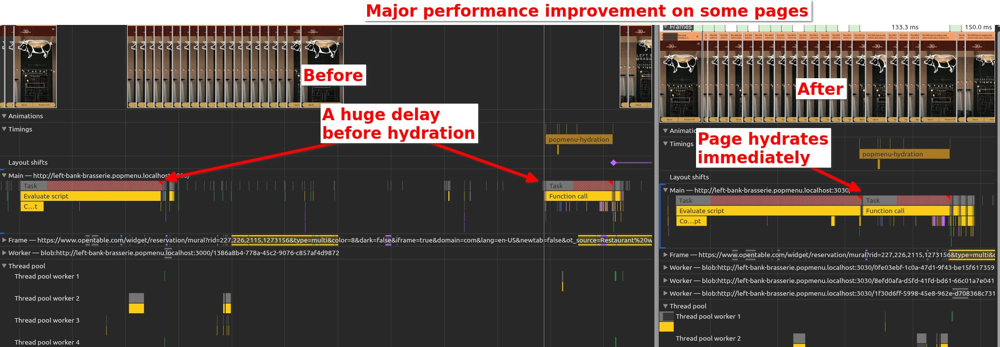

# React on Rails 16.0.0 Release Notes

Also see the [Changelog for 16.0.0](https://github.com/shakacode/react_on_rails/blob/master/CHANGELOG.md#1600---2025-01-xx).

**Note: Version 15.0.0 has been retracted. Please upgrade directly from v14 to v16.**

## Major Features

### 🚀 React Server Components Support

Experience the future of React with full RSC integration in your Rails apps:

- Seamlessly use React Server Components
- Reduce client bundle sizes
- Enable powerful new patterns for data fetching
- ⚡️ Requires React on Rails Pro - [See the full tutorial](https://www.shakacode.com/react-on-rails-pro/docs/react-server-components/tutorial/)

### 🚀 Major Performance Breakthrough: Early Hydration

**React on Rails now starts hydration even before the full page is loaded!** This revolutionary change delivers significant performance improvements across all pages:

- **Eliminates Race Conditions**: No more waiting for full page load before hydration begins
- **Faster Time-to-Interactive**: Components hydrate as soon as their server-rendered HTML reaches the client
- **Streaming HTML Optimization**: Perfect for modern streaming responses - components hydrate in parallel with page streaming
- **Async Script Safety**: Can use `async` scripts without fear of race conditions
- **No More Defer Needed**: The previous need for `defer` to prevent race conditions has been eliminated

This optimization is particularly impactful for:

- **Streamed pages** where content loads progressively
- **Large pages** with many components
- **Slow network conditions** where every millisecond counts
- **Modern web apps** requiring fast interactivity

_Performance improvement visualization:_



_The image above demonstrates the dramatic performance improvement:_

- **Left (Before)**: Hydration didn't start until the full page load completed, causing a huge delay before hydration
- **Right (After)**: Hydration starts immediately as soon as components are available, without waiting for full page load
- **Result**: Components now become interactive much faster, eliminating the previous race condition delays

### Enhanced Script Loading Strategies

- New configuration option `generated_component_packs_loading_strategy` replaces `defer_generated_component_packs`
- Supports three loading strategies:
  - `:async` - Loads scripts asynchronously (default for Shakapacker ≥ 8.2.0)
  - `:defer` - Defers script execution until after page load (doesn't work well with Streamed HTML as it will wait for the full page load before hydrating the components)
  - `:sync` - Loads scripts synchronously (default for Shakapacker < 8.2.0) (better to upgrade to Shakapacker 8.2.0 and use `:async` strategy)
- Improves page performance by optimizing how component packs are loaded

## Breaking Changes

### Component Hydration Changes

- The `defer_generated_component_packs` configuration has been deprecated. Use `generated_component_packs_loading_strategy` instead.
- The `generated_component_packs_loading_strategy` defaults to `:async` for Shakapacker ≥ 8.2.0 and `:sync` for Shakapacker < 8.2.0.
- The `immediate_hydration` configuration now defaults to `false`. **Note: `immediate_hydration` is a React on Rails Pro (licensed) feature.**
- When `generated_component_packs_loading_strategy: :async` and `immediate_hydration: true` are configured together, they optimize component hydration. Components hydrate as soon as their code and server-rendered HTML are available, without waiting for the full page to load. This parallel processing significantly improves time-to-interactive by eliminating the traditional waterfall of waiting for page load before beginning hydration (It's critical for streamed HTML).

  - The previous need for deferring scripts to prevent race conditions has been eliminated due to improved hydration handling. Making scripts not defer is critical to execute the hydration scripts early before the page is fully loaded.
  - The `immediate_hydration` configuration (React on Rails Pro licensed feature) makes `react-on-rails` hydrate components immediately as soon as their server-rendered HTML reaches the client, without waiting for the full page load.
  - To enable optimized hydration, you can set `immediate_hydration: true` in your `config/initializers/react_on_rails.rb` file (requires React on Rails Pro license).
    - You can also enable it for individual components by passing `immediate_hydration: true` to `react_component` or `stream_react_component`.
  - Redux store now supports the `immediate_hydration` option (React on Rails Pro licensed feature), which defaults to `config.immediate_hydration` (and so to `false` if that isn't set). If `true`, the Redux store will hydrate immediately as soon as its server-side data reaches the client.
    - You can override this behavior for individual Redux stores by calling the `redux_store` helper with `immediate_hydration: true` or `immediate_hydration: false`, same as `react_component`.

- `ReactOnRails.reactOnRailsPageLoaded()` is now an async function:

  - If you manually call this function to ensure components are hydrated (e.g., with async script loading), you must now await the promise it returns:

    ```js
    // Before
    ReactOnRails.reactOnRailsPageLoaded();
    // Code expecting all components to be hydrated

    // After
    await ReactOnRails.reactOnRailsPageLoaded();
    // Code expecting all components to be hydrated
    ```

  - If you call it in a `turbolinks:load` listener to work around the issue documented in [Turbolinks](../rails/turbolinks.md#async-script-loading), the listener can be safely removed.

### Script Loading Strategy Migration

- If you were previously using `defer_generated_component_packs: true`, use `generated_component_packs_loading_strategy: :defer` instead
- If you were previously using `defer_generated_component_packs: false`, use `generated_component_packs_loading_strategy: :sync` instead
- For optimal performance with Shakapacker ≥ 8.2.0, consider using `generated_component_packs_loading_strategy: :async`

### ESM-only package

The package is now published as ES Modules instead of CommonJS. In most cases it shouldn't affect your code, as bundlers will be able to handle it. However:

- If you explicitly use `require('react-on-rails')`, and can't change to `import`, upgrade to Node v20.19.0+ or v22.12.0+. They allow `require` for ESM modules without any flags. Node v20.17.0+ with `--experimental-require-module` should work as well.
- If you run into `TS1479: The current file is a CommonJS module whose imports will produce 'require' calls; however, the referenced file is an ECMAScript module and cannot be imported with 'require'.` TypeScript error, you'll need to [upgrade to TypeScript 5.8 and set `module` to `nodenext`](https://www.typescriptlang.org/docs/handbook/release-notes/typescript-5-8.html#support-for-require-of-ecmascript-modules-in---module-nodenext).

Finally, if everything else fails, please contact us and we'll help you upgrade or release a dual ESM-CJS version.

### `globalThis`

[`globalThis`](https://developer.mozilla.org/en-US/docs/Web/JavaScript/Reference/Global_Objects/globalThis) is now used in code.
It should be available in browsers since 2020 and in Node, but in case your environment doesn't support it, you'll need to shim it using [globalthis](https://www.npmjs.com/package/globalthis) or [core-js](https://www.npmjs.com/package/core-js).

## Store Dependencies for Components

When using Redux stores with multiple components, you need to explicitly declare store dependencies to optimize hydration. Here's how:

### The Problem

If you have deferred Redux stores and components like this:

```erb
<% redux_store("SimpleStore", props: @app_props_server_render, defer: true) %>
<%= react_component('ReduxApp', {}, {prerender: true}) %>
<%= react_component('ComponentWithNoStore', {}, {prerender: true}) %>
<%= redux_store_hydration_data %>
```

By default, React on Rails assumes components depend on all previously created stores. This means:

- Neither `ReduxApp` nor `ComponentWithNoStore` will hydrate until `SimpleStore` is hydrated
- Since the store is deferred to the end of the page, both components are forced to wait unnecessarily

### The Solution

Explicitly declare store dependencies for each component:

```erb
<% redux_store("SimpleStore", props: @app_props_server_render, defer: true) %>
<%= react_component('ReduxApp', {}, {
  prerender: true
  # No need to specify store_dependencies: it automatically depends on SimpleStore
}) %>
<%= react_component('ComponentWithNoStore', {}, {
  prerender: true,
  # Explicitly declare no store dependencies
  store_dependencies: []
}) %>
<%= redux_store_hydration_data %>
```

This allows `ComponentWithNoStore` to hydrate immediately without waiting for `SimpleStore`, improving page performance.
