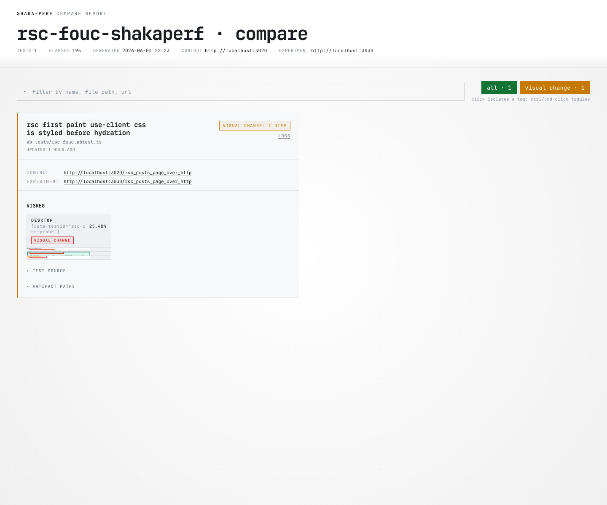
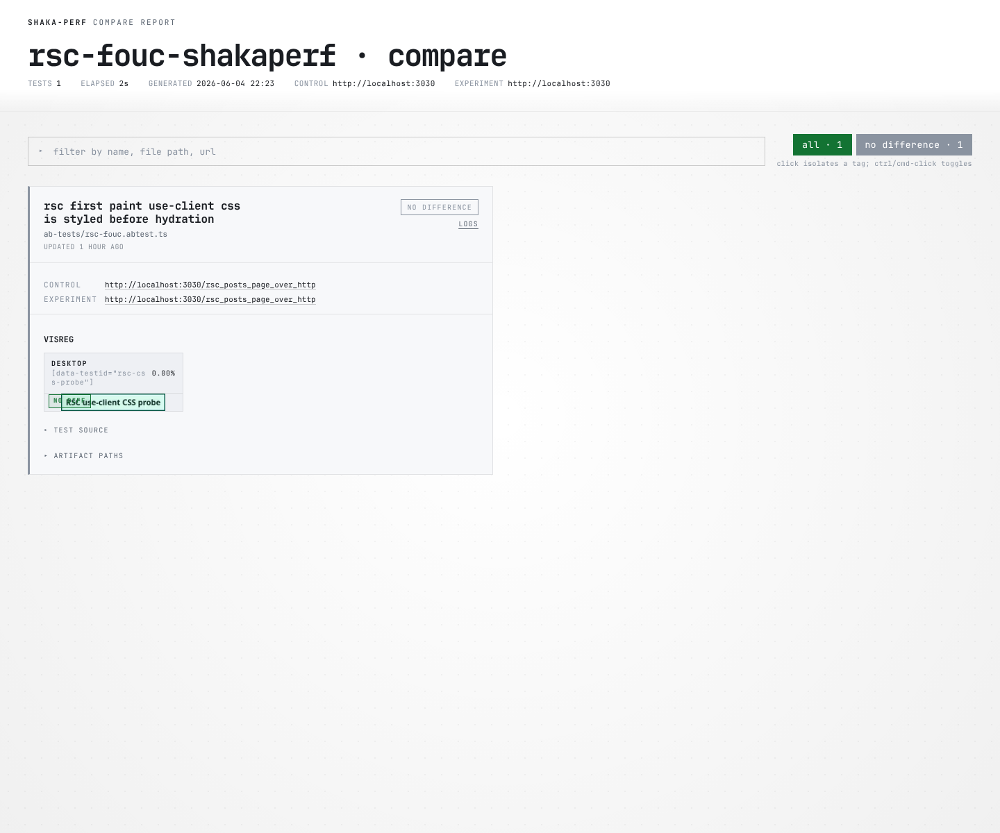
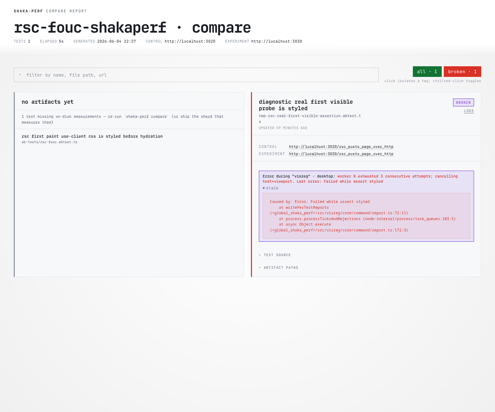

# RSC FOUC ShakaPerf Investigation

> **Status note (2026-07-09):** This is a dated investigation snapshot. The "Implementation
> comparison" below describes two implementations that have both since been superseded: the
> downstream `<link precedence="ror-rsc">` tree-wrapping bridge
> ([react_on_rails#3587](https://github.com/shakacode/react_on_rails/pull/3587)) no longer exists
> in the code (no `ror-rsc` references remain), and the upstream direction evolved into today's
> two-part design — `preinit` hint rows fired from the client-manifest Proxy in
> `react-on-rails-rsc` plus the `injectRSCPayload` stream transform (preload promotion,
> Flight-chunk inference, reveal deferral) in React on Rails Pro. For the current mechanism, see
> [docs/pro/react-server-components/css-and-styling.md → How CSS reaches the browser](../../docs/pro/react-server-components/css-and-styling.md#how-css-reaches-the-browser).
> Unit tests now exist at `packages/react-on-rails-pro/tests/injectRSCPayload.test.ts`. The
> ShakaPerf evidence and test-pattern guidance below remain valid.

## Verdict

| Area                         | Status               | Finding                                                                                  |
| ---------------------------- | -------------------- | ---------------------------------------------------------------------------------------- |
| React on Rails dummy app     | Proven               | Current `main` fixes the RSC `use client` CSS FOUC repro.                                |
| Old/pre-fix React on Rails   | Proven               | Reproduces the bug as an unstyled first paint.                                           |
| ShakaPerf coverage           | Proven for dummy app | ShakaPerf catches the old/fixed difference and passes fixed/fixed.                       |
| hichee downstream validation | Not proven yet       | Package/manifest evidence exists. ShakaPerf browser proof is still TODO.                 |
| Unit tests                   | Not delivered here   | Add after hichee is ShakaPerf-proven and/or the upstream package fix is released/pinned. |

## Bug target

The bug is CSS for a React Server Components client boundary arriving too late or not being emitted with the RSC response.

Failure mode:

1. An RSC page renders a component behind a `'use client'` boundary.
2. That client component imports CSS.
3. The server output does not include a stylesheet signal for that CSS before the boundary is painted.
4. The user can see the component with transparent background, default text color, no padding, and no border radius before the CSS is applied.

The fixed behavior is that RSC CSS is represented before hydration, so the boundary is styled at first visible paint.

## ShakaPerf results

### ShakaPerf report screenshots

Old/pre-fix vs current/fixed first paint. ShakaPerf reports a visual change (`25.48%`) on the RSC CSS probe.

Current/fixed vs current/fixed first paint. Same test, same fixed side on both servers. ShakaPerf reports no difference (`0.00%`).

Natural first-visible assertion. This does not block app JS; the old/pre-fix side fails the first-visible computed-style assertion.

### Selector screenshots

Old/pre-fix selector capture: unstyled first paint.

Current/fixed selector capture: styled first paint.

### Test matrix

| Test                                  | Control       | Experiment    | ShakaPerf result        | Investigation result                              | Purpose                                                                         |
| ------------------------------------- | ------------- | ------------- | ----------------------- | ------------------------------------------------- | ------------------------------------------------------------------------------- |
| Deterministic first-paint visual test | old/pre-fix   | current/fixed | FAIL: 1 visual mismatch | PASS: real A/B diff detected                      | Blocks app JS before navigation to isolate server-rendered first paint.         |
| Deterministic first-paint visual test | current/fixed | current/fixed | PASS                    | PASS                                              | Control run proving the test is stable when both sides are fixed.               |
| Natural first-visible assertion       | old/pre-fix   | current/fixed | FAIL: assertion error   | PASS: old side is unstyled at first visible frame | Does not block JS. Uses `waitUntil: "commit"` and RAF computed-style assertion. |
| Natural first-visible assertion       | current/fixed | current/fixed | PASS                    | PASS                                              | Control run proving the assertion is not inherently flaky.                      |

### Main ShakaPerf evidence

| Evidence                                    | Result                                                                                                                       | Artifact                                                                                                                                                                                                                                                                            |
| ------------------------------------------- | ---------------------------------------------------------------------------------------------------------------------------- | ----------------------------------------------------------------------------------------------------------------------------------------------------------------------------------------------------------------------------------------------------------------------------------- |
| Old/pre-fix first-paint probe image         | `840x24`, expected green CSS `0.0%`, white/plain background `95.12%`, dark text `1.45%`.                                     | [image](rsc-fouc-shakaperf-artifacts/images/first-paint-old-unstyled-probe.png)                                                                                                                                                                                                     |
| Current/fixed first-paint probe image       | `214x36`, expected green CSS `70.35%`, white/plain background `0.0%`.                                                        | [image](rsc-fouc-shakaperf-artifacts/images/first-paint-current-styled-probe.png)                                                                                                                                                                                                   |
| Old/pre-fix vs current/fixed visual diff    | `1851` diff pixels.                                                                                                          | [ShakaPerf report screenshot](rsc-fouc-shakaperf-artifacts/images/shakaperf-first-paint-old-vs-current-report.png), [selector diff](rsc-fouc-shakaperf-artifacts/images/first-paint-old-vs-current-diff.png)                                                                        |
| Current/fixed vs current/fixed visual diff  | `0` diff pixels.                                                                                                             | [ShakaPerf report screenshot](rsc-fouc-shakaperf-artifacts/images/shakaperf-first-paint-current-vs-current-report.png), [report](rsc-fouc-shakaperf-artifacts/reports/first-paint-current-vs-current/full-report.html)                                                              |
| Natural first-visible old/pre-fix assertion | `backgroundColor: rgba(0, 0, 0, 0)`, `color: rgb(0, 0, 0)`, `padding: 0px`, `borderRadius: 0px`, `width: 840`, `height: 24`. | [log](rsc-fouc-shakaperf-artifacts/logs/natural-first-visible-old-vs-current.log), [old image](rsc-fouc-shakaperf-artifacts/images/natural-first-visible-old-unstyled-probe.png), [fixed image](rsc-fouc-shakaperf-artifacts/images/natural-first-visible-current-styled-probe.png) |

### ShakaPerf limitation / workaround

This is not a global ShakaPerf limitation.

Normal settled screenshots can miss transient FOUC because ShakaPerf captures after page preparation and the test function complete. For this bug, two valid patterns worked:

1. deterministic first-paint isolation: block app JS in `beforeNavigate`, then compare the server-rendered first paint;
2. natural first-visible assertion: do not block JS, navigate with `waitUntil: "commit"`, and assert computed styles on the first visible animation frame.

For a pure visual "capture exactly at first visible frame" report card, ShakaPerf would need a first-class capture hook inside the test function or a dedicated first-visible capture mode.

## Artifact index

Artifacts: [rsc-fouc-shakaperf-artifacts/](rsc-fouc-shakaperf-artifacts/)

Artifact index: [rsc-fouc-shakaperf-artifacts/README.md](rsc-fouc-shakaperf-artifacts/README.md)

### ShakaPerf setup and tests

| Area                                      | Artifacts                                                                                                                                      |
| ----------------------------------------- | ---------------------------------------------------------------------------------------------------------------------------------------------- |
| Setup/test bundle                         | [README](rsc-fouc-shakaperf-artifacts/setup/README.md)                                                                                         |
| Deterministic first-paint AB test         | [rsc-fouc.abtest.ts](rsc-fouc-shakaperf-artifacts/setup/ab-tests/rsc-fouc.abtest.ts)                                                           |
| Natural first-visible assertion AB test   | [natural-first-visible-assertion.abtest.ts](rsc-fouc-shakaperf-artifacts/setup/ab-tests/natural-first-visible-assertion.abtest.ts)             |
| Main ShakaPerf config                     | [abtests.config.ts](rsc-fouc-shakaperf-artifacts/setup/config/abtests.config.ts)                                                               |
| Twin server setup                         | [Dockerfile](rsc-fouc-shakaperf-artifacts/setup/twin-servers/Dockerfile), [Procfile](rsc-fouc-shakaperf-artifacts/setup/twin-servers/Procfile) |
| Generated ShakaPerf instructions followed | [setup/generated-shakaperf-skills/](rsc-fouc-shakaperf-artifacts/setup/generated-shakaperf-skills/)                                            |

### Key ShakaPerf reports

| Run                                                            | Report                                                                                                             | Log                                                                                   |
| -------------------------------------------------------------- | ------------------------------------------------------------------------------------------------------------------ | ------------------------------------------------------------------------------------- |
| Old/pre-fix vs current/fixed deterministic first paint         | [full-report.html](rsc-fouc-shakaperf-artifacts/reports/first-paint-old-vs-current/full-report.html)               | [log](rsc-fouc-shakaperf-artifacts/logs/first-paint-old-vs-current.log)               |
| Current/fixed vs current/fixed deterministic first paint       | [full-report.html](rsc-fouc-shakaperf-artifacts/reports/first-paint-current-vs-current/full-report.html)           | [log](rsc-fouc-shakaperf-artifacts/logs/first-paint-current-vs-current.log)           |
| Old/pre-fix vs current/fixed natural first-visible assertion   | [full-report.html](rsc-fouc-shakaperf-artifacts/reports/natural-first-visible-old-vs-current/full-report.html)     | [log](rsc-fouc-shakaperf-artifacts/logs/natural-first-visible-old-vs-current.log)     |
| Current/fixed vs current/fixed natural first-visible assertion | [full-report.html](rsc-fouc-shakaperf-artifacts/reports/natural-first-visible-current-vs-current/full-report.html) | [log](rsc-fouc-shakaperf-artifacts/logs/natural-first-visible-current-vs-current.log) |

## Implementation comparison

### Downstream React on Rails implementation

Reference: [react_on_rails#3587](https://github.com/shakacode/react_on_rails/pull/3587)

General shape:

- patches `react-on-rails-rsc@19.0.4` locally so client-reference manifest entries include `css?: string[]`;
- adds a React on Rails Pro resolver that dedupes, sorts, and prefixes those CSS hrefs;
- wraps the RSC tree with React 19 `<link rel="stylesheet" precedence="ror-rsc">` elements before `renderToPipeableStream`;
- relies on React 19 stylesheet precedence behavior to hoist/block stylesheet application before the boundary commits;
- includes downstream integration around Rails asset paths and the Pro renderer.

### Upstream package implementation

References:

- [react_on_rails_rsc#35](https://github.com/shakacode/react_on_rails_rsc/pull/35)
- [React fork commit `4c02caac8888e8e8b6145bc2780a8145cb2c921a`](https://github.com/AbanoubGhadban/react/commit/4c02caac8888e8e8b6145bc2780a8145cb2c921a)

General shape:

- records CSS metadata in the RSC client manifest;
- wraps component-shaped client references with stylesheet link records at the package/loader layer;
- sets `globalThis.__reactFlightClientManifest` during server render so React can find the manifest;
- changes deferred Suspense replacement from `$RC` to `$RR` where needed so replacement waits for CSS.

### Comparison

| Layer                              | Downstream implementation                                            | Upstream package implementation                                    |
| ---------------------------------- | -------------------------------------------------------------------- | ------------------------------------------------------------------ |
| Manifest CSS metadata              | Yes, via local `pnpm` patch against `react-on-rails-rsc@19.0.4`.     | Yes, in package/plugin code.                                       |
| Where stylesheet links are emitted | React on Rails Pro renderer wraps the RSC tree.                      | Package/loader layer wraps client references.                      |
| Deferred Suspense CSS gating       | Relies on React 19 stylesheet precedence behavior for emitted links. | Adds React `$RR` behavior for deferred replacement waiting on CSS. |
| Rails asset prefix handling        | Explicitly handled by the downstream resolver.                       | Needs integration/pinning verification downstream.                 |
| Status                             | Merged downstream bridge.                                            | Open/upstream package work.                                        |

Conclusion: the implementations overlap but are not identical. The downstream implementation is a bridge/integration fix for React on Rails. The upstream package implementation is the more complete package-level direction. Once the upstream package fix is released and pinned, the downstream bridge should be reviewed for deletion or reduction to Rails-specific integration only.

## Related React on Rails package update

Reference: [react_on_rails#3577](https://github.com/shakacode/react_on_rails/pull/3577)

Status:

- open;
- updates to `react-on-rails-rsc 19.0.5-rc.5`;
- includes expectations around RSC stream CSS records/preload behavior;
- should be rechecked after the upstream package fix is released and pinned.

Current npm dist-tags observed during the investigation:

| Tag      | Version       |
| -------- | ------------- |
| `latest` | `19.0.4`      |
| `rc`     | `19.0.5-rc.5` |

## hichee downstream validation

Reference: private `shakacode/hichee#9379`.

This is not proven with ShakaPerf yet. What we have so far is package and manifest evidence:

- PR head uses vendored `react-on-rails-rsc-19.0.5-rc.1`;
- that package contains the upstream RSC CSS metadata/loader/server-global path;
- the hichee patch path also handles ReScript `make` exports;
- local production manifests show CSS metadata on the PR/head side and none on the compared base side.

Manifest evidence from the local production build artifacts:

| hichee side | Manifest entries | Entries with CSS | Unique CSS files |
| ----------- | ---------------: | ---------------: | ---------------: |
| base        |               92 |                0 |                0 |
| PR head     |              101 |               87 |                5 |

No hichee browser/ShakaPerf proof is claimed here. That is still the next step.

## Unit-test plan

No new unit tests are included in this PR.

The safest order is:

1. prove hichee with ShakaPerf;
2. confirm whether the downstream bridge stays or is replaced by the upstream package fix;
3. add unit tests against that final path.

Good unit-test targets after that:

| Test                                                                                           | Location / owner                                         |
| ---------------------------------------------------------------------------------------------- | -------------------------------------------------------- |
| client-reference manifest entries include CSS metadata for CSS imported behind `'use client'`; | upstream package or downstream patch if bridge remains   |
| CSS href resolver handles prefix, dedupe, sort, and missing `css`;                             | downstream React on Rails Pro if resolver remains        |
| renderer emits React 19 stylesheet links from manifest CSS;                                    | downstream React on Rails Pro if renderer bridge remains |
| unpatched/no-CSS manifests behave as no-op;                                                    | downstream React on Rails Pro                            |
| ReScript `make` exports are classified as component-shaped client references;                  | upstream package if ReScript support is required there   |
| hichee RSC page does not first-paint unstyled;                                                 | ShakaPerf visual/assertion coverage, not unit-level      |

## Follow-ups

Status as of 2026-07-09 — items 2–4 are resolved history (see the status note at the top):

1. Prove the hichee branch with ShakaPerf. **Still open.**
2. ~~Recheck `react_on_rails#3577` after the upstream package fix is released/pinned.~~ **Resolved:**
   [#3577](https://github.com/shakacode/react_on_rails/pull/3577) merged; the rollout has since moved
   to the coordinated `react-on-rails-rsc` 19.2.x line.
3. ~~Decide whether the downstream bridge in `react_on_rails#3587` should stay, shrink to Rails asset
   integration, or be removed after upstream package adoption.~~ **Resolved:** the
   [#3587](https://github.com/shakacode/react_on_rails/pull/3587) `ror-rsc` tree-wrapping bridge was
   removed; the current design is the `preinit` hint layer plus the `injectRSCPayload` stream
   transform (see status note).
4. ~~Add unit tests after the target integration path is settled.~~ **Resolved:** unit tests for the
   settled path exist at `packages/react-on-rails-pro/tests/injectRSCPayload.test.ts`.
5. If we want ShakaPerf to produce a first-visible screenshot without blocking JS, add/request a first-visible capture hook or capture mode. Filed as [shakaperf#55](https://github.com/shakacode/shakaperf/issues/55) (2026-07-09).
