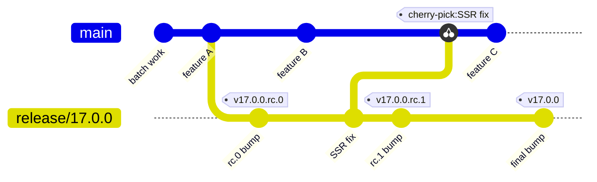
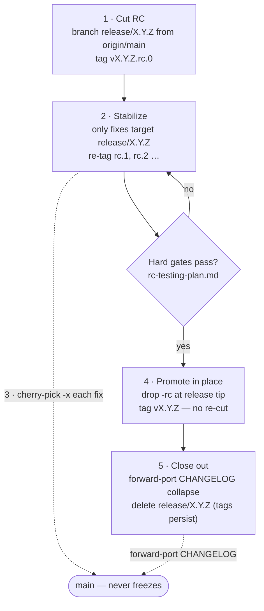
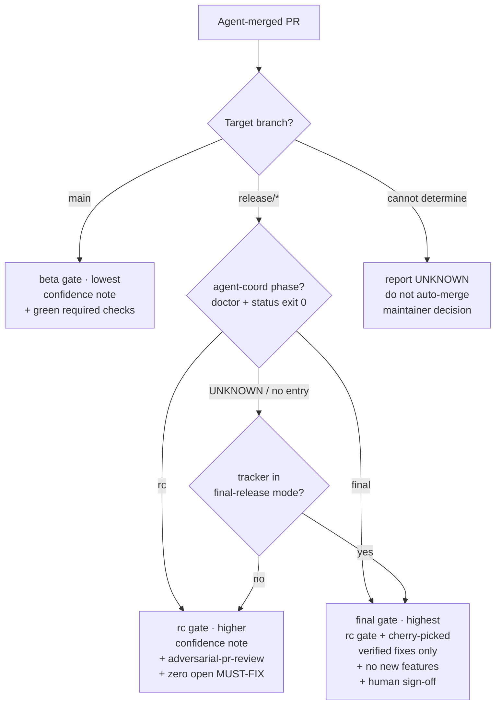

# Release-Train Runbook

How React on Rails cuts, stabilizes, and ships a release while `main` keeps absorbing batch work,
and how the per-branch **release phase** selects the agent merge gate.

This is contributor-only release-process documentation. It lives in `internal/contributor-info/`
because it coordinates maintainer-only go/no-go decisions and private validation. It is the
**branching strategy** companion to:

- [`releasing.md`](releasing.md) — the mechanical `rake release` steps (version bumps, publishing, tags).
- [`rc-testing-plan.md`](rc-testing-plan.md) — the hard-gate / smoke-evidence validation that decides whether an RC is good.
- [`release-verification-runbook.md`](release-verification-runbook.md) — the behavioral verification lanes (upgrade dry-run, debut-feature abuse pass, stress/soak, changelog and artifact audits) run against each RC.
- [`agent-coordination-backend.md`](agent-coordination-backend.md) — how the current phase is published to agents.

`AGENTS.md` carries the short, canonical policy (the phase→gate table and the branching rules an agent
must follow). If this runbook ever conflicts with `AGENTS.md`, `AGENTS.md` wins.

## Why a release train

React on Rails is a library. Most consumer apps ship many times a day and tolerate `main` churn, but
some pin exact versions, so the **published** release must be far more careful than `main`.

Batch engineering merges PRs into `main` continuously; release stabilization wants the opposite — a
frozen, known-good commit set. If we cut a release candidate (RC) straight from `main` and keep
merging, then by the time we promote that RC to final, `main` has drifted. We would have to either
re-test everything (slow, kills batch throughput) or ship a final that contains untested commits.

The release train separates "keep merging" from "stabilize a release":

- `main` never freezes. It keeps absorbing batch work the whole time.
- A short-lived **release branch** holds the frozen, stabilizing commit set. RCs are tagged there.
- **Final = promote the last good RC**, not a re-cut from `main`. Extra `main` commits since the RC
  roll into the next version automatically.

The whole train at a glance — `main` keeps moving while `release/17.0.0` stabilizes, every fix is
cherry-picked back to `main`, and the final is the last good RC promoted in place (no re-cut):



## Decision: ephemeral `release/X.Y.Z`, not one long-lived `releases` branch

We use an **ephemeral per-version `release/X.Y.Z` branch**, cut at RC time and deleted after the final
ships. We do **not** keep a single long-lived `releases` branch reset each cycle.

Rationale:

- **Honest history.** A per-version branch's commits are exactly "what shipped in X.Y.Z." A reset
  long-lived branch rewrites that history every cycle, so `git log releases` stops meaning anything and
  the reflog becomes the only record of a past release line.
- **Parallel release lines.** A patch on the previous minor (e.g. `release/16.7.1`) can be stabilized at
  the same time as the next minor's RC (`release/17.0.0`). One shared branch cannot represent two live
  release lines at once.
- **No destructive reset on shared history.** Resetting/force-pushing one long-lived branch each cycle
  collides head-on with the repo rule against `reset --hard` / force-push that drops commits on a branch
  others may have based work on. Ephemeral branches are only ever appended to, then deleted.
- **Tags are the durable record.** Every `vX.Y.Z*` tag is immutable, so deleting the branch after the
  release loses nothing — the tags fully reconstruct the release line. The branch is scaffolding.
- **Cleaner gate signal.** "Is this PR targeting a `release/*` branch?" is a precise, machine-readable
  RC/final signal (see [Phase-tiered merge gating](#phase-tiered-merge-gating)). A single `releases`
  branch would force tooling to ask "which cycle is this branch in right now?" instead.

Cost we accept: branch names are not a fixed string, so tooling keys off the `release/*` glob plus the
published phase rather than one hard-coded ref. If a single stable name is ever needed (for a dashboard
or webhook), point a `releases` **tag or symbolic ref** at the active release branch instead of making
it the working branch.

Naming: `release/X.Y.Z` where `X.Y.Z` is the final target (no `-rc` suffix). The same branch carries
every RC for that target (`vX.Y.Z.rc.0`, `.rc.1`, …) and the final `vX.Y.Z` tag.

## The phases

A release moves through three phases. The phase is a property of the **target branch**, so an agent can
read it without being told (see [Phase-tiered merge gating](#phase-tiered-merge-gating)).

| Phase     | Where it lives                         | What is happening                                                                 |
| --------- | -------------------------------------- | --------------------------------------------------------------------------------- |
| **beta**  | `main`                                 | Continuous batch work. Features and fixes land freely. `main` may be unstable.    |
| **rc**    | `release/X.Y.Z` (stabilizing)          | Only stabilizing fixes land. RCs are tagged and validated against the hard gates. |
| **final** | `release/X.Y.Z` (promotion) → `vX.Y.Z` | Promotion freeze. No new work; the last good RC becomes the final.                |

Phase is the **gate selector**. It composes with the existing release **mode**
(`development` / `accelerated-rc` / `strict-rc` / `final-release`) from the release tracker, which tunes
the auto-merge automation _within_ a phase. See
[Phase vs. release mode](#phase-vs-release-mode).

## Runbook

The git mechanics below were validated end-to-end with a local dry-run (see
[Dry-run](#dry-run-validate-the-mechanics)).

The five steps mapped onto the two branches. The solid path is the release branch (1 → 2 → 4 → 5);
step 3 is not a separate stage — it runs _during_ stabilization, so it appears as a dotted
forward-port arrow to `main` rather than a node in the main flow. The step-5 close-out likewise
forward-ports the CHANGELOG. `main` never freezes:



> **Note:** Worked examples use the concrete version `17.0.0` (and branch `release/17.0.0`, tags
> `v17.0.0.rc.N` / `v17.0.0`) for clarity, because the repo is on `v17.0.0.rc.3` as this runbook lands.
> Substitute your actual target version everywhere you see `17.0.0` / `release/17.0.0` / `v17.0.0*`; the
> generic form is `X.Y.Z`.

### 1. Cut the RC onto `release/X.Y.Z`

Do this when maintainers decide `main` is feature-complete for the target and want to start stabilizing.

Starting a release line is two steps with a CI run between them — cutting the branch and tagging rc.0
**cannot** be one command. The release CI gate evaluates the branch tip, and a freshly pushed
`release/X.Y.Z` has no checks yet (`no_checks`), so you create + push the branch, wait for CI, then
cut rc.0.

**Step 1a — create and push the release branch.** From `main`, run:

```bash
git checkout main && git pull --rebase
bundle exec rake "release:start[17.0.0]"   # create + push release/17.0.0 from origin/main, then stop for CI
```

`release:start` fetches `origin`, refuses if `release/17.0.0` already exists (local or remote), creates
the branch from `origin/main`, pushes it, and prints the next steps. With no version argument it derives
the release line from the top `### [X.Y.Z.rc.N]` CHANGELOG.md header. Pass the **stable base**
(`17.0.0`), never `17.0.0.rc.0` — the rc index lives in the changelog, not the branch name. Add a
second `true` argument for a dry run (`rake "release:start[17.0.0,true]"`).

If you prefer to do it by hand, the equivalent is:

```bash
git fetch origin
# Cut from the exact main commit you intend to stabilize.
git checkout -b release/17.0.0 origin/main
git push -u origin release/17.0.0
```

**Step 1b — cut rc.0 from the branch.** After at least one CI run finishes on the `release/17.0.0` tip,
ensure the rc changelog header is present (`$react-on-rails-update-changelog rc`
targeting the branch), then cut rc.0 with a
bare release — the version is read from CHANGELOG.md, so you do **not** pass `17.0.0.rc.0`:

```bash
# On release/17.0.0, with CHANGELOG.md stamped ### [17.0.0.rc.0]:
bundle exec rake release   # reads 17.0.0.rc.0 from CHANGELOG.md, bumps version.rb, tags v17.0.0.rc.0, publishes
```

**Forgot to start the line first?** If you run `bundle exec rake release` for an rc while still on
`main` and `release/X.Y.Z` does not exist yet, the release task **offers to start the release line for
you** (`Start the 17.0.0 release line now? [y/N]`); accepting runs the same `release:start` logic and
stops before tagging. If `release/X.Y.Z` already exists, the task stops and tells you to
`git checkout release/X.Y.Z` and re-run — this guards against tagging an rc off a drifted `main`.

> **The release task's CI gate evaluates the branch you release from.** `rakelib/release.rake` runs
> `validate_main_ci_status!`, which now fetches and evaluates the tip of the branch the release is cut
> from: `origin/release/X.Y.Z` when you run from a `release/*` branch (RC cut or final promotion), or
> `origin/main` otherwise. Cutting an RC from `release/X.Y.Z` therefore validates the release-branch
> tip, not `main`. (The non-runtime walk-back still applies, so a changelog/version-only tip is skipped
> back to the last runtime-bearing commit on that branch.) The ShakaPerf release gate likewise runs on
> the current branch ref. If the release branch was just pushed, wait for at least one CI run on that
> branch before cutting the first RC; otherwise the branch-tip gate can stop with a `no_checks` result.

A maintainer opens (or updates) the release tracker per [`rc-testing-plan.md`](rc-testing-plan.md) and
sets the mode to `accelerated-rc` or `strict-rc`. Publish the phase as `rc` for this release line so
agents pick up the RC gate automatically (see [Phase-tiered merge gating](#phase-tiered-merge-gating)).

`main` keeps moving the entire time. Nothing about cutting the RC freezes it.

### 2. Stabilize on the release branch

During the RC phase, **only stabilizing fixes** target `release/X.Y.Z`. New features keep targeting
`main` and wait for the next version.

Author each stabilizing fix as a PR **targeting `release/X.Y.Z`** (not `main`):

```bash
git fetch origin
git checkout -b fix/17.0.0-ssr-regression origin/release/17.0.0
# ...fix, test...
git push -u origin fix/17.0.0-ssr-regression
gh pr create --base release/17.0.0 --title "Fix SSR regression" --body "..."
```

Merge stabilizing PRs into `release/X.Y.Z`, then cut the next RC tag (`v17.0.0.rc.1`, …) from the
branch tip when maintainers want a new candidate to validate. Re-run the hard-gate validation in
[`rc-testing-plan.md`](rc-testing-plan.md) for each RC, and run the behavioral lanes in
[`release-verification-runbook.md`](release-verification-runbook.md) (upgrade dry-run,
debut-feature abuse pass, stress/soak, changelog and artifact audits) — they must be green or
explicitly waived before step 4 promotes the RC, except Lane 4b artifact defects, which must be
fixed by republishing.

> Targeting confusion is the most common mistake here. A fix opened against `main` during the RC phase
> does **not** reach the release unless it is forward-ported in step 3 (run in reverse: cherry-pick
> `main`→`release/X.Y.Z`). Prefer authoring stabilizing fixes against the release branch first.

### 3. Forward-port stabilizing fixes back to `main`

Every fix that lands on `release/X.Y.Z` must also reach `main`, or `main` regresses the moment the
release branch is deleted. Use `script/release-forward-port` first so the operation is dry-run-able,
idempotent, and skips RC version-bump commits. The helper uses **`git cherry-pick -x`** for commits it
applies; do not use a branch merge:

```bash
git fetch origin
git checkout main
git pull --rebase

# Inspect the plan first. Expect fix/CHANGELOG commits to be PICK and
# Bump version commits to be SKIP.
script/release-forward-port --source origin/release/17.0.0 --target main --dry-run

# Apply the same plan. The helper checks out the local target branch and cherry-picks with -x.
script/release-forward-port --source origin/release/17.0.0 --target main
git push   # or open a PR if main is protected / the fix needs review on main
```

- The helper skips commits already present on `main` using `(cherry picked from commit <sha>)`
  evidence when available, unless the footer-bearing target commit has a later standard `git revert` commit
  on the target branch. For already-applied patches without the footer, it uses `git cherry` as the
  candidate signal before matching the source patch-id to target history and checking for a later standard
  `git revert` of the matching target commit.
- `-x` appends `(cherry picked from commit <sha>)` so the forward-port is auditable and future
  helper runs can see the relationship.
- Known limitation: the "already forward-ported" skip still starts from history evidence. If a later
  target commit quotes the exact `(cherry picked from commit <sha>)` footer in its message body, that can
  look like `-x` evidence. Standard `git revert` commits of the footer-bearing target commit prevent the
  skip, so reverted picks are eligible to be picked again; inspect the dry-run plan before applying if a
  commit message intentionally quotes cherry-pick footers or if a revert was done manually without
  `git revert`.
- **Do not `git merge release/X.Y.Z` into `main`.** That drags the RC `Bump version to …rc.N` commits
  and the release-branch CHANGELOG layout onto `main`, which is exactly what we want to keep off `main`.
  Let the helper pick only eligible commits, or manually cherry-pick only the specific fix commit(s).
- Stable final `Bump version to X.Y.Z` commits are also skipped. If the release closeout needs their
  CHANGELOG content on `main`, use the manual fallback to take only those hunks and leave release-branch
  version-file changes behind.
- Manual fallback: if the helper reports a real conflict on an eligible fix, prefer resolving that
  specific cherry-pick in place with `git cherry-pick --continue` so the earlier successful picks are
  kept. If you instead run `git cherry-pick --abort`, only the current conflicting commit is abandoned;
  earlier picks in this run are already committed and safe. After fixing the conflict, rerun
  `script/release-forward-port` from the start: it is idempotent and skips commits already applied,
  then continues from the still-missing fix. Do not manually pick `Bump version to ...rc.N` commits.
- Manual inspection fallback: if the helper reports `MANUAL` for a merge commit or a release-only
  rollback, inspect whether any target hunks are needed. Apply those hunks manually if needed, then
  rerun the helper. If the inspected commit still appears as `MANUAL` and no target hunks are needed,
  rerun with `--ack-manual <sha>` for that commit so the helper can continue to later eligible picks.
  `--ack-manual` only accepts commits that the current plan marks `MANUAL`; it is an acknowledgement,
  not a blanket skip for normal `PICK` commits.
- If a fix is _also_ wanted for ongoing `main` development and is low-risk, it is acceptable to author
  it on `main` first and cherry-pick it onto `release/X.Y.Z` (step 2 in reverse). Pick one direction
  per fix and record which in the PR so the other branch is not missed.

### 4. Promote the last good RC to final (drop `-rc`, no re-cut)

When the hard gates pass for a specific RC, promote **that** RC. Do not re-cut from `main`.

**Scripted path (recommended).** `script/release-finish promote X.Y.Z` orchestrates this whole step:
it runs `git fetch`, asserts you are on `release/X.Y.Z` with a clean tree, verifies the tip equals the
accepted RC tag (`git diff --stat vX.Y.Z.rc.N` is empty), prompts you to collapse the rc CHANGELOG, then
asks for explicit confirmation before running `bundle exec rake release[X.Y.Z]`. It wraps — does not
replace — the rake promotion guards (`stable_release_branch_allowed?`,
`ensure_release_branch_promotes_tagged_rc!`). Preview the exact commands first with `--dry-run`:

```bash
script/release-finish promote 17.0.0 --dry-run   # prints every command, executes nothing
script/release-finish promote 17.0.0             # runs it, with a confirmation before rake release
```

By default it resolves the highest `v17.0.0.rc.N` tag as the accepted RC; pass `--rc-tag v17.0.0.rc.3`
to pin a specific one. The manual equivalent the script runs is below.

```bash
git fetch origin
git checkout release/17.0.0
# The branch tip MUST be the last good RC commit (e.g. the v17.0.0.rc.3 commit).
git rev-parse HEAD            # confirm it equals the tag of the good RC
git diff --stat v17.0.0.rc.3  # expect: empty (no drift since the good RC)
```

Collapse the RC CHANGELOG sections into the final section and bump to the final version, then release —
this is the only code change between the good RC and the final:

```bash
# $react-on-rails-update-changelog release   (collapses rc sections into ### [17.0.0])
bundle exec rake "release[17.0.0]"   # version.rb rc.3 -> 17.0.0, tags v17.0.0, publishes
```

> **Run the stable promotion from `release/X.Y.Z` itself.** `rakelib/release.rake` allows a stable
> (non-prerelease) `release[X.Y.Z]` from `main` **or** from the matching `release/X.Y.Z` branch (the
> `stable_release_branch_allowed?` guard); the branch name must match the target version exactly, so you
> cannot promote `17.0.0` from `release/16.7.1`. There is no re-cut from `main` and no manual tag dance —
> promote the RC in place. The CI gate validates the `release/X.Y.Z` tip (see the step-1 note), and the
> task still pushes the version-bump commit, runs the ShakaPerf release gate on the branch ref, tags
> `vX.Y.Z`, and publishes, exactly as it does from `main`. Release-branch final promotion may ignore
> newer prerelease tags from another line (for example `17.1.0.beta.1` while promoting `17.0.0`), but a
> newer stable tag still blocks promotion so npm `latest` cannot move backward.

The invariant that makes this safe (verified by the dry-run): the **final's runtime code tree equals
the last good RC's** — only version/changelog **metadata** differs, never runtime source. Under unified
versioning the release task bumps several version artifacts in one commit (the gem `version.rb`, the Pro
gem version, every workspace `package.json`, and any lockfiles it updates) plus `CHANGELOG.md`. Untested
commits that landed on `main` after the cut are **not** in the final.

```bash
# Expect only version/changelog metadata — version.rb, the Pro version file, package.json files,
# lockfiles, and CHANGELOG.md — and no runtime source (.rb/.ts/.tsx/.js under lib or src) changes:
git diff --name-only v17.0.0.rc.3 v17.0.0
```

`final` is the strictest phase: no new features, only cherry-picked fully-verified fixes if an RC must
be re-spun, and an explicit human sign-off on the promotion itself (see
[Phase-tiered merge gating](#phase-tiered-merge-gating)). Set the mode to `final-release` on the tracker
and publish phase `final` for the release line during the promotion freeze.

### 5. Close out the release line

**Scripted path (recommended).** `script/release-finish close-out X.Y.Z` orchestrates this step: it runs
`git fetch`, asserts you are on `main` with a clean tree, shows the real `script/release-forward-port`
dry-run plan, then asks for explicit confirmation before applying the forward-port and, separately,
before deleting the release branch on the remote. It shells out to the existing
`script/release-forward-port` interface (it does not re-implement forward-porting), so the same plan,
skips, and `MANUAL` handling described in step 3 apply. Preview everything first with `--dry-run`:

```bash
git fetch origin
git checkout main
git pull --rebase
script/release-finish close-out 17.0.0 --dry-run   # prints commands + the real forward-port plan
script/release-finish close-out 17.0.0             # applies, with confirmations before each outward op
# Then `git push` the forward-ported commits to main (or open a PR if main is protected).
```

The manual equivalent the script wraps is below.

```bash
# After v17.0.0 is published and the GitHub release exists:
# 1. Forward-port any remaining release-branch commits to main:
git fetch origin
git checkout main
git pull --rebase

# The helper skips rc version bumps and already-forward-ported fixes.
# It reports stable final version bumps as MANUAL so CHANGELOG extraction is explicit.
script/release-forward-port --source origin/release/17.0.0 --target main --dry-run
script/release-forward-port --source origin/release/17.0.0 --target main
git push   # or open a PR if main is protected
# 2. Delete the ephemeral branch — the tags are the durable record.
git push origin --delete release/17.0.0
```

> **Caveat — do not blindly cherry-pick version-bump commits.** The helper always skips
> `Bump version to ...rc.N` commits. For stable non-RC version bumps, the helper always marks the commit
> `MANUAL`, regardless of `main`'s current version, so the operator explicitly decides whether to extract
> only the CHANGELOG hunks. For prerelease non-RC bumps (for example `beta` or `dev`), it compares
> `main`'s current version to the commit subject and skips with an explicit version-drift message when
> `main` has already advanced past the release version (e.g. to `17.1.0.dev`) or already has that version.
> If the skipped final version-bump commit also contains the only CHANGELOG collapse you need on `main`,
> use the manual fallback: cherry-pick that one commit, resolve version artifacts to keep `main`'s newer
> version, keep only the intended CHANGELOG changes, and preserve a `(cherry picked from commit <sha>)`
> footer in the final commit message. Then bump `main` to the next dev version per
> [`releasing.md`](releasing.md) if it is not already.

See [`releasing.md`](releasing.md) for the next-dev version bump details.

Mark the release tracker released per [`rc-testing-plan.md`](rc-testing-plan.md), and clear the
published phase for this line (the entry is removed when the branch is deleted) so agents stop applying
the RC/final gate. This is consistent with the "never down-gate `release/*` to `beta`" rule: phase always
derives from the **target branch**, and once `release/X.Y.Z` is deleted the only remaining target for this
line is `main`, which derives to `beta` — not because the entry is absent, but because no `release/*`
target exists anymore.

## Phase-tiered merge gating

The merge-gate strictness for an agent-merged PR is a **function of the target branch's release phase**.
This formalizes the attention-contract gating levels (#3975): maintainer attention is spent only on
judgment; everything machine-checkable is handled autonomously with evidence.

| Phase     | Target            | Agent merge gate (lowest → highest)                                                                                                                                                                                                        |
| --------- | ----------------- | ------------------------------------------------------------------------------------------------------------------------------------------------------------------------------------------------------------------------------------------ |
| **beta**  | `main`            | **Lowest.** Confidence note + green required checks. Fast iteration; `main` may be unstable.                                                                                                                                               |
| **rc**    | `release/*`       | **Higher.** Confidence note + adversarial-pr-review + **zero open MUST-FIX**. Only stabilizing fixes reach `release/*`; features still allowed on `main`.                                                                                  |
| **final** | `release/*` → tag | **Highest.** Everything `rc` requires (adversarial-pr-review + **zero open MUST-FIX**) **plus**: only cherry-picked, fully-verified fixes; **no new features**; **human sign-off on the promotion itself**. No confidence-only auto-merge. |

The same selection as the decision an agent runs per PR — the table above is the canonical wording;
this diagram mirrors it (`agent-coord` first, the deterministic branch-derived fallback when it is
`UNKNOWN`):



Reading the gate is mechanical:

1. Determine the PR's **target branch**.
2. Resolve the **phase** for that branch (next section).
3. Apply that phase's row above, **plus** the existing mode rules from `AGENTS.md` →
   _Release Mode And Auto-Merge Coordination_.

### How the phase is published (agent-coord)

So that every agent reads the current gate without being told, the active phase for each release line is
published through the private `agent-coord` state backend and read with `agent-coord`. Keep the schema
and exact subcommand surface in the backend schema and CLI docs; this repo carries only the contract,
mirroring [`agent-coordination-backend.md`](agent-coordination-backend.md).

**Contract (public pointer):**

- The backend exposes a **phase** value (`beta` | `rc` | `final`) per release line / target branch.
  For PR/issue lanes, read it from
  `agent-coord status --repo shakacode/react_on_rails --target <issue-or-pr> --json`; the backend
  schema, `agent-coord --help`, and `agent-coord config show --json` are authoritative for the
  exact phase field. There is no separate `none` value; a missing entry (no published phase for that
  line) means "no explicit override is published" — derive the phase from the target branch exactly as
  in the backend-UNKNOWN fallback below (`main` → `beta`; `release/*` → `rc`, or `final` in
  `final-release` mode). A missing entry must never down-gate a `release/*` target to `beta`.
- Treat the published phase as available only when `agent-coord doctor --json` and targeted status exit 0,
  exactly as for claim/heartbeat state. Otherwise report the phase as `UNKNOWN` and use the fallback.
  Do not use broad `agent-coord status` for routine phase reads; broad reads are audit-only.
  For batch-dependency phase state, use `agent-coord status --batch-id <batch-id> --json` instead.
- The **release tracker remains the human source of truth** for mode and go/no-go; the published phase
  is the fast machine path so agents do not have to parse the tracker on every PR. If the published
  phase and the tracker disagree, treat it like a release-mode conflict: do not auto-merge, and report
  it with a `Release Mode Block:` PR comment per `AGENTS.md`.

**Fallback (backend UNKNOWN) — derive the phase deterministically:**

1. Target is `main` → **beta**.
2. Target matches `release/*` → **rc**, unless the applicable release tracker is in `final-release`
   mode, in which case **final**. (`final-release` mode is the only machine-readable signal in the
   fallback path; the promotion freeze is normally published via `agent-coord`, which is the tool that
   is unavailable here.)
3. Cannot determine the target or applicable tracker → report `UNKNOWN` and do not auto-merge; fall
   back to standard `AGENTS.md` merge qualification with a maintainer decision.

Agents that act on the gate: `pr-batch`, `address-review` (nit-autonomy + MUST-FIX handling),
`adversarial-pr-review` (required at `rc`/`final`), and `pr-processing` (the worker path). None carries a
skill-level phase **table** of its own — the table lives only in `AGENTS.md` and this runbook. `pr-batch`
and `adversarial-pr-review` add a one-line pointer back here and to `AGENTS.md`; `address-review` and
`pr-processing` inherit the same gate through the `AGENTS.md` Maintainer Attention Contract they already
follow. If the gate tiers ever change, update `AGENTS.md` and this runbook (the canonical source) —
including the gate-selection diagram above, which mirrors the table and is illustrative only — rather
than adding per-skill phase tables.

### Phase vs. release mode

These are two composable dimensions, not competitors:

- **Phase** (this doc): derived from the **target branch**, published via `agent-coord`. Selects the
  **gate tier** — what evidence a merge requires.
- **Mode** (`AGENTS.md` → _Release Mode And Auto-Merge Coordination_): derived from the **release
  tracker**. Selects the **auto-merge automation posture** — whether confidence-only auto-merge is
  allowed and at what threshold.

They map cleanly, and the mapping is backward-compatible with today's behavior:

| Target & situation                        | Phase | Typical mode                   |
| ----------------------------------------- | ----- | ------------------------------ |
| `main`, no active release                 | beta  | `development`                  |
| `main`, while a release is being prepared | beta  | `accelerated-rc` / `strict-rc` |
| `release/X.Y.Z`, stabilizing              | rc    | `accelerated-rc` / `strict-rc` |
| `release/X.Y.Z`, promotion freeze         | final | `final-release`                |

A PR's effective gate is the **phase's evidence requirements** plus the **mode's auto-merge rules**. For
example, a stabilizing PR into `release/X.Y.Z` under `accelerated-rc` needs the rc-tier evidence
(adversarial review, zero open MUST-FIX) _and_ the finalized 8/10 confidence block that
`accelerated-rc` auto-merge already requires.

## Dry-run: validate the mechanics

Acceptance for this model includes a dry-run that cuts a fake release, lands a stabilizing fix with a
forward-port, and promotes to final by dropping `-rc`. The git mechanics in this runbook were validated
locally with the sequence below (run in a throwaway repo so it never touches `origin`):

1. Create commits on `main` (beta work).
2. `git checkout -b release/1.0.0` from `main`; tag `v1.0.0.rc.0`.
3. Land more commits on `main` (next-version features) so `main` drifts ahead of the cut.
4. Author a fix on `release/1.0.0`; tag `v1.0.0.rc.1`.
5. Forward-port **only** the fix to `main` with `git cherry-pick -x <fix-sha>`.
6. Promote: on `release/1.0.0` at the `rc.1` tip, bump to `1.0.0` and tag `v1.0.0` — no re-cut.

Asserted invariants (all passed):

- `git diff --name-only v1.0.0.rc.1 v1.0.0` lists only `version.rb` + `CHANGELOG.md` — the final's code
  tree equals the last good RC's.
- The post-cut `main` features are **absent** from the `v1.0.0` tree
  (`git merge-base --is-ancestor main v1.0.0` is false).
- `main` has the fix (via cherry-pick) but **not** the RC version bump.

To re-validate after changing this runbook, repeat the sequence in a `mktemp -d` git repo; do not run it
against the real repository or push any of the fake tags.
