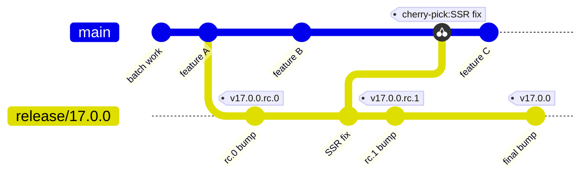
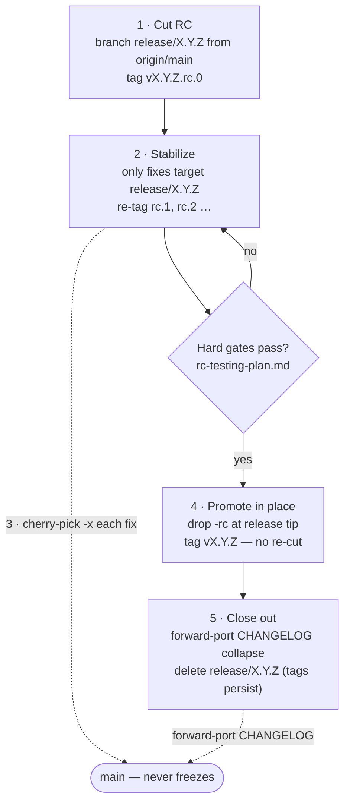
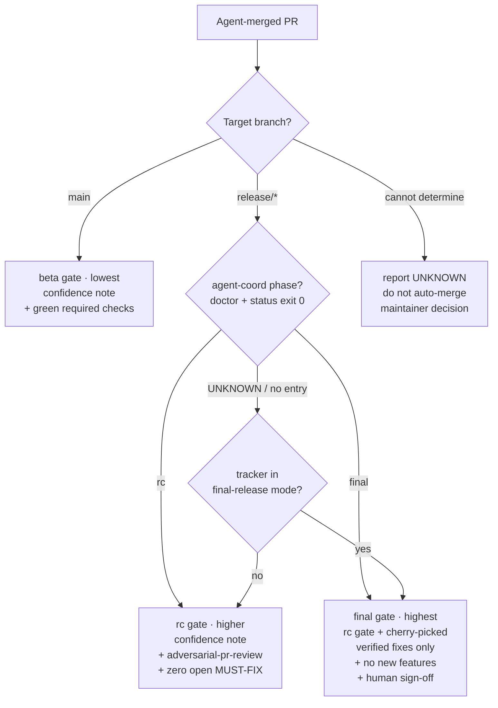

# Release-Train Runbook

How React on Rails cuts, stabilizes, and ships a release while `main` keeps absorbing batch work,
and how the per-branch **release phase** selects the agent merge gate.

This is contributor-only release-process documentation. It lives in `internal/contributor-info/`
because it coordinates maintainer-only go/no-go decisions and private validation. It is the
**branching strategy** companion to:

- [`releasing.md`](releasing.md) — the mechanical `rake release` steps (version bumps, publishing, tags).
- [`rc-testing-plan.md`](rc-testing-plan.md) — the hard-gate / smoke-evidence validation that decides whether an RC is good.
- [`release-verification-runbook.md`](release-verification-runbook.md) — the behavioral verification lanes (upgrade dry-run, debut-feature abuse pass, stress/soak, changelog and artifact audits) run against each RC.
- [`agent-coordination-backend.md`](agent-coordination-backend.md) — how the current phase is published to agents.

`AGENTS.md` carries the short, canonical policy (the phase→gate table and the branching rules an agent
must follow). If this runbook ever conflicts with `AGENTS.md`, `AGENTS.md` wins.

## Why a release train

React on Rails is a library. Most consumer apps ship many times a day and tolerate `main` churn, but
some pin exact versions, so the **published** release must be far more careful than `main`.

Batch engineering merges PRs into `main` continuously; release stabilization wants the opposite — a
frozen, known-good commit set. If we cut a release candidate (RC) straight from `main` and keep
merging, then by the time we promote that RC to final, `main` has drifted. We would have to either
re-test everything (slow, kills batch throughput) or ship a final that contains untested commits.

The release train separates "keep merging" from "stabilize a release":

- `main` never freezes. It keeps absorbing batch work the whole time.
- A short-lived **release branch** holds the frozen, stabilizing commit set. RCs are tagged there.
- **Final = promote the last good RC**, not a re-cut from `main`. Extra `main` commits since the RC
  roll into the next version automatically.

The whole train at a glance — `main` keeps moving while `release/17.0.0` stabilizes, every fix is
cherry-picked back to `main`, and the final is the last good RC promoted in place (no re-cut):


```mermaid
gitGraph
    commit id: "batch work"
    commit id: "feature A"
    branch release/17.0.0
    commit id: "rc.0 bump" tag: "v17.0.0.rc.0"
    checkout main
    commit id: "feature B"
    checkout release/17.0.0
    commit id: "SSR fix"
    commit id: "rc.1 bump" tag: "v17.0.0.rc.1"
    checkout main
    cherry-pick id: "SSR fix"
    commit id: "feature C"
    checkout release/17.0.0
    commit id: "final bump" tag: "v17.0.0"
```

## Decision: ephemeral `release/X.Y.Z`, not one long-lived `releases` branch

We use an **ephemeral per-version `release/X.Y.Z` branch**, cut at RC time and deleted after the final
ships. We do **not** keep a single long-lived `releases` branch reset each cycle.

Rationale:

- **Honest history.** A per-version branch's commits are exactly "what shipped in X.Y.Z." A reset
  long-lived branch rewrites that history every cycle, so `git log releases` stops meaning anything and
  the reflog becomes the only record of a past release line.
- **Parallel release lines.** A patch on the previous minor (e.g. `release/16.7.1`) can be stabilized at
  the same time as the next minor's RC (`release/17.0.0`). One shared branch cannot represent two live
  release lines at once.
- **No destructive reset on shared history.** Resetting/force-pushing one long-lived branch each cycle
  collides head-on with the repo rule against `reset --hard` / force-push that drops commits on a branch
  others may have based work on. Ephemeral branches are only ever appended to, then deleted.
- **Tags are the durable record.** Every `vX.Y.Z*` tag is immutable, so deleting the branch after the
  release loses nothing — the tags fully reconstruct the release line. The branch is scaffolding.
- **Cleaner gate signal.** "Is this PR targeting a `release/*` branch?" is a precise, machine-readable
  RC/final signal (see [Phase-tiered merge gating](#phase-tiered-merge-gating)). A single `releases`
  branch would force tooling to ask "which cycle is this branch in right now?" instead.

Cost we accept: branch names are not a fixed string, so tooling keys off the `release/*` glob plus the
published phase rather than one hard-coded ref. If a single stable name is ever needed (for a dashboard
or webhook), point a `releases` **tag or symbolic ref** at the active release branch instead of making
it the working branch.

Naming: `release/X.Y.Z` where `X.Y.Z` is the final target (no `-rc` suffix). The same branch carries
every RC for that target (`vX.Y.Z.rc.0`, `.rc.1`, …) and the final `vX.Y.Z` tag.

## The phases

A release moves through three phases. The phase is a property of the **target branch**, so an agent can
read it without being told (see [Phase-tiered merge gating](#phase-tiered-merge-gating)).

| Phase     | Where it lives                         | What is happening                                                                 |
| --------- | -------------------------------------- | --------------------------------------------------------------------------------- |
| **beta**  | `main`                                 | Continuous batch work. Features and fixes land freely. `main` may be unstable.    |
| **rc**    | `release/X.Y.Z` (stabilizing)          | Only stabilizing fixes land. RCs are tagged and validated against the hard gates. |
| **final** | `release/X.Y.Z` (promotion) → `vX.Y.Z` | Promotion freeze. No new work; the last good RC becomes the final.                |

Phase is the **gate selector**. It composes with the existing release **mode**
(`development` / `accelerated-rc` / `strict-rc` / `final-release`) from the release tracker, which tunes
the auto-merge automation _within_ a phase. See
[Phase vs. release mode](#phase-vs-release-mode).

## Runbook

The git mechanics below were validated end-to-end with a local dry-run (see
[Dry-run](#dry-run-validate-the-mechanics)).

The five steps mapped onto the two branches. The solid path is the release branch (1 → 2 → 4 → 5);
step 3 is not a separate stage — it runs _during_ stabilization, so it appears as a dotted
forward-port arrow to `main` rather than a node in the main flow. The step-5 close-out likewise
forward-ports the CHANGELOG. `main` never freezes:


```mermaid
flowchart TD
    A["1 · Cut RC<br/>branch release/X.Y.Z from origin/main<br/>tag vX.Y.Z.rc.0"] --> B["2 · Stabilize<br/>only fixes target release/X.Y.Z<br/>re-tag rc.1, rc.2 …"]
    B --> C{"Hard gates pass?<br/>rc-testing-plan.md"}
    C -->|"no"| B
    C -->|"yes"| D["4 · Promote in place<br/>drop -rc at release tip<br/>tag vX.Y.Z — no re-cut"]
    D --> E["5 · Close out<br/>forward-port CHANGELOG collapse<br/>delete release/X.Y.Z (tags persist)"]
    B -.->|"3 · cherry-pick -x each fix"| M(["main — never freezes"])
    E -.->|"forward-port CHANGELOG"| M
```

> **Note:** Worked examples use the concrete version `17.0.0` (and branch `release/17.0.0`, tags
> `v17.0.0.rc.N` / `v17.0.0`) for clarity, because the repo is on `v17.0.0.rc.3` as this runbook lands.
> Substitute your actual target version everywhere you see `17.0.0` / `release/17.0.0` / `v17.0.0*`; the
> generic form is `X.Y.Z`.

### Serialize every release-line write

Before running **any** step below that creates, updates, tags, promotes, or
deletes `release/X.Y.Z`, acquire the canonical release-line coordination lease
and hold it through that write. This includes release-branch creation, every RC
cut or re-spin, release-first fixes, backports from `main`, changelog and metadata
PRs, final promotion, and branch deletion. The lease is an `agent-coord` claim
in `shakacode/react_on_rails` whose target is exactly `release-line:X.Y.Z` (for
example, `release-line:17.0.0`). One dedicated release coordinator owns this
synthetic target and is the only actor that dispatches a release-targeted lane
or performs a release-line write. A claim on an individual issue or PR does not
serialize writers that target the same release line. If an actor cannot
participate in this lease, stop. The repository's merge-group CI does not rerun
release-specific source-liveness, provenance, attribution, manual QA, or review
gates and is not an alternative.

Use one non-reusable identity for the lifetime of the coordinator process and
its supervised child processes. Generate a fresh UUID-backed agent id on every
restart or handoff; never copy an old process's id into its replacement. Carry
the same instance id in the claim and heartbeat as defense in depth. These
identities make stale ownership visible, but they do not fence a GitHub or Git
write: neither remote accepts the coordination claim generation as part of its
mutation. The bounded status and claim operations fail closed on timeout,
`UNKNOWN`, or `CLAIM_REFUSED`:

```bash
RELEASE_VERSION=17.0.0
RELEASE_COORDINATOR_INSTANCE_ID="$(
  ruby -rsecurerandom -e 'print SecureRandom.uuid'
)" || {
  echo "could not generate a release coordinator process identity" >&2
  return 1 2>/dev/null || exit 1
}
test -n "${RELEASE_COORDINATOR_INSTANCE_ID}" || {
  echo "empty release coordinator process identity" >&2
  return 1 2>/dev/null || exit 1
}
RELEASE_COORDINATOR_ID="release-${RELEASE_VERSION}-${RELEASE_COORDINATOR_INSTANCE_ID}"
readonly RELEASE_COORDINATOR_INSTANCE_ID RELEASE_COORDINATOR_ID
export RELEASE_COORDINATOR_INSTANCE_ID RELEASE_COORDINATOR_ID
RELEASE_LINE_TARGET="release-line:${RELEASE_VERSION}"
PR_BATCH_SKILL_DIR="${PR_BATCH_SKILL_DIR:-$(.agents/bin/shared-skill-dir pr-batch)}"

heartbeat_release_line_lease() {
  agent-coord heartbeat \
    --agent-id "${RELEASE_COORDINATOR_ID}" \
    --instance-id "${RELEASE_COORDINATOR_INSTANCE_ID}" \
    --repo shakacode/react_on_rails \
    --target "${RELEASE_LINE_TARGET}" \
    --branch "release/${RELEASE_VERSION}" \
    --phase release-write-serialization \
    --status in_progress \
    --ttl 900
}

require_live_release_line_lease() {
  command -v jq >/dev/null || return 1
  lease_json="$(
    "${PR_BATCH_SKILL_DIR}/bin/agent-coord-bounded" --timeout 20 status \
      --repo shakacode/react_on_rails --target "${RELEASE_LINE_TARGET}" --json
  )" || return 1
  jq -e \
    --arg holder "${RELEASE_COORDINATOR_ID}" \
    --arg instance "${RELEASE_COORDINATOR_INSTANCE_ID}" \
    --arg target "shakacode/react_on_rails#${RELEASE_LINE_TARGET}" \
    '(.claims | length == 1) and
     (.claims[0].status == "active") and
     (.claims[0].agent_id == $holder) and
     (.claims[0].instance_id == $instance) and
     (.claims[0].expires_at != "UNKNOWN") and
     ((.claims[0].expires_at | fromdateiso8601) > now) and
     (.heartbeats | length == 1) and
     (.heartbeats[0].agent_id == $holder) and
     (.heartbeats[0].instance_id == $instance) and
     (.heartbeats[0].target == $target) and
     (.heartbeats[0].liveness == "live")' \
    >/dev/null <<<"${lease_json}"
}

acquire_release_line_lease() {
  "${PR_BATCH_SKILL_DIR}/bin/agent-coord-bounded" --timeout 20 status \
    --repo shakacode/react_on_rails --target "${RELEASE_LINE_TARGET}" --json \
    >/dev/null || return 1
  "${PR_BATCH_SKILL_DIR}/bin/agent-coord-bounded" --timeout 20 claim \
    --agent-id "${RELEASE_COORDINATOR_ID}" \
    --instance-id "${RELEASE_COORDINATOR_INSTANCE_ID}" \
    --repo shakacode/react_on_rails \
    --target "${RELEASE_LINE_TARGET}" \
    --branch "release/${RELEASE_VERSION}" \
    --ttl 14400 || return 1
  heartbeat_release_line_lease || return 1
  require_live_release_line_lease
}

acquire_release_line_lease
lease_status=$?
if [ "${lease_status}" -ne 0 ]; then
  echo "release-line lease unavailable or UNKNOWN; stop" >&2
  return "${lease_status}" 2>/dev/null || exit "${lease_status}"
fi
```

The explicit claim TTL is four hours and the heartbeat TTL is 15 minutes. Renew
the claim at least hourly with the bounded `claim` command from
`acquire_release_line_lease`, and run `heartbeat_release_line_lease` at every
release phase transition **and at least every five minutes while CI, validation,
QA, review, publication, or another gate remains in one phase**. A
transition-only heartbeat is insufficient. If either refresh fails, stop all
release-line writes until `acquire_release_line_lease` succeeds and the live
assertion passes again.

Treat a helper that performs several outward operations, such as
`script/release-finish` or `bundle exec rake release`, as one compound writer.
Those helpers do not embed the coordination client and cannot check ownership
at each outward-operation boundary. A separate supervisor is insufficient: it
can be killed while its helper remains alive, after which a replacement could
take the lease and race the orphan. Until a repository-owned wrapper binds the
whole helper process group to the supervisor's lifetime and checks ownership at
each outward operation, use these helpers only in dry-run mode. For a live
release, stop and use the runbook's individual commands, with
`require_live_release_line_lease` immediately before each outward write. If an
individual command cannot expose that boundary, stop rather than run it as an
uncontrolled compound writer.

Immediately before each write or merge, rerun `require_live_release_line_lease`
in the shell where the functions above are defined. It is a fail-closed
**preflight read**: it proves that the canonical claim is active, unexpired, and
owned by the process-unique `RELEASE_COORDINATOR_ID` at the instant of the read,
with a matching live heartbeat and instance id. It does not atomically bind
that ownership to the subsequent GitHub mutation or Git remote transaction.
GitHub's `expectedHeadOid` and Git's `--force-with-lease`/compare-and-swap bind
resource identity and reduce stale-write risk, but neither carries the
coordination generation. Individual commands therefore remain a best-effort
single-controller protocol with a narrow preflight-to-write race.

Operational exclusivity is mandatory: do not release, transfer, or take over the
claim until the prior coordinator process group and every child are positively
known terminated. Claim expiry, heartbeat staleness, or backend permission to
take over is not proof of termination and is insufficient by itself. If that
positive termination evidence or another durable ownership guarantee cannot be
established, stop pending resource-bound fencing instead of taking over. In a
batch, chain each later release-targeted lane with `depends_on` and do not launch
it until the preceding merge is terminal. A merge queue that reruns only the
repository's current merge-group CI is not an alternative. If the preflight is
unavailable or `UNKNOWN`, stop rather than let two release writers race from the
same release tip.

Keep the lease across the whole release train when practical. Release it only
after branch deletion and release-line closeout are complete, or after a
cancellation/handoff is durably recorded **and** the coordinator process group
and every child are positively known terminated:

```bash
agent-coord release \
  --agent-id "${RELEASE_COORDINATOR_ID}" \
  --instance-id "${RELEASE_COORDINATOR_INSTANCE_ID}" \
  --repo shakacode/react_on_rails \
  --target "${RELEASE_LINE_TARGET}"
```

On handoff, the replacement must generate a fresh process identity and acquire
this same canonical target after the old release and positive process-group
termination evidence are visible; it must not reuse the old id, invent another
target, or bypass a refusal. If the old process crashed but its termination and
children cannot be established, remain stopped even after TTL expiry or backend
takeover becomes available. A fresh identity helps reject later preflights from
a resumed old process; it cannot revoke a write already between preflight and
mutation.

#### Partial-publication recovery

If a compound release stops after any outward write, stop the helper and keep
the release-line lease live. Preserve the exact local and remote branch tips,
local and remote tag identity, the complete six-package registry artifact set,
and the helper command and output. Do not delete or move tags, reset or
force-push the release branch, rerun the compound release, overwrite published
artifacts, or ad-lib manual publication.

- **The tag exists and zero immutable packages were published.** Live recovery
  is **BLOCKED** pending the repository-owned process-group/per-write fencing
  wrapper or an explicit maintainer-approved fully fenced reconciliation plan.
- **All six immutable packages were published, but GitHub release creation or
  update failed.** `sync_github_release` remains idempotent in behavior, but its
  live GitHub create/edit boundary is unfenced. Preview only with the dry-run
  form `sync_github_release[X.Y.Z,true]`; live recovery is **BLOCKED** pending
  the repository-owned process-group/per-write fencing wrapper or an explicit
  maintainer-approved fully fenced reconciliation plan.
- **Only a subset of the six immutable packages was published.** Live recovery
  is **BLOCKED** pending the repository-owned process-group/per-write fencing
  wrapper or an explicit maintainer-approved fully fenced reconciliation plan.

If the lease, branch, tag, registry, or helper evidence is missing,
contradictory, or `UNKNOWN`, remain stopped. A maintainer-approved plan must
identify and fence every remaining outward write; approval alone does not make
an unfenced command safe.

### 1. Cut the RC onto `release/X.Y.Z`

Do this when maintainers decide `main` is feature-complete for the target and want to start stabilizing.
Acquire the release-line writer lease above before Step 1a, keep its heartbeat
live while waiting for CI, and rerun `require_live_release_line_lease`
immediately before the branch push and again before every RC cut or re-spin.

Starting a release line is two steps with a CI run between them — cutting the branch and tagging rc.0
**cannot** be one command. The release CI gate evaluates the branch tip, and a freshly pushed
`release/X.Y.Z` has no checks yet (`no_checks`), so you create + push the branch, wait for CI, then
cut rc.0.

**Step 1a — create and push the release branch.** Use `release:start` only to
preview its checks, then perform the single outward write with the individually
guarded commands below:

```bash
git checkout main && git pull --rebase
bundle exec rake "release:start[17.0.0,true]"   # dry-run only; no branch or remote write
```

Live `release:start` is an unfenced compound helper: it fetches, creates, and
pushes the branch after only an outer lease check. Do not run it until the
wrapper contract above is implemented. With no version argument the helper
derives the release line from the top `### [X.Y.Z.rc.N]` CHANGELOG.md header.
Pass the **stable base** (`17.0.0`), never `17.0.0.rc.0` — the rc index lives in
the changelog, not the branch name.

After the dry-run succeeds, create the branch from an explicitly refreshed
`origin/main` and publish it only if the remote release ref is still absent:

```bash
git fetch --prune origin "+refs/heads/main:refs/remotes/origin/main"
# Cut from the exact main commit you intend to stabilize.
git switch -c release/17.0.0 origin/main
require_live_release_line_lease || { return 1 2>/dev/null || exit 1; }
git push \
  --force-with-lease="refs/heads/release/17.0.0:" \
  -u origin "release/17.0.0:refs/heads/release/17.0.0"
```

**Step 1b — cut rc.0 from the branch.** After at least one CI run finishes on the `release/17.0.0` tip,
ensure the rc changelog header is present (`$react-on-rails-update-changelog rc`
targeting the branch). The bare release command reads the version from CHANGELOG.md, so you do **not**
pass `17.0.0.rc.0`. It is currently an unfenced compound writer: preview and prepare the cut, but stop
before live execution until the wrapper contract above is implemented.

```bash
# On release/17.0.0, with CHANGELOG.md stamped ### [17.0.0.rc.0]:
require_live_release_line_lease || { return 1 2>/dev/null || exit 1; }
# BLOCKED: bundle exec rake release would bump, tag, and publish without per-write lease fences.
```

**Forgot to start the line first?** The release task's existing behavior, once the compound-writer
wrapper exists, is: if you run `bundle exec rake release` for an rc while still on
`main` and `release/X.Y.Z` does not exist yet, the release task **offers to start the release line for
you** (`Start the 17.0.0 release line now? [y/N]`); accepting runs the same `release:start` logic and
stops before tagging. If `release/X.Y.Z` already exists, the task stops and tells you to
`git checkout release/X.Y.Z` and re-run — this guards against tagging an rc off a drifted `main`.

> **The release task's CI gate evaluates the branch you release from.** `rakelib/release.rake` runs
> `validate_main_ci_status!`, which now fetches and evaluates the tip of the branch the release is cut
> from: `origin/release/X.Y.Z` when you run from a `release/*` branch (RC cut or final promotion), or
> `origin/main` otherwise. Cutting an RC from `release/X.Y.Z` therefore validates the release-branch
> tip, not `main`. (The non-runtime walk-back still applies, so a changelog/version-only tip is skipped
> back to the last runtime-bearing commit on that branch.) The ShakaPerf release gate likewise runs on
> the current branch ref. If the release branch was just pushed, wait for at least one CI run on that
> branch before cutting the first RC; otherwise the branch-tip gate can stop with a `no_checks` result.

#### Automatic ShakaPerf pre-run after changelog preparation

Pushing a prepared next-version `CHANGELOG.md` section to `release/X.Y.Z` automatically starts the
ShakaPerf release gate for that branch tip. The lightweight dispatcher runs only for `CHANGELOG.md`
pushes on `release/**`, then verifies that the first non-`Unreleased` changelog section is non-empty,
newer than the checked-in gem version, and belongs to the branch's `X.Y.Z` release line. An arbitrary
documentation edit or an unchanged/stale version therefore does not start the long-running gate.

The dispatched Actions run names the target version, release branch, and exact candidate SHA. On
completion it uploads `shakaperf-release-evidence.json` in the `shakaperf-release-evidence` artifact,
containing the branch, target version, candidate SHA, conclusion, run URL, completion time, and runtime
tree fingerprint, plus the workflow run attempt that produced the evidence. Open that run URL from the
later `rake release` output to inspect the gate and its
artifacts. The sequential validation, ShakaPerf, and evidence jobs are bounded to 60 minutes in total;
the release task allows 65 minutes after finding a run so the workflow can reach that bound cleanly.
Per-release-branch concurrency cancels an obsolete in-progress run when a newer prepared
candidate is dispatched; the newest branch candidate is authoritative, so a failed or cancelled newer
run never causes fallback to an older success.

When `bundle exec rake release[...]` later pushes the version-bump commit, it first watches the latest
prepared-candidate pre-run if that run is still active. A failed or otherwise non-reusable exact-head run
does not prevent the task from considering the latest pre-run. The task reuses completed pre-run evidence
only when all of these checks succeed:

- the run and artifact report success for the same branch, target version, candidate SHA, run ID, run
  attempt, and run URL;
- the evidence is no more than seven days old, and both its recorded completion and the workflow's
  update occurred before this release command started, unless the task found that same pre-run already
  active with a provable earlier current-attempt start and watched that same attempt to successful
  completion itself;
- the tested candidate is an ancestor of the version-bump commit;
- the candidate and version-bump commits have the same exact Git-tree fingerprint after excluding only
  `CHANGELOG.md` and the existing release-finalization metadata paths; and
- every intervening commit is either an existing content-validated version-finalization metadata commit
  or a canonical CI-detector-confirmed `CHANGELOG.md`-only commit.

Missing, malformed, stale, wrong-version, wrong-branch, failed, cancelled, superseded, non-ancestor, or
runtime-different evidence is never a waiver. The task falls back to dispatching the gate on the exact
version-bump commit and waits for that run plus its verified evidence exactly as before. If the fresh
gate or its evidence fails, tagging and package publication remain blocked. Final promotion keeps the
same strict final-release gates and cannot use the prerelease-only CI override.

A maintainer opens (or updates) the release tracker per [`rc-testing-plan.md`](rc-testing-plan.md) and
sets the mode to `accelerated-rc` or `strict-rc`. Publish the phase as `rc` for this release line so
agents pick up the RC gate automatically (see [Phase-tiered merge gating](#phase-tiered-merge-gating)).

`main` keeps moving the entire time. Nothing about cutting the RC freezes it.

### 2. Stabilize on the release branch

During the RC phase, **only stabilizing fixes** target `release/X.Y.Z`. New features keep targeting
`main` and wait for the next version.

The writer lease above remains mandatory: acquire or renew it before creating or
updating a stabilizer branch, and require it to be live immediately before any
merge into `release/X.Y.Z`.

Author each stabilizing fix as a PR **targeting `release/X.Y.Z`** (not `main`):

```bash
git fetch origin
git checkout -b fix/17.0.0-ssr-regression origin/release/17.0.0
# ...fix, test...
git push -u origin fix/17.0.0-ssr-regression
gh pr create --base release/17.0.0 --title "Fix SSR regression" --body "..."
```

Merge stabilizing PRs into `release/X.Y.Z`, then cut the next RC tag (`v17.0.0.rc.1`, …) from the
branch tip when maintainers want a new candidate to validate. Re-run the hard-gate validation in
[`rc-testing-plan.md`](rc-testing-plan.md) for each RC, and run the behavioral lanes in
[`release-verification-runbook.md`](release-verification-runbook.md) (upgrade dry-run,
debut-feature abuse pass, stress/soak, changelog and artifact audits) — they must be green or
explicitly waived before step 4 promotes the RC, except Lane 4b artifact defects, which must be
fixed by republishing.

> Targeting confusion is the most common mistake here. A fix opened against `main` during the RC phase
> does **not** reach the release unless it is forward-ported in step 3 (run in reverse: cherry-pick
> `main`→`release/X.Y.Z`). Prefer authoring stabilizing fixes against the release branch first.

#### Backport merged `main` PRs one at a time

When maintainers select one or more merged `main` PRs for the release train,
use **one source PR -> one release PR**. Process them under the writer lease
above; when there are multiple selections, serialize the sequence:

1. Search open PRs targeting the release branch, targeted private coordination
   for the selected source, and remote branches with verified ownership and
   source-commit binding. If a valid source-atomic lane or an explicitly
   maintainer-approved aggregate whose sources meet the inseparability exception
   below already exists, treat that lane as started and reuse it (or skip it when
   another owner holds it); do not create a duplicate branch or PR. Stop rather
   than duplicate work when a candidate branch's ownership or source binding is
   `UNKNOWN`. Do not extend an unapproved, shape-violating aggregate. Close it
   only with explicit write authorization, retain its branch unless deletion is
   separately authorized, and replace it with source-atomic PRs.
2. Fetch and prune both `origin/main` and the target release branch. Using those
   refreshed refs, verify the source PR is merged, is a release stabilizer, its
   patch is still live on `origin/main`, and it is not already present or
   superseded on `release/X.Y.Z`. If the source was reverted or superseded on
   `main`, stop unless a maintainer renews the backport approval with that
   current state.
3. If step 1 found a valid backport PR, update its branch onto the current
   release tip under the repository's branch-rewrite policy. Repeat the
   presence and supersession checks, then rerun validation, QA, and review on
   the updated current head. Otherwise, create a branch from the fetched tip.
4. On a new branch, resolve the complete source shape before cherry-picking:
   - For a source PR that landed as exactly one single-parent commit, whether by
     squash merge or a one-commit rebase merge, use
     `git cherry-pick -x <source-sha>`.
   - For a true multi-parent merge commit, use
     `git cherry-pick -m 1 -x <source-sha>` and record the mainline-parent
     choice.
   - For a multi-commit rebase merge, identify the complete ordered set of
     commits that landed from the PR on `main`, mapping the PR commits to landed
     commits with merge metadata and stable patch IDs. Cherry-pick every landed
     commit oldest-first with `git cherry-pick -x <source-sha>` only after the
     maintainer-approved merge plan required by step 7 exists. Stop if the
     complete mapping cannot be proven or that merge plan is absent.
5. If a cherry-pick conflicts, preserve release-only divergence while resolving
   it, record the source SHA and every non-mechanical resolution in the PR, and
   complete the operation with `git cherry-pick --continue` before inspecting
   the resulting commit message.
6. After any source-shape path, normalize every resulting release commit message
   to exactly one direct `(cherry picked from commit <source-sha>)` footer. If a
   source commit already has inherited `-x` provenance, record that deeper
   lineage in the PR and remove its footer from the release commit message.
7. Run the release-phase validation, QA, and review gates on the current head.
   Immediately before merge, fetch and prune `origin/main` and the target release
   branch again. Repeat the source-liveness, presence, and supersession checks.
   Confirm that the release-line lease is still held. Merge-group CI is not an
   alternative because it does not rerun the release-specific gates.
   If the source's relevant `main` state changed, or the release tip advanced
   beyond the tip incorporated into the backport branch, update the branch and
   rerun validation, QA, and review; merge only when the evidence covers the
   exact refreshed refs.
   A backport with exactly one source commit must be squash-merged. Set the final
   squash subject to end in `(#<backport-pr-number>)` and copy its exact direct
   `(cherry picked from commit <source-sha>)` footer into the final squash commit
   body; a rebase merge is not supported because an unattributed source subject
   can make the changelog sweep report `UNKNOWN`. For a multi-commit
   rebase-merged source PR or an
   approved inseparable aggregate, retain one normalized commit per source
   commit and never squash them into a multi-footer commit. The current
   repository cannot close that shape safely: merge commits are disabled, while
   a rebase merge preserves the commits but the changelog sweep classifies each
   release-targeted commit as `UNKNOWN`. Stop for a maintainer-approved merge
   plan until the merge settings or changelog classifier can preserve both the
   commits and one PR attribution. Split an aggregate into source-atomic PRs
   when that resolves the shape; otherwise do not merge the backport. After any
   supported merge method, verify each backport-created release commit has
   exactly one direct source footer; do not proceed to the next backport if
   provenance was lost.

   Merge a one-source backport synchronously from the release coordinator's
   shell; do not enable auto-merge or use a merge queue. Record the exact head,
   release-base, and `main` OIDs covered by validation and review, then use this
   expected-head squash path with the final headline and body. After the
   exact-head gates, rerun the existing source-liveness, presence, and
   supersession audit against `BACKPORT_VALIDATED_MAIN_OID`; only when it proves
   the source patch is still live and neither reverted nor superseded may the
   operator set `BACKPORT_SOURCE_AUDIT_RESULT` to the exact bound value shown
   below:

   ```bash
   BACKPORT_PR="${BACKPORT_PR:?set the backport PR number or URL}"
   BACKPORT_RELEASE_BRANCH="${BACKPORT_RELEASE_BRANCH:?set the exact release/X.Y.Z branch}"
   BACKPORT_VALIDATED_HEAD_OID="${BACKPORT_VALIDATED_HEAD_OID:?set the validated 40-character head OID}"
   BACKPORT_VALIDATED_BASE_OID="${BACKPORT_VALIDATED_BASE_OID:?set the validated 40-character release-base OID}"
   BACKPORT_VALIDATED_MAIN_OID="${BACKPORT_VALIDATED_MAIN_OID:?set the audited 40-character main OID}"
   BACKPORT_SOURCE_SHA="${BACKPORT_SOURCE_SHA:?set the direct 40-character main source SHA}"
   BACKPORT_SOURCE_AUDIT_RESULT="${BACKPORT_SOURCE_AUDIT_RESULT:?set the main-OID-bound source-audit result}"
   BACKPORT_COMMIT_HEADLINE="${BACKPORT_COMMIT_HEADLINE:?set the final squash headline}"
   BACKPORT_COMMIT_BODY="${BACKPORT_COMMIT_BODY:?set the final squash body}"

   jq -en --arg branch "${BACKPORT_RELEASE_BRANCH}" \
     '$branch | test("^release/[0-9]+\\.[0-9]+\\.[0-9]+$")' >/dev/null || {
     echo "backport target is not an exact release/X.Y.Z branch; stop backport" >&2
     return 1 2>/dev/null || exit 1
   }
   ruby -e '
     full_sha = /\A[0-9a-f]{40}\z/
     head, base, main, source, body = ARGV
     abort "invalid backport OID" unless [head, base, main, source].all? { |oid| full_sha.match?(oid) }
     footers = body.lines(chomp: true).grep(/\A\(cherry picked from commit [0-9a-f]{40}\)\z/)
     expected = "(cherry picked from commit #{source})"
     abort "squash body must contain exactly one direct source footer" unless footers == [expected]
   ' "${BACKPORT_VALIDATED_HEAD_OID}" "${BACKPORT_VALIDATED_BASE_OID}" \
     "${BACKPORT_VALIDATED_MAIN_OID}" "${BACKPORT_SOURCE_SHA}" \
     "${BACKPORT_COMMIT_BODY}" || {
     return 1 2>/dev/null || exit 1
   }

   backport_pr_json="$(
     gh pr view "${BACKPORT_PR}" --json number,id,baseRefName,baseRefOid,headRefOid
   )" || {
     echo "could not resolve the backport PR identity; stop backport" >&2
     return 1 2>/dev/null || exit 1
   }
   BACKPORT_PR_NUMBER="$(jq -er '.number | select(type == "number" and . > 0) | tostring' \
     <<<"${backport_pr_json}")" || {
     echo "backport PR number is missing or invalid; stop backport" >&2
     return 1 2>/dev/null || exit 1
   }
   BACKPORT_PR_ID="$(jq -er '.id | select(type == "string" and length > 0)' \
     <<<"${backport_pr_json}")" || {
     echo "backport PR node id is missing or invalid; stop backport" >&2
     return 1 2>/dev/null || exit 1
   }
   BACKPORT_HEAD_OID="$(jq -er '.headRefOid | select(test("^[0-9a-f]{40}$"))' \
     <<<"${backport_pr_json}")" || {
     echo "backport PR head OID is missing or invalid; stop backport" >&2
     return 1 2>/dev/null || exit 1
   }
   BACKPORT_BASE_OID="$(jq -er '.baseRefOid | select(test("^[0-9a-f]{40}$"))' \
     <<<"${backport_pr_json}")" || {
     echo "backport PR base OID is missing or invalid; stop backport" >&2
     return 1 2>/dev/null || exit 1
   }
   jq -e --arg branch "${BACKPORT_RELEASE_BRANCH}" '.baseRefName == $branch' \
     >/dev/null <<<"${backport_pr_json}" || {
     echo "backport PR no longer targets the exact release branch; stop backport" >&2
     return 1 2>/dev/null || exit 1
   }
   test "${BACKPORT_HEAD_OID}" = "${BACKPORT_VALIDATED_HEAD_OID}" &&
     test "${BACKPORT_BASE_OID}" = "${BACKPORT_VALIDATED_BASE_OID}" || {
     echo "backport PR head or base differs from validated evidence; stop backport" >&2
     return 1 2>/dev/null || exit 1
   }
   jq -en --arg headline "${BACKPORT_COMMIT_HEADLINE}" \
     --arg suffix "(#${BACKPORT_PR_NUMBER})" \
     '($headline | length > 0) and ($headline | contains("\n") | not) and
      ($headline | endswith($suffix))' >/dev/null || {
     echo "final squash headline must end in (#${BACKPORT_PR_NUMBER}); stop backport" >&2
     return 1 2>/dev/null || exit 1
   }
   git fetch --prune origin \
     "+refs/heads/main:refs/remotes/origin/main" \
     "+refs/heads/${BACKPORT_RELEASE_BRANCH}:refs/remotes/origin/${BACKPORT_RELEASE_BRANCH}" || {
     echo "could not refresh main and the release branch; stop backport" >&2
     return 1 2>/dev/null || exit 1
   }
   test "$(git rev-parse refs/remotes/origin/main^{commit})" = \
     "${BACKPORT_VALIDATED_MAIN_OID}" || {
     echo "origin/main differs from the audited main OID; stop backport" >&2
     return 1 2>/dev/null || exit 1
   }
   test "$(git rev-parse "refs/remotes/origin/${BACKPORT_RELEASE_BRANCH}^{commit}")" = \
     "${BACKPORT_VALIDATED_BASE_OID}" || {
     echo "release branch differs from the validated base; stop backport" >&2
     return 1 2>/dev/null || exit 1
   }
   git merge-base --is-ancestor \
     "${BACKPORT_SOURCE_SHA}" refs/remotes/origin/main || {
     echo "backport source is not an ancestor of the exact fetched main; stop backport" >&2
     return 1 2>/dev/null || exit 1
   }
   test "${BACKPORT_SOURCE_AUDIT_RESULT}" = \
     "live-not-reverted-not-superseded:${BACKPORT_VALIDATED_MAIN_OID}" || {
     echo "source audit is missing, UNKNOWN, stale, or not clean; stop backport" >&2
     return 1 2>/dev/null || exit 1
   }
   require_live_release_line_lease || { return 1 2>/dev/null || exit 1; }
   backport_merge_result="$(
     gh api graphql \
       -f query='mutation(
         $pullRequestId: ID!,
         $expectedHeadOid: GitObjectID!,
         $commitHeadline: String!,
         $commitBody: String!
       ) {
         mergePullRequest(input: {
           pullRequestId: $pullRequestId
           expectedHeadOid: $expectedHeadOid
           mergeMethod: SQUASH
           commitHeadline: $commitHeadline
           commitBody: $commitBody
         }) {
           pullRequest { merged }
         }
       }' \
       -f pullRequestId="${BACKPORT_PR_ID}" \
       -f expectedHeadOid="${BACKPORT_HEAD_OID}" \
       -f commitHeadline="${BACKPORT_COMMIT_HEADLINE}" \
       -f commitBody="${BACKPORT_COMMIT_BODY}"
   )" || {
     echo "synchronous backport squash merge failed; stop backport" >&2
     return 1 2>/dev/null || exit 1
   }
   jq -e '.data.mergePullRequest.pullRequest.merged == true' \
     >/dev/null <<<"${backport_merge_result}" || {
     echo "backport PR was not merged synchronously; stop backport" >&2
     return 1 2>/dev/null || exit 1
   }
   ```

   The head, base, branch, freshly fetched `main`, source-audit, and release-line
   ownership checks are preflight checks. They retain the narrow
   preflight-to-mutation race, so use this path only under the
   positive-termination/single-controller rule above; otherwise stop pending
   resource-bound fencing.

8. Fetch the new release tip before updating or branching the next selected
   source PR.
9. After every backport retained in the final release set lands, reconcile the
   changelog entries and stamp or regenerate the RC changelog.
10. Before every RC cut or re-spin, fetch `origin/main`, enumerate every
    main-origin backport retained on the release branch from its direct
    `git cherry-pick -x` provenance, and confirm that each source patch is still
    live. A reverted, superseded, or `UNKNOWN` source blocks the cut until a
    maintainer explicitly reapproves retaining it with the current evidence.

Do not combine independent source PRs merely because they target the same
release, touch related code, or conflict in `CHANGELOG.md`. Separate PRs preserve
review scope, provenance, rollback, and failure attribution; the shared
changelog is a reason to serialize them. Combining requires an explicit
maintainer-approved exception proving the changes are behaviorally inseparable
and cannot be reviewed, tested, or reverted safely on their own.

Each backport PR retains its source PR's applicable changelog entry. Resolve an
equivalent, obsolete, or conflicting release-branch entry explicitly in that
PR; do not defer all entry curation to the final changelog pass.

#### Promote prerelease dependencies before final

Do not promote a React on Rails RC to final while it still pins a prerelease of a coordinated
dependency. For `17.0.0` and `react-on-rails-rsc@19.2.1`, use this order:

1. Follow the
   [`react-on-rails-rsc` release guide](https://github.com/shakacode/react_on_rails_rsc/blob/main/internal/docs/releasing.md),
   complete its downstream release gate, and accept the exact commit behind the tested
   `19.2.1-rc.N`. If any code changes, publish and test another RSC RC instead of promoting an
   untested commit.
2. Publish that same accepted commit as stable `react-on-rails-rsc@19.2.1`, and verify the registry
   package and `latest` dist-tag before changing React on Rails.
3. Complete [#4357](https://github.com/shakacode/react_on_rails/issues/4357) on
   `release/17.0.0`: update the Ruby generator's RSC pin and the Pro peer/dev dependency metadata,
   node-renderer and dummy/override pins, and affected lockfiles. This is a dependency update, not a
   manual bump of React on Rails' own gem/npm product version.
4. Forward-port the dependency-pin fix to `main` with `git cherry-pick -x`, as for every other release
   branch fix.
5. Cut a new React on Rails RC that contains the stable RSC pin. Do not treat an earlier React on Rails
   RC that still points at `19.2.1-rc.N` as the final candidate.
6. Run the RC hard gates and demo-fleet QA against the newly published artifacts. Include a scratch
   non-RSC smoke test that installs or copies the published `react-on-rails-pro@<rc>` tarball while
   leaving `react-on-rails-rsc` absent; a monorepo/workspace symlink is not valid evidence because it
   can mask package-resolution leaks.
7. Only after that new RC is accepted should [#4569](https://github.com/shakacode/react_on_rails/issues/4569)
   promote `17.0.0` final.

### 3. Forward-port stabilizing fixes back to `main`

Every fix that lands on `release/X.Y.Z` must also reach `main`, or `main` regresses the moment the
release branch is deleted. Use `script/release-forward-port` first so the operation is dry-run-able,
idempotent, and skips RC version-bump commits. The helper uses **`git cherry-pick -x`** for commits it
applies; do not use a branch merge or combine the remaining source fixes into one catch-all PR.

```bash
git fetch origin

# Inspect the complete plan from current main. Expect missing fix commits to be PICK and pure CHANGELOG/version-bump
# commits to be SKIP; changelog content is handled by the reconciliation pass below.
script/release-forward-port --source origin/release/17.0.0 --target main --dry-run

# For EACH remaining PICK, start again from the latest origin/main and create one source-change PR.
# Replace <source-sha>, <source-pr>, and <slug>; merge this PR before starting the next one.
git switch -c forward-port/<source-pr>-<slug> origin/main
script/release-forward-port \
  --source origin/release/17.0.0 \
  --target forward-port/<source-pr>-<slug> \
  --only <source-sha> \
  --dry-run
script/release-forward-port \
  --source origin/release/17.0.0 \
  --target forward-port/<source-pr>-<slug> \
  --only <source-sha>
# Validate, push, open the PR to main, and merge it before repeating from a freshly fetched origin/main.

# After every source-change PR has merged, use a separate release/changelog branch and PR.
git fetch --prune origin main
git switch -c release/reconcile-17.0.0-changelog origin/main
script/release-forward-port \
  --source origin/release/17.0.0 \
  --target release/reconcile-17.0.0-changelog \
  --changelog \
  --dry-run
script/release-forward-port \
  --source origin/release/17.0.0 \
  --target release/reconcile-17.0.0-changelog \
  --changelog
git diff --check
git add CHANGELOG.md
git commit -m "Reconcile 17.0.0 release changelog on main"
# Validate, push, and open the dedicated release/changelog PR to main. Squash it with:
# Record the final React on Rails X.Y.Z changelog (#<pr-number>)
# Include this exact sentence in the PR body, using the newest release-branch commit that changed CHANGELOG.md:
# The final changelog records source CHANGELOG.md commit `<40-character-sha>`.
```

Merge every source-change PR and the dedicated changelog PR synchronously from
the release coordinator's shell after its exact-head gates pass. Set
`CLOSEOUT_MERGE_METHOD=REBASE` for a source-change PR and `SQUASH` for the
dedicated changelog PR. Do not use auto-merge or a merge queue here: neither
rechecks the release-line lease immediately before the write, and a queued
merge can land a different head. Record both the head OID and base OID covered
by validation and review. The mutation binds the head with `expectedHeadOid`;
the base comparisons below are fail-closed preflight checks because GitHub's
merge mutation has no expected-base argument:

```bash
CLOSEOUT_PR="${CLOSEOUT_PR:?set the closeout PR number or URL}"
CLOSEOUT_MERGE_METHOD="${CLOSEOUT_MERGE_METHOD:?set REBASE or SQUASH}"
CLOSEOUT_VALIDATED_HEAD_OID="${CLOSEOUT_VALIDATED_HEAD_OID:?set the validated 40-character head OID}"
CLOSEOUT_VALIDATED_BASE_OID="${CLOSEOUT_VALIDATED_BASE_OID:?set the validated 40-character base OID}"
case "${CLOSEOUT_MERGE_METHOD}" in
  REBASE|SQUASH) ;;
  *) echo "unsupported closeout merge method" >&2; return 1 2>/dev/null || exit 1 ;;
esac
closeout_pr_json="$(gh pr view "${CLOSEOUT_PR}" --json id,baseRefName,baseRefOid,headRefOid)" || {
  echo "could not resolve the closeout PR identity; stop closeout" >&2
  return 1 2>/dev/null || exit 1
}
CLOSEOUT_PR_ID="$(
  jq -er '.id | select(type == "string" and length > 0)' <<<"${closeout_pr_json}"
)" || {
  echo "closeout PR node id is missing or invalid; stop closeout" >&2
  return 1 2>/dev/null || exit 1
}
CLOSEOUT_HEAD_OID="$(
  jq -er '.headRefOid | select(type == "string" and test("^[0-9a-f]{40}$"))' \
    <<<"${closeout_pr_json}"
)" || {
  echo "closeout PR head OID is missing or invalid; stop closeout" >&2
  return 1 2>/dev/null || exit 1
}
test "${CLOSEOUT_HEAD_OID}" = "${CLOSEOUT_VALIDATED_HEAD_OID}" || {
  echo "closeout PR head differs from the validated head; stop closeout" >&2
  return 1 2>/dev/null || exit 1
}
CLOSEOUT_BASE_OID="$(
  jq -er '.baseRefOid | select(type == "string" and test("^[0-9a-f]{40}$"))' \
    <<<"${closeout_pr_json}"
)" || {
  echo "closeout PR base OID is missing or invalid; stop closeout" >&2
  return 1 2>/dev/null || exit 1
}
jq -e '.baseRefName == "main"' >/dev/null <<<"${closeout_pr_json}" || {
  echo "closeout PR no longer targets main; stop closeout" >&2
  return 1 2>/dev/null || exit 1
}
test "${CLOSEOUT_BASE_OID}" = "${CLOSEOUT_VALIDATED_BASE_OID}" || {
  echo "closeout PR base differs from the validated base; stop closeout" >&2
  return 1 2>/dev/null || exit 1
}
git fetch --prune origin +refs/heads/main:refs/remotes/origin/main || {
  echo "could not refresh origin/main; stop closeout" >&2
  return 1 2>/dev/null || exit 1
}
test "$(git rev-parse origin/main)" = "${CLOSEOUT_VALIDATED_BASE_OID}" || {
  echo "origin/main differs from the validated base; stop closeout" >&2
  return 1 2>/dev/null || exit 1
}
require_live_release_line_lease || { return 1 2>/dev/null || exit 1; }
closeout_merge_result="$(
  gh api graphql \
    -f query='mutation(
      $pullRequestId: ID!,
      $expectedHeadOid: GitObjectID!,
      $mergeMethod: PullRequestMergeMethod!
    ) {
      mergePullRequest(input: {
        pullRequestId: $pullRequestId
        expectedHeadOid: $expectedHeadOid
        mergeMethod: $mergeMethod
      }) {
        pullRequest { merged }
      }
    }' \
    -f pullRequestId="${CLOSEOUT_PR_ID}" \
    -f expectedHeadOid="${CLOSEOUT_HEAD_OID}" \
    -f mergeMethod="${CLOSEOUT_MERGE_METHOD}"
)" || {
  echo "synchronous closeout PR merge failed; stop closeout" >&2
  return 1 2>/dev/null || exit 1
}
jq -e '.data.mergePullRequest.pullRequest.merged == true' \
  >/dev/null <<<"${closeout_merge_result}" || {
  echo "closeout PR was not merged synchronously; stop closeout" >&2
  return 1 2>/dev/null || exit 1
}
```

These base and ownership checks reduce stale-write risk but do not eliminate a
change after the last preflight and before the mutation. Run them only under the
single-controller/positive-termination rule above; if that operational
ownership is not durable, stop pending resource-bound fencing.

Fetch the new `origin/main` immediately after each successful merge before
planning the next source-change PR or the final changelog PR.

- Treat the dry-run plan as a queue, not one combined forward-port branch. Land one missing source
  change per PR, wait for it to merge, fetch the new `origin/main`, and then plan the next PR. Prefer
  a history-preserving rebase merge for source-change PRs. If the repository merge queue enforces a
  squash, the one-change-per-PR boundary is mandatory and the PR title/body must identify the release
  source commit and source PR. Use this exact positive provenance sentence in the PR body so the
  squash commit remains machine-checkable even when Markdown wraps it:
  `The commit retains \`cherry-pick -x\` provenance from source squash commit \`<40-character-sha>\`.`
  That exact sentence is authoritative regardless of the squash title; free-form or negated prose
  is not a substitute.
- Squash the dedicated changelog/release reconciliation PR with
  `Record the final React on Rails X.Y.Z changelog (#<pr-number>)`. Do not mix source changes into it.
  Include the exact source-CHANGELOG sentence shown above in the PR body. That changelog-only commit is
  authoritative only while the named source commit remains the newest release-branch `CHANGELOG.md` change
  and its `X.Y.Z` section remains byte-for-byte unchanged on `main`. The current target must also have no
  matching RC section and no release entry reintroduced under `[Unreleased]`; the helper removes that residue
  in a new changelog reconciliation rather than letting the authority check hide it. This permits reviewed
  consolidation of superseded RC-only entries without allowing a later release-branch or target correction
  to be hidden. The close-out check also fails if `release/X.Y.Z` no longer contains a matching stable or
  prerelease `X.Y.Z` section, because a non-destructive no-op is not proof of release completion. For a legacy
  dedicated changelog PR that predates the sentence, inspect the current source changelog commit and pass
  `--ack-final-changelog-source <sha>` to the changelog check and `release-finish close-out`.
- Do not create empty marker or provenance-only commits for `SKIP` entries. A commit marked already
  present, patch-equivalent, changelog-only, version-only, generated-only, or empty is evidence that
  no source PR is needed. The helper's empty-commit guard specifically prevents no-op forward-port
  markers from reaching `main`.
- Normal mode refuses to apply more than one actionable commit unless `--all` is explicit. `--all`
  exists for exceptional local recovery and is not the main-branch release close-out workflow.
- `--check` and `release-finish close-out` refuse to run while a cherry-pick is in progress, including
  an empty cherry-pick whose porcelain status appears clean. Finish, skip, or abort it first.
- The helper skips commits already present on `main` using `(cherry picked from commit <sha>)`
  evidence when available, unless the footer-bearing target commit has a later standard `git revert` commit
  on the target branch. For already-applied patches without the footer, it uses `git cherry` as the
  candidate signal before matching the source patch-id to target history and checking for a later standard
  `git revert` of the matching target commit. Combined squash commits can make the whole-commit patch ID
  differ, so an exact source-subject or source-PR mention in target history is also a candidate signal; the
  helper still requires a path-scoped patch-ID match before skipping the source commit. When a release
  backport body explicitly names its upstream PR, the helper can use a zero-context path-scoped match so
  harmless neighboring context drift does not hide an otherwise identical patch.
- Adapted backports can record their upstream PR relationship, but source-commit narration is not content
  proof. Statements such as `Backports #123 to the release train`,
  `This is equivalent to main PR #123 with release-specific behavior preserved.`, and reviewed
  replacement/composite forms therefore report `MANUAL` for operator inspection when every required target
  commit remains live. They never produce an automatic skip from PR numbers or shared path names alone.
  Automatic skips still require patch equivalence, `cherry-pick -x`, or exact source-bound provenance recorded
  by the target forward-port commit. Incidental, contrastive, or negated prose such as
  `not a backport from main PR #123` is never authoritative. A later standard revert makes the source eligible
  again instead of leaving it as an acknowledged relationship.
- Generated-only `llms-full.txt` / `llms-full-pro.txt` commits are skipped because release artifacts can be
  stale relative to current target documentation. Regenerate both files from the resolved target sources.
- An interim prerelease package pin is skipped only when a later stable source commit names the same stable
  version, covers every non-changelog/non-generated path of the interim pin, and is independently proven live
  on the target. The cumulative contents and modes of the interim pin's paths at that stable source commit
  must also match the target. If they differ, the helper marks the interim commit `MANUAL` so an unrelated
  setting cannot be silently omitted while the stable pin is skipped.
- `-x` appends `(cherry picked from commit <sha>)` so the forward-port is auditable and future
  helper runs can see the relationship.
- Pure `CHANGELOG.md` stamp commits are skipped in code mode. After the code picks finish, run the
  separate `--changelog` dry-run and apply commands shown above; that pass de-duplicates release entries
  into `main`'s `[Unreleased]` section and removes RC-header residue from mixed code/changelog picks.
- Known limitation: the "already forward-ported" skip still starts from history evidence. If a later
  target commit quotes the exact `(cherry picked from commit <sha>)` footer in its message body, that can
  look like `-x` evidence. Standard `git revert` commits of the footer-bearing target commit prevent the
  skip, so reverted picks are eligible to be picked again; inspect the dry-run plan before applying if a
  commit message intentionally quotes cherry-pick footers or if a revert was done manually without
  `git revert`.
- **Do not `git merge release/X.Y.Z` into `main`.** That drags the RC `Bump version to …rc.N` commits
  and the release-branch CHANGELOG layout onto `main`, which is exactly what we want to keep off `main`.
  Let the helper pick only eligible commits, or manually cherry-pick only the specific fix commit(s).
- Stable final `Bump version to X.Y.Z` commits are also skipped. If the release closeout needs their
  CHANGELOG content on `main`, use the manual fallback to take only those hunks and leave release-branch
  version-file changes behind.
- Manual fallback: if the helper reports a real conflict on an eligible fix, prefer resolving that
  specific cherry-pick in place with `git cherry-pick --continue` so the earlier successful picks are
  kept. If you instead run `git cherry-pick --abort`, only the current conflicting commit is abandoned;
  earlier picks in this run are already committed and safe. After fixing the conflict, rerun
  `script/release-forward-port` from the start: it is idempotent and skips commits already applied,
  then continues from the still-missing fix. Do not manually pick `Bump version to ...rc.N` commits.
- Manual inspection fallback: if the helper reports `MANUAL` for a merge commit or a release-only
  rollback, inspect whether any target hunks are needed. Apply those hunks manually if needed, then
  rerun the helper. If the inspected commit still appears as `MANUAL` and no target hunks are needed,
  rerun with `--ack-manual <sha>` for that commit so the helper can continue to later eligible picks.
  `--ack-manual` only accepts commits that the current plan marks `MANUAL`; it is an acknowledgement,
  not a blanket skip for normal `PICK` commits.
- If a fix is _also_ wanted for ongoing `main` development and is low-risk, it is acceptable to author
  it on `main` first and cherry-pick it onto `release/X.Y.Z` (step 2 in reverse). Pick one direction
  per fix and record which in the PR so the other branch is not missed.

### 4. Promote the last good RC to final (drop `-rc`, no re-cut)

When the hard gates pass for a specific RC, promote **that** RC. Do not re-cut from `main`.

Acquire or renew the release-line writer lease before promotion, keep its
heartbeat live through publication, and rerun `require_live_release_line_lease`
immediately before the release task writes the final version commit and tag.

Before promotion, fetch `origin/main` and repeat the retained-source audit from
the backport workflow. Enumerate every main-origin backport retained in the
accepted RC from its direct `git cherry-pick -x` provenance and confirm that
each source patch is still live. A reverted, superseded, or `UNKNOWN` source
blocks promotion until a maintainer explicitly reapproves retaining it with the
current evidence.

**Scripted preview path.** `script/release-finish promote X.Y.Z` describes this whole step:
it runs `git fetch`, asserts you are on `release/X.Y.Z` with a clean tree, verifies the tip equals the
accepted RC tag (`git diff --stat vX.Y.Z.rc.N` is empty), prompts you to collapse the rc CHANGELOG, then
asks for explicit confirmation before running `bundle exec rake release[X.Y.Z]`. It wraps — does not
replace — the rake promotion guards (`stable_release_branch_allowed?`,
`ensure_release_branch_promotes_tagged_rc!`). Because normal mode is an unfenced compound writer, use
only `--dry-run` until the wrapper contract above is implemented:

```bash
script/release-finish promote 17.0.0 --dry-run   # checks current remote state; performs no release writes
# BLOCKED: do not run normal mode without the repository-owned lifetime/fencing wrapper.
```

By default it resolves the highest `v17.0.0.rc.N` tag as the accepted RC; pass `--rc-tag v17.0.0.rc.3`
to pin a specific one. The manual equivalent the script runs is below.

```bash
git fetch origin
git checkout release/17.0.0
# The branch tip MUST be the last good RC commit (e.g. the v17.0.0.rc.3 commit).
git rev-parse HEAD            # confirm it equals the tag of the good RC
git diff --stat v17.0.0.rc.3  # expect: empty (no drift since the good RC)
```

Collapse the RC CHANGELOG sections into the final section, then stop at the fenced-publication gap.
Do not manually bump the
React on Rails gem/npm product-version files; the release task owns that coordinated change. The
CHANGELOG edit plus the task-generated version metadata is the only difference between the good RC
and the final:

```bash
# $react-on-rails-update-changelog release   (collapses rc sections into ### [17.0.0])
require_live_release_line_lease || { return 1 2>/dev/null || exit 1; }
# BLOCKED: bundle exec rake "release[17.0.0]" would bump, tag, and publish without per-write lease fences.
```

> **Run the stable promotion from `release/X.Y.Z` itself.** `rakelib/release.rake` allows a stable
> (non-prerelease) `release[X.Y.Z]` from `main` **or** from the matching `release/X.Y.Z` branch (the
> `stable_release_branch_allowed?` guard); the branch name must match the target version exactly, so you
> cannot promote `17.0.0` from `release/16.7.1`. There is no re-cut from `main` and no manual tag dance —
> promote the RC in place. The CI gate validates the `release/X.Y.Z` tip (see the step-1 note), and the
> task still pushes the version-bump commit, runs the ShakaPerf release gate on the branch ref, tags
> `vX.Y.Z`, and publishes, exactly as it does from `main`. Release-branch final promotion may ignore
> newer prerelease tags from another line (for example `17.1.0.beta.1` while promoting `17.0.0`), but a
> newer stable tag still blocks promotion so npm `latest` cannot move backward.

The invariant that makes this safe (verified by the dry-run): the **final's runtime code tree equals
the last good RC's** — only version/changelog **metadata** differs, never runtime source. Under unified
versioning the release task bumps several version artifacts in one commit (the gem `version.rb`, the Pro
gem version, every workspace `package.json`, and any lockfiles it updates) plus `CHANGELOG.md`. Untested
commits that landed on `main` after the cut are **not** in the final.

```bash
# Expect only version/changelog metadata — version.rb, the Pro version file, package.json files,
# lockfiles, and CHANGELOG.md — and no runtime source (.rb/.ts/.tsx/.js under lib or src) changes:
git diff --name-only v17.0.0.rc.3 v17.0.0
```

`final` is the strictest phase: no new features, only cherry-picked fully-verified fixes if an RC must
be re-spun, and an explicit human sign-off on the promotion itself (see
[Phase-tiered merge gating](#phase-tiered-merge-gating)). Set the mode to `final-release` on the tracker
and publish phase `final` for the release line during the promotion freeze.

Final promotion must fail closed. Do not set `RELEASE_CI_STATUS_OVERRIDE=true`, pass the fourth
`override_ci_status` argument, or use an accelerated asynchronous/deferred-gate option when publishing
the stable version. Successful gate evidence from the accepted RC may be reused only when the final
release policy and release tooling validate that evidence. A narrowly scoped, documented final waiver
remains possible only where the existing final-release policy explicitly permits it, with its required
evidence and maintainer sign-off; it must not become a global skip of CI, ShakaPerf, or any other gate.

### 5. Close out the release line

Acquire or renew the release-line writer lease before closeout and hold it
through guarded branch deletion. Refresh its heartbeat during the read-only
checks, and rerun `require_live_release_line_lease` immediately before every
remote ref transaction. Release the lease only after closeout and phase clear
are durable.

Before running the closeout helper, fetch `origin/main` and repeat the
retained-source audit. If a retained backport's main origin was reverted,
superseded, or is `UNKNOWN`, stop for explicit manual disposition; do not let a
missing-source plan silently reapply it.

**Scripted preview path.** `script/release-finish close-out X.Y.Z` describes this step: it runs
`git fetch`, asserts you are on a clean and current `main`, and runs the real
`script/release-forward-port --check` code and changelog plans. It does not apply release commits to
`main`; step 3's separate PRs must already be merged. In normal mode, only after both checks pass does it ask for
confirmation before deleting the release branch on the remote. A final fetch would still need to find local
`main` exactly equal to `origin/main` and both checked remote tips unchanged; any intervening commit
requires rerunning both checks. Git omits an unchanged `main` refspec from a push, so a no-op main lease
cannot close the last network race. Instead, the deletion atomically moves the checked source tip to a
temporary `release-finish-recovery/*` branch while deleting the release branch with a real source lease.
It then re-fetches `main`: if `main` raced, it atomically restores the release branch before aborting;
if another actor recreated the release branch, it aborts and retains recovery for inspection; otherwise
it atomically proves the source remains absent while removing the temporary recovery branch. A concurrent
source recreation rejects that cleanup transaction and leaves recovery available for inspection. Pass
`--ack-manual <sha>` for each
stable version-bump, merge, or rollback item that was inspected and intentionally required no source
PR. For a legacy authoritative changelog PR without embedded source-SHA provenance, also pass
`--ack-final-changelog-source <current-source-changelog-sha>`. Because the helper cannot refresh the
canonical coordination lease immediately before each remote transaction, normal mode remains blocked
until the repository-owned lifetime/per-write wrapper exists. Preview with `--dry-run`:

```bash
git fetch origin
git checkout main
git pull --rebase
script/release-finish close-out 17.0.0 --dry-run   # prints commands + the real forward-port plan
# BLOCKED: do not run normal mode without the repository-owned lifetime/per-write lease wrapper.
# If either check is incomplete, land the PRs from step 3 and rerun the preview.
```

The manual equivalent the script wraps is below.

```bash
# After v17.0.0 is published and the GitHub release exists:
# 1. Forward-port any remaining release-branch commits through the separate PRs in step 3.
git fetch origin
git checkout main
git pull --rebase
checked_main_sha="$(git rev-parse origin/main)"
checked_source_sha="$(git rev-parse origin/release/17.0.0)"

# The read-only completion checks must pass after every source PR and the separate
# changelog/release squash PR have merged. Acknowledge only inspected MANUAL items.
script/release-forward-port --source origin/release/17.0.0 --target main --check \
  --ack-manual <inspected-sha>
script/release-forward-port --source origin/release/17.0.0 --target main --changelog --check \
  --ack-final-changelog-source <current-source-changelog-sha>

# 2. Prefer release-finish for deletion. If reproducing it manually, fetch and compare both refs,
# then preserve the source tip on a temporary remote branch throughout the destructive window:
git fetch origin
test "$(git rev-parse origin/main)" = "${checked_main_sha}"
test "$(git rev-parse origin/release/17.0.0)" = "${checked_source_sha}"
release_ref="refs/heads/release/17.0.0"
recovery_ref="refs/heads/release-finish-recovery/17.0.0-${checked_source_sha:0:12}"
require_live_release_line_lease || { return 1 2>/dev/null || exit 1; }
git push --atomic \
  --force-with-lease="${release_ref}:${checked_source_sha}" \
  --force-with-lease="${recovery_ref}:" \
  origin \
  "${checked_source_sha}:${recovery_ref}" \
  ":${release_ref}"

# Re-fetch immediately. Restore the release branch if main changed during deletion;
# abort with recovery intact if the release branch reappeared; otherwise atomically prove it remains
# absent while removing recovery with its own lease.
git fetch origin || {
  echo "post-deletion fetch failed; retain recovery and rerun all completion checks" >&2
  return 1 2>/dev/null || exit 1
}
if git ls-remote --exit-code --heads -- origin release/17.0.0 >/dev/null 2>&1; then
  echo "release branch reappeared; retain recovery and rerun all completion checks" >&2
  exit 1
fi
if test "$(git rev-parse origin/main)" != "${checked_main_sha}"; then
  require_live_release_line_lease || { return 1 2>/dev/null || exit 1; }
  git push --atomic \
    --force-with-lease="${release_ref}:" \
    --force-with-lease="${recovery_ref}:${checked_source_sha}" \
    origin \
    "${checked_source_sha}:${release_ref}" \
    ":${recovery_ref}"
  echo "main changed; release branch restored — rerun close-out" >&2
  exit 1
fi
require_live_release_line_lease || { return 1 2>/dev/null || exit 1; }
git push --atomic \
  --force-with-lease="${release_ref}:" \
  --force-with-lease="${recovery_ref}:${checked_source_sha}" \
  origin \
  ":${release_ref}" \
  ":${recovery_ref}"
```

#### Selective manual closeout for intentionally omitted `PICK` entries

`script/release-forward-port` intentionally classifies a backport whose
main-origin commit was later reverted as `PICK`; `--ack-manual` cannot skip a
`PICK`. When the recorded maintainer dispositions are to omit one or more such
changes or use replacements already live on `main`, do not run normal-mode
`script/release-forward-port` or `script/release-finish close-out`. Use this
audited manual path instead:

1. Set `RELEASE_VERSION`, `PLAN_FILE`, and `OMITTED_PICKS_FILE`; fetch both
   `origin/main` and the exact release ref, require a clean local `main` exactly
   equal to `origin/main`, save the complete dry-run plan as release-tracker
   evidence, and record the audited release tip. Every stated precondition is
   executable and fails closed:

   ```bash
   RELEASE_VERSION=17.0.0
   PLAN_FILE="${PLAN_FILE:?set a durable path for release-tracker plan evidence}"
   OMITTED_PICKS_FILE="${OMITTED_PICKS_FILE:?set a durable path for omitted-pick evidence}"
   main_refspec="+refs/heads/main:refs/remotes/origin/main"
   release_refspec="+refs/heads/release/${RELEASE_VERSION}:refs/remotes/origin/release/${RELEASE_VERSION}"
   git fetch --prune origin "${main_refspec}" "${release_refspec}" || {
     echo "could not refresh main and the release ref; stop selective closeout" >&2
     return 1 2>/dev/null || exit 1
   }
   git switch main || { return 1 2>/dev/null || exit 1; }
   test -z "$(git status --porcelain)" || {
     echo "main is dirty; stop selective closeout" >&2
     return 1 2>/dev/null || exit 1
   }
   AUDITED_MAIN_TIP="$(git rev-parse origin/main)" || {
     echo "could not resolve origin/main; stop selective closeout" >&2
     return 1 2>/dev/null || exit 1
   }
   test "$(git rev-parse HEAD)" = "${AUDITED_MAIN_TIP}" || {
     echo "local main differs from origin/main; stop selective closeout" >&2
     return 1 2>/dev/null || exit 1
   }
   AUDITED_RELEASE_TIP="$(git rev-parse "origin/release/${RELEASE_VERSION}")" || {
     echo "could not resolve the release tip; stop selective closeout" >&2
     return 1 2>/dev/null || exit 1
   }
   script/release-forward-port \
     --source "origin/release/${RELEASE_VERSION}" --target main --dry-run \
     >"${PLAN_FILE}" 2>&1 || { return 1 2>/dev/null || exit 1; }
   cat "${PLAN_FILE}" || { return 1 2>/dev/null || exit 1; }
   ```

2. Record the maintainer-approved omission dispositions against the exact
   initial plan and `AUDITED_RELEASE_TIP`. This is a provisional selection, not
   the final manifest. Each disposition must name the full release commit, its
   direct main-origin commit, reverted/superseded proof, a replacement commit or
   `NONE`, and the exact approval. Any `UNKNOWN` disposition stops closeout.
3. Process every `PICK` not selected for omission **serially in its own
   source-change PR**. For each one, refetch `origin/main`, require the release
   tip still equals `AUDITED_RELEASE_TIP`, branch from that fresh main tip, and
   run `script/release-forward-port --only <full-release-sha>` for exactly one
   commit. Verify the resulting commit contains exactly one direct `-x` footer.
   Validate, review, and push that branch; then use the synchronous merge block
   in Step 3 with `CLOSEOUT_MERGE_METHOD=REBASE`, setting its validated head and
   base OIDs from that PR's exact-head gates. Fetch the new `origin/main` and
   prove that source is no longer a `PICK` before starting the next PR. Never
   combine two non-omitted picks, and never begin final manifest or changelog
   reconciliation while one is non-terminal:

   ```bash
   FORWARD_PORT_SHA="${FORWARD_PORT_SHA:?set one non-omitted full release commit SHA}"
   FORWARD_PORT_BRANCH="${FORWARD_PORT_BRANCH:?set one unique source-change branch}"
   git fetch --prune origin "${main_refspec}" "${release_refspec}" || {
     echo "could not refresh refs; stop selective closeout" >&2
     return 1 2>/dev/null || exit 1
   }
   test "$(git rev-parse "origin/release/${RELEASE_VERSION}")" = "${AUDITED_RELEASE_TIP}" || {
     echo "release tip changed; restart the selective audit" >&2
     return 1 2>/dev/null || exit 1
   }
   FORWARD_PORT_BASE_OID="$(git rev-parse origin/main)" || {
     echo "could not resolve the forward-port base; stop selective closeout" >&2
     return 1 2>/dev/null || exit 1
   }
   git switch -c "${FORWARD_PORT_BRANCH}" "${FORWARD_PORT_BASE_OID}" || {
     return 1 2>/dev/null || exit 1
   }
   script/release-forward-port \
     --source "origin/release/${RELEASE_VERSION}" \
     --target "${FORWARD_PORT_BRANCH}" \
     --only "${FORWARD_PORT_SHA}" \
     --dry-run || { return 1 2>/dev/null || exit 1; }
   script/release-forward-port \
     --source "origin/release/${RELEASE_VERSION}" \
     --target "${FORWARD_PORT_BRANCH}" \
     --only "${FORWARD_PORT_SHA}" || { return 1 2>/dev/null || exit 1; }
   test "$(git log -1 --format=%B | grep -Fxc "(cherry picked from commit ${FORWARD_PORT_SHA})")" -eq 1 || {
     echo "forward-port commit lacks exactly one direct -x footer; stop" >&2
     return 1 2>/dev/null || exit 1
   }
   # Validate, review, push, and synchronously merge this one-source PR using
   # CLOSEOUT_VALIDATED_BASE_OID=${FORWARD_PORT_BASE_OID}; then fetch/replan.
   ```

4. Only after every non-omitted `PICK` is terminal, refetch and rerun the full
   plan. Resolve every `MANUAL` row with the existing manual fallback, explain
   every `SKIP`, and run the separate changelog reconciliation PR from fresh
   `origin/main` if needed. Then create `OMITTED_PICKS_FILE` as strict JSON with
   exactly these top-level keys and exactly these keys per row:

   ```json
   {
     "version": 1,
     "omitted_picks": [
       {
         "release_sha": "<40 lowercase hex characters>",
         "origin_sha": "<40 lowercase hex characters>",
         "replacement_sha": "<40 lowercase hex characters or NONE>",
         "proof": "<nonempty reverted-or-superseded evidence>",
         "approval": "<nonempty exact maintainer approval>"
       }
     ]
   }
   ```

   The manifest must be nonempty. Refetch `origin/main` after the final
   reconciliation, repeat the live replacement and omitted-origin audit, and
   record that exact tip in `AUDITED_MAIN_TIP`. Missing, changed, duplicate, or
   `UNKNOWN` evidence stops closeout. Also create `MANUAL_ACKS_FILE` as a
   durable newline-delimited list containing the full lowercase SHA of every
   manually resolved plan row. It may be empty only when the plan has no manual
   rows; blank lines, duplicates, abbreviated SHAs, and `UNKNOWN` are invalid.
   The final helper invocation passes each row as repeatable `--ack-manual`;
   the helper itself rejects any acknowledgement that is not currently
   classified `MANUAL`.

5. Immediately before tag publication and deletion, refetch the exact main and
   release refs and require them to equal `AUDITED_MAIN_TIP` and
   `AUDITED_RELEASE_TIP`. Re-run the dry-run against audited `origin/main`.
   Machine-validate that the manifest release commits are **exactly** the final
   plan's remaining `PICK` set, that each row's origin matches the release
   commit's sole direct `-x` footer, and that every replacement SHA is live on
   audited main. No other `PICK`, unresolved `MANUAL`, or unexplained `SKIP` may
   remain. Compute the plan and manifest digests only after this validator
   passes. Then, with the required destructive-operation confirmation, publish
   the annotated evidence tag and delete the release branch in one Git ref
   transaction:

   ```bash
   main_refspec="+refs/heads/main:refs/remotes/origin/main"
   release_refspec="+refs/heads/release/${RELEASE_VERSION}:refs/remotes/origin/release/${RELEASE_VERSION}"
   git fetch --prune origin "${main_refspec}" "${release_refspec}" || {
     echo "could not refresh main and the release ref; stop selective closeout" >&2
     return 1 2>/dev/null || exit 1
   }
   current_main_tip="$(git rev-parse origin/main)" || {
     echo "could not resolve the main tip; stop selective closeout" >&2
     return 1 2>/dev/null || exit 1
   }
   test "${current_main_tip}" = "${AUDITED_MAIN_TIP}" || {
     echo "main advanced; restart the closeout audit" >&2
     return 1 2>/dev/null || exit 1
   }
   current_release_tip="$(git rev-parse "origin/release/${RELEASE_VERSION}")" || {
     echo "could not resolve the release tip; stop selective closeout" >&2
     return 1 2>/dev/null || exit 1
   }
   test "${current_release_tip}" = "${AUDITED_RELEASE_TIP}" || {
     echo "release tip changed; restart the closeout audit" >&2
     return 1 2>/dev/null || exit 1
   }
   MANUAL_ACKS_FILE="${MANUAL_ACKS_FILE:?set the durable manual-acknowledgement SHA file}"
   ruby -e '
     path = ARGV.fetch(0)
     content = File.binread(path)
     abort "manual acknowledgement file must end with a newline" if
       !content.empty? && !content.end_with?("\n")
     shas = content.lines(chomp: true)
     abort "manual acknowledgement rows must be full lowercase SHAs" unless
       shas.all? { |sha| sha.match?(/\A[0-9a-f]{40}\z/) }
     abort "manual acknowledgement SHAs must be unique" unless shas.uniq.length == shas.length
   ' "${MANUAL_ACKS_FILE}" || {
     echo "manual acknowledgement file is invalid; stop selective closeout" >&2
     return 1 2>/dev/null || exit 1
   }
   manual_ack_args=()
   while IFS= read -r manual_ack_sha; do
     manual_ack_args+=(--ack-manual "${manual_ack_sha}")
   done <"${MANUAL_ACKS_FILE}"
   FINAL_PLAN_FILE="${PLAN_FILE}.final"
   script/release-forward-port \
     --source "origin/release/${RELEASE_VERSION}" --target origin/main \
     "${manual_ack_args[@]}" --dry-run \
     >"${FINAL_PLAN_FILE}" 2>&1 || { return 1 2>/dev/null || exit 1; }
   cat "${FINAL_PLAN_FILE}" || { return 1 2>/dev/null || exit 1; }
   ruby -rjson -ropen3 -e '
     fail_validation = lambda do |message|
       warn "manifest validation failed: #{message}"
       exit 1
     end
     capture_command = lambda do |*command|
       output, status = Open3.capture2e(*command)
       fail_validation.call("#{command.join(" ")} failed: #{output.strip}") unless status.success?
       output.strip
     end
     plan_path, manifest_path, release_tip, main_tip, manual_acks_path = ARGV
     full_sha = /\A[0-9a-f]{40}\z/
     expected_row_keys = %w[approval origin_sha proof release_sha replacement_sha]
     manifest = JSON.parse(File.read(manifest_path, encoding: "UTF-8"))
     fail_validation.call("top-level object or keys are invalid") unless
       manifest.is_a?(Hash) && manifest.keys.sort == %w[omitted_picks version]
     fail_validation.call("version must equal 1") unless manifest["version"] == 1
     rows = manifest["omitted_picks"]
     fail_validation.call("omitted_picks must be a nonempty array") unless rows.is_a?(Array) && !rows.empty?
     rows.each_with_index do |row, index|
       fail_validation.call("row #{index} shape is invalid") unless
         row.is_a?(Hash) && row.keys.sort == expected_row_keys
       %w[proof approval].each do |field|
         value = row[field]
         fail_validation.call("row #{index} #{field} is empty or UNKNOWN") unless
           value.is_a?(String) && !value.strip.empty? && !value.match?(/\bUNKNOWN\b/i)
       end
       %w[release_sha origin_sha].each do |field|
         value = row[field]
         fail_validation.call("row #{index} #{field} is not a full lowercase SHA") unless
           value.is_a?(String) && value.match?(full_sha)
       end
       replacement = row["replacement_sha"]
       fail_validation.call("row #{index} replacement_sha must be a full SHA or NONE") unless
         replacement == "NONE" || (replacement.is_a?(String) && replacement.match?(full_sha))
     end
     release_shas = rows.map { |row| row.fetch("release_sha") }
     origin_shas = rows.map { |row| row.fetch("origin_sha") }
     fail_validation.call("release_sha values are duplicated") unless release_shas.uniq.length == release_shas.length
     fail_validation.call("origin_sha values are duplicated") unless origin_shas.uniq.length == origin_shas.length
     lines = File.readlines(plan_path, chomp: true)
     entries = []
     index = 0
     while index < lines.length
       line = lines.fetch(index)
       known_action = line.match?(/\A(?:PICK|SKIP|MANUAL|ACK-MANUAL)\b/)
       entry_shaped = line.match?(/\A[A-Z][A-Z-]*\s+[0-9a-f]{12}\b/)
       unless known_action || entry_shaped
         index += 1
         next
       end
       match = /\A(?<action>PICK|SKIP|MANUAL|ACK-MANUAL) (?<prefix>[0-9a-f]{12}) (?<subject>\S(?:.*\S)?)\z/.match(line)
       fail_validation.call("malformed or unrecognized plan action row: #{line.inspect}") unless match
       entry = { action: match[:action], prefix: match[:prefix] }
       unless entry.fetch(:action) == "PICK"
         index += 1
         reason_match = /\A     (?<reason>\S(?:.*\S)?)\z/.match(lines[index].to_s)
         fail_validation.call("#{entry.fetch(:action)} #{entry.fetch(:prefix)} lacks an explanation") unless
           reason_match && !reason_match[:reason].match?(/\bUNKNOWN\b/i)
         if entry.fetch(:action) == "MANUAL"
           fail_validation.call("unresolved MANUAL #{entry.fetch(:prefix)} remains in final plan")
         elsif entry.fetch(:action) == "ACK-MANUAL"
           index += 1
           expected_marker = "     acknowledged by --ack-manual; skipping after operator inspection"
           fail_validation.call("ACK-MANUAL #{entry.fetch(:prefix)} lacks its acknowledgement marker") unless
             lines[index] == expected_marker
         end
       end
       entries << entry
       index += 1
     end
     prefixes = entries.map { |entry| entry.fetch(:prefix) }
     fail_validation.call("final plan action SHAs are duplicated") unless prefixes.uniq.length == prefixes.length
     entries.each do |entry|
       sha = capture_command.call("git", "rev-parse", "--verify", "#{entry.fetch(:prefix)}^{commit}")
       fail_validation.call("plan entry #{entry.fetch(:prefix)} is outside audited release") unless
         system("git", "merge-base", "--is-ancestor", sha, release_tip,
                out: File::NULL, err: File::NULL)
       entry[:sha] = sha
     end
     planned_release_shas = entries.filter_map { |entry| entry[:sha] if entry.fetch(:action) == "PICK" }
     fail_validation.call("final plan has no remaining PICK set") if planned_release_shas.empty?
     fail_validation.call("manifest is not exactly the final PICK set") unless
       release_shas.sort == planned_release_shas.sort
     manual_ack_shas = File.readlines(manual_acks_path, chomp: true)
     fail_validation.call("manual acknowledgement rows are malformed") unless
       manual_ack_shas.all? { |sha| sha.match?(full_sha) }
     fail_validation.call("manual acknowledgement SHAs are duplicated") unless
       manual_ack_shas.uniq.length == manual_ack_shas.length
     acknowledged_plan_shas = entries.filter_map do |entry|
       entry[:sha] if entry.fetch(:action) == "ACK-MANUAL"
     end
     fail_validation.call("manual acknowledgement file does not exactly match ACK-MANUAL rows") unless
       manual_ack_shas.sort == acknowledged_plan_shas.sort
     rows.each_with_index do |row, index|
       body = capture_command.call("git", "show", "-s", "--format=%B", row.fetch("release_sha"))
       origins = body.lines.filter_map do |line|
         match = /\A\(cherry picked from commit ([0-9a-f]{40})\)\s*\z/.match(line)
         match && match[1]
       end
       fail_validation.call("row #{index} origin does not match one direct -x footer") unless
         origins == [row.fetch("origin_sha")]
       fail_validation.call("row #{index} origin object is unavailable") unless
         system("git", "cat-file", "-e", "#{row.fetch("origin_sha")}^{commit}",
                out: File::NULL, err: File::NULL)
       replacement = row.fetch("replacement_sha")
       next if replacement == "NONE"

       fail_validation.call("row #{index} replacement is not live on audited main") unless
         system("git", "merge-base", "--is-ancestor", replacement, main_tip,
                out: File::NULL, err: File::NULL)
     end
   ' "${FINAL_PLAN_FILE}" "${OMITTED_PICKS_FILE}" \
     "${AUDITED_RELEASE_TIP}" "${AUDITED_MAIN_TIP}" "${MANUAL_ACKS_FILE}" || {
     echo "final omitted-pick manifest validation failed; stop selective closeout" >&2
     return 1 2>/dev/null || exit 1
   }
   FINAL_PLAN_SHA256="$(
     ruby -rdigest -e 'puts Digest::SHA256.file(ARGV.fetch(0)).hexdigest' "${FINAL_PLAN_FILE}"
   )" || {
     echo "could not digest the final plan; stop selective closeout" >&2
     return 1 2>/dev/null || exit 1
   }
   OMITTED_PICKS_SHA256="$(
     ruby -rdigest -e 'puts Digest::SHA256.file(ARGV.fetch(0)).hexdigest' "${OMITTED_PICKS_FILE}"
   )" || {
     echo "could not digest the omitted-pick manifest; stop selective closeout" >&2
     return 1 2>/dev/null || exit 1
   }
   CLOSEOUT_TAG="release-closeout/${RELEASE_VERSION}"
   git show-ref --verify --quiet "refs/tags/${CLOSEOUT_TAG}" && {
     echo "local closeout tag already exists; inspect it before retrying" >&2
     return 1 2>/dev/null || exit 1
   }
   remote_closeout_tag="$(git ls-remote --tags origin "refs/tags/${CLOSEOUT_TAG}")" || {
     echo "could not inspect the remote closeout tag; stop selective closeout" >&2
     return 1 2>/dev/null || exit 1
   }
   test -z "${remote_closeout_tag}" || {
     echo "remote closeout tag already exists; stop rather than overwrite audit evidence" >&2
     return 1 2>/dev/null || exit 1
   }
   git tag -a "${CLOSEOUT_TAG}" "${AUDITED_RELEASE_TIP}" \
     -m "Release ${RELEASE_VERSION} selective closeout" \
     -m "Audited-main: ${AUDITED_MAIN_TIP}" \
     -m "Audited-release: ${AUDITED_RELEASE_TIP}" \
     -m "Final-plan-sha256: ${FINAL_PLAN_SHA256}" \
     -m "Omitted-picks-sha256: ${OMITTED_PICKS_SHA256}" || {
     echo "could not create the closeout evidence tag" >&2
     return 1 2>/dev/null || exit 1
   }
   require_live_release_line_lease || {
     echo "release-line lease unavailable or UNKNOWN; stop selective closeout" >&2
     return 1 2>/dev/null || exit 1
   }
   git push --atomic \
     --force-with-lease="refs/heads/release/${RELEASE_VERSION}:${AUDITED_RELEASE_TIP}" \
     --force-with-lease="refs/tags/${CLOSEOUT_TAG}:" \
     origin \
     "refs/tags/${CLOSEOUT_TAG}:refs/tags/${CLOSEOUT_TAG}" \
     ":refs/heads/release/${RELEASE_VERSION}"
   ```

   If the atomic push rejects either Git ref lease, no remote ref changes:
   preserve the branch, inspect or remove the unpushed local closeout tag, and
   restart the audit. The tag records the audited `main` cutoff, release tip, and
   validated evidence digests in the same Git ref transaction that deletes the
   branch. The Git CAS protects those resource identities; it does not bind the
   coordination claim generation and retains the narrow preflight-to-push race.
   Apply the positive-termination single-controller rule above or remain stopped
   pending resource-bound fencing. Commits merged to `main` after the recorded
   cutoff belong to later development. After guarded deletion, clear the
   release-line phase; the release and closeout tags remain the durable record.

This path is the complete alternative to the helper's apply and branch-delete
steps; do not mix a partial helper run with an unrecorded selective omission.

> **Caveat — do not blindly cherry-pick version-bump commits.** The helper always skips
> `Bump version to ...rc.N` commits. For stable non-RC version bumps, the helper always marks the commit
> `MANUAL`, regardless of `main`'s current version, so the operator explicitly decides whether to extract
> only the CHANGELOG hunks. For prerelease non-RC bumps (for example `beta` or `dev`), it compares
> `main`'s current version to the commit subject and skips with an explicit version-drift message when
> `main` has already advanced past the release version (e.g. to `17.1.0.dev`) or already has that version.
> If the skipped final version-bump commit also contains the only CHANGELOG collapse you need on `main`,
> use the dedicated `--changelog` reconciliation branch and squash PR; do not cherry-pick the release
> version commit. After that PR merges and the changelog check passes, give its inspected source SHA to
> `release-finish close-out --ack-manual <sha>`. Then bump `main` to the next dev version per
> [`releasing.md`](releasing.md) if it is not already.

See [`releasing.md`](releasing.md) for the next-dev version bump details.

Mark the release tracker released per [`rc-testing-plan.md`](rc-testing-plan.md), and clear the
published phase for this line (the entry is removed when the branch is deleted) so agents stop applying
the RC/final gate. This is consistent with the "never down-gate `release/*` to `beta`" rule: phase always
derives from the **target branch**, and once `release/X.Y.Z` is deleted the only remaining target for this
line is `main`, which derives to `beta` — not because the entry is absent, but because no `release/*`
target exists anymore.

## Phase-tiered merge gating

The merge-gate strictness for an agent-merged PR is a **function of the target branch's release phase**.
This formalizes the attention-contract gating levels (#3975): maintainer attention is spent only on
judgment; everything machine-checkable is handled autonomously with evidence.

| Phase     | Target            | Agent merge gate (lowest → highest)                                                                                                                                                                                                        |
| --------- | ----------------- | ------------------------------------------------------------------------------------------------------------------------------------------------------------------------------------------------------------------------------------------ |
| **beta**  | `main`            | **Lowest.** Confidence note + green required checks. Fast iteration; `main` may be unstable.                                                                                                                                               |
| **rc**    | `release/*`       | **Higher.** Confidence note + adversarial-pr-review + **zero open MUST-FIX**. Only stabilizing fixes reach `release/*`; features still allowed on `main`.                                                                                  |
| **final** | `release/*` → tag | **Highest.** Everything `rc` requires (adversarial-pr-review + **zero open MUST-FIX**) **plus**: only cherry-picked, fully-verified fixes; **no new features**; **human sign-off on the promotion itself**. No confidence-only auto-merge. |

The same selection as the decision an agent runs per PR — the table above is the canonical wording;
this diagram mirrors it (`agent-coord` first, the deterministic branch-derived fallback when it is
`UNKNOWN`):


```mermaid
flowchart TD
    PR["Agent-merged PR"] --> T{"Target branch?"}
    T -->|"main"| BETA["beta gate · lowest<br/>confidence note<br/>+ green required checks"]
    T -->|"release/*"| AC{"agent-coord phase?<br/>doctor + status exit 0"}
    T -->|"cannot determine"| NOAM["report UNKNOWN<br/>do not auto-merge<br/>maintainer decision"]
    AC -->|"rc"| RC["rc gate · higher<br/>confidence note<br/>+ adversarial-pr-review<br/>+ zero open MUST-FIX"]
    AC -->|"final"| FINAL["final gate · highest<br/>rc gate + cherry-picked<br/>verified fixes only<br/>+ no new features<br/>+ human sign-off"]
    AC -->|"UNKNOWN / no entry"| FB{"tracker in<br/>final-release mode?"}
    FB -->|"no"| RC
    FB -->|"yes"| FINAL
```

Reading the gate is mechanical:

1. Determine the PR's **target branch**.
2. Resolve the **phase** for that branch (next section).
3. Apply that phase's row above, **plus** the existing mode rules from `AGENTS.md` →
   _Release Mode And Auto-Merge Coordination_.

### How the phase is published (agent-coord)

So that every agent reads the current gate without being told, the active phase for each release line is
published through the private `agent-coord` state backend and read with `agent-coord`. Keep the schema
and exact subcommand surface in the backend schema and CLI docs; this repo carries only the contract,
mirroring [`agent-coordination-backend.md`](agent-coordination-backend.md).

**Contract (public pointer):**

- The backend exposes a **phase** value (`beta` | `rc` | `final`) per release line / target branch.
  For PR/issue lanes, read it from
  `agent-coord status --repo shakacode/react_on_rails --target <issue-or-pr> --json`; the backend
  schema, `agent-coord --help`, and `agent-coord config show --json` are authoritative for the
  exact phase field. There is no separate `none` value; a missing entry (no published phase for that
  line) means "no explicit override is published" — derive the phase from the target branch exactly as
  in the backend-UNKNOWN fallback below (`main` → `beta`; `release/*` → `rc`, or `final` in
  `final-release` mode). A missing entry must never down-gate a `release/*` target to `beta`.
- Treat the published phase as available only when `agent-coord doctor --json` and targeted status exit 0,
  exactly as for claim/heartbeat state. Otherwise report the phase as `UNKNOWN` and use the fallback.
  Do not use broad `agent-coord status` for routine phase reads; broad reads are audit-only.
  For batch-dependency phase state, use `agent-coord status --batch-id <batch-id> --json` instead.
- The **release tracker remains the human source of truth** for mode and go/no-go; the published phase
  is the fast machine path so agents do not have to parse the tracker on every PR. If the published
  phase and the tracker disagree, treat it like a release-mode conflict: do not auto-merge, and report
  it with a `Release Mode Block:` PR comment per `AGENTS.md`.

**Fallback (backend UNKNOWN) — derive the phase deterministically:**

1. Target is `main` → **beta**.
2. Target matches `release/*` → **rc**, unless the applicable release tracker is in `final-release`
   mode, in which case **final**. (`final-release` mode is the only machine-readable signal in the
   fallback path; the promotion freeze is normally published via `agent-coord`, which is the tool that
   is unavailable here.)
3. Cannot determine the target or applicable tracker → report `UNKNOWN` and do not auto-merge; fall
   back to standard `AGENTS.md` merge qualification with a maintainer decision.

Agents that act on the gate: `pr-batch`, `address-review` (nit-autonomy + MUST-FIX handling),
`adversarial-pr-review` (required at `rc`/`final`), and `pr-processing` (the worker path). None carries a
skill-level phase **table** of its own — the table lives only in `AGENTS.md` and this runbook. `pr-batch`
and `adversarial-pr-review` add a one-line pointer back here and to `AGENTS.md`; `address-review` and
`pr-processing` inherit the same gate through the `AGENTS.md` Maintainer Attention Contract they already
follow. If the gate tiers ever change, update `AGENTS.md` and this runbook (the canonical source) —
including the gate-selection diagram above, which mirrors the table and is illustrative only — rather
than adding per-skill phase tables.

### Phase vs. release mode

These are two composable dimensions, not competitors:

- **Phase** (this doc): derived from the **target branch**, published via `agent-coord`. Selects the
  **gate tier** — what evidence a merge requires.
- **Mode** (`AGENTS.md` → _Release Mode And Auto-Merge Coordination_): derived from the **release
  tracker**. Selects the **auto-merge automation posture** — whether confidence-only auto-merge is
  allowed and at what threshold.

They map cleanly, and the mapping is backward-compatible with today's behavior:

| Target & situation                        | Phase | Typical mode                   |
| ----------------------------------------- | ----- | ------------------------------ |
| `main`, no active release                 | beta  | `development`                  |
| `main`, while a release is being prepared | beta  | `accelerated-rc` / `strict-rc` |
| `release/X.Y.Z`, stabilizing              | rc    | `accelerated-rc` / `strict-rc` |
| `release/X.Y.Z`, promotion freeze         | final | `final-release`                |

A PR's effective gate is the **phase's evidence requirements** plus the **mode's auto-merge rules**. For
example, a stabilizing PR into `release/X.Y.Z` under `accelerated-rc` needs the rc-tier evidence
(adversarial review, zero open MUST-FIX) _and_ the finalized 8/10 confidence block that
`accelerated-rc` auto-merge already requires.

## Dry-run: validate the mechanics

Acceptance for this model includes a dry-run that cuts a fake release, lands a stabilizing fix with a
forward-port, and promotes to final by dropping `-rc`. The git mechanics in this runbook were validated
locally with the sequence below (run in a throwaway repo so it never touches `origin`):

1. Create commits on `main` (beta work).
2. `git checkout -b release/1.0.0` from `main`; tag `v1.0.0.rc.0`.
3. Land more commits on `main` (next-version features) so `main` drifts ahead of the cut.
4. Author a fix on `release/1.0.0`; tag `v1.0.0.rc.1`.
5. Forward-port **only** the fix to `main` with `git cherry-pick -x <fix-sha>`.
6. Promote: on `release/1.0.0` at the `rc.1` tip, bump to `1.0.0` and tag `v1.0.0` — no re-cut.

Asserted invariants (all passed):

- `git diff --name-only v1.0.0.rc.1 v1.0.0` lists only `version.rb` + `CHANGELOG.md` — the final's code
  tree equals the last good RC's.
- The post-cut `main` features are **absent** from the `v1.0.0` tree
  (`git merge-base --is-ancestor main v1.0.0` is false).
- `main` has the fix (via cherry-pick) but **not** the RC version bump.

To re-validate after changing this runbook, repeat the sequence in a `mktemp -d` git repo; do not run it
against the real repository or push any of the fake tags.
