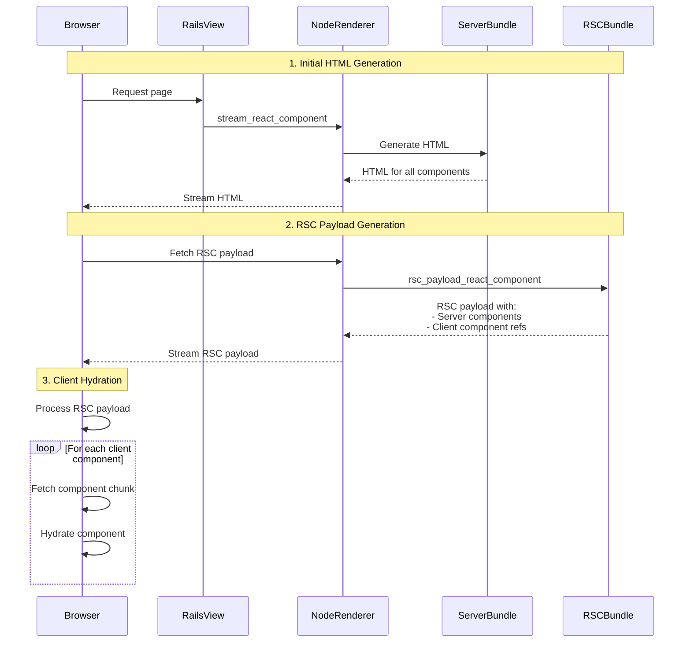
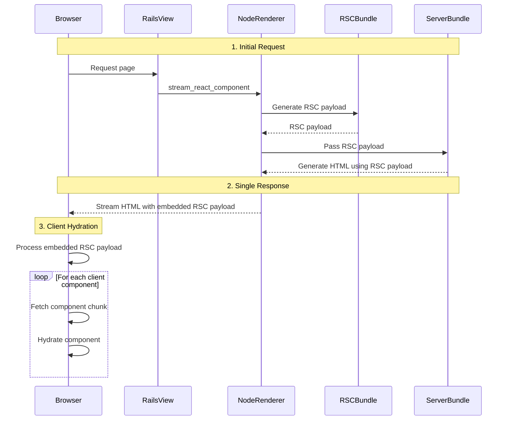

# React Server Components Rendering Flow

This document explains the rendering flow of React Server Components (RSC) in React on Rails Pro.

## Types of Bundles

In a React Server Components project, there are three distinct types of bundles:

### RSC Bundle (rsc-bundle.js)
- Contains only server components and references to client components
- Generated using the RSC Webpack Loader which transforms client components into references
- Used specifically for generating RSC payloads
- Configured with `react-server` condition to enable RSC-specific code paths that tell the runtime that this bundle is used for RSC payload generation.

### Server Bundle (server-bundle.js)
- Contains both server and client components in their full form
- Used for traditional server-side rendering (SSR)
- Enables HTML generation of any components
- Does not transform client components into references

### Client Bundle
- Split into multiple chunks based on client components
- Each file with `'use client'` directive becomes an entry point
- Code splitting occurs automatically for client components
- Chunks are loaded on-demand during client component hydration

## Current React Server Component Rendering Flow

When a request is made to a page using React Server Components, the following sequence occurs:

1. Initial HTML Generation:
   - The `stream_react_component` helper is called in the view
   - Makes a request to the node renderer
   - Renderer uses the **Server Bundle** to generate HTML for all components
   - HTML is streamed to the client

2. RSC Payload Generation:
   - Browser shows the initial html
   - Browser makes a separate fetch request to the RSC payload URL
   - Calls `rsc_payload_react_component` on the server
   - Node renderer uses the **RSC Bundle** to generate the RSC payload
   - Server components are rendered and serialized
   - Client components are included as references

3. Client Hydration:
   - RSC payload is processed by React runtime
   - Client component chunks are fetched based on references
   - Components are hydrated progressively

## Current React Server Component Rendering Limitations
_See open PRs. Active development will soon solve these limitations_

This approach has two main inefficiencies:

1. **Double Rendering**: Server components are rendered twice:
   - Once for HTML generation using the server bundle
   - Again, for RSC payload generation using the RSC bundle

2. **Multiple Requests**: Requires two separate HTTP requests:
   - Initial request for HTML
   - Secondary request for RSC payload

> [!NOTE]
> For simplicity, this diagram shows the RSC payload being fetched after the HTML is fully streamed to the client. In reality, the browser begins fetching the RSC payload and starts hydration immediately as soon as it receives the necessary HTML, without waiting for the complete page to be streamed. This parallel processing enables faster page interactivity and better performance.

## Future Improvements

These inefficiencies will be addressed in the upcoming ["Use RSC payload to render server components on server"](https://github.com/shakacode/react_on_rails_pro/pull/515) PR. The new flow will be:

1. Initial Request:
   - `stream_react_component` triggers node renderer
   - Renderer uses **RSC Bundle** to generate RSC payload
   - Payload is passed to the rendering function in **Server Bundle**
   - HTML of server components is generated using RSC payload
   - Client component references are filled with HTML of the client components

2. Single Response:
   - HTML and RSC payload are streamed together, with the RSC payload embedded inside the HTML page
   - Browser displays HTML immediately
   - React runtime uses embedded RSC payload for hydration
   - Client components are hydrated progressively

This improved approach eliminates double rendering and reduces HTTP requests, resulting in better performance and resource utilization.

