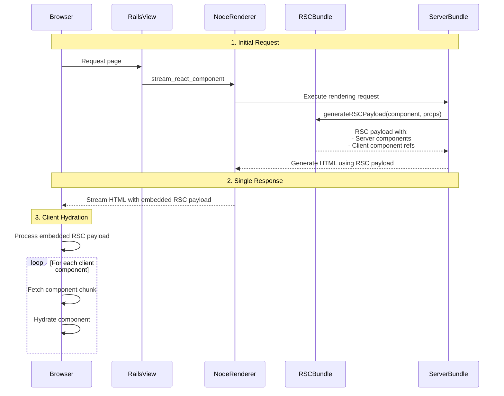

# React Server Components Rendering Flow

This document explains the rendering flow of React Server Components (RSC) in React on Rails Pro.

## Types of Bundles

In a React Server Components project, there are three distinct types of bundles:

### RSC Bundle (rsc-bundle.js)

- Contains only server components and references to client components
- Generated using the RSC Webpack Loader which transforms client components into references
- Used specifically for generating RSC payloads
- Configured with `react-server` condition to enable RSC-specific code paths that tell the runtime that this bundle is used for RSC payload generation.

### Server Bundle (server-bundle.js)

- Contains both server and client components in their full form
- Used for traditional server-side rendering (SSR)
- Enables HTML generation of any components
- Does not transform client components into references

### Client Bundle

- Split into multiple chunks based on client components
- Each file with `'use client'` directive becomes an entry point
- Code splitting occurs automatically for client components
- Chunks are loaded on-demand during client component hydration

## React Server Component Rendering Flow

When a request is made to a page using React Server Components, the following optimized sequence occurs:

1. Initial Request Processing:

   - The `stream_react_component` helper is called in the view
   - Makes a request to the node renderer
   - Server bundle's rendering function calls `generateRSCPayload` with the component name and props
   - This executes the component rendering in the RSC bundle
   - RSC bundle generates the payload containing server component data and client component references
   - The payload is returned to the server bundle

2. Server-Side Rendering with RSC Payload:

   - The server bundle uses the RSC payload to generate HTML for server components using `RSCServerRoot`
   - `RSCServerRoot` splits the RSC payload stream into two parts:
     - One stream for rendering server components as HTML
     - Another stream for embedding the RSC payload in the response
   - `RSCPayloadContainer` component embeds the RSC payload within the HTML response
   - HTML and embedded RSC payload are streamed together to the client

3. Client Hydration:
   - Browser displays HTML immediately
   - React runtime uses the embedded RSC payload for hydration
   - Client components are hydrated progressively without requiring a separate HTTP request

This approach offers significant advantages:

- Eliminates double rendering of server components
- Reduces HTTP requests by embedding the RSC payload within the initial HTML response
- Provides faster interactivity through streamlined rendering and hydration

## Next Steps

To learn more about how to render React Server Components inside client components, see [React Server Components Inside Client Components](./inside-client-components.md).
