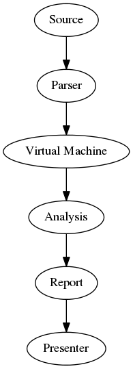

# @title Architecture
# Architecture

The process of analysing Ruby source code is broken up into several separate
steps. The basic flow of this process looks like the following:

Most third-party code will only deal with the last 3 steps.

This chapter takes a brief look at the various parts that make up ruby-lint.
Some of these parts are discussed more in depth in which case a link to these
chapters can be found below.

## The Parser

The {RubyLint::Parser parser} converts raw Ruby source code into an AST. The
AST is built up by nodes formatted as S expressions. A node for a simple String
would look like the following:

    (string "hello")

Each node is an instance of {RubyLint::AST::Node}. Each node can contain a
number of child nodes. If one were to format the above S expression as an Array
you'd get the following:

    [:string, ["hello"]]

The parser used by ruby-lint is the [parser gem][parser gem] and as such
ruby-lint can support various Ruby implementations and versions.

## Virtual Machine

The ruby-lint virtual machine is a stack based virtual machine used for
partially evaluating Ruby code in order to build definitions of method
definitions, class definitions, variable assignments and so on. For more
information on the internals of this class see the documentation of
{RubyLint::VirtualMachine}.

## Analysis

This is where the real work start. The analysis step consists out of various
Ruby classes of which each performs its own type of analysis. For example,
{RubyLint::Analysis::UndefinedMethods} checks for the use of undefined methods.

## Reports

Reports are used for storing a set of {RubyLint::Report::Entry} instances that
contain information about a block of Ruby code that is being analyzed. Each
entry contains some location information (line and column number for example)
as well as a message (e.g. an error message).

## Presenters

Presenters are classes tasked with the job of presenting a report. Currently
ruby-lint ships with a presenter that outputs a report in plain text as well as
one that outputs a report in JSON.

[parser gem]: https://github.com/whitequark/parser
